Lab 1: Introduction to Machine Learning with TensorFlow
========================================================


Overview

In this lab, you will learn how to create, utilize, and apply linear
transformations to the fundamental building blocks of programming with
TensorFlow: tensors. You will then utilize tensors to understand the
complex concepts associated with neural networks, including tensor
reshaping, transposition, and multiplication.


Introduction
============


**Machine learning** (**ML**) has permeated various aspects of daily
life that are unknown to many. From the recommendations of your daily
social feeds to the results of your online searches, they are all
powered by machine learning algorithms. These algorithms began in
research environments solving niche problems, but as their accessibility
broadened, so too have their applications for broader use cases.
Researchers and businesses of all types recognize the value of using
models to optimize every aspect of their respective operations. Doctors
can use machine learning to decide diagnosis and treatment options,
retailers can use ML to get the right products to their stores at the
right time, and entertainment companies can use ML to provide
personalized recommendations to their customers.

In the age of data, machine learning models have proven to be valuable
assets to any data-driven company. The large quantities of data
available allow powerful and accurate models to be created to complete a
variety of tasks, from regression to classification, recommendations to
time series analysis, and even generative art, many of which will be
covered in this workshop. And all can be built, trained, and deployed
with TensorFlow.

The TensorFlow API has a huge amount of functionality that has made it
popular among all machine learning practitioners building machine
learning models or working with tensors, which are multidimensional
numerical arrays. For researchers, TensorFlow is an appropriate choice
to create new machine learning applications due to its advanced
customization and flexibility. For developers, TensorFlow is an
excellent choice of machine learning library due to its ease in terms of
deploying models from development to production environments. Combined,
TensorFlow\'s flexibility and ease of deployment make the library a
smart choice for many practitioners looking to build performant machine
learning models using a variety of different data sources and to
replicate the results of that learning in production environments.

This lab provides a practical introduction to TensorFlow\'s API. You
will learn how to perform mathematical operations pertinent to machine
learning that will give you a firm foundation for building performant ML
models using TensorFlow. You will first learn basic operations such as
how to create variables with the API. Following that, you will learn how
to perform linear transformations such as addition before moving on to
more advanced tasks, including tensor multiplication.


Implementing Artificial Neural Networks in TensorFlow
=====================================================


The advanced flexibility that TensorFlow offers lends itself well to
creating **artificial neural networks** (**ANNs**). ANNs are algorithms
that are inspired by the connectivity of neurons in the brain and are
intended to replicate the process in which humans learn. They consist of
layers through which information propagates from the input to the
output.

*Figure 1.1* shows a visual representation of an ANN. An input layer is
on the left-hand side, which, in this example, has two features
(`X`[1]{.subscript} and `X`[2]{.subscript}). The
input layer is connected to the first hidden layer, which has three
units. All the data from the previous layer gets passed to each unit in
the first hidden layer. The data is then passed to the second hidden
layer, which also has three units. Again, the information from each unit
of the prior layer is passed to each unit of the second hidden layer.
Finally, all the information from the second hidden layer is passed to
the output layer, which has one unit, representing a single number for
each set of input features.

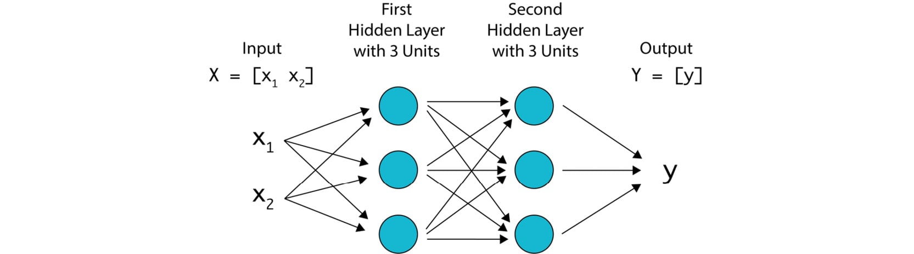


ANNs have proven to be successful in learning complex and nonlinear
relationships with large, unstructured datasets, such as audio, images,
and text data. While the results can be impressive, there is a lot of
variability in how ANNs can be configured. For example, the number of
layers, the size of each layer, and which nonlinear function should be
used are some of the factors that determine the configuration of ANNs.
Not only are the classes and functions that TensorFlow provides
well-suited to building and training ANNs, but the library also supplies
a suite of tools to help visualize and debug ANNs during the training
process.

Compared with traditional machine learning algorithms, such as linear
and logistic regression, ANNs can outperform them when provided with
large amounts of data. ANNs are advantageous since they can be fed
unstructured data and feature engineering is not necessarily required.
Data pre-processing can be a time-intensive process. Therefore, many
practitioners prefer ANNs if there is a large amount of data.

Many companies from all sectors utilize TensorFlow to build ANNs for
their applications. Since TensorFlow is backed by Google, the company
utilizes the library for much of its research, development, and
production of machine learning applications. However, there are many
other companies that also use the library. Companies such as Airbnb,
Coca-Cola, Uber, and GE Healthcare all utilize the library for a variety
of tasks. The use of ANNs is particularly appealing since they can
achieve remarkable accuracy if provided with sufficient data and trained
appropriately. For example, GE Healthcare uses TensorFlow to build ANNs
to identify specific anatomy regardless of orientation from magnetic
resonance images to improve speed and accuracy. By using ANNs, they can
achieve over 99% accuracy in identifying anatomy in seconds, regardless
of head rotation, which would otherwise take a trained professional much
more time.

While the number of companies utilizing ANNs is vast, ANNs may not be
the most appropriate choice for solving all business problems. In such
an environment, you must answer the following questions to determine
whether ANNs are the most appropriate choice:

-   **Does the problem have a numerical solution?** Machine learning
    algorithms, ANNs included, generate predicted numerical results
    based on input data. For example, machine learning algorithms may
    predict a given number, such as the temperature of a city given the
    location and previous weather conditions, or the stock price given
    previous stock prices, or label images into a given number of
    categories. In each of these examples, a numerical output is
    generated based on the data provided and, given enough labeled data,
    models can perform well. However, when the desired result is more
    abstract, or creativity is needed, such as creating a new song, then
    machine learning algorithms may not be the most appropriate choice,
    since a well-defined numerical solution may not be available.
-   **Is there enough appropriately labeled data to train a model?** For
    a supervised learning task, you must have at least some labeled data
    to train a model. For example, if you want to build a model to
    predict financial stock data for a given company, you will first
    need historical training data. If the company in question has not
    been public for very long, there may not be adequate training data.
    ANNs can often require a lot of data. When working with images, ANNs
    often need millions of training examples to develop accurate, robust
    models. This may be a determining factor for consideration when
    deciding which algorithm is appropriate for a given task.

Now that you are aware of what TensorFlow is, consider the following
advantages and disadvantages of TensorFlow.

Advantages of TensorFlow
------------------------

The following are a few of the main advantages of using TensorFlow that
many practitioners consider when deciding whether to pursue the library
for machine learning purposes:

-   **Library Management**: There is a large community of practitioners
    that maintain the TensorFlow library to keep it up to date with
    frequent new releases to help fix bugs, add new functions and
    classes to reflect current advances in the field, and add support
    for multiple programming languages.
-   **Pipelining**: TensorFlow supports end-to-end model production,
    from model development in highly parallelizable environments that
    support GPU processing to a suite of model deployment tools. Also,
    there are lightweight libraries in TensorFlow that are used for
    deploying trained TensorFlow models on mobile and embedded devices,
    such as **Internet of Things** (**IoT**) devices.
-   **Community Support**: The community of practitioners that use and
    support the library is vast and they support each other, because of
    which those practitioners who are new to the library achieve the
    results they are looking for easily.
-   **Open Source**: TensorFlow is an open source library, and its code
    base is available for anyone to use and modify for their own
    applications.
-   **Works with Multiple Languages**: While the library is natively
    designed for Python, models can now be trained and deployed in
    JavaScript.

Disadvantages of TensorFlow
---------------------------

The following are a few of the disadvantages of using TensorFlow:

-   **Computational Speed**: Since the primary programming language of
    TensorFlow is Python, the library is not as computationally fast as
    it could be if it were native to other languages, such as C++.
-   **Steep Learning Curve**: Compared to other machine learning
    libraries, such as Keras, the learning curve is steeper, and this
    can make it challenging for new practitioners to create their own
    models outside of given example code.

Now that you have understood what TensorFlow is, the next section will
demonstrate how to use the TensorFlow library using Python.


The TensorFlow Library in Python
================================


TensorFlow can be used in Python by importing certain libraries. You can
import libraries in Python using the `import` statement:


```
import tensorflow as tf
```


In the preceding command, you have imported the TensorFlow library and
used the shorthand `tf`.

In the next exercise, you will learn how to import the TensorFlow
library and check its version so that you can utilize the classes and
functions supplied by the library, which is an important and necessary
first step when utilizing the library.

Exercise 1.01: Verifying Your Version of TensorFlow
---------------------------------------------------

In this exercise, you will load TensorFlow and check which version is
installed on your system.

Perform the following steps:

1.  Open a Jupyter notebook to implement this exercise by typing
    `jupyter notebook` in the terminal.

2.  Import the TensorFlow library by entering the following code in the
    Jupyter cell:
    
    ```
    import tensorflow as tf
    ```


3.  Verify the version of TensorFlow using the following command:

    
    ```
    tf.__version__
    ```


    This will result in the following output:

    
    ```
    '2.6.0'
    ```


    As you can see from the preceding output, the version of TensorFlow
    is `2.6.0`.

    Note

    The version may vary on your system if you have not set up the
    environment using the steps provided in *Preface*.

In this exercise, you successfully imported TensorFlow. You have also
checked which version of TensorFlow is installed on your system.

This task can be done for any imported library in Python and is useful
for debugging and referencing documentation.

The potential applications of using TensorFlow are numerous, and it has
already achieved impressive results, as evidenced by the results from
companies such as Airbnb, which uses TensorFlow to classify images on
their platform, to GE Healthcare, which uses TensorFlow to identify
anatomy on MRIs of the brain. To learn how to create powerful models for
your own applications, you first must learn the basic mathematical
principles and operations that make up the machine learning models that
can be achieved in TensorFlow. The mathematical operations can be
intimidating to new users, but a comprehensive understanding of how they
operate is key to making performant models.


Introduction to Tensors
=======================


Tensors can be thought of as the core components of ANNs---the input
data, output predictions, and weights that are learned throughout the
training process are all tensors. Information propagates through a
series of linear and nonlinear transformations to turn the input data
into predictions. This section demonstrates how to apply linear
transformations such as additions, transpositions, and multiplications
to tensors. Other linear transformations, such as rotations,
reflections, and shears, also exist. However, their applications as they
pertain to ANNs are less common.

Scalars, Vectors, Matrices, and Tensors
---------------------------------------

Tensors can be represented as multi-dimensional arrays. The number of
dimensions a tensor spans is known as the tensor\'s rank. Tensors with
ranks `0`, `1`, and `2` are used often and
have their own names, which are **scalars**, **vectors**, and
**matrices**, respectively, although the term *tensors* can be used to
describe each of them. *Figure 1.2* shows some examples of tensors of
various ranks. From left to right are a scalar, vector, matrix, and a
3-dimensional tensor, where each element represents a different number,
and the subscript represents the location of the element in the tensor:

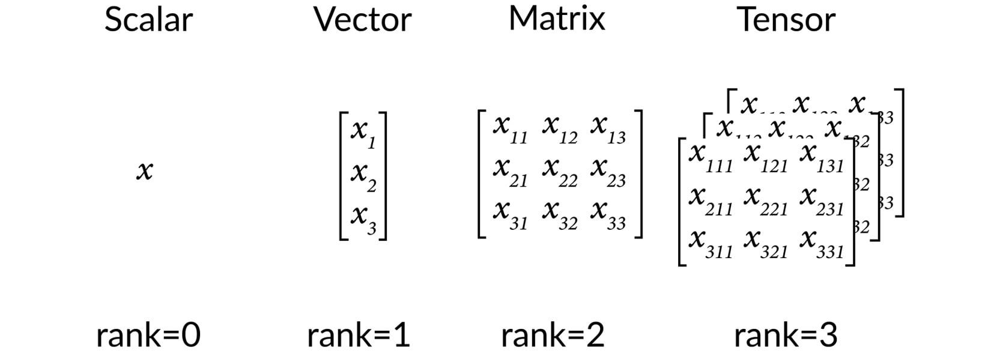


The formal definitions of a scalar, vector, matrix, and tensor are as
follows:

-   **Scalar**: A scalar consists of a single number, making it a
    zero-dimensional array. It is an example of zero-order tensors.
    Scalars do not have any axes. For instance, the width of an object
    is a scalar.
-   **Vector**: Vectors are one-dimensional arrays and are an example of
    first-order tensors. They can be considered lists of values. Vectors
    have one axis. The size of a given object denoted by the width,
    height, and depth is an example of a vector field.
-   **Matrix**: Matrices are two-dimensional arrays with two axes. They
    are an example of second-order tensors. Matrices might be used to
    store the size of several objects. Each dimension of the matrix
    comprises the size of each object (width, height, depth) and the
    other matrix dimension is used to differentiate between objects.
-   **Tensor**: Tensors are the general entities that encapsulate
    scalars, vectors, and matrices, although the name is generally
    reserved for tensors of rank `3` or more. A tensor can be
    used to store the size of many objects and their locations over
    time. The first dimension of the matrix comprises the size of each
    object (width, height, depth), the second dimension is used to
    differentiate between the objects, and the third dimension describes
    the location of these objects over time.

Tensors can be created using the `Variable` class present in
the TensorFlow library and passing in a value representing the tensor. A
float or integer can be passed for scalars, a list of floats or integers
can be passed for vectors, a nested list of floats or integers for
matrices, and so on. The following command demonstrates the use of the
`Variable` class where a list of the intended values for the
tensor as well as any other attributes that are required to be
explicitly defined are passed:


```
tensor1 = tf.Variable([1,2,3], dtype=tf.int32, \
                      name='my_tensor', trainable=True)
```


The resultant `Variable` object has several attributes that
may be commonly called, and these are as follows:

-   `dtype`: The datatype of the `Variable` object
    (for the tensor defined above, the datatype is
    `tf.int32`). The default value for this attribute is
    determined from the values passed.

-   `shape`: The number of dimensions and length of each
    dimension of the `Variable` object (for the tensor defined
    above, the shape is `[3]`). The default value for this
    attribute is also determined from the values passed.

-   `name`: The name of the `Variable` object (for
    the tensor defined above, the name of the tensor is defined as
    `'my_tensor'`). The default for this attribute
    is `Variable`.

-   `trainable`: This attribute indicates whether the
    `Variable` object can be updated during model training
    (for the tensor defined above, the `trainable` parameter
    is set to `true`). The default for this attribute is
    `true`.

    Note

    You can read more about the attributes of the `Variable`
    object here:
    [https://www.tensorflow.org/api\_docs/python/tf/Variable].

The `shape` attribute of the `Variable` object can
be called as follows:


```
tensor1.shape
```


The `shape` attribute gives the shape of the tensor, that is,
is it a scalar, vector, matrix, and so on. The output of the preceding
command will be `[3]` since the tensor has a single dimension
with three values along that dimension.

The rank of a tensor can be determined in TensorFlow using the
`rank` function. It can be used by passing the tensor as the
single argument to the function and the result will be an integer value:


```
tf.rank(tensor1)
```


The output of the following command will be a zero-dimensional integer
tensor representing the rank of the input. In this case, the rank of
`tensor1` will be `1` as the tensor has only one
dimension.

In the following exercise, you will learn how to create tensors of
various ranks using TensorFlow\'s `Variable` class.

Exercise 1.02: Creating Scalars, Vectors, Matrices, and Tensors in TensorFlow
-----------------------------------------------------------------------------

The votes cast for different candidates of three different political
parties in districts A and B are as follows:

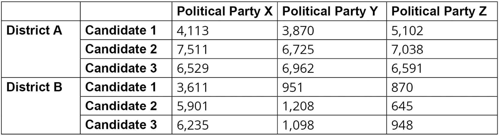


You are required to do the following:

-   Create a scalar to store the votes cast for `Candidate 1`
    of political party `X` in district `A`, that is,
    `4113`, and check its shape and rank.
-   Create a vector to represent the proportion of votes cast for three
    different candidates of political party `X` in district
    `A` and check its shape and rank.
-   Create a matrix to represent the votes cast for three different
    candidates of political parties `X` and `Y` and
    check its shape and rank.
-   Create a tensor to represent the votes cast for three different
    candidates in two different districts, for three political parties,
    and check its shape and rank.

Perform the following steps to complete this exercise:

1.  Import the TensorFlow library:
    
    ```
    import tensorflow as tf
    ```


2.  Create an integer variable using TensorFlow\'s `Variable`
    class and pass `4113` to represent the number of votes
    cast for a particular candidate. Also, pass `tf.int16` as
    a second argument to ensure that the input number is an integer
    datatype. Print the result:

    Note

    The datatype does not have to be explicitly defined. If one is not
    defined, the datatype will be determined by TensorFlow\'s
    `convert_to_tensor` function.

    
    ```
    int_variable = tf.Variable(4113, tf.int16)
    int_variable
    ```


    This will result in the following output:

    
    ```
    <tf.Variable 'Variable:0' shape=() dtype=int32, numpy=4113>
    ```


    Here, you can see the attributes of the variable created, including
    the name, `Variable:0`, the shape, datatype, and the NumPy
    representation of the tensor.

3.  Use TensorFlow\'s `rank` function to print the rank of the
    variable created:

    
    ```
    tf.rank(int_variable)
    ```


    This will result in the following output:

    
    ```
    <tf.Tensor: shape=(), dtype=int32, numpy=0>
    ```


    You can see that the rank of the integer variable that was created
    is `0` from the NumPy representation of the tensor.

4.  Access the integer variable of the rank by calling the
    `numpy` attribute:

    
    ```
    tf.rank(int_variable).numpy()
    ```


    This will result in the following output:

    
    ```
    0
    ```


    The rank of the scalar is `0`.

    Note

    All attributes of the result of the `rank` function can be
    called, including the `shape` and `dtype`
    attributes.

5.  Call the `shape` attribute of the integer to find the
    shape of the tensor:

    
    ```
    int_variable.shape
    ```


    This will result in the following output:

    
    ```
    TensorShape([])
    ```


    The preceding output signifies that the shape of the tensor has no
    size, which is representative of a scalar.

6.  Print the `shape` of the scalar variable as a Python list:

    
    ```
    int_variable.shape.as_list()
    ```


    This will result in the following output:

    
    ```
    []
    ```


7.  Create a `vector` variable using TensorFlow\'s
    `Variable` class. Pass a list for the vector to represent
    the proportion of votes cast for three different candidates, and
    pass in a second argument for the datatype as `tf.float32`
    to ensure that it is a `float` datatype. Print the result:

    
    ```
    vector_variable = tf.Variable([0.23, 0.42, 0.35], \
                                  tf.float32)
    vector_variable
    ```


    This will result in the following output:

    
    ```
    <tf.Variable 'Variable:0' shape(3,) dtype=float32, 
    numpy=array([0.23, 0.42, 0.35], dtype=float32)>
    ```


    You can see that the shape and NumPy attributes are different from
    the scalar variable created earlier. The shape is now
    `(3,)`, indicating that the tensor is one-dimensional with
    three elements along that dimension.

8.  Print the rank of the `vector` variable using
    TensorFlow\'s `rank` function as a NumPy variable:

    
    ```
    tf.rank(vector_variable).numpy()
    ```


    This will result in the following output:

    
    ```
    1
    ```


    Here, you can see that the rank of the vector variable is
    `1`, confirming that this variable is one-dimensional.

9.  Print the shape of the `vector` variable as a Python list:

    
    ```
    vector_variable.shape.as_list()
    ```


    This will result in the following output:

    
    ```
    [3]
    ```


10. Create a matrix variable using TensorFlow\'s `Variable`
    class. Pass a list of lists of integers for the matrix to represent
    the votes cast for three different candidates in two different
    districts. This matrix will have three columns representing the
    candidates, and two rows representing the districts. Pass in a
    second argument for the datatype as `tf.int32` to ensure
    that it is an integer datatype. Print the result:

    
    ```
    matrix_variable = tf.Variable([[4113, 7511, 6259], \
                                   [3870, 6725, 6962]], \
                                  tf.int32)
    matrix_variable
    ```


    This will result in the following output:

    
    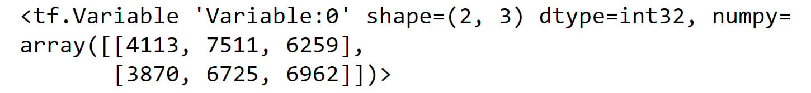


11. Print the rank of the matrix variable as a NumPy variable:

    
    ```
    tf.rank(matrix_variable).numpy()
    ```


    This will result in the following output:

    
    ```
    2
    ```


    Here, you can see that the rank of the matrix variable is
    `2`, confirming that this variable is two-dimensional.

12. Print the shape of the matrix variable as a Python list:

    
    ```
    matrix_variable.shape.as_list()
    ```


    This will result in the following output:

    
    ```
    [2, 3]
    ```


13. Create a tensor variable using TensorFlow\'s `Variable`
    class. Pass in a triple nested list of integers for the tensor to
    represent the votes cast for three different candidates in two
    different districts, for three political parties. Print the result:

    
    ```
    tensor_variable = tf.Variable([[[4113, 7511, 6259], \
                                    [3870, 6725, 6962]], \
                                   [[5102, 7038, 6591], \
                                    [3661, 5901, 6235]], \
                                   [[951, 1208, 1098], \
                                    [870, 645, 948]]])
    tensor_variable
    ```


    This will result in the following output:

    
    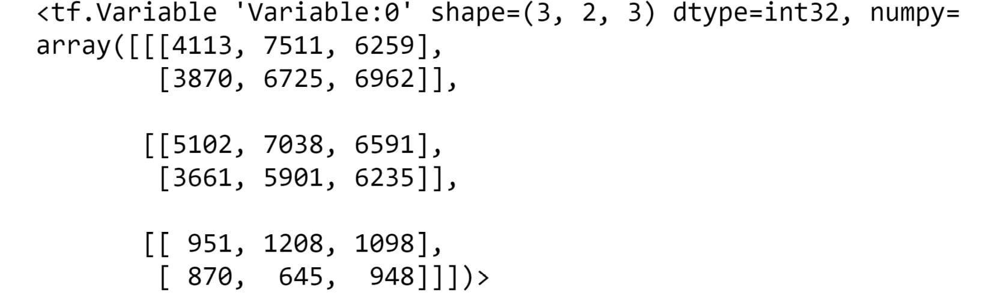


14. Print the rank of the tensor variable as a NumPy variable:

    
    ```
    tf.rank(tensor_variable).numpy()
    ```


    This will result in the following output:

    
    ```
    3
    ```


    Here, you can see that the rank of the tensor variable is
    `3`, confirming that this variable is three-dimensional.

15. Print the shape of the tensor variable as a Python list:

    
    ```
    tensor_variable.shape.as_list()
    ```


    This will result in the following output:

    
    ```
    [3, 2, 3]
    ```


    The result shows that the shape of the resulting tensor is a list
    object.

In this exercise, you have successfully created tensors of various ranks
from political voting data using TensorFlow\'s `Variable`
class. First, you created scalars, which are tensors that have a rank of
`0`. Next, you created vectors, which are tensors with a rank
of `1`. Matrices were then created, which are tensors of rank
`2`. Finally, tensors were created that have rank
`3` or more. You confirmed the rank of the tensors you created
by using TensorFlow\'s `rank` function and verified their
shape by calling the tensor\'s `shape` attribute.

In the next section, you will combine tensors to create new tensors
using tensor addition.


Tensor Addition
===============


Tensors can be added together to create new tensors. You will use the
example of matrices in this lab, but the concept can be extended to
tensors with any rank. Matrices may be added to scalars, vectors, and
other matrices under certain conditions in a process known as
broadcasting. Broadcasting refers to the process of array arithmetic on
tensors of different shapes.

Two matrices may be added (or subtracted) together if they have the same
shape. For such matrix-matrix addition, the resultant matrix is
determined by the element-wise addition of the input matrices. The
resultant matrix will therefore have the same shape as the two input
matrices. You can define the matrix
`Z = [Z`[ij]{.subscript}`]` as the matrix sum
`Z = X + Y`, where `z`[ij]{.subscript} =
`x`[ij]{.subscript} `+`
`y`[ij]{.subscript} and each element in `Z` is the
sum of the same element in `X` and `Y`.

Matrix addition is commutative, which means that the order of
`X` and `Y` does not matter, that is,
`X + Y = Y + X`. Matrix addition is also associative,
which means that the same result is achieved even when the order of
additions is different or even if the operation is applied more than
once, that is, `X + (Y + Z) = (X + Y) + Z`.

The same matrix addition principles apply to scalars, vectors, and
tensors. An example is shown in the following figure:

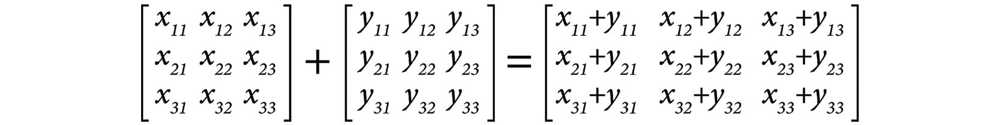


Scalars can also be added to matrices. Here, each element of the matrix
is added to the scalar individually, as shown in *Figure 1.7*:

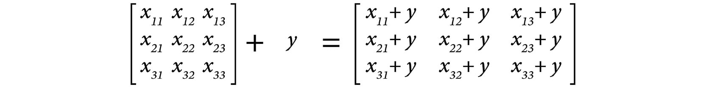


Addition is an important transformation that can be applied to tensors
since the transformation occurs so frequently. For example, a common
transformation in developing ANNs is to add a bias to a layer. This is
when a constant tensor array of the same size of the ANN layer is added
to that layer. Therefore, it is important to know how and when this
seemingly simple transformation can be applied to tensors.

Tensor addition can be performed in TensorFlow by using the
`add` function and passing in the tensors as arguments, or
simply by using the `+` operator as follows:


```
tensor1 = tf.Variable([1,2,3])
tensor2 = tf.Variable([4,5,6])
tensor_add1 = tf.add(tensor1, tensor2)
tensor_add2 = tensor1 + tensor2
```


In the following exercise, you will perform tensor addition on scalars,
vectors, and matrices in TensorFlow.

Exercise 1.03: Performing Tensor Addition in TensorFlow
-------------------------------------------------------

The votes cast for different candidates of three different political
parties in districts A and B are as follows:

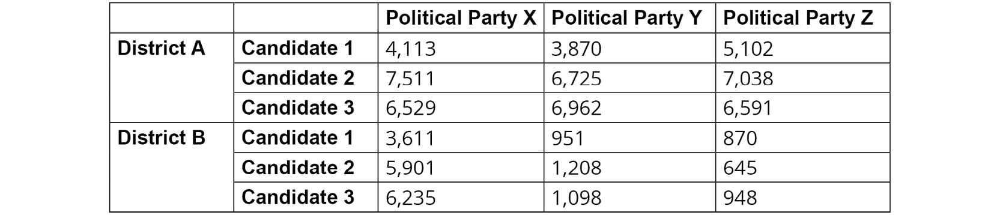


Your requisite tasks are as follows:

-   Store the total number of votes cast for political party X in
    district A.
-   Store the total number of votes cast for each political party in
    district A.
-   Store the total number of votes cast for each political party in
    both districts.

Perform the following steps to complete the exercise:

1.  Import the TensorFlow library:
    
    ```
    import tensorflow as tf
    ```


2.  Create three scalar variables using TensorFlow\'s
    `Variable` class to represent the votes cast for three
    candidates of political party X in district A:
    
    ```
    int1 = tf.Variable(4113, tf.int32)
    int2 = tf.Variable(7511, tf.int32)
    int3 = tf.Variable(6529, tf.int32)
    ```


3.  Create a new variable to store the total number of votes cast for
    political party X in district A:
    
    ```
    int_sum = int1+int2+int3
    ```


4.  Print the result of the sum of the two variables as a NumPy
    variable:

    
    ```
    int_sum.numpy()
    ```


    This will result in the following output:

    
    ```
    18153
    ```


5.  Create three vectors to represent the number of votes cast for
    different political parties in district A, each with one row and
    three columns:
    
    ```
    vec1 = tf.Variable([4113, 3870, 5102], tf.int32)
    vec2 = tf.Variable([7511, 6725, 7038], tf.int32)
    vec3 = tf.Variable([6529, 6962, 6591], tf.int32)
    ```


6.  Create a new variable to store the total number of votes for each
    political party in district A:
    
    ```
    vec_sum = vec1 + vec2 + vec3
    ```


7.  Print the result of the sum of the two variables as a NumPy array:

    
    ```
    vec_sum.numpy()
    ```


    This will result in the following output:

    
    ```
    array([18153, 17557, 18731])
    ```


8.  Verify that the vector addition is as expected by performing the
    addition of each element of the vector:

    
    ```
    print((vec1[0] + vec2[0] + vec3[0]).numpy())
    print((vec1[1] + vec2[1] + vec3[1]).numpy())
    print((vec1[2] + vec2[2] + vec3[2]).numpy())
    ```


    This will result in the following output:

    
    ```
    18153
    17557
    18731
    ```


    You can see that the `+` operation on three vectors is
    simply element-wise addition of the vectors.

9.  Create three matrices to store the votes cast for candidates of each
    political party in each district:
    
    ```
    matrix1 = tf.Variable([[4113, 3870, 5102], \
                           [3611, 951, 870]], tf.int32)
    matrix2 = tf.Variable([[7511, 6725, 7038], \
                           [5901, 1208, 645]], tf.int32)
    matrix3 = tf.Variable([[6529, 6962, 6591], \
                           [6235, 1098, 948]], tf.int32)
    ```


10. Verify that the three tensors have the same shape:

    
    ```
    matrix1.shape == matrix2.shape == matrix3.shape
    ```


    This will result in the following output:

    
    ```
    True
    ```


11. Create a new variable to store the total number of votes cast for
    each political party in both districts:
    
    ```
    matrix_sum = matrix1 + matrix2 + matrix3
    ```


12. Print the result of the sum of the two variables as a NumPy array:

    
    ```
    matrix_sum.numpy()
    ```


    This will result in the following output representing the total
    votes for each candidate and each party across districts:

    
    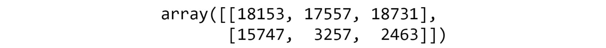


13. Verify that the tensor addition is as expected by performing the
    addition of each element of the vector:

    
    ```
    print((matrix1[0][0] + matrix2[0][0] + matrix3[0][0]).numpy())
    print((matrix1[0][1] + matrix2[0][1] + matrix3[0][1]).numpy())
    print((matrix1[0][2] + matrix2[0][2] + matrix3[0][2]).numpy())
    print((matrix1[1][0] + matrix2[1][0] + matrix3[1][0]).numpy())
    print((matrix1[1][1] + matrix2[1][1] + matrix3[1][1]).numpy())
    print((matrix1[1][2] + matrix2[1][2] + matrix3[1][2]).numpy())
    ```


    This will result in the following output:

    
    ```
    18153
    17557
    18731
    15747
    3257
    2463
    ```


    You can see that the `+` operation is equivalent to the
    element-wise addition of the three matrices created.

In this exercise, you successfully performed tensor addition on data
representing votes cast for political candidates. The transformation can
be applied by using the `+` operation. You also verified that
addition is performed element by element, and that one way to ensure
that the transformation is valid is for the tensors to have the same
rank and shape.

In the following activity, you will further practice tensor addition in
TensorFlow.

Activity 1.01: Performing Tensor Addition in TensorFlow
-------------------------------------------------------

You work in a company that has three locations, each with two
salespersons and each location sells three products. You are required to
sum the tensors to represent the total revenue for each product across
locations.

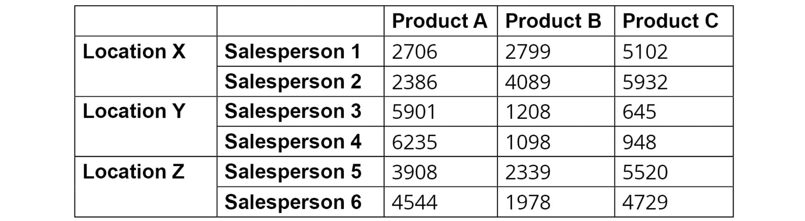


The steps you will take are as follows:

1.  Import the TensorFlow library.

2.  Create two scalars to represent the total revenue for
    `Product A` by all salespeople at `Location X`
    using TensorFlow\'s `Variable` class. The first variable
    will have a value of `2706` and the second will have a
    value of `2386`.

3.  Create a new variable as the sum of the scalars and print the
    result.

    You should get the following output:

    
    ```
    5092
    ```


4.  Create a vector with values `[2706, 2799, 5102]` and a
    scalar with the value `95` using TensorFlow\'s
    `Variable` class.

5.  Create a new variable as the sum of the scalar with the vector to
    represent the sales goal for `Salesperson 1` at
    `Location X` and print the result.

    You should get the following output:

    
    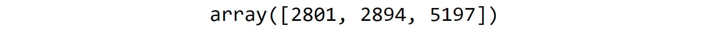


6.  Create three tensors with a rank of 2 representing the revenue for
    each salesperson, product, and location using TensorFlow\'s
    `Variable` class. The first tensor will have the value
    `[[2706, 2799, 5102], [2386, 4089, 5932]]`, the second
    will have the value
    `[[5901, 1208, 645], [6235, 1098, 948]]`, and the third
    will have `[[3908, 2339, 5520], [4544, 1978, 4729]]`.

7.  Create a new variable as the sum of the matrices and print the
    result:
    
    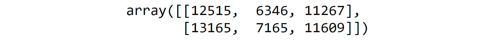


Note

The solution to this activity can be found via [this link].

In the following section, you will learn how to change a tensor\'s shape
and rank.


Reshaping
=========


Some operations, such as addition, can only be applied to tensors if
they meet certain conditions. Reshaping is one method for modifying the
shape of tensors so that such operations can be performed. Reshaping
takes the elements of a tensor and rearranges them into a tensor of a
different size. A tensor of any size can be reshaped so long as the
number of total elements remains the same.

For example, a `(4x3)` matrix can be reshaped into a
`(6x2)` matrix since they both have a total of `12`
elements. The rank, or number, of dimensions, can also be changed in the
reshaping process. For instance, a `(4x3)` matrix that has a
rank equal to `2` can be reshaped into a `(3x2x2)`
tensor that has a rank equal to `3`. The `(4x3)`
matrix can also be reshaped into a `(12x1)` vector in which
the rank has changed from `2` to `1`.

*Figure 1.13* illustrates tensor reshaping. On the left is a tensor with
shape `(3x2)`, which can be reshaped to a tensor of shape
equal to either `(2x3)`, `(6)`, or
`(6x1)`. Here, the number of elements, that is, six, has
remained constant, though the shape and rank of the tensor have changed:

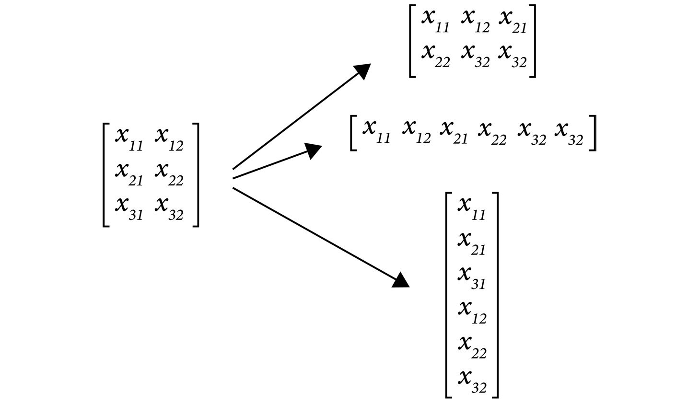


Tensor reshaping can be performed in TensorFlow by using the
`reshape` function and passing in the tensor and the desired
shape of the new tensor as the arguments:


```
tensor1 = tf.Variable([1,2,3,4,5,6])
tensor_reshape = tf.reshape(tensor1, shape=[3,2])
```


Here, a new tensor is created that has the same elements as the
original; however, the shape is `[3,2]` instead of
`[6]`.

The next section introduces tensor transposition, which is another
method for modifying the shape of a tensor.

Tensor Transposition
--------------------

When a tensor is transposed, the elements in the tensor are rearranged
in a specific order. The transpose operation is usually denoted as a
`T` superscript on the tensor. The new position of each
element in the tensor can be determined by
`(x`[12...k]{.subscript}`)`[T] =
`x`[k...21]{.subscript}. For a matrix or tensor of rank equal
to `2`, the rows become the columns and vice versa. An example
of matrix transposition is shown in *Figure 1.14*. Tensors of any rank
can be transposed, and often the shape changes as a result:


The following diagram shows the matrix transposition properties of
matrices `A` and `B`:

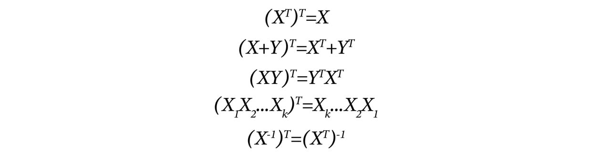


A tensor is said to be symmetrical if the transpose of a tensor is
equivalent to the original tensor.

Tensor transposition can be performed in TensorFlow by using its
`transpose` function and passing in the tensor as the only
argument:


```
tensor1 = tf.Variable([1,2,3,4,5,6])
tensor_transpose = tf.transpose(tensor1)
```


When transposing a tensor, there is only one possible result; however,
reshaping a tensor has multiple possible results depending on the
desired shape of the output.

In the following exercise, reshaping and transposition are demonstrated
on tensors using TensorFlow.

Exercise 1.04: Performing Tensor Reshaping and Transposition in TensorFlow
--------------------------------------------------------------------------

In this exercise, you will learn how to perform tensor reshaping and
transposition using the TensorFlow library.

Perform the following steps:

1.  Import the TensorFlow library and create a matrix with two rows and
    four columns using TensorFlow\'s `Variable` class:
    
    ```
    import tensorflow as tf
    matrix1 = tf.Variable([[1,2,3,4], [5,6,7,8]])
    ```


2.  Verify the shape of the matrix by calling the `shape`
    attribute of the matrix as a Python list:

    
    ```
    matrix1.shape.as_list()
    ```


    This will result in the following output:

    
    ```
    [2, 4]
    ```


    You see that the shape of the matrix is `[2,4]`.

3.  Use TensorFlow\'s `reshape` function to change the matrix
    to a matrix with four rows and two columns by passing in the matrix
    and the desired new shape:

    
    ```
    reshape1 = tf.reshape(matrix1, shape=[4, 2])
    reshape1
    ```


    You should get the following output:

    
    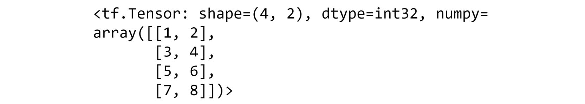


4.  Verify the shape of the reshaped matrix by calling the
    `shape` attribute as a Python list:

    
    ```
    reshape1.shape.as_list()
    ```


    This will result in the following output:

    
    ```
    [4, 2]
    ```


    Here, you can see that the shape of the matrix has changed to your
    desired shape, `[4,2]`.

5.  Use TensorFlow\'s `reshape` function to convert the matrix
    into a matrix with one row and eight columns. Pass the matrix and
    the desired new shape as parameters to the `reshape`
    function:

    
    ```
    reshape2 = tf.reshape(matrix1, shape=[1, 8])
    reshape2
    ```


    You should get the following output:

    
    ```
    <tf.Tensor: shape=(1, 8), dtype=int32, numpy=array([[1, 2, 3, 4, 5, 6, 7, 8]])>
    ```


6.  Verify the shape of the reshaped matrix by calling the
    `shape` attribute as a Python list:

    
    ```
    reshape2.shape.as_list()
    ```


    This will result in the following output:

    
    ```
    [1, 8]
    ```


    The preceding output confirms the shape of the reshaped matrix as
    `[1, 8]`.

7.  Use TensorFlow\'s `reshape` function to convert the matrix
    into a matrix with eight rows and one column, passing the matrix and
    the desired new shape as parameters to the `reshape`
    function:

    
    ```
    reshape3 = tf.reshape(matrix1, shape=[8, 1])
    reshape3
    ```


    You should get the following output:

    
    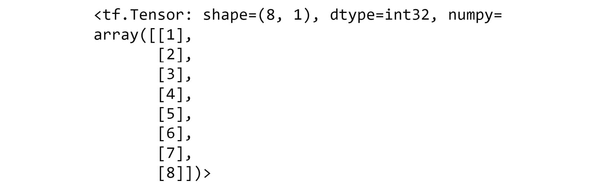


8.  Verify the shape of the reshaped matrix by calling the
    `shape` attribute as a Python list:

    
    ```
    reshape3.shape.as_list()
    ```


    This will result in the following output:

    
    ```
    [8, 1]
    ```


    The preceding output confirms the shape of the reshaped matrix as
    `[8, 1]`.

9.  Use TensorFlow\'s `reshape` function to convert the matrix
    to a tensor of size `2x2x2`. Pass the matrix and the
    desired new shape as parameters to the reshape function:

    
    ```
    reshape4 = tf.reshape(matrix1, shape=[2, 2, 2])
    reshape4
    ```


    You should get the following output:

    
    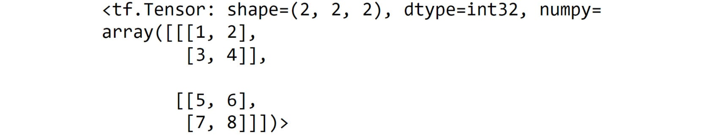


10. Verify the shape of the reshaped matrix by calling the
    `shape` attribute as a Python list:

    
    ```
    reshape4.shape.as_list()
    ```


    This will result in the following output:

    
    ```
    [2, 2, 2]
    ```


    The preceding output confirms the shape of the reshaped matrix as
    `[2, 2, 2]`.

11. Verify that the rank has changed using TensorFlow\'s
    `rank` function and print the result as a NumPy variable:

    
    ```
    tf.rank(reshape4).numpy()
    ```


    This will result in the following output:

    
    ```
    3
    ```


12. Use TensorFlow\'s `transpose` function to convert the
    matrix of size `2X4` to a matrix of size `4x2`:

    
    ```
    transpose1 = tf.transpose(matrix1)
    transpose1
    ```


    You should get the following output:

    
    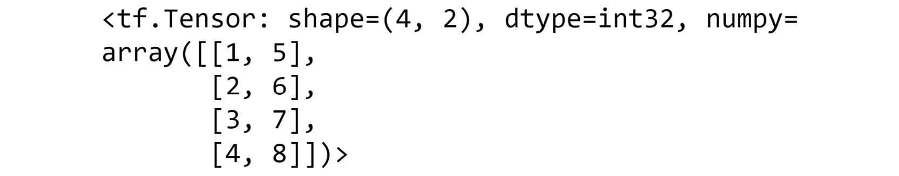


13. Verify that the `reshape` function and the
    `transpose` function create different resulting matrices
    when applied to the given matrix:

    
    ```
    transpose1 == reshape1
    ```


    
    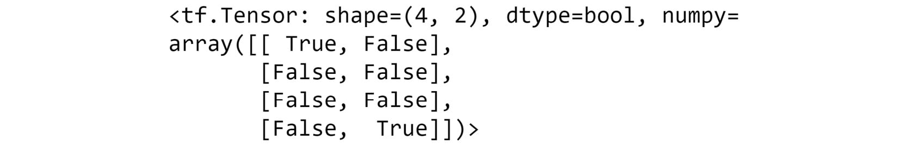


14. Use TensorFlow\'s `transpose` function to transpose the
    reshaped matrix in *step 9*:

    
    ```
    transpose2 = tf.transpose(reshape4)
    transpose2
    ```


    This will result in the following output:

    
    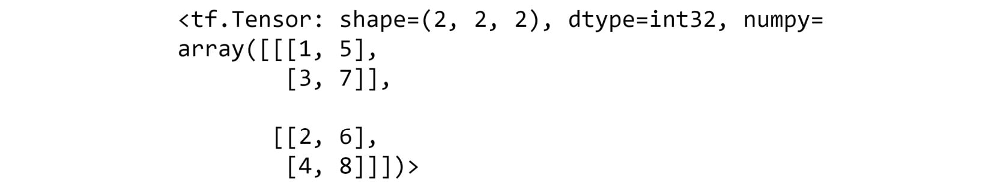


This result shows how the resulting tensor appears after reshaping and
transposing a tensor.

In this exercise, you have successfully modified the shape of a tensor
either through reshaping or transposition. You studied how the shape and
rank of the tensor changes following the reshaping and transposition
operation.

In the following activity, you will test your knowledge on how to
reshape and transpose tensors using TensorFlow.

Activity 1.02: Performing Tensor Reshaping and Transposition in TensorFlow
--------------------------------------------------------------------------

In this activity, you are required to simulate the grouping of 24 school
children for class projects. The dimensions of each resulting reshaped
or transposed tensor will represent the size of each group.

Perform the following steps:

1.  Import the TensorFlow library.

2.  Create a one-dimensional tensor with 24 monotonically increasing
    elements using the `Variable` class to represent the IDs
    of the school children. Verify the shape of the matrix.

    You should get the following output:

    
    ```
    [24]
    ```


3.  Reshape the matrix so that it has 12 rows and 2 columns using
    TensorFlow\'s `reshape` function representing 12 pairs of
    school children. Verify the shape of the new matrix.

    You should get the following output:

    
    ```
    [12, 2]
    ```


4.  Reshape the original matrix so that it has a shape of
    `3x4x2` using TensorFlow\'s `reshape` function
    representing 3 groups of 4 sets of pairs of school children. Verify
    the shape of the new tensor.

    You should get the following output:

    
    ```
    [3, 4, 2]
    ```


5.  Verify that the rank of this new tensor is `3`.

6.  Transpose the tensor created in *step 3* to represent 2 groups of 12
    students using TensorFlow\'s `transpose` function. Verify
    the shape of the new tensor.

    You should get the following output:

    
    ```
    [2, 12]
    ```


    Note

    The solution to this activity can be found via [this
    link].

In this section, you were introduced to some of the basic components of
ANNs---tensors. You also learned about some basic manipulation of
tensors, such as addition, transposition, and reshaping. You implemented
these concepts by using functions in the TensorFlow library.

In the next topic, you will extend your understanding of linear
transformations by covering another important transformation related to
ANNs---tensor multiplication.


Tensor Multiplication
=====================


Tensor multiplication is another fundamental operation that is used
frequently in the process of building and training ANNs since
information propagates through the network from the inputs to the result
via a series of additions and multiplications. While the rules for
addition are simple and intuitive, the rules for tensors are more
complex. Tensor multiplication involves more than simple element-wise
multiplication of the elements. Rather, a more complicated procedure is
implemented that involves the dot product between the entire
rows/columns of each of the tensors to calculate each element of the
resulting tensor. This section will explain how multiplication works for
two-dimensional tensors or matrices. However, tensors of higher orders
can also be multiplied.

Given a matrix, `X = [x`[ij]{.subscript}`]`[m x
n]{.subscript}, and another matrix,
`Y = [y`[ij]{.subscript}`]`[n x p]{.subscript}, the
product of the two matrices is
`Z = XY = [z`[ij]{.subscript}`]`[m x p]{.subscript},
and each element, `z`[ij]{.subscript}, is defined element-wise
as 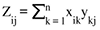. The shape of the
resultant matrix is the same as the outer dimensions of the matrix
product, or the number of rows of the first matrix and the number of
columns of the second matrix. For the multiplication to work, the inner
dimensions of the matrix product must match, or the number of columns in
the first matrix and the number of columns in the second matrix must
correspond.

The concept of inner and outer dimensions of matrix multiplication is
shown in the following diagram, where `X` represents the first
matrix and `Y` represents the second matrix:

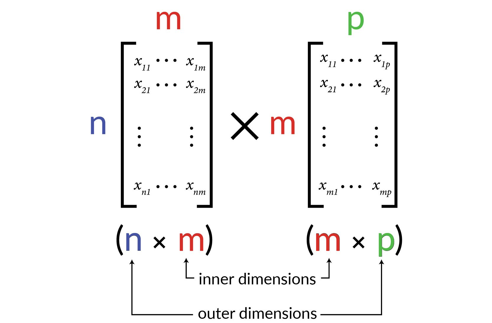


Unlike matrix addition, matrix multiplication is not commutative, which
means that the order of the matrices in the product matters:

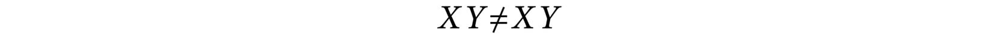


For example, say you have the following two matrices:

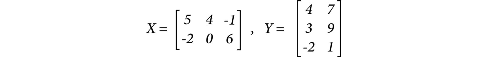


One way to construct the product is to have matrix `X` first,
multiplied by `Y`:

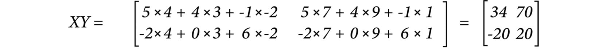


This results in a `2x2` matrix. Another way to construct the
product is to have `Y` first, multiplied by `X`:

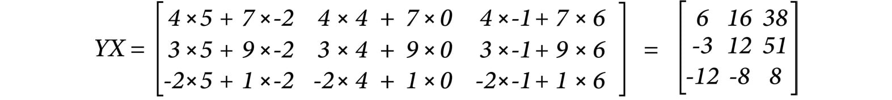


Here you can see that the matrix formed from the product `YX`
is a `3x3` matrix and is very different from the matrix formed
from the product `XY`.

Tensor multiplication can be performed in TensorFlow by using the
`matmul` function and passing in the tensors to be multiplied
in the order in which they are to be multiplied as the arguments:


```
tensor1 = tf.Variable([[1,2,3]])
tensor2 = tf.Variable([[1],[2],[3]])
tensor_mult = tf.matmul(tensor1, tensor2)
```


Tensor multiplication can also be achieved by using the `@`
operator as follows:


```
tensor_mult = tensor1 @ tensor2
```


Scalar-tensor multiplication is much more straightforward and is simply
the product of every element in the tensor multiplied by the scalar so
that `λX = [λx`[ij...k]{.subscript}`]`, where
`λ` is a scalar and `X` is a tensor.

Scalar multiplication can be achieved in TensorFlow either by using the
`matmul` function or by using the `*` operator:


```
tensor1 = tf.Variable([[1,2,3]])
scalar_mult = 5 * tensor1
```


In the following exercise, you will perform tensor multiplication using
the TensorFlow library.

Exercise 1.05: Performing Tensor Multiplication in TensorFlow
-------------------------------------------------------------

In this exercise, you will perform tensor multiplication in TensorFlow
using TensorFlow\'s `matmul` function and the `@`
operator. In this exercise, you will use the example of data from a
sandwich retailer representing the ingredients of various sandwiches and
the costs of different ingredients. You will use matrix multiplication
to determine the costs of each sandwich.

**Sandwich recipe**:

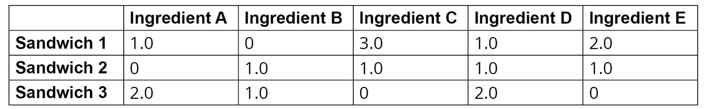


**Ingredient details**:

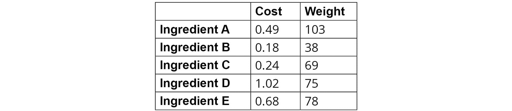


**Sales projections**:

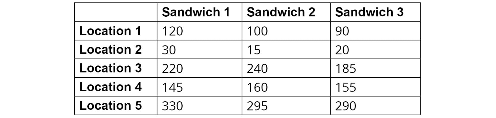


Perform the following steps:

1.  Import the TensorFlow library:
    
    ```
    import tensorflow as tf
    ```


2.  Create a matrix representing the different sandwich recipes, with
    the rows representing the three different sandwich offerings and the
    columns representing the combination and number of the five
    different ingredients using the `Variable` class:

    
    ```
    matrix1 = tf.Variable([[1.0,0.0,3.0,1.0,2.0], \
                           [0.0,1.0,1.0,1.0,1.0], \
                           [2.0,1.0,0.0,2.0,0.0]], \
                          tf.float32)
    matrix1
    ```


    You should get the following output:

    
    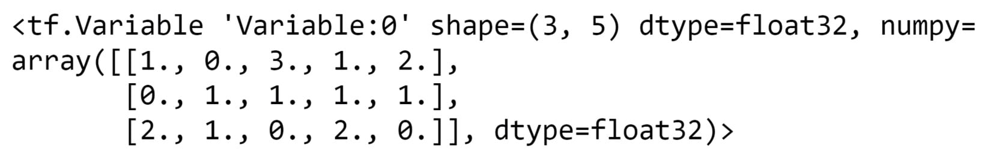


3.  Verify the shape of the matrix by calling the `shape`
    attribute of the matrix as a Python list:

    
    ```
    matrix1.shape.as_list()
    ```


    This will result in the following output:

    
    ```
    [3, 5]
    ```


4.  Create a second matrix representing the cost and weight of each
    individual ingredient in which the rows represent the five
    ingredients, and the columns represent the cost and weight of the
    ingredients in grams:

    
    ```
    matrix2 = tf.Variable([[0.49, 103], \
                           [0.18, 38], \
                           [0.24, 69], \
                           [1.02, 75], \
                           [0.68, 78]])
    matrix2
    ```


    You should get the following result:

    
    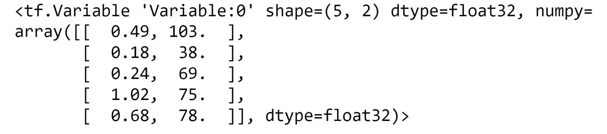


5.  Use TensorFlow\'s `matmul` function to perform the matrix
    multiplication of `matrix1` and `matrix2`:

    
    ```
    matmul1 = tf.matmul(matrix1, matrix2)
    matmul1
    ```


    This will result in the following output:

    
    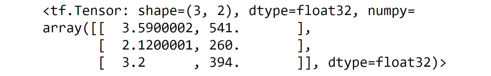


6.  Create a matrix to represent the sales projections of five different
    stores for each of the three sandwiches:
    
    ```
    matrix3 = tf.Variable([[120.0, 100.0, 90.0], \
                           [30.0, 15.0, 20.0], \
                           [220.0, 240.0, 185.0], \
                           [145.0, 160.0, 155.0], \
                           [330.0, 295.0, 290.0]])
    ```


7.  Multiply `matrix3` by the result of the matrix
    multiplication of `matrix1` and `matrix2` to
    give the expected cost and weight for each of the five stores:

    
    ```
    matmul3 = matrix3 @ matmul1
    matmul3
    ```


    This will result in the following output:

    
    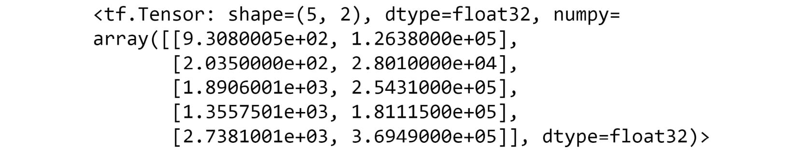


The resulting tensor from the multiplication shows the expected cost of
sandwiches and the expected weight of the total ingredients for each of
the stores.

In this exercise, you have successfully learned how to perform matrix
multiplication in TensorFlow using several operators. You used
TensorFlow\'s `matmul` function, as well as the shorthand
`@` operator. Each will perform the multiplication; however,
the `matmul` function has several different arguments that can
be passed into the function that make it more flexible.

Note

You can read more about the `matmul` function here:
[https://www.tensorflow.org/api\_docs/python/tf/linalg/matmul].

In the next section, you will explore some other mathematical concepts
that are related to ANNs. You will explore forward and backpropagation,
as well as activation functions.


Optimization
============


In this section, you will learn about some optimization approaches that
are fundamental to training machine learning models. Optimization is the
process by which the weights of the layers of an ANN are updated such
that the error between the predicted values of the ANN and the true
values of the training data is minimized.

Forward Propagation
-------------------

Forward propagation is the process by which information propagates
through ANNs. Operations such as a series of tensor multiplications and
additions occur at each layer of the network until the final output.
Forward propagation is explained in *Figure 1.37*, showing a single
hidden layer ANN. The input data has two features, while the output
layer has a single value for each input record.

The weights and biases for the hidden layer and output are shown as
matrices and vectors with the appropriate indexes. For the hidden layer,
the number of rows in the weight matrix is equal to the number of
features of the input, and the number of columns is equal to the number
of units in the hidden layer. Therefore, `W1` has two rows and
three columns because the input, `X`, has two features.
Likewise, `W2` has three rows and one column, the hidden layer
has three units, and the output has the size one. The bias, however, is
always a vector with a size equal to the number of nodes in that layer
and is added to the product of the input and weight matrix.

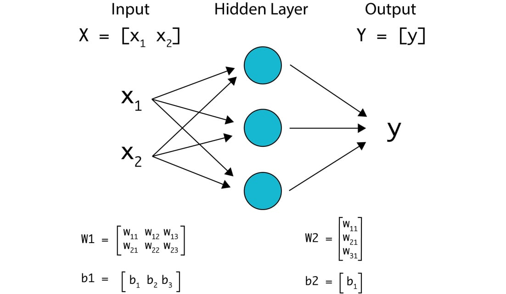


The steps to perform forward propagation are as follows:

1.  `X` is the input to the network and the input to the
    hidden layer. First, the input matrix, `X`, is multiplied
    by the weight matrix for the hidden layer, `W1`, and then
    the bias, `b1`, is added:

    `z1 = X*W1 + b1`

    Here is an example of what the shape of the resulting tensor will be
    after the operation. If the input is size `nX2`, where
    `n` is the number of input examples, `W1` is of
    size `2X3`, and `b1` is of size `1X3`,
    the resulting matrix, `z1`, will have a size
    of `nX3`.

2.  `z1` is the output of the hidden layer, which is the
    **input** for the output layer. Next, the output of the hidden layer
    is the input matrix multiplied by the weight matrix for the output
    layer, `W2`, and the bias, `b2`, is added:

    `Y = z1 * W2 + b2`

    To understand the shape of the resulting tensor, consider the
    following example. If the input to the output layer, `z1`,
    is of size `nX3`, `W2` is of size
    `3X1`, and `b1` is of size `1X1`, the
    resulting matrix, `Y`, will have a size of
    `nX1`, representing one result for each training example.

The total number of parameters in this model is equal to the sum of the
number of elements in `W1`, `W2`, `b1`,
and `b2`. Therefore, the number of parameters can be
calculated by summing the elements in each of the parameters in weight
matrices and biases, which is equal to `6 + 3 + 3 + 1 = 13`.
These are the parameters that need to be learned in the process of
training the ANN.

Following the forward propagation step, you must evaluate your model and
compare it to the real target values. This is achieved using a loss
function. Mean squared error, that is, the mean value of the squared
difference between true and predicted values, is one of the examples of
the loss function of the regression task. Once the loss is calculated,
the weights must be updated to reduce the loss, and the amount and
direction that the weights should be updated are found using
backpropagation.

Backpropagation
---------------

**Backpropagation** is the process of determining the derivative of the
loss with respect to the model parameter. The loss is calculated by
applying the `loss` function to the predicted outputs as
follows:

`loss = L(y_predicted)`

The derivative of the loss with respect to the model parameters will
inform you if increasing or decreasing the model parameter will result
in increasing or decreasing the loss. The process of backpropagation is
achieved by applying the chain rule of calculus from the output layer to
the input layer of a neural network, at each layer computing the
derivatives of the `loss` function with respect to the
model parameters.

The chain rule of calculus is a technique used to compute the derivative
of a composite function via intermediate functions. A generalized
version of the function can be written as follows:

`dz/dx = dz/dy * dy/dx`

Here, `dz/dx` is the composite function and `y` is
the intermediate function. In the case of ANNs, the composite function
is the loss as a function of the model parameters and the intermediate
functions represent the hidden layers. Therefore, the derivative of the
loss with respect to the model parameters can be computed by multiplying
the derivative of the loss with respect to the predicted output by the
derivative of the predicted output with respect to the model parameters.

In the next section, you will learn how the weight parameters are
updated given the derivatives of the loss function with respect to each
of the weights so that the loss is minimized.

Learning Optimal Parameters
---------------------------

In this section, you will see how optimal weights are iteratively
chosen. You know that forward propagation transfers information through
the network via a series of tensor additions and multiplications, and
that backpropagation is the process of understanding the change in loss
with respect to each model weight. The next step is to use the results
from backpropagation to update the weights so that they reduce the error
according to the loss function. This process is known as learning the
parameters and is achieved using an optimization algorithm. A common
optimization algorithm often utilized is called **gradient descent**.

In learning the optimal parameters, you apply the optimization algorithm
until a minimum in the loss function is reached. You usually stop after
a given number of steps or when there is a negligible change in the loss
function. If you plot the loss as a function of each model parameter,
the shape of the loss function resembles a convex shape, having only one
minimum, and it is the goal of the optimization function to find this
minimum.

The following figure shows the loss function of a particular feature:

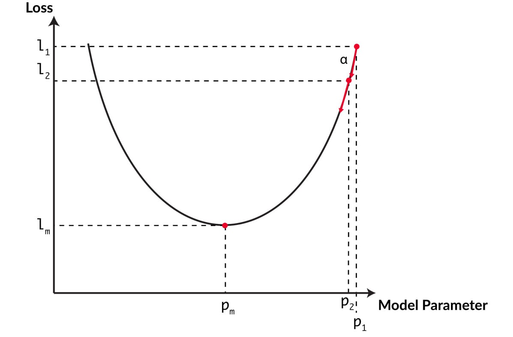


This is achieved, first, by randomly setting parameters for each weight,
indicated by `p`[1]{.subscript} in the diagram. The loss is
then calculated for that model parameter, `l`[1]{.subscript}.
The backpropagation step determines the derivative of the loss with
respect to the model parameter and will determine in which direction the
model should be updated. The next model parameter,
`p`[2]{.subscript}, is equal to the current model parameter
minus the learning rate (`α`) multiplied by the derivative
value. The learning rate is a hyperparameter that is set before the
model training process. By multiplying by the derivative value, larger
steps will be taken when the parameter is far from the minimum where the
absolute value for the derivative is larger. The loss,
`l`[2]{.subscript}, is then calculated and the process
continues until the minimum loss is reached,
`l`[m]{.subscript}, with the optimal parameter,
`p`[m]{.subscript}.

To summarize, these are the iterative steps that the optimization
algorithm performs to find the optimal parameters:

1.  Use forward propagation and current parameters to predict the
    outputs for the entire dataset.
2.  Apply the loss function to compute the loss over all the examples
    from the predicted output.
3.  Use backpropagation to compute the derivatives of the loss with
    respect to the weights and biases at each layer.
4.  Update the weights and biases using the derivative values and the
    learning rate.

Optimizers in TensorFlow
------------------------

There are several different optimizers readily available within
TensorFlow. Each is based on a different optimization algorithm that
aims to reach a global minimum for the loss function. They are all based
on the gradient descent algorithm, although they differ slightly in
implementation. The available optimizers in TensorFlow include
the following:

-   **Stochastic Gradient Descent** (**SGD**): The SGD algorithm applies
    gradient descent to small batches of training data. A momentum
    parameter is also available when using the optimizer in TensorFlow
    that applies exponential smoothing to the computed gradient to speed
    up training.
-   **Adam**: This optimization is an SGD method that is based on the
    continuous adaptive estimation of first and second-order moments.
-   **Root Mean Squared Propagation** (**RMSProp**): This is an
    unpublished, adaptive learning rate optimizer. RMSprop divides the
    learning rate by an average of the squared gradients when finding
    the loss minimum after each step, which results in a learning rate
    that exponentially decays.
-   **Adagrad**: This optimizer has parameter-specific learning rates
    that are updated depending on how frequently the parameter is
    updated during the training process. As the parameter receives more
    updates, each subsequent update is smaller in value.

The choice of optimizer will affect training time and model performance.
Each optimizer also has hyperparameters, such as the initial learning
rate, that must be selected before training, and tuning of these
hyperparameters will also affect training time and model performance.
While other optimizers available in TensorFlow are not explicitly stated
here (and can be found here:
[https://www.tensorflow.org/api\_docs/python/tf/keras/optimizers]),
those stated above perform well both in terms of training time and model
performance and are a safe first choice when selecting an optimizer for
your model. The optimizers available in TensorFlow are located in the
`tf.optimizers` module; for example, an Adam optimizer with a
learning rate equal to `0.001` can be initialized as follows:


```
optimizer = tf.optimizer.adam(learning_rate=0.001)
```


In this topic, you have seen the steps taken in achieving gradient
descent to compute the optimal parameters for model training. In
gradient descent, every single training example is used to learn the
parameters. However, when working with large volume datasets, such as
with images and audio, you will often work in batches and make updates
after learning from each batch. When using gradient descent on batch
data, the algorithm is known as SGD. The SGD optimizer, along with a
suite of other performant optimizers, is readily available in
TensorFlow, including the Adam, RMSProp, and Adagrad optimizers, and
more.

In the next section, you will explore different activation functions,
which are generally applied to the output of each layer.


Activation functions
====================


Activation functions are mathematical functions that are generally
applied to the outputs of ANN layers to limit or bound the values of the
layer. The reason that values may want to be bounded is that without
activation functions, the value and corresponding gradients can either
explode or vanish, thereby making the results unusable. This is because
the final value is the cumulative product of the values from each
subsequent layer. As the number of layers increases, the likelihood of
values and gradients exploding to infinity or vanishing to zero
increases. This concept is known as the **exploding and vanishing
gradient problem**. Deciding whether a node in a layer should be
*activated* is another use of activation functions, hence their name.
Common activation functions and their visual representation in *Figure
1.36* are as follows:

-   **Step** function: The value is non-zero if it is above a certain
    threshold, otherwise it is zero. This is shown in *Figure 1.36a*.
-   **Linear** function: 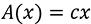,
    which is a scalar multiplication of the input value. This is shown
    in *Figure 1.36b*.
-   **Sigmoid** function: 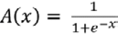,
    like a smoothed-out step function with smooth gradients. This
    activation function is useful for classification since the values
    are bound from zero to one. This is shown in *Figure 1.36c*.
-   **Tanh** function: 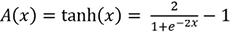,
    which is a scaled version of the sigmoid with steeper gradients
    around `x=0`. This is shown in *Figure 1.36d*.
-   **ReLU** (**Rectified Linear Unit**) function:
    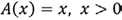, otherwise
    `0`. This is shown in *Figure 1.36e*.
-   **ELU** (**Exponential Linear Unit**) function:
    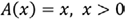, otherwise
    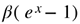, where
    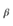 is a constant.
-   **SELU** (**Scaled Exponential Linear Unit**) function:
    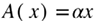, otherwise
    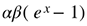, where
    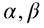are constants. This is
    shown in *Figure 1.36f*.
-   **Swish** function: 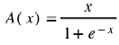.
    This is shown in *Figure 1.36g*:

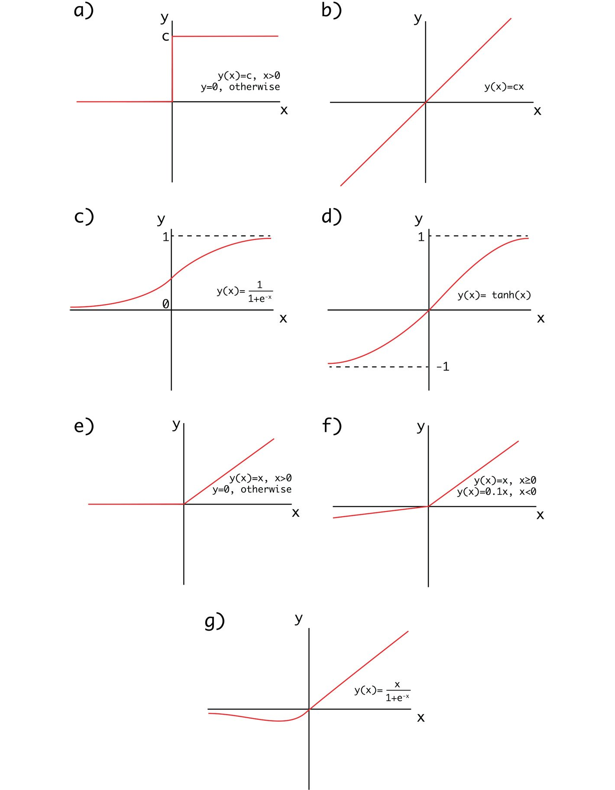


An activation function can be applied to any tensor by utilizing the
activation functions in the `tf.keras.activations` module. For
example, a sigmoid activation function can be applied to a tensor as
follows:


```
y=tf.keras.activations.sigmoid(x)
```


Now, let\'s test the knowledge that you have gained so far in the
following activity.

Activity 1.03: Applying Activation Functions
--------------------------------------------

In this activity, you will recall many of the concepts used throughout
the lab as well as apply activation functions to tensors. You will
use example data of car dealership sales, apply these concepts, show the
sales records of various salespeople, and highlight those with net
positive sales.

**Sales records**:

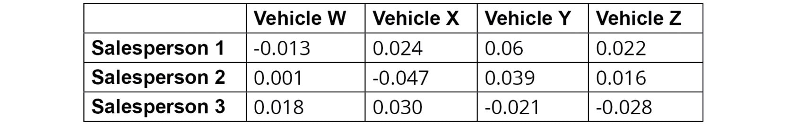


**Vehicle MSRPs**:

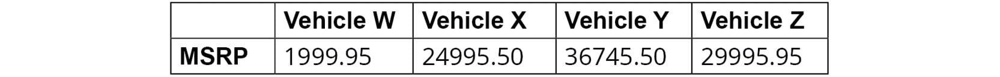


**Fixed costs**:

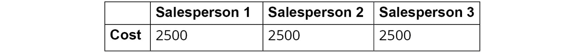


Perform the following steps:

1.  Import the TensorFlow library.

2.  Create a `3x4` tensor as an input with the values
    `[[-0.013, 0.024, 0.06, 0.022], [0.001, -0.047, 0.039, 0.016], [0.018, 0.030, -0.021, -0.028]]`.
    The rows in this tensor represent the sales of various sales
    representatives, the columns represent various vehicles available at
    the dealership, and values represent the average percentage
    difference from MSRP. The values are positive or negative depending
    on whether the salesperson was able to sell for more or less than
    the MSRP.

3.  Create a `4x1` weights tensor with the shape
    `4x1` with the values
    `[[19995.95], [24995.50], [36745.50], [29995.95]]`
    representing the MSRP of the cars.

4.  Create a bias tensor of size `3x1` with the values
    `[[-2500.0], [-2500.0], [-2500.0]]` representing the fixed
    costs associated with each salesperson.

5.  Matrix multiply the input by the weight to show the average
    deviation from the MSRP on all cars and add the bias to subtract the
    fixed costs of the salesperson. Print the result.

    You should get the following result:

    
    


6.  Apply a ReLU activation function to highlight the net-positive
    salespeople and print the result.

    You should get the following result:

    
    


Note

The solution to this activity can be found via [this link].

In subsequent chapters, you will see how to add activation functions to
your ANNs, either between layers or applied directly after a layer when
layers are defined. You will learn how to choose which activation
functions are most appropriate, which is often by hyperparameter
optimization techniques. The activation function is one example of a
hyperparameter, a parameter set before the learning process begins, that
can be tuned to find the optimal values for model performance.


Summary
=======


In this lab, you were introduced to the TensorFlow library. You
learned how to use it in the Python programming language. You created
the building blocks of ANNs (tensors) with various ranks and shapes,
performed linear transformations on tensors using TensorFlow, and
implemented addition, reshaping, transposition, and multiplication on
tensors---all of which are fundamental for understanding the underlying
mathematics of ANNs.
