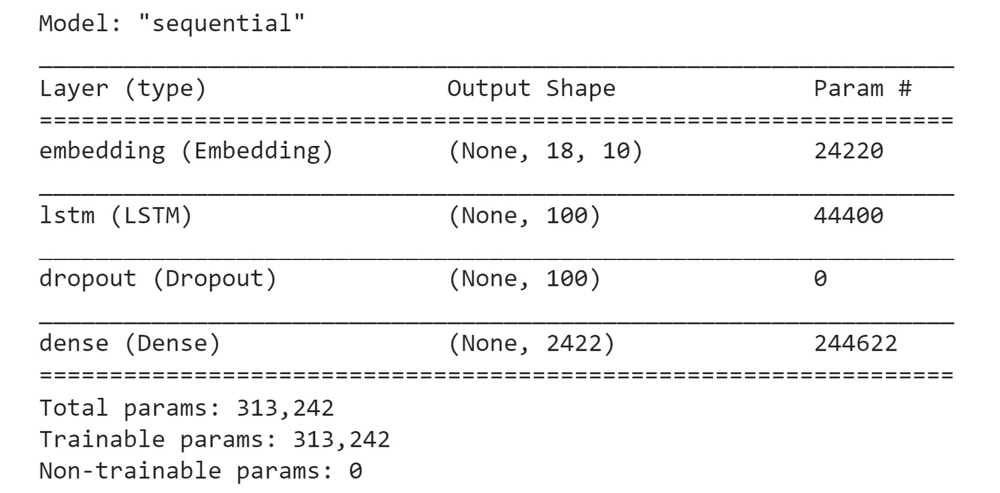

Lab 10:  Generative Models
==========================


Overview

This lab introduces you to generative models---their components, how
they function, and what they can do. You will start with generative
**long short-term memory** (**LSTM**) networks and how to use them to
generate new text. You will then learn about **generative adversarial
networks** (**GANs**) and how to create new data, before moving on to
**deep convolutional generative adversarial networks** (**DCGANs**)
and creating your own images.

By the end of the lab, you will know how to effectively use
different types of GANs and generate various types of new data.


Introduction
============


In this lab, you will explore generative models, which are types of
unsupervised learning algorithms that generate completely new artificial
data. Generative models differ from predictive models in that they aim
to generate new samples from the same distribution of training data.
While the purpose of these models may be very different from those
covered in other chapters, you can and will use many of the concepts
learned in prior chapters, including loading and preprocessing various
data files, hyperparameter tuning, and building convolutional and
**recurrent neural networks** (**RNNs**). In this lab, you will
learn about one way to generate new samples from a training dataset,
which is to use LSTM models to complete sequences of data based on
initial seed data.

Another way that you will learn about is the concept of two neural
networks competing against one another in an adversarial way, that is, a
generator generating samples and a discriminator trying to distinguish
between the generated and real samples. As both models train
simultaneously, the generator generates more realistic samples as the
discriminator can more accurately distinguish between the \"real\" and
\"fake\" data over time. These networks working together are called
GANs. Generative models can be used to generate new text data, audio
samples, and images.

In this lab, you will focus primarily on three areas of generative
models -- text generation or language modeling, GANs, and DCGANs.


Text Generation
===============


In *Lab 9*, *Recurrent Neural Networks*, you were introduced to
**natural language processing** (**NLP**) and text generation (also
known as language modeling), as you worked with some sequential data
problems. In this section, you will be extending your sequence model for
text generation using the same dataset to generate extended headlines.

Previously in this book, you saw that sequential data is data in which
each point in the dataset is dependent on the point prior and the order
of the data is important. Recall the example with the bag of words from
*Lab 9*, *Recurrent Neural Networks*. With the *bag-of-words*
approach, you simply used a set of word counts to derive meaning from
their use. As you can see in *Figure 11.1*, these two sentences have
completely opposite semantic meanings, but would be identical in a
bag-of-words format. While this may be an effective strategy for some
problems, it\'s not an ideal approach for predicting the next word or
words.


Consider the following example of a language model. You are given a
sentence or a phrase, `yesterday I took my car out for a`, and
are asked to predict the word that comes next in the sequence. Here, an
appropriate word to complete the sequence would be `drive`.


To be successful in working with sequential data, you need a neural
network capable of storing the value of the sequence. For this, you can
use RNNs and LSTMs. LSTMs that are used for generating new sequences,
such as text generation or language modeling, are known as generative
LSTMs.

Let\'s do a simple review of RNNs and LSTMs.

Essentially, RNNs loop back on themselves, storing information and
repeating the process, in a continuous cycle. Information is first
transformed into vectors so that it can be processed by machines. The
RNN then processes the vector sequence one at a time. As the RNN
processes each vector, the vector gets passed through the previous
hidden state. In this way, the hidden state retains information from the
previous step, acting as a type of memory. It does this by combining the
input and the previous hidden state with a tanh function that compresses
the values between `-1` and `1`.

Essentially, this is how the RNN functions. RNNs don\'t need a lot of
computation and work well with short sequences. Simply put, RNNs are
networks that have loops that allow information to persist over time.


RNNs do come with a couple of challenges---most notably, the exploding
and vanishing gradient problems.

The **exploding gradient problem** is what happens when gradients become
too large for optimization. The opposite problem may occur where your
gradients are too small. This is what is known as the **vanishing
gradient problem**. This happens when gradients become increasingly
smaller as you make repeated multiplications. Since the size of the
gradient determines the size of the weight updates, exploding or
vanishing gradients mean that the network can no longer be trained. This
is a very real problem when it comes to training RNNs since the output
of the networks feeds back into the input. The vanishing and exploding
gradient issues were covered in *Lab 9*, *Recurrent Neural
Networks*, and more details of how these issues are solved can be found
there.

LSTMs can selectively control the flow of information within each LSTM
node. With added control, you can more easily adjust the model to
prevent potential problems with gradients.


So, what enables LSTMs to track and store information throughout many
time steps? You\'ll recall from *Lab 9*, *Recurrent Neural
Networks*, that the key building block behind the LSTM is the structure
called a *gate*, which allows the LSTM to selectively add or remove
information to its cell state.

Gates consist of a bounding function such as sigmoid or tanh. For
example, if the function were sigmoid, it would force its input to be
between zero and one. Intuitively, you can think of this as capturing
how much of the information passed through the gate should be retained.
This should be between zero and one, effectively *gating* the flow of
information.

LSTMs process information through four simple steps.

They first forget their irrelevant history. Second, they perform a
computation to store relevant parts of new information, and thirdly,
they use these two steps together to selectively update their internal
state. Finally, they generate an output.


This was a bit of a refresher on LSTMs and how they can selectively
control and regulate the flow of information. Now that you\'ve reviewed
LSTMs and their architecture, you can put some of these concepts to work
by reviewing your code and LSTM model.

You can create an LSTM model in the following manner using a sequential
model. This LSTM contains four hidden layers, each with `50`,
`60`, `80`, and `120` units and a ReLU
activation function. The `return_sequences` parameter is set
to `True` for all but the last layer since they are not the
final LSTM layer in the network:


```
regressor = Sequential()
regressor.add(LSTM(units= 50, activation = 'relu', \
                   return_sequences = True, \
                   input_shape = (X_train.shape[1], 5)))
regressor.add(Dropout(0.2))
regressor.add(LSTM(units= 60, activation = 'relu', \
                   return_sequences = True))
regressor.add(Dropout(0.3))
regressor.add(LSTM(units= 80, activation = 'relu', \
              return_sequences = True))
regressor.add(Dropout(0.4))
regressor.add(LSTM(units= 120, activation = 'relu'))
regressor.add(Dropout(0.5))
regressor.add(Dense(units = 1))
```


Now that you\'ve recalled how to create RNNs with LSTM layers, you\'ll
next learn how to apply them to natural language text and generate new
text in a sequence.

Extending NLP Sequence Models to Generate Text
----------------------------------------------

**NLP** takes data in the form of natural language that has
traditionally been very difficult for machines to make sense of and
turns it into data that can be useful for machine learning applications.
This data can take the form of characters, words, sentences, or
paragraphs. You will be focusing on text generation in this section.

As a quick review, *preprocessing* generally entails all the steps
needed to train your model. Some common steps include *data cleaning*,
*transformation*, and *data reduction*. For NLP, more specifically, the
steps could be all or some of the following:

-   **Dataset cleaning** encompasses the conversion of the case to
    lowercase, removing punctuation.
-   **Tokenization** is breaking up a character sequence into specified
    units called tokens.
-   **Padding** is a way to make input sentences of different sizes the
    same by padding them.
-   **Padding the sequences** refers to making sure that the sequences
    have a uniform length.
-   **Stemming** is truncating words down to their stem. For example,
    the words `rainy` and `raining` both have the
    stem `rain`.

Let\'s take a closer look at what the process looks like.

Dataset Cleaning
----------------

Here, you create a function, `clean_text`, that returns a list
of words after cleaning. Now, save all text as lowercase with
`lower()` method, encoded with `utf8` for character
standardization. Finally, output 10 headlines from your corpus:


```
def clean_text(txt):
    txt = "".join(v for v in txt \
                  if v not in string.punctuation).lower()
    txt = txt.encode("utf8").decode("ascii",'ignore')
    return txt 
corpus = [clean_text(x) for x in all_headlines]
corpus[:10]
```


Cleaning the text in this manner is a great way to standardize text to
input into a model. Converting all words to lowercase in the same
encoding ensures consistency of the text. It also ensures that
capitalization or different encodings of the same words are not treated
as different words by any model that is created.

Generating a Sequence and Tokenization
--------------------------------------

Neural networks expect input data in a consistent, numerical format.
Much like how images are processed for image classification models,
where each image is represented as a three-dimensional array, and are
often resized to meet the expectations of the model, text must be
processed similarly. Luckily, Keras has a number of utility classes and
functions to aid with processing text data for neural networks. One such
class is `Tokenizer`, which vectorizes a text corpus by
converting the corpus into a sequence of integers. The following code
imports the `Tokenizer` class from Keras:


```
from keras.preprocessing.text import Tokenizer
```


Generating a Sequence of n-gram Tokens
--------------------------------------

Here, you create a function named `get_seq_of_tokens`. With
`tokenizer.fit_on_texts`, you extract tokens from the corpus.
Each integer output corresponds with a specific word. The
`input_seq` parameter is initialized as an empty list,
`[]`. With `token_list =`
`tokenizer.texts_to_sequences`, you convert text to the
tokenized equivalent. With `n_gram_sequence`
`= token_list`, you generate the n-gram sequences. Using
`input_seq.append(n_gram_sequence)`, you append each sequence
to the list of your features:


```
tokenizer = Tokenizer()
def get_seq_of_tokens(corpus):
    tokenizer.fit_on_texts(corpus)
    all_words = len(tokenizer.word_index) + 1
    
    input_seq = []
    for line in corpus:
        token_list = tokenizer.texts_to_sequences([line])[0]
        for i in range(1, len(token_list)):
            n_gram_sequence = token_list[:i+1]
            input_seq.append(n_gram_sequence)
    return input_seq, all_words
your_sequences, all_words = get_seq_of_tokens(corpus)
your_sequences[:10]
```


`get_seq_of_tokens` ensures that a corpus is broken up into
sequences of equal length. If a corpus is too short for the network\'s
expected input, the resultant sequence will have to be padded.

Padding Sequences
-----------------

Here, you create a `generate_padded_sequences` function that
takes `input_seq` as input. The `pad_sequences`
function is used to pad the sequences to make their lengths equal. In
the function, first, the maximum sequence length is determined by
calculating the length of each input sequence. Once the maximum sequence
length is determined, all other sequences are padded to match. Next, the
`predictors` and `label` parameters are created. The
`label` parameter is the last word of the sequence, and the
`predictors` parameter is all the preceding words. Finally,
the `label` parameter is converted to a categorical array:


```
def generate_padded_sequences(input_seq):
    max_sequence_len = max([len(x) for x in input_seq])
    input_seq = np.array(pad_sequences\
                         (input_seq, maxlen=max_sequence_len, \
                          padding='pre'))
    
    predictors, label = input_seq[:,:-1],input_seq[:,-1]
    label = keras.utils.to_categorical(label, num_classes=all_words)
    return predictors, label, max_sequence_len
predictors, label, max_sequence_len = generate_padded_sequences\
                                      (your_sequences)
```


Now that you have learned some preprocessing and cleaning steps for
working with natural language, including cleaning, generating n-gram
sequences, and padding sequences for consistent lengths, you are ready
for your first exercise of the lab, that is, text generation.

Exercise 11.01: Generating Text
-------------------------------

In this exercise, you will use the LSTM model from *Exercise 9.02*,
*Building an RNN with LSTM Layer Nvidia Stock Prediction*, to extend
your prediction sequence and generate new text. In that exercise, you
created an LSTM model to predict the stock price of Nvidia by feeding
the historical stock prices to the model. The model was able to use LSTM
layers to understand patterns in the historical stock prices for
future predictions.

In this exercise, you will use the same principle applied to text, by
feeding the historical headlines to the model. You will use the
`articles.csv` dataset for this exercise. The dataset contains
831 news headlines from the New York Times in CSV format. Along with the
headlines, the dataset also contains several attributes about the news
article, including the publication date, print page, and keywords. You
are required to generate new news headlines using the given dataset.

Note

You can find `articles.csv` here:
[https://github.com/fenago/deep-learning-essentials/blob/main/Lab09/Datasets/Articles.csv].

Perform the following steps to complete this exercise:

1.  Open a new Jupyter or Colab notebook.

2.  Import the following libraries:

    
    ```
    from keras.preprocessing.sequence import pad_sequences
    from keras.models import Sequential
    from keras.layers import Embedding, LSTM, Dense, Dropout
    import tensorflow.keras.utils as ku 
    from keras.preprocessing.text import Tokenizer
    import pandas as pd
    import numpy as np
    from keras.callbacks import EarlyStopping
    import string, os 
    import warnings
    warnings.filterwarnings("ignore")
    warnings.simplefilter(action='ignore', category=FutureWarning)
    ```


    You should get the following output:

    
    ```
    Using TensorFlow backend.
    ```


3.  Load the dataset locally by setting `your_dir` to
    `content/`. Create a `your_headlines` parameter
    as an empty list and use a `for` loop to iterate over:

    
    ```
    your_dir = 'content/'
    your_headlines = []
    for filename in os.listdir(your_dir):
        if 'Articles' in filename:
            article_df = pd.read_csv(your_dir + filename)
            your_headlines.extend(list(article_df.headline.values))
            break
    your_headlines = [h for h in your_headlines if h != "Unknown"]
    len(our_headlines)
    ```


    The output will represent the number of headlines in your dataset:

    
    ```
    831
    ```


4.  Now, create a `clean_text` function to return a list of
    cleaned words. Convert the text to lowercase with
    `lower()` method and encode it with `utf8` for
    character standardization. Finally, output 20 headlines from your
    corpus:

    
    ```
    def clean_text(txt):
        txt = "".join(v for v in txt \
                      if v not in string.punctuation).lower()
        txt = txt.encode("utf8").decode("ascii",'ignore')
        return txt 
    corpus = [clean_text(x) for x in all_headlines]
    corpus[60:80]
    ```


    You should get the following output:

    
    


5.  With `tokenizer.fit`, extract tokens from the corpus. Each
    integer output corresponds to a specific word. The
    `input_seq` parameter is initialized as an empty list,
    `[]`. With `token_list =`
    `tokenizer.texts_to_sequences`, you convert each sentence
    into its tokenized equivalent. With
    `n_gram_sequence = token_list`, you generate the n-gram
    sequences. Using `input_seq.append(n_gram_sequence)`, you
    append each sequence to a list of features:

    
    ```
    tokenizer = Tokenizer()
    def get_seq_of_tokens(corpus):
        tokenizer.fit_on_texts(corpus)
        all_words = len(tokenizer.word_index) + 1
        
        input_seq = []
        for line in corpus:
            token_list = tokenizer.texts_to_sequences([line])[0]
            for i in range(1, len(token_list)):
                n_gram_sequence = token_list[:i+1]
                input_seq.append(n_gram_sequence)
        return input_seq, all_words
    your_sequences, all_words = get_seq_of_tokens(corpus)
    your_sequences[:20]
    ```


    You should get the following output:

    
    


    The output shows the n-gram tokens of the headlines. For each
    headline, the number of n-grams is determined by the length of the
    headline.

6.  Pad the sequences and obtain the variables, `predictors`
    and `target`:
    
    ```
    def generate_padded_sequences(input_seq):
        max_sequence_len = max([len(x) for x in input_seq])
        input_seq = np.array(pad_sequences\
                             (input_seq, maxlen=max_sequence_len, \
                              padding='pre'))
        predictors, label = input_seq[:,:-1],input_seq[:,-1]
        label = ku.to_categorical(label, num_classes=all_words)
        return predictors, label, max_sequence_len
    predictors, label, \
    max_sequence_len = generate_padded_sequences(inp_seq)
    ```


7.  Prepare your model for training. Add an input embedding layer with
    `model.add(Embedding)`, a hidden LSTM layer with
    `model.add(LSTM(100))`, and a dropout of 10%. Then, add
    the output layer with `model.add(Dense)` using the softmax
    activation function. With `compile()` method, configure
    your model for training, setting your loss function to
    `categorical_crossentropy`. Use the Adam optimizer:

    
    ```
    def create_model(max_sequence_len, all_words):
        input_len = max_sequence_len - 1
        model = Sequential()
        
        model.add(Embedding(all_words, 10, input_length=input_len))
        
        model.add(LSTM(100))
        model.add(Dropout(0.1))
        
        model.add(Dense(all_words, activation='softmax'))
        model.compile(loss='categorical_crossentropy', \
                      optimizer='adam')
        
        return model
    model = create_model(max_sequence_len, all_words)
    model.summary()
    ```


    You should get the following output:

    
    


8.  Fit the model and set `epochs` to `200` and
    `verbose` to `5`:

    
    ```
    model.fit(predictors, label, epochs=200, verbose=5)
    ```


    You should get the following output:

    
    


9.  Create a function that will generate a headline given a starting
    seed text, the number of words to generate, the model, and the
    maximum sequence length. The function will include a `for`
    loop to iterate over the number of words to generate. In each
    iteration, the tokenizer will tokenize the text, and then pad the
    sequence before predicting the next word in the sequence. Next, the
    iteration will convert the token back into a word and add it to the
    sentence. Once the `for` loop completes, the generated
    headline will be returned:
    
    ```
    def generate_text(seed_text, next_words, model, max_sequence_len):
        for _ in range(next_words):
            token_list = tokenizer.texts_to_sequences([seed_text])[0]
            token_list = pad_sequences([token_list], \
                                        maxlen = max_sequence_len-1, \
                                        padding='pre')
            predicted = model.predict\
                        (token_list, verbose=0)
            output_word = ""
            for word,index in tokenizer.word_index.items():
                if index == predicted.any():
                    output_word = word
                    break
            seed_text += " "+output_word
        return seed_text.title()
    ```


10. Finally, output some of your generated text with the
    `print` function by printing the output of the function
    you created in *Step 9*. Use the `10 ways`,
    `europe looks to`, `best way`,
    `homeless in`, `unexpected results`, and
    `critics warn` seed words with the corresponding number of
    words to generate; that is, `11`, `8`,
    `10`, `10`, `10`, and `10`,
    respectively:

    
    ```
    print (generate_text("10 ways", 11, model, max_sequence_len))
    print (generate_text("europe looks to", 8, model, \
                         max_sequence_len))
    print (generate_text("best way", 10, model, max_sequence_len))
    print (generate_text("homeless in", 10, model, max_sequence_len))
    print (generate_text("unexpected results", 10, model,\
                         max_sequence_len))
    print (generate_text("critics warn", 10, model, \
                         max_sequence_len))
    ```


    You should get the following output:

    
    


The output shows the generated headlines with the seed text provided.
The words generated are limited to what was included in the training
dataset, which itself was fairly limited in size, leading to some
nonsensical results.

Now that you\'ve generated text with an LSTM in your first exercise,
let\'s move on to working with images by using GANs to generate new
images based on a given dataset.


Generative Adversarial Networks
===============================


GANs are networks that generate new, synthetic data by learning patterns
and underlying representations from a training dataset. The GAN does
this by using two networks that compete with one another in an
adversarial fashion. These networks are called the **generator** and
**discriminator**.

To see how these networks compete with one another, consider the
following example. The example will skip over a few details that will
make more sense as you get to them later in the lab.

Imagine two entities: a money counterfeiter and a business owner. The
counterfeiter attempts to make a currency that looks authentic to fool
the business owner into thinking the currency is legitimate. By
contrast, the business owner tries to identify any fake bills, so that
they don\'t end up with just a piece of worthless paper instead of real
currency.

This is essentially what GANs do. The counterfeiter in this example is
the generator, and the business owner is the discriminator. The
generator creates an image and passes it to the discriminator. The
discriminator checks whether the image is real or not, and both networks
compete against each other, driving improvements within one another.

The generator\'s mission is to create a synthetic sample of data that
can fool the discriminator. The generator will try to trick the
discriminator into thinking that the sample is real. The
discriminator\'s mission is to be able to correctly classify a synthetic
sample created by the generator.


The next sections will look a bit closer at the generator and
discriminator and how they function individually, before considering
both in combination in the *The Adversarial Network* section.

The Generator Network
---------------------

As discussed, GANs are utilized for unsupervised learning tasks in
machine learning. GANs consist of two models (a generator and a
discriminator) that automatically discover and learn the patterns in
input data. The two models compete with one another to analyze, capture,
and create variations within data. GANs can be used to generate new data
that looks like it could have come from the original data.

First up is the generator model. How does the generator create synthetic
data?

The generator receives input as a *fixed-length random vector* called
the **latent vector**, which goes into the generator network. This is
sometimes referred to as the **random noise seed**. A new sample is
generated from it. The generated instance is then sent to the
discriminator for classification. Through random noise, the generator
learns which outputs were more convincing and continues to improve in
that direction.


In the following figure, you can see that the discriminator takes input
from both real data and the generator. The generator neural network
attempts to generate data that looks real to the discriminator.

The generator doesn\'t get to see what the real data is. The main goal
of the generator is to convince the discriminator to classify its output
as real.


The GAN includes the following components:

-   Noisy input vector
-   Discriminator network
-   Generator loss

Backpropagation is used to adjust the weights in the optimal direction
by calculating a weight\'s impact on the output. The backpropagation
method is used to obtain gradients and these gradients can help change
the generator weights.


The basic procedure of a single generator iteration looks something like
this:

1.  Based on real data from a dataset, *sample random noise* is used.
2.  The *generator* produces *output* from the noise.
3.  The *discriminator* classifies the output as \"*real*\" or
    \"*fake*.\"
4.  The *loss* from this classification is calculated, followed by
    *backpropagation through the generator* and *discriminator* to
    obtain the *gradients*.
5.  The *gradients* are used to adjust the generator *weights*.

Now, to code the generator, the first step is to define your generator
model. You begin by creating your generator function with
`define_your_gen`. The number of outputs of your generator
should match the size of the data you are trying to synthesize.
Therefore, the final layer of your generator should be a dense layer
with the number of units equal to the expected size of the output:


```
model.add(Dense(n_outputs, activation='linear'))
```


The model will not compile because it does not directly fit the
generator model.

The code block will look something like the following:


```
def define_your_gen(latent_dim, n_outputs=2):
    model = Sequential()
    model.add(Dense(5, activation='relu', \
                    kernel_initializer='he_uniform', \
                    input_dim=latent_dim))
    model.add(Dense(n_outputs, activation='linear'))
    return model
```


The generator composes one half of the GAN; the other half is the
discriminator.

The Discriminator Network
-------------------------

A **discriminator** is a neural network model that learns to identify
real data from the fake data that the generator sends as input. The two
sources of training data are the authentic data samples and the fake
generator samples:

-   Real data instances are used by the discriminator as positive
    samples during the training.
-   Synthetic data instances created by the generator are used as fake
    examples during the training process.


During the discriminator training process, the discriminator is
connected to the generator and discriminator loss. It requires both real
data and synthetic data from the generator, but only uses the
discriminator loss for weight updates.


Now let\'s take a look at how the discriminator works with some code.

Your first step is to define your discriminator model with
`define_disc()`.

The model takes a vector from your generator and makes a prediction as
to whether the sample is real or fake. Therefore, you use binary
classification.

You\'re creating a simple GAN, so you will only need one hidden layer.
Use `model.add(Dense(25)` to create the hidden layer.

Again, your activation function will be ReLU with
`activation='relu'` and the `he_uniform` weight
initialization with `kernel_initializer='he_uniform'`.

Your output layer will only need a single node for binary
classification. To ensure your output is zero or one, you will use the
sigmoid activation function:


```
model.add(Dense(1, activation='sigmoid'))
```


The model will attempt to minimize your loss function. Use Adam for your
stochastic gradient descent:


```
model.compile(loss='binary_crossentropy', \
              optimizer='adam', metrics=['accuracy'])
```


Here\'s a look at your discriminator model code:


```
def define_disc(n_inputs=2):
    model = Sequential()
    model.add(Dense(25, activation='relu', \
                    kernel_initializer='he_uniform', \
                    input_dim=n_inputs))
    model.add(Dense(1, activation='sigmoid'))
    model.compile(loss='binary_crossentropy', \
                  optimizer='adam', metrics=['accuracy'])
    return model
```


Now that you know how to create both models that compose the GAN, you
can learn how to combine them to create your GAN in the next section.

The Adversarial Network
-----------------------

GANs consist of two networks, a generator, which is represented as
, and a discriminator,
represented as . Both networks
play an adversarial game. The generator network tries to learn the
underlying distribution of the training data and generates similar
samples, while the discriminator network tries to catch the fake samples
generated by the generator.

The generator network takes a sample and generates a fake sample of
data. The generator is trained to increase the probability of the
discriminator network making mistakes. The discriminator network decides
whether the data is generated or taken from the real sample using binary
classification with the help of a sigmoid function. The sigmoid function
ensures that the output is zero or one.

The following list represents an overview of a typical GAN at work:

1.  First, a *noise vector* or the *input vector* is fed to the
    generator network.
2.  The generator creates synthetic data samples.
3.  Authentic data is passed to the discriminator along with the
    synthetic data.
4.  The discriminator then identifies the data and classifies it as real
    or fake.
5.  The model is trained and the loss backpropagated into both the
    discriminator and generator networks.


To code an adversarial network, the following steps are necessary. Each
of these is described in detail in the following sections:

1.  Combine the generator and discriminator models in your GAN.
2.  Generate real samples with class labels.
3.  Create points in latent space to use as input for the generator.
4.  Use the generator to create fake samples.
5.  Evaluate the discriminator performance.
6.  Train the generator and discriminator.
7.  Create the latent space, generator, discriminator, and GAN, and
    train the GAN on the training data.

Now that you\'ve explored the inner workings of the generator and
discriminator, take a look at how you can combine the models to compete
with one another.

### Combining the Generative and Discriminative Models

The `define_your_gan()` function creates your combined model.

While creating the combined GAN model, freeze the weights of the
discriminator model by specifying
`discriminator.trainable = False`. This prevents the
discriminator weights from getting updated while you update the
generator weights.

Now, you can add both models with `model.add(generator)` and
`model.add(discriminator)`.

Then, specify `binary_crossentropy` as the loss function and
Adam as your optimizer while compiling your model:


```
def define_your_gan(generator, discriminator):
    discriminator.trainable = False
    model = Sequential()
    model.add(generator)
    model.add(discriminator)
    model.compile(loss='binary_crossentropy', optimizer='adam')
    return model
```


### Generating Real Samples with Class Labels

Now extract real samples from the dataset to inspect fake samples
against them. You can use the `generate_real()` function
defined previously. In the first line of the function,
`rand(n) – 0.5`, create random numbers on `n` in the
range of `-0.5` to `0.5`. Use `hstack` to
stack your array. Now you can generate class labels with
`y = ones((n, 1))`:


```
def generate_real(n):
    X1 = rand(n) - 0.5
    X2 = X1 * X1
    X1 = X1.reshape(n, 1)
    X2 = X2.reshape(n, 1)
    X = hstack((X1, X2))
    y = ones((n, 1))
    return X, y
```


### Creating Latent Points for the Generator

Next, use the generator model to create fake samples. You need to
generate the same number of points in the latent space with your
`gen_latent_points()` function. These latent points will be
passed to the generator to create samples. This function generates
uniformly random samples from NumPy\'s `randn` function. The
number will correspond to the latent dimension multiplied by the number
of samples to generate. This array of random numbers will then be
reshaped to match the expected input of the generator:


```
def gen_latent_points(latent_dim, n):
    x_input = randn(latent_dim * n)
    x_input = x_input.reshape(n, latent_dim)
    return x_input
```


### Using the Generator to Generate Fake Samples and Class Labels

The `gen_fake()` function generates fake samples with a class
label of zero. This function generates the latent points using the
function created in the previous step. Then, the generator will generate
samples based on the latent points. Finally, the class label,
`y`,is generated as an array of zeros representing the fact
that this is synthetic data:


```
def gen_fake(generator, latent_dim, n):
    x_input = gen_latent_points(latent_dim, n)
    X = generator.predict(x_input)
    y = zeros((n, 1))
    return X, y
```


### Evaluating the Discriminator Model

The following `performance_summary()` function is used to plot
both real and fake data points. The function generates real values and
synthetic data and evaluates the performance of the discriminator via
its accuracy in identifying the synthetic images. Then, it finally plots
both the real and synthetic images for visual review:


```
def performance_summary(epoch, generator, \
                        discriminator, latent_dim, n=100):
    x_real, y_real = generate_real(n)
    _, acc_real = discriminator.evaluate\
                  (x_real, y_real, verbose=0)
    x_fake, y_fake = gen_fake\
                     (generator, latent_dim, n)
    _, acc_fake = discriminator.evaluate\
                  (x_fake, y_fake, verbose=0)
    print(epoch, acc_real, acc_fake)
    plt.scatter(x_real[:, 0], x_real[:, 1], color='green')
    plt.scatter(x_fake[:, 0], x_fake[:, 1], color='red')
    plt.show()
```


### Training the Generator and Discriminator

Now, train your model with the `train()` function. This
function contains a `for` loop to iterate through the epochs.
At each epoch, real data is sampled with a size equal to half the batch,
and then synthetic data is generated. Then, the discriminator trains on
the real, followed by the synthetic, data. Then, the GAN model is
trained. When the epoch number is a multiple of the input argument,
`n_eval`, a performance summary is generated:


```
def train(g_model, d_model, your_gan_model, \
          latent_dim, n_epochs=1000, n_batch=128, n_eval=100):
    half_batch = int(n_batch / 2)
    for i in range(n_epochs):
        x_real, y_real = generate_real(half_batch)
        x_fake, y_fake = gen_fake\
                         (g_model, latent_dim, half_batch)
        d_model.train_on_batch(x_real, y_real)
        d_model.train_on_batch(x_fake, y_fake)
        x_gan = gen_latent_points(latent_dim, n_batch)
        y_gan = ones((n_batch, 1))
        your_gan_model.train_on_batch(x_gan, y_gan)
        if (i+1) % n_eval == 0:
            performance_summary(i, g_model, d_model, latent_dim)
```


### Creating the Latent Space, Generator, Discriminator, GAN, and Training Data

You can combine all the steps to build and train the model. Here,
`latent_dim` is set to `5`, representing five latent
dimensions:


```
latent_dim = 5
generator = define_gen(latent_dim)
discriminator = define_discrim()
your_gan_model = define_your_gan(generator, discriminator)
train(generator, discriminator, your_gan_model, latent_dim)
```


In this section, you learned about GANs, different components, the
generator and discriminator, and how you combine them to create an
adversarial network. You will now use these concepts to generate
sequences with your own GAN.

Exercise 11.02: Generating Sequences with GANs
----------------------------------------------

In this exercise, you will use a GAN to create a model that generates a
quadratic function (`y=x`[2]) for values of
`x` between `-0.5` and `0.5`. You will
create a generator that will simulate the normal distribution and then
square the values to simulate the quadratic function. You will also
create a discriminator that will discriminate between a true quadratic
function and the output from the generator. Next, you will combine them
to create your GAN model. Finally, you will train your GAN model and
evaluate your model, comparing the results from the generator against a
true quadratic function.

Perform the following steps to complete this exercise:

1.  Open a new Jupyter or Colab notebook and import the following
    libraries:
    
    ```
    from keras.models import Sequential
    from numpy import hstack, zeros, ones
    from numpy.random import rand, randn
    from keras.layers import Dense
    import matplotlib.pyplot as plt 
    ```


2.  Define the generator model. Begin by creating your generator
    function with `define_gen`.

    Use Keras\' `linear` activation function for the last
    layer of the generator network because the output vector should
    consist of continuous real values as a normal distribution does. The
    first element of the output vector has a range of
    `[-0.5,0.5]`. Since you will only consider values of
    `x` between these two values, the second element has a
    range of `[0.0,0.25]`:

    
    ```
    def define_gen(latent_dim, n_outputs=2):
        model = Sequential()
        model.add(Dense(15, activation='relu', \
                  kernel_initializer='he_uniform', \
                  input_dim=latent_dim))
        model.add(Dense(n_outputs, activation='linear'))
        return model
    ```


3.  Now, with `define_disc()`, define your discriminator. The
    discriminator network has a binary output that identifies whether
    the input is real or fake. For this reason, use sigmoid as the
    activation function and binary cross-entropy as your loss.

    You\'re creating a simple GAN, so use one hidden layer with
    `25` nodes. Use ReLU activation and `he_uniform`
    weight initialization. Your output layer will only need a single
    node for binary classification. Use Adam as your optimizer. The
    model will attempt to minimize your loss function:

    
    ```
    def define_disc(n_inputs=2):
        model = Sequential()
        model.add(Dense(25, activation='relu', \
                        kernel_initializer='he_uniform', \
                        input_dim=n_inputs))
        model.add(Dense(1, activation='sigmoid'))
        model.compile(loss='binary_crossentropy', \
                      optimizer='adam', metrics=['accuracy'])
        return model
    ```


4.  Now, add both models with `model.add(generator)` and
    `model.add(discriminator)`. Then, specify binary
    cross-entropy as your loss function and Adam as your optimizer,
    while compiling your model:
    
    ```
    def define_your_gan(generator, discriminator):
        discriminator.trainable = False
        model = Sequential()
        model.add(generator)
        model.add(discriminator)
        model.compile(loss='binary_crossentropy', optimizer='adam')
        return model
    ```


5.  Extract real samples from your dataset to inspect fake samples
    against them. Use the `generate_real()` function defined
    previously. `rand(n) – 0.5` creates random numbers on
    `n` in the range of `-0.5` to `0.5`.
    Use `hstack` to stack your array. Now, generate class
    labels with` y = ones((n, 1))`:
    
    ```
    def generate_real(n):
        X1 = rand(n) - 0.5
        X2 = X1 * X1
        X1 = X1.reshape(n, 1)
        X2 = X2.reshape(n, 1)
        X = hstack((X1, X2))
        y = ones((n, 1))
        return X, y
    ```


6.  Next, set the generator model to create fake samples. Generate the
    same number of points in the latent space with your
    `gen_latent_points()` function. Then, pass them to the
    generator and use them to create samples:
    
    ```
    def gen_latent_points(latent_dim, n):
        x_input = randn(latent_dim * n)
        x_input = x_input.reshape(n, latent_dim)
        return x_input
    ```


7.  Use the generator to generate fake samples with class labels:
    
    ```
    def gen_fake(generator, latent_dim, n):
        x_input = gen_latent_points(latent_dim, n)
        X = generator.predict(x_input)
        y = zeros((n, 1))
        return X, y
    ```


8.  Evaluate the discriminator model. The
    `performance_summary()` function will plot both real and
    fake data points:
    
    ```
    def performance_summary(epoch, generator, \
                            discriminator, latent_dim, n=100):
        x_real, y_real = generate_real(n)
        _, acc_real = discriminator.evaluate\
                      (x_real, y_real, verbose=0)
        x_fake, y_fake = gen_fake\
                         (generator, latent_dim, n)
        _, acc_fake = discriminator.evaluate\
                      (x_fake, y_fake, verbose=0)
        print(epoch, acc_real, acc_fake)
        plt.scatter(x_real[:, 0], x_real[:, 1], color='green')
        plt.scatter(x_fake[:, 0], x_fake[:, 1], color='red')
        plt.show()
    ```


9.  Now, train your model with the `train()` function:
    
    ```
    def train(g_model, d_model, your_gan_model, \
              latent_dim, n_epochs=1000, \
              n_batch=128, n_eval=100):
        half_batch = int(n_batch / 2)
        for i in range(n_epochs):
            x_real, y_real = generate_real(half_batch)
            x_fake, y_fake = gen_fake\
                             (g_model, latent_dim, half_batch)
            d_model.train_on_batch(x_real, y_real)
            d_model.train_on_batch(x_fake, y_fake)
            x_gan = gen_latent_points(latent_dim, n_batch)
            y_gan = ones((n_batch, 1))
            your_gan_model.train_on_batch(x_gan, y_gan)
            if (i+1) % n_eval == 0:
                performance_summary(i, g_model, d_model, latent_dim)
    ```


10. Create a parameter for the latent dimension and set it equal to
    `5`. Then, create a generator, discriminator, and GAN
    using the respective functions. Train the generator, discriminator,
    and GAN models using the `train` function:

    
    ```
    latent_dim = 5
    generator = define_gen(latent_dim)
    discriminator = define_disc()
    your_gan_model = define_your_gan(generator, discriminator)
    train(generator, discriminator, your_gan_model, latent_dim)
    ```


    You will get the following output:

    
    


The output shows the generator progressively improving by generating
points that more closely resemble a quadratic function. In early epochs,
the points generated by the generator, indicated by the blue dots, show
little similarity to the true quadratic function, indicated by the red
dots. However, by the final epoch, the points generated by the generator
almost lie on top of the true points, demonstrating that the generator
has almost captured the true underlying function -- the quadratic.

In this exercise, you utilized the different components of a generative
model to create data that fits a quadratic function. As you can see in
*Figure 11.18*, by the final epoch, the fake data resembles the real
data, showing that the generator can capture the quadratic function
well.

Now it\'s time for the final section of the book, on DCGANs, where
you\'ll be creating your own images.


Deep Convolutional Generative Adversarial Networks (DCGANs)
===========================================================


DCGANs use convolutional neural networks instead of simple neural
networks for both the discriminator and the generator. They can generate
higher-quality images and are commonly used for this purpose.

The generator is a set of convolutional layers with fractional stride
convolutions, also known as transpose convolutions. Layers with
transpose convolutions upsample the input image at every convolutional
layer, which increases the spatial dimensions of the images after each
layer.

The discriminator is a set of convolutional layers with stride
convolutions, so it downsamples the input image at every convolutional
layer, decreasing the spatial dimensions of the images after each layer.

Consider the following two images. Can you identify which one is fake
and which one is real? Take a moment and look carefully at each of them.


You may be surprised to find out that neither of the images shown is of
real people. These images were created using images of real people, but
they are not of real people. They were created by two competing neural
networks.

As you know, a GAN is composed of two different neural networks: the
discriminator and the generator. What looks different right away is that
each of these networks has different inputs and outputs. This is key to
understanding how GANs can do what they do.

For the discriminator, the input is an image---a 3D tensor (height,
width, color). The output is a single number that is used to make the
classification. In *Figure 11.20*, you can see `[0.95]`. It
implies there is a 95% chance that the tomato image is real.

For the generator, the input is a generated random seed vector of
numbers. The output is an image.

The generator network learns to generate images similar to the ones in
the dataset, while the discriminator learns to discriminate the original
images from the generated ones. In this competitive fashion, they learn
to generate realistic images like the ones in the training dataset.


Let\'s take a look at how the generator trains. One of the key points to
take away from *Figure 11.20* is that the generator network has *weights
static*, while the discriminator network shows *weights trained*. This
is important because this enables you to differentiate how the GAN loss
function changes from updates to the weights on the generator and
discriminator independently.

Note that `X` (the random seed) is fed into the model to
produce `y`. Your model outputs what you predict.


Another important point to keep in mind is that the generator trains
without ever seeing any of the real data. The generator\'s only goal is
to fool the discriminator.

Now, consider the training process of the discriminator network. The
discriminator is trained on a training dataset consisting of an equal
number of real and fake (generated) images. The real images are sampled
randomly from the original dataset and are labeled as one. An equal
number of fake images is generated using the generator network and are
labeled as zero.


The core differences between the original \"vanilla\" GAN and DCGAN
correspond to the differences in the architecture. Pooling layers of the
vanilla GAN are replaced with transposed convolutions in the generator
and stride convolutions in the discriminator of the DCGAN. The generator
and discriminator of DCGANs both use batch normalization layers, except
for the generator output layer and the discriminator input layer. Also,
the fully connected hidden layers of DCGANs are removed. Finally, the
activation functions in DCGANs are generally different to reflect the
use of convolutional layers. In the generator, ReLU is used for all
layers except for the output layer, where tanh is used, and for the
discriminator, Leaky ReLU is used for all layers.

Training a DCGAN
----------------

To start, you\'re going to set all the constants that will define your
DCGAN.

The resolution of the images that you want to generate is specified by
the `gen_res` parameter. The final resolution will be
`32*gen_res` for the height and width of the image. You will
use `gen_res = 3`, which results in an image resolution of
`96x96`.

Image channels, `img_chan`, are simply how many numbers per
pixel the image has. For color, you need a pixel value for each of the
three color channels: **red, green, and blue** (**RGB**). So, your image
channel should be set to `3`.

Your preview image rows and columns (`img_rows` and
`img_cols`) will be how many images you want to display in a
row and a column. For example, if you were to choose a preview image row
of `4`, and a preview column value of `4`, you would
get a total of 16 images displayed.

`data_path` is where your data is stored on your computer.
This provides the path needed for the code to access and store data.

`epoch` is the number of passes when training the data.

Batch size, `num_batch`, is the number of training samples per
iteration.

Buffer size, `num_buffer`, is the random shuffle that is used.
You will simply set this to your dataset size.

Seed vector, `seed_vector`, is the size of the vector of seeds
that will be used to generate images.

Consider the following sample to see how to initialize all the constants
that define your DCGAN:


```
gen_res = 3
gen_square = 32 * gen_res
img_chan = 3
img_rows = 5
img_cols = 5
img_margin = 16
seed_vector = 200
data_path = '/content/drive/MyDrive/Datasets\
            '/apple-or-tomato/training_set/'
epochs = 1000
num_batch = 32
num_buffer = 1000
```


Now you can build the generator and the discriminator. Start by defining
your generator function with `def create_generator`, using
`seed_size` and `channels` as arguments:


```
def create_generator(seed_size, channels):
    model = Sequential()
```


Now, you will create the generated image that is going to come from an
*input seed*; different seed numbers will generate different images and
your seed size will determine how many different images are generated.

Next, add a dense layer with `4*4*256` as the dimensionality
of your output space, and use the ReLU activation function.
`input_dim` is an input shape, which you will have equal to
`seed_size`.

Use the following code to add a layer that reshapes your inputs to match
your output space of `4*4*256`:


```
model.add(Reshape((4,4,256)))
```


Your `UpSampling2D` layer is a simple layer that doubles the
dimensions of input. It must be followed by a convolutional layer
(`Conv2D`):


```
model.add(UpSampling2D())
```


Add your `Conv2D` layer with `256` as your input.
You can choose `kernel_size=3` for your `3x3`
convolution filter. With `padding="same"`, you can ensure that
the layer\'s outputs will have the same spatial dimensions as its
inputs:


```
model.add(Conv2D(256,kernel_size=3,padding="same"))
```


Use batch normalization to normalize your individual layers and help
prevent gradient problems. Momentum can be anywhere in the range of
`0.0` to `0.99`. Here, use `momentum=0.8`:


```
model.add(BatchNormalization(momentum=0.8))
```


On your final CNN layer, you will use the tanh activation function to
ensure that your output images are in the range `-1` to
`1`:


```
model.add(Conv2D(channels,kernel_size=3,padding="same"))
model.add(Activation("tanh"))
```


The complete code block should look like this:


```
def create_generator(seed_size, channels):
    model = Sequential()
    model.add(Dense(4*4*256,activation="relu", \
                    input_dim=seed_size))
    model.add(Reshape((4,4,256)))
    model.add(UpSampling2D())
    model.add(Conv2D(256,kernel_size=3,padding="same"))
    model.add(BatchNormalization(momentum=0.8))
    model.add(Activation("relu"))
    model.add(UpSampling2D())
    model.add(Conv2D(256,kernel_size=3,padding="same"))
    model.add(BatchNormalization(momentum=0.8))
    model.add(Activation("relu"))
   
    model.add(UpSampling2D())
    model.add(Conv2D(128,kernel_size=3,padding="same"))
    model.add(BatchNormalization(momentum=0.8))
    model.add(Activation("relu"))
    if gen_res>1:
      model.add(UpSampling2D(size=(gen_res,gen_res)))
      model.add(Conv2D(128,kernel_size=3,padding="same"))
      model.add(BatchNormalization(momentum=0.8))
      model.add(Activation("relu"))
    model.add(Conv2D(channels,kernel_size=3,padding="same"))
    model.add(Activation("tanh"))
    return model
```


Now you can define your discriminator:


```
def create_discriminator(image_shape):
    model = Sequential()
```


Here, use a `Conv2D` layer. You can choose
`kernel_size=3` for your `3x3` convolution filter.
With `strides=2`, you specify how many strides are for your
\"sliding window.\" Set `input_shape=image_shape` to ensure
they match, and again, with `padding="same"`, you ensure that
the layer\'s outputs will have the same spatial dimensions as its
inputs. Add a LeakyReLU activation function after the `Conv2D`
layer for all discriminator layers:


```
model.add(Conv2D(32, kernel_size=3, \
                 strides=2, input_shape=image_shape, \
                 padding="same"))
model.add(LeakyReLU(alpha=0.2))
```


The `Flatten` layer converts your data into a single feature
vector for input into your last layer:


```
model.add(Flatten())
```


For your activation function, use sigmoid for binary classification
output:


```
model.add(Dense(1, activation='sigmoid'))
```


The complete code block should look like this:


```
def create_discriminator(image_shape):
    model = Sequential()
    model.add(Conv2D(32, kernel_size=3, strides=2, \
                     input_shape=image_shape, 
                     padding="same"))
    model.add(LeakyReLU(alpha=0.2))
    model.add(Dropout(0.25))
    model.add(Conv2D(64, kernel_size=3, strides=2, \
                     padding="same"))
    model.add(ZeroPadding2D(padding=((0,1),(0,1))))
    model.add(BatchNormalization(momentum=0.8))
    model.add(LeakyReLU(alpha=0.2))
    model.add(Dropout(0.25))
    model.add(Conv2D(128, kernel_size=3, strides=2, \
                     padding="same"))
    model.add(BatchNormalization(momentum=0.8))
    model.add(LeakyReLU(alpha=0.2))
    model.add(Dropout(0.25))
    model.add(Conv2D(256, kernel_size=3, strides=1, \
                     padding="same"))
    model.add(BatchNormalization(momentum=0.8))
    model.add(LeakyReLU(alpha=0.2))
    model.add(Dropout(0.25))
    model.add(Conv2D(512, kernel_size=3, \
                     strides=1, padding="same"))
    model.add(BatchNormalization(momentum=0.8))
    model.add(LeakyReLU(alpha=0.2))
    model.add(Dropout(0.25))
    model.add(Flatten())
    model.add(Dense(1, activation='sigmoid'))
    return model
```


Next, create your loss functions. Since the outputs of the discriminator
and generator networks are different, you need to define two separate
loss functions for them. Moreover, they need to be trained separately in
independent passes through the networks.

You can use `tf.keras.losses.BinaryCrossentropy` for
`cross_entropy`. This calculates the loss between true and
predicted labels. Then, define the `discrim_loss` function
from your `real_output` and `fake_output` parameters
using `tf.ones` and `tf.zeros` to calculate
`total_loss`:


```
cross_entropy = tf.keras.losses.BinaryCrossentropy()
def discrim_loss(real_output, fake_output):
    real_loss = cross_entropy(tf.ones_like(real_output), \
                              real_output)
    fake_loss = cross_entropy(tf.zeros_like(fake_output), \
                              fake_output)
    total_loss = real_loss + fake_loss
    return total_loss
def gen_loss(fake_output):
    return cross_entropy(tf.ones_like(fake_output), \
                         fake_output)
```


The Adam optimizer is used for the generator and discriminator, with the
same learning rate and momentum:


```
gen_optimizer = tf.keras.optimizers.Adam(1.5e-4,0.5)
disc_optimizer = tf.keras.optimizers.Adam(1.5e-4,0.5)
```


Here, you have your individual training step. It\'s very important that
you only modify one network\'s weights at a time. With
`tf.GradientTape()`, you can train the discriminator and
generator at the same time, but separately from one another. This is how
TensorFlow does automatic differentiation. It calculates the
derivatives. You\'ll see that it creates two \"tapes\" --
`gen_tape` and `disc_tape`.

Then, create `real_output` and `fake_output` for the
discriminator. Use this for the generator loss (`g_loss`).
Now, you can calculate the discriminator loss (`d_loss`),
calculate the gradients of both the generator and discriminator with
`gradients_of_generator` and
`gradients_of_discriminator`, and apply them:


```
@tf.function
def train_step(images):
    seed = tf.random.normal([num_batch, seed_vector])
    with tf.GradientTape() as gen_tape, \
              tf.GradientTape() as disc_tape:
    gen_imgs = generator(seed, training=True)
    real_output = discriminator(images, training=True)
    fake_output = discriminator(gen_imgs, training=True)
    g_loss = gen_loss(fake_output)
    d_loss = discrim_loss(real_output, fake_output)
    
    gradients_of_generator = gen_tape.gradient(\
        g_loss, generator.trainable_variables)
    gradients_of_discriminator = disc_tape.gradient(\
        d_loss, discriminator.trainable_variables)
    gen_optimizer.apply_gradients(zip(
        gradients_of_generator, generator.trainable_variables))
    disc_optimizer.apply_gradients(zip(
        gradients_of_discriminator, 
        discriminator.trainable_variables))
    return g_loss,d_loss
```


Next, create a number of fixed seeds with `fixed_seeds`, a
seed for each image displayed, and for each seed vector. This is done so
you can track the same images, observing the changes over time. With
`for epoch in range`, you are tracking your time. Loop through
each batch with `for image_batch in dataset`. Now, continue to
track your loss for both the generator and discriminator with
`generator_loss` and `discriminator_loss`. Now you
have a nice display of all this information as it trains:


```
def train(dataset, epochs):
    fixed_seed = np.random.normal\
                (0, 1, (img_rows * img_cols, seed_vector))
    start = time.time()
    for epoch in range(epochs):
        epoch_start = time.time()
        g_loss_list = []
        d_loss_list = []
        for image_batch in dataset:
            t = train_step(image_batch)
            g_loss_list.append(t[0])
            d_loss_list.append(t[1])
        generator_loss = sum(g_loss_list) / len(g_loss_list)
        discriminator_loss = sum(d_loss_list) / len(d_loss_list)
        epoch_elapsed = time.time()-epoch_start
        print (f'Epoch {epoch+1}, gen loss={generator_loss}', \
               f'disc loss={discriminator_loss},'\
               f' {time_string(epoch_elapsed)}')
        save_images(epoch,fixed_seed)
    elapsed = time.time()-start
    print (f'Training time: {time_string(elapsed)}')
```


In this last section, you took an additional step in using generative
networks. You learned how to train a DCGAN and how to utilize the
generator and discriminator together to create your very own images.

In the next exercise, you will implement what you have learned so far in
this section.

Exercise 11.03: Generating Images with DCGAN
--------------------------------------------

In this exercise, you will generate your own images from scratch using a
DCGAN. You will build your DCGAN with a generator and discriminator that
both have convolutional layers. Then, you will train your DCGAN on
images of a tomato, and throughout the training process, you will output
generated images from the generator to track the performance of the
generator.

Note

You can find `tomato-or-apple` dataset here:
[https://github.com/fenago/deep-learning-essentials/tree/main/Lab10/Exercise11.03].

For this exercise, it is recommended that you use Google Colab:

1.  Load Google Colab and Google Drive:

    
    ```
    try:
        from google.colab import drive
        drive.mount('/content/drive', force_remount=True)
        COLAB = True
        print("Note: using Google CoLab")
        %tensorflow_version 2.x
    except:
        print("Note: not using Google CoLab")
        COLAB = False
    ```


    Your output should look something like this:

    
    ```
    Mounted at /content/drive
    Note: using Google Colab
    ```


2.  Import the relevant libraries:
    
    ```
    import tensorflow as tf
    from tensorflow.keras.layers
    import Input, Reshape, Dropout, Dense 
    from tensorflow.keras.layers
    import Flatten, BatchNormalization
    from tensorflow.keras.layers
    import Activation, ZeroPadding2D
    from tensorflow.keras.layers import LeakyReLU
    from tensorflow.keras.layers import UpSampling2D, Conv2D
    from tensorflow.keras.models
    import Sequential, Model, load_model
    from tensorflow.keras.optimizers import Adam
    import zipfile
    import numpy as np
    from PIL import Image
    from tqdm import tqdm
    import os 
    import time
    import matplotlib.pyplot as plt
    from skimage.io import imread
    ```


3.  Format a time string to track your time usage:
    
    ```
    def time_string(sec_elapsed):
        hour = int(sec_elapsed / (60 * 60))
        minute = int((sec_elapsed % (60 * 60)) / 60)
        second = sec_elapsed % 60
        return "{}:{:>02}:{:>05.2f}".format(hour, minute, second)
    ```


4.  Set the generation resolution to `3`. Also, set
    `img_rows` and `img_cols` to `5` and
    `img_margin` to `16` so that your preview images
    will be a `5x5` array (25 images) with a 16-pixel margin.

    Set `seed_vector` equal to `200`. Set
    `data_path` to where you stored your image dataset. As you
    can see, you are using Google Drive here. If you don\'t know your
    data path, you can simply locate where your files are, right-click,
    and select `Copy Path`. Set your epochs to
    `1000`.

    Finally, print the parameters:

    
    ```
    gen_res = 3 
    gen_square = 32 * gen_res
    img_chan = 3
    img_rows = 5
    img_cols = 5
    img_margin = 16
    seed_vector = 200
    data_path = '/content/drive/MyDrive/Datasets'\
                '/apple-or-tomato/training_set/'
    epochs = 5000
    num_batch = 32
    num_buffer = 60000
    print(f"Will generate a resolution of {gen_res}.")
    print(f"Will generate {gen_square}px square images.")
    print(f"Will generate {img_chan} image channels.")
    print(f"Will generate {img_rows} preview rows.")
    print(f"Will generate {img_cols} preview columns.")
    print(f"Our preview margin equals {img_margin}.")
    print(f"Our data path is: {data_path}.")
    print(f"Our number of epochs are: {epochs}.")
    print(f"Will generate a batch size of {num_batch}.")
    print(f"Will generate a buffer size of {num_buffer}.")
    ```


    Your output should look something like this:

    
    


5.  Load and preprocess the images. Here, you will save a NumPy
    preprocessed file. Load the previous training NumPy file. The name
    of the binary file of the images has the dimensions of the images
    encoded in it:
    
    ```
    training_binary_path = os.path.join(data_path,\
            f'training_data_{gen_square}_{gen_square}.npy')
    print(f"Looking for file: {training_binary_path}")
    if not os.path.isfile(training_binary_path):
        start = time.time()
        print("Loading training images...")
        train_data = []
        images_path = os.path.join(data_path,'tomato')
        for filename in tqdm(os.listdir(images_path)):
            path = os.path.join(images_path,filename)
            images = Image.open(path).resize((gen_square,
                gen_square),Image.ANTIALIAS)
            train_data.append(np.asarray(images))
        train_data = np.reshape(train_data,(-1,gen_square,
                gen_square,img_chan))
        train_data = train_data.astype(np.float32)
        train_data = train_data / 127.5 - 1.
        print("Saving training images...")
        np.save(training_binary_path,train_data)
        elapsed = time.time()-start
        print (f'Image preprocessing time: {time_string(elapsed)}')
    else:
        print("Loading the training data...")
        train_data = np.load(training_binary_path)
    ```


6.  Batch and shuffle the data. Use the
    `tensorflow.data.Dataset` object library to use its
    functions to shuffle the dataset and create batches:
    
    ```
    train_dataset = tf.data.Dataset.from_tensor_slices(train_data) \
                      .shuffle(num_buffer).batch(num_batch)
    ```


7.  Build the generator:
    
    ```
    def create_generator(seed_size, channels):
        model = Sequential()
        model.add(Dense(4*4*256,activation="relu", \
                        input_dim=seed_size))
        model.add(Reshape((4,4,256)))
        model.add(UpSampling2D())
        model.add(Conv2D(256,kernel_size=3,padding="same"))
        model.add(BatchNormalization(momentum=0.8))
        model.add(Activation("relu"))
        model.add(UpSampling2D())
        model.add(Conv2D(256,kernel_size=3,padding="same"))
        model.add(BatchNormalization(momentum=0.8))
        model.add(Activation("relu"))
       
        model.add(UpSampling2D())
        model.add(Conv2D(128,kernel_size=3,padding="same"))
        model.add(BatchNormalization(momentum=0.8))
        model.add(Activation("relu"))
        if gen_res>1:
            model.add(UpSampling2D(size=(gen_res,gen_res)))
            model.add(Conv2D(128,kernel_size=3,padding="same"))
            model.add(BatchNormalization(momentum=0.8))
            model.add(Activation("relu"))
        model.add(Conv2D(channels,kernel_size=3,padding="same"))
        model.add(Activation("tanh"))
        return model
    ```


8.  Build the discriminator:
    
    ```
    def create_discriminator(image_shape):
        model = Sequential()
        model.add(Conv2D(32, kernel_size=3, strides=2, \
                         input_shape=image_shape, 
                         padding="same"))
        model.add(LeakyReLU(alpha=0.2))
        model.add(Dropout(0.25))
        model.add(Conv2D(64, kernel_size=3, \
                         strides=2, padding="same"))
        model.add(ZeroPadding2D(padding=((0,1),(0,1))))
        model.add(BatchNormalization(momentum=0.8))
        model.add(LeakyReLU(alpha=0.2))
        model.add(Dropout(0.25))
        model.add(Conv2D(128, kernel_size=3, strides=2, \
                         padding="same"))
        model.add(BatchNormalization(momentum=0.8))
        model.add(LeakyReLU(alpha=0.2))
        model.add(Dropout(0.25))
        model.add(Conv2D(256, kernel_size=3, strides=1, \
                         padding="same"))
        model.add(BatchNormalization(momentum=0.8))
        model.add(LeakyReLU(alpha=0.2))
        model.add(Dropout(0.25))
        model.add(Conv2D(512, kernel_size=3, strides=1, \
                         padding="same"))
        model.add(BatchNormalization(momentum=0.8))
        model.add(LeakyReLU(alpha=0.2))
        model.add(Dropout(0.25))
        model.add(Flatten())
        model.add(Dense(1, activation='sigmoid'))
        return model
    ```


9.  During the training process, display generated images to get some
    insight into the progress that\'s been made. Save the images. At
    regular intervals of 100 epochs, save a grid of images to evaluate
    the progress:
    
    ```
    def save_images(cnt,noise):
        img_array = np.full(( 
          img_margin + (img_rows * (gen_square+img_margin)), 
          img_margin + (img_cols * (gen_square+img_margin)), 3), 
          255, dtype=np.uint8)
        gen_imgs = generator.predict(noise)
        gen_imgs = 0.5 * gen_imgs + 0.5
        img_count = 0
        for row in range(img_rows):
        for col in range(img_cols):
            r = row * (gen_square+16) + img_margin
            c = col * (gen_square+16) + img_margin
            img_array[r:r+gen_square,c:c+gen_square] \
                = gen_imgs[img_count] * 255
            img_count += 1
        output_path = os.path.join(data_path,'output')
        if not os.path.exists(output_path):
        os.makedirs(output_path)
        filename = os.path.join(output_path,f"train-{cnt}.png")
        im = Image.fromarray(img_array)
        im.save(filename)
    ```


10. Now, create a generator that generates noise:

    
    ```
    generator = create_generator(seed_vector, img_chan)
    noise = tf.random.normal([1, seed_vector])
    gen_img = generator(noise, training=False)
    plt.imshow(gen_img[0, :, :, 0])
    ```


    Your output should look something like this:

    
    


11. View one of the images generated by typing in the following
    commands:

    
    ```
    img_shape = (gen_square,gen_square,img_chan)
    discriminator = create_discriminator(img_shape)
    decision = discriminator(gen_img)
    print (decision)
    ```


    Your output should look something like this:

    
    ```
    tf.Tensor([[0.4994658]], shape=(1,1), dtype=float32)
    ```


12. Create your loss functions. Since the outputs of the discriminator
    and generator networks are different, you need to define two
    separate loss functions for them. Moreover, they need to be trained
    separately in independent passes through the networks. Use
    `tf.keras.losses.BinaryCrossentropy` for
    `cross_entropy`. This calculates the loss between true and
    predicted labels. Then, define the `discrim_loss` function
    from `real_output` and `fake_output` using
    `tf.ones` and `tf.zeros` to calculate
    `total_loss`:
    
    ```
    cross_entropy = tf.keras.losses.BinaryCrossentropy()
    def discrim_loss(real_output, fake_output):
        real_loss = cross_entropy(tf.ones_like(real_output), \
                                  real_output)
        fake_loss = cross_entropy(tf.zeros_like(fake_output), \
                                  fake_output)
        total_loss = real_loss + fake_loss
        return total_loss
    def gen_loss(fake_output):
        return cross_entropy(tf.ones_like(fake_output), \
                             fake_output)
    ```


13. Create two Adam optimizers (one for the generator and one for the
    discriminator), using the same learning rate and momentum for each:
    
    ```
    gen_optimizer = tf.keras.optimizers.Adam(1.5e-4,0.5)
    disc_optimizer = tf.keras.optimizers.Adam(1.5e-4,0.5)
    ```


14. Create a function to implement an individual training step. With
    `tf.GradientTape()`, train the discriminator and generator
    at the same time, but separately from one another.

    Then, create `real_output` and `fake_output` for
    the discriminator. Use this for the generator loss
    (`g_loss`). Then, calculate the discriminator loss
    (`d_loss`) and calculate the gradients of both the
    generator and discriminator with `gradients_of_generator`
    and `gradients_of_discriminator`, and apply them:

    
    ```
    @tf.function
    def train_step(images):
        seed = tf.random.normal([num_batch, seed_vector])
        with tf.GradientTape() as gen_tape, \
            tf.GradientTape() as disc_tape:
        gen_imgs = generator(seed, training=True)
        real_output = discriminator(images, training=True)
        fake_output = discriminator(gen_imgs, training=True)
        g_loss = gen_loss(fake_output)
        d_loss = discrim_loss(real_output, fake_output)
        
        gradients_of_generator = gen_tape.gradient(\
            g_loss, generator.trainable_variables)
        gradients_of_discriminator = disc_tape.gradient(\
            d_loss, discriminator.trainable_variables)
        gen_optimizer.apply_gradients(zip(
            gradients_of_generator, generator.trainable_variables))
        disc_optimizer.apply_gradients(zip(
            gradients_of_discriminator, 
            discriminator.trainable_variables))
        return g_loss,d_loss
    ```


15. Create an array number of fixed seeds with `fixed_seeds`
    equal to the number of images displayed along one dimension and the
    seed vector along the other dimension so that you can track the same
    images. This allows you to see how individual seeds evolve over
    time. Loop through each batch with
    `for image_batch in dataset`. Continue to track your loss
    for both the generator and discriminator with
    `generator_loss` and `discriminator_loss`. You
    get a nice display of all this information as it trains:
    
    ```
    def train(dataset, epochs):
        fixed_seed = np.random.normal(0, 1, (img_rows * img_cols, 
                                            seed_vector))
        start = time.time()
        for epoch in range(epochs):
        epoch_start = time.time()
        g_loss_list = []
        d_loss_list = []
        for image_batch in dataset:
            t = train_step(image_batch)
            g_loss_list.append(t[0])
            d_loss_list.append(t[1])
        generator_loss = sum(g_loss_list) / len(g_loss_list)
        discriminator_loss = sum(d_loss_list) / len(d_loss_list)
        epoch_elapsed = time.time()-epoch_start
        print (f'Epoch {epoch+1}, gen loss={generator_loss}', \
               f'disc loss={discriminator_loss},'\
               f' {time_string(epoch_elapsed)}')
        save_images(epoch,fixed_seed)
        elapsed = time.time()-start
        print (f'Training time: {time_string(elapsed)}')
    ```


16. Train on your training dataset:

    
    ```
    train(train_dataset, epochs)
    ```


    Your output should look something like this:

    
    


17. Take a closer look at the generated images, `train-0`,
    `train-100`, `train-250`, `train-500`,
    and `train-999`. These images were automatically saved
    during the training process, as specified in the `train`
    function:

    
    ```
    a = imread('/content/drive/MyDrive/Datasets'\
               '/apple-or-tomato/training_set/output/train-0.png')
    plt.imshow(a)
    ```


    You will get output like the following:

    
    


Now, run the following commands:


```
a = imread('/content/drive/MyDrive/Datasets'\
           '/apple-or-tomato/training_set/output/train-100.png')
plt.imshow(a)
```


You will get output like the following:


Also, run the following commands:


```
a = imread('/content/drive/MyDrive/Datasets'\
           '/apple-or-tomato/training_set/output/train-500.png')
plt.imshow(a)
```


You will get output like the following:


Now, run the following commands:


```
a = imread('/content/drive/MyDrive/Datasets'\
           '/apple-or-tomato/training_set/output/train-999.png')
plt.imshow(a)
```


You will get output like the following:


The output shows that after 1,000 epochs, the images of the synthetic
tomatoes generated by the generator look very similar to real tomatoes
and the images improve during the training process.

In this exercise, you created your own images with a DCGAN. As you can
see from *Figure 11.29*, the results are impressive. While some of the
images are easy to determine as fake, others look very real.

In the next section, you will complete a final activity to put all that
you\'ve learned in this lab to work and generate your own images
with a GAN.

Activity 11.01: Generating Images Using GANs
--------------------------------------------

In this activity, you will build a GAN to generate new images. You will
then compare the results between a DCGAN and a vanilla GAN by creating
one of each and training them on the same dataset for the same 500
epochs. This activity will demonstrate the difference that model
architecture can have on the output and show why having an appropriate
model is so important. You will use the `banana-or-orange`
dataset. You\'ll only be using the banana training set images to train
and generate new images.

Note

You can find `banana-or-orange` dataset here:
[https://github.com/fenago/deep-learning-essentials/tree/main/Lab10/Activity11.01].

Perform the following steps to complete the activity:

1.  Load Google Colab and Google Drive.

    Import the relevant libraries, including `tensorflow`,
    `numpy`, `zipfile`, `tqdm`,
    `zipfile`, `skimage`, `time`, and
    `os`.

2.  Create a function to format a time string to track your time usage.

3.  Set the generation resolution to `3`. Also, set
    `img_rows` and `img_cols` to `5` and
    `img_margin` to `16` so that your preview images
    will be a `5x5` array (25 images) with a 16-pixel margin.
    Set `seed_vector` equal to `200`,
    `data_path` to where you stored your image dataset, and
    `epochs` to `500`. Finally, print
    the parameters.

4.  If a NumPy preprocessed file exists from prior execution, then load
    it into memory; otherwise, preprocess the data and save the image
    binary.

5.  Batch and shuffle the data. Use the
    `tensorflow.data.Dataset` object library to use its
    functions to shuffle the dataset and create batches.

6.  Build the generator for the DCGAN.

7.  Build the discriminator for the DCGAN.

8.  Build the generator for the vanilla GAN.

9.  Build the discriminator for the vanilla GAN.

10. Create a function to generate and save images that can be used to
    view progress during the model\'s training.

11. Next, initialize the generator for the DCGAN and view the output.

12. Initialize the generator for the vanilla GAN and view the output.

13. Print the decision of the DCGAN discriminator evaluated on the seed
    image.

14. Print the decision of the vanilla GAN discriminator evaluated on the
    seed image.

15. Create your loss functions. Since the output of both the
    discriminator and generator networks is different, you can define
    two separate loss functions for them. Moreover, they need to be
    trained separately in independent passes through the networks. Both
    GANs can utilize the same loss functions for their discriminators
    and generators. You can use
    `tf.keras.losses.BinaryCrossentropy` for
    `cross_entropy`. This calculates the loss between true and
    predicted labels. Then, define the `discrim_loss` function
    from `real_output` and `fake_output` using
    `tf.ones` and `tf.zeros` to calculate
    `total_loss`.

16. Create two Adam optimizers, one for the generator and one for the
    discriminator. Use the same learning rate and momentum for each.

17. Create `real_output` and `fake_output` for the
    discriminator. Use this for the generator loss (`g_loss`).
    Then, calculate the discriminator loss (`d_loss`) and the
    gradients of both the generator and discriminator with
    `gradients_of_generator` and
    `gradients_of_discriminator` and apply them. Encapsulate
    these steps within a function, passing in the generator,
    discriminator, and images and returning the generator loss
    (`g_loss`) and discriminator loss (`d_loss`).

18. Next, create a number of fixed seeds with `fixed_seeds`
    equal to the number of images to display so that you can track the
    same images. This allows you to see how individual seeds evolve over
    time, tracking your time with `for epoch in range`. Now,
    loop through each batch with `for image_batch in dataset`.
    Continue to track your loss for both the generator and discriminator
    with `generator_loss` and `discriminator_loss`.
    Now, you have a nice display of all this information as it trains.

19. Train the DCGAN model on your training dataset.

20. Train the vanilla model on your training dataset.

21. View your images generated by the DCGAN model after the 100th epoch.

22. View your images generated by the DCGAN model after the 500th epoch.

23. View your images generated by the vanilla GAN model after the 100th
    epoch.

24. View your images generated by the vanilla GAN model after the 500th
    epoch.

    Note

    The solution to this activity can be found via [this
    link].


Summary
=======


In this lab, you learned about a very exciting class of machine
learning models called generative models. You discovered the amazing
potential of this new and continually developing field in machine
learning by using a generative LSTM on a language modeling challenge to
generate textual output.

Then, you learned about generative adversarial models. You implemented a
GAN to generate data for a normal distribution of points. You also went
even further into deep convolutional neural networks (DCGANS),
discovering how to use one of the most powerful applications of GANs
while creating new images of tomatoes and bananas that exhibited
human-recognizable characteristics of the fruits on which they were
trained.

We hope you enjoyed the final lab of *The TensorFlow Workshop* and
the book as a whole.

Let\'s take a look back at the amazing journey that you have completed.
First, you started by learning the basics of TensorFlow and how to
perform operations on the building blocks of ANNs---tensors. Then, you
learned how to load and preprocess a variety of data types in
TensorFlow, including tabular data, images, audio files, and text.

Next, you learned about a variety of resources that can be used in
conjunction with TensorFlow to aid in your development, including
TensorBoard for visualizing important components of your model,
TensorFlow Hub for accessing pre-trained models, and Google Colab for
building and training models in a managed environment. Then, you dived
into building sequential models to solve regression and classification.

To improve model performance, you then learned about regularization and
hyperparameter tuning, which are used to ensure that your models perform
well not only on the data they are trained upon, but also on new, unseen
data. From there, you explored convolutional neural networks, which are
an excellent choice when working with image data. After that, you
learned in-depth how to utilize pre-trained networks to solve your own
problems and fine-tune them to your own data. Then, you learned how to
build and train RNNs, which are best used when working with sequential
data, such as stock prices or even natural language. In the later part
of the book, you explored more advanced TensorFlow capabilities using
the Functional API and how to develop anything you might need in
TensorFlow, before finally learning how to use TensorFlow for more
creative endeavors via generative models.
