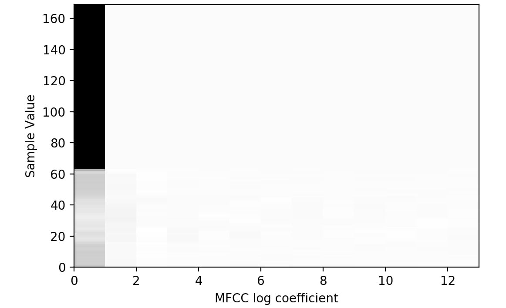
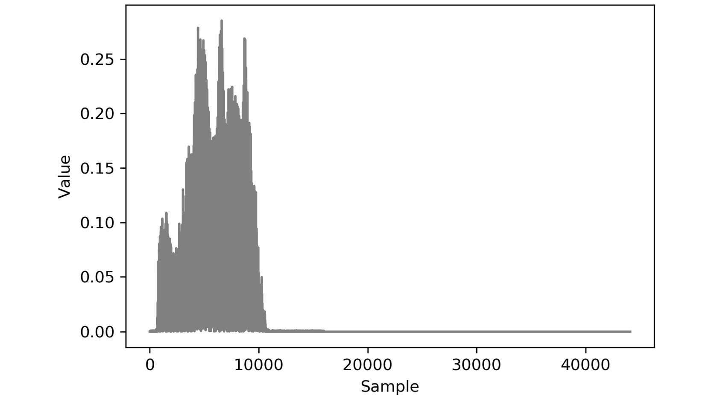

Lab 2: Loading and Processing Data
==================================


Overview

In this lab, you will learn how to load and process a variety of
data types for modeling in TensorFlow. You will implement methods to
input data into TensorFlow models so that model training can be
optimized.

By the end of this lab, you will know how to input tabular data,
images, text, and audio data and preprocess them so that they are
suitable for training TensorFlow models.


Introduction
============


In the previous lab, you learned how to create, utilize, and apply
linear transformations to tensors using TensorFlow. The lab started
with the definition of tensors and how they can be created using the
`Variable` class in the TensorFlow library. You then created
tensors of various ranks and learned how to apply tensor addition,
reshaping, transposition, and multiplication using the library. These
are all examples of linear transformations. You concluded that lab
by covering optimization methods and activation functions and how they
can be accessed in the TensorFlow library.

When training machine learning models in TensorFlow, you must supply the
model with training data. The raw data that is available may come in a
variety of formats---for example, tabular CSV files, images, audio, or
text files. Different data sources are loaded and preprocessed in
different ways in order to provide numerical tensors for TensorFlow
models. For example, virtual assistants use voice queries as input
interaction and then apply machine learning models to decipher input
speech and perform specific actions as output. To create the models for
this task, the audio data of the speech input must be loaded into
memory. A preprocessing step also needs to be involved that converts the
audio input into text. Following this, the text is converted into
numerical tensors for model training. This is one example that
demonstrates the complexity of creating models from non-tabular,
non-numerical data such as audio data.

This lab will explore a few of the common data types that are
utilized for building machine learning models. You will load raw data
into memory in an efficient manner, and then perform some preprocessing
steps to convert the raw data into numerical tensors that are
appropriate for training machine learning models. Luckily, machine
learning libraries have advanced significantly, which means that
training models with data types such as images, text, and audio is
extremely accessible to practitioners.


Exploring Data Types
====================


Depending on the source, raw data can be of different forms. Common
forms of data include tabular data, images, video, audio, and text. For
example, the output from a temperature logger (used to record the
temperature at a given location over time) is tabular. Tabular data is
structured with rows and columns, and, in the example of a temperature
logger, each column may represent a characteristic for each record, such
as the time, location, and temperature, while each row may represent the
values of each record. The following table shows an example of numerical
tabular data:


Image data represents another common form of raw data that is popular
for building machine learning models. These models are popular due to
the large volume of data that\'s available. With smartphones and
security cameras recording all of life\'s moments, they have generated
an enormous amount of data that can be used to train models.

The dimensions of image data for training are different than they are
for tabular data. Each image has a height and width dimension, as well
as a color channel adding a third dimension, and the quantity of images
adding a fourth. As such, the input tensors for image data models are
four-dimensional tensors, whereas the input tensors for tabular data are
two-dimensional. The following figure shows an example of labeled
training examples of boats and airplanes taken from the
`Open Images` dataset
([https://storage.googleapis.com/openimages/web/index.html]);
the images have been preprocessed so that they all have the same height
and width. This data could be used, for example, to train a binary
classification model to classify images as boats or airplanes:


Other types of raw data that can be used to build machine learning
models include text and audio. Like images, their popularity in the
machine learning community is derived from the large amount of data
that\'s available. Both audio and text have the challenge of having
indeterminate sizes. You will explore how this challenge can be overcome
later in this lab. The following figure shows an audio sample with a
sample rate of 44.1 kHz, which means the audio data is sampled 44,100
times per second. This is an example of the type of raw data that is
input into virtual assistants, from which they decipher the request and
act accordingly:


Now that you know about some of the types of data you may encounter when
building machine learning models, in the next section, you will uncover
ways to preprocess different types of data.


Data Preprocessing
==================


Data preprocessing refers to the process in which raw data is converted
into a form that is appropriate for machine learning models to use as
input. Each different data type will require different preprocessing
steps, with the minimum requirement that the resulting tensor is
composed solely of numerical elements, such as integers or decimal
numbers. Numerical tensors are required since models rely on linear
transformations such as addition and multiplication, which can only be
performed on numerical tensors.

While many datasets exist with solely numerical fields, many do not.
They may have fields that are of the string, Boolean, categorical, or
date data types that must all be converted into numerical fields. Some
may be trivial; a Boolean field can be mapped so that `true`
values are equal to `1` and `false` values are equal
to `0`. Therefore, mapping a Boolean field to a numerical
field is simple and all the necessary information is preserved. However,
when converting other data types, such as date fields, you may lose
information when converting into numerical fields unless it\'s
explicitly stated otherwise.

One example of a possible loss of information occurs when converting a
date field into a numerical field by using Unix time. Unix time
represents the number of seconds that have elapsed since the Unix epoch;
that is, 00:00:00 UTC on January 1, 1970, and leap seconds are ignored.
Using Unix time removes the explicit indication of the month, day of the
week, hour of the day, and so on, which may act as important features
when training a model.

When converting fields into numerical data types, it is important to
preserve as much informational context as possible as it will aid any
model that is trained to understand the relationship between the
features and the target. The following diagram demonstrates how a date
field can be converted into a series of numerical fields:


As shown in the preceding diagram, on the left, the date field
represents a given date, while on the right, there is a method providing
numerical information:

-   The year is extracted from the date, which is an integer.
-   The month is one-hot encoded. There is a column for each month of
    the year and the month is binary encoded, if the date\'s month
    corresponds with the column\'s name.
-   A column is created indicating whether the date occurs on a weekend.

This is just a method to encode the `date` column here; not
all the preceding methods are necessary and there are many more that can
be used. Encoding all the fields into numerical fields appropriately is
important to create performant machine learning models that can learn
the relationships between the features and the target.

Data normalization is another preprocessing technique used to speed up
the training process. The normalization process rescales the fields so
that they are all of the same scale. This will also help ensure that the
weights of the model are of the same scale.

In the preceding diagram, the `year` column has the order of
magnitude `10`[3], and the other columns have
the order `10`[0]. This implies there are three
orders of magnitude between the columns. Fields with values that are
very different in scale will result in a less accurate model as the
optimal weights to minimize the error function may not be discovered.
This may be due to the tolerance limits or the learning rate that are
defined as hyperparameters prior to training not being optimal for both
scales when the weights are updated. In the preceding example, it may be
beneficial to rescale the `year` column so that it has the
same order of magnitude as the other columns.

Throughout this lab, you will explore a variety of methods that can
be used to preprocess tabular data, image data, text data, and audio
data so that it can be used to train machine learning models.


Processing Tabular Data
=======================


In this section, you will learn how to load tabular data into a Python
development environment so that it can be used for TensorFlow modeling.
You will use pandas and scikit-learn to utilize the classes and
functions that are useful for processing data. You will also explore
methods that can be used to preprocess this data.

Tabular data can be loaded into memory by using the pandas
`read_csv` function and passing the path into the dataset. The
function is well suited and easy to use for loading in tabular data and
can be used as follows:


```
df = pd.read_csv('path/to/dataset')
```


In order to normalize the data, you can use a scaler that is available
in scikit-learn. There are multiple scalers that can be applied;
`StandardScaler` will normalize the data so that the fields of
the dataset have a mean of `0` and a standard deviation of
`1`. Another common scaler that is used is
`MinMaxScaler`, which will rescale the dataset so that the
fields have a minimum value of `0` and a maximum value of
`1`.

To use a scaler, it must be initialized and fit to the dataset. By doing
this, the dataset can be transformed by the scaler. In fact, the fitting
and transformation processes can be performed in one step by using the
`fit_transform` method, as follows:


```
scaler = StandardScaler()
transformed_df = scaler.fit_transform(df)
```


In the first exercise, you will learn how to use pandas and scikit-learn
to load a dataset and preprocess it so that it is suitable for modeling.

Exercise 2.01: Loading Tabular Data and Rescaling Numerical Fields
------------------------------------------------------------------

The dataset, `Bias_correction_ucl.csv`, contains information
for bias correction of the next-day maximum and minimum air temperature
forecast for Seoul, South Korea. The fields represent temperature
measurements of the given date, the weather station at which the metrics
were measured, model forecasts of weather-related metrics such as
humidity, and projections for the temperature of the following day. You
are required to preprocess the data to make all the columns normally
distributed with a mean of `0` and a standard deviation of
`1`. You will demonstrate the effects with the
`Present_Tmax` column, which represents the maximum
temperature on the given date at a given weather station.

Note

The dataset can be found here: [https://github.com/fenago/deep-learning-essentials/blob/main/Lab02/Datasets/Bias_correction_ucl.csv].

Perform the following steps to complete this exercise:

1.  Open a new Jupyter notebook to implement this exercise. Save the
    file as `Exercise2-01.ipnyb`.

2.  In a new Jupyter Notebook cell, import the pandas library, as
    follows:

    
    ```
    import pandas as pd
    ```


    Note

    You can find the documentation for pandas at the following link:
    [https://pandas.pydata.org/docs/].

3.  Create a new pandas DataFrame named `df` and read the
    `Bias_correction_ucl.csv` file into it. Examine whether
    your data is properly loaded by printing the resultant DataFrame:

    
    ```
    df = pd.read_csv('Bias_correction_ucl.csv')
    df
    ```


    Note

    Make sure you change the path (highlighted) to the CSV file based on
    its location on your system. If you\'re running the Jupyter notebook
    from the same directory where the CSV file is stored, you can run
    the preceding code without any modification.

    The output will be as follows:

    
    


4.  Drop the `date` column using the `drop` method
    of the DataFrame and pass in the name of the column. The
    `date` column will be dropped as it is a non-numerical
    field and rescaling will not be possible when non-numerical fields
    exist. Since you are dropping a column, both the `axis=1`
    argument and the `inplace=True` argument should be passed:
    
    ```
    df.drop('Date', inplace=True, axis=1)
    ```


5.  Plot a histogram of the `Present_Tmax` column that
    represents the maximum temperature across dates and weather stations
    within the dataset:

    
    ```
    ax = df['Present_Tmax'].hist(color='gray')
    ax.set_xlabel("Temperature")
    ax.set_ylabel("Frequency")
    ```


    The output will be as follows:

    
    


    The resultant histogram shows the distribution of values for the
    `Present_Tmax` column. You can see that the temperature
    values vary from 20 to 38 degrees Celsius. Plotting a histogram of
    the feature values is a good way to view the distribution of values
    to understand whether scaling is required as a preprocessing step.

6.  Import the `StandardScaler` class from scikit-learn\'s
    preprocessing package. Initialize the scaler, fit the scaler, and
    transform the DataFrame using the scaler\'s
    `fit_transform` method. Create a new DataFrame,
    `df2`, using the transformed DataFrame since the result of
    the `fit_transform` method is a NumPy array. The standard
    scaler will transform the numerical fields so that the mean of the
    field is `0` and the standard deviation is `1`:

    
    ```
    from sklearn.preprocessing import StandardScaler
    scaler = StandardScaler()
    df2 = scaler.fit_transform(df)
    df2 = pd.DataFrame(df2, columns=df.columns)
    ```


    Note

    The values for the mean and standard deviation of the resulting
    transformed data can be input into the scaler.

7.  Plot a histogram of the transformed `Present_Tmax` column:

    
    ```
    ax = df2['Present_Tmax'].hist(color='gray')
    ax.set_xlabel("Normalized Temperature")
    ax.set_ylabel("Frequency")
    ```


    The output will be as follows:

    
    


The resulting histogram shows that the temperature values range from
around `-3` to `3` degrees Celsius, as evidenced by
the range on the *x* axis of the histogram. By using the standard
scaler, the values will always have a mean of `0` and a
standard deviation of `1`. Having the features normalized can
speed up the model training process.

In this exercise, you successfully imported tabular data using the
pandas library and performed some preprocessing using the scikit-learn
library. The preprocessing of data included dropping the
`date` column and scaling the numerical fields so that they
have a mean value of `0` and a standard deviation of
`1`.

In the following activity, you will load in tabular data using the
pandas library and scale that data using the `MinMax` scaler
present in scikit-learn. You will do so on the same dataset that you
used in the prior exercise, which describes the bias correction of air
temperature forecasts for Seoul, South Korea.

Activity 2.01: Loading Tabular Data and Rescaling Numerical Fields with a MinMax Scaler
---------------------------------------------------------------------------------------

In this activity, you are required to load tabular data and rescale the
data using a `MinMax` scaler. The dataset,
`Bias_correction_ucl.csv`, contains information for bias
correction of the next-day maximum and minimum air temperature forecast
for Seoul, South Korea. The fields represent temperature measurements of
the given date, the weather station at which the metrics were measured,
model forecasts of weather-related metrics such as humidity, and
projections for the temperature the following day. You are required to
scale the columns so that the minimum value of each column is
`0` and the maximum value is `1`.

Perform the following steps to complete this activity:

1.  Open a new Jupyter notebook to implement this activity.

2.  Import pandas and the `Bias_correction_ucl.csv` dataset.

3.  Read the dataset using the pandas `read_csv` function.

4.  Drop the `date` column of the DataFrame.

5.  Plot a histogram of the `Present_Tmax` column.

6.  Import `MinMaxScaler` and fit it to and transform the
    feature DataFrame.

7.  Plot a histogram of the transformed `Present_Tmax` column.

    You should get an output similar to the following:

    
    


Note

The solution to this activity can be found via [this link].

One method of converting non-numerical fields such as categorical or
date fields is to one-hot encode them. The **one-hot encoding process**
creates a new column for each unique value in the provided column, while
each row has a value of `0` except for the one that
corresponds to the correct column. The column headers of the newly
created dummy columns correspond to the unique values. One-hot encoding
can be achieved by using the `get_dummies` function of the
pandas library and passing in the column to be encoded. An optional
argument is to provide a prefix feature that adds a prefix to the column
headers. This can be useful for referencing the columns:


```
dummies = pd.get_dummies(df['feature1'], prefix='feature1')
```


Note

When using the `get_dummies` function, `NaN` values
are converted into all zeros.

In the following exercise, you\'ll learn how to preprocess non-numerical
fields. You will utilize the same dataset that you used in the previous
exercise and activity, which describes the bias correction of air
temperature forecasts for Seoul, South Korea.

Exercise 2.02: Preprocessing Non-Numerical Data
-----------------------------------------------

In this exercise, you will preprocess the `date` column by
one-hot encoding the year and the month from the `date` column
using the `get_dummies` function. You will join the
one-hot-encoded columns with the original DataFrame and ensure that all
the fields in the resultant DataFrame are numerical.

Perform the following steps to complete this exercise:

1.  Open a new Jupyter notebook to implement this exercise. Save the
    file as `Exercise2-02.ipnyb`.

2.  In a new Jupyter Notebook cell, import the pandas library, as
    follows:
    
    ```
    import pandas as pd
    ```


3.  Create a new pandas DataFrame named `df` and read the
    `Bias_correction_ucl.csv` file into it. Examine whether
    your data is properly loaded by printing the resultant DataFrame:

    
    ```
    df = pd.read_csv('Bias_correction_ucl.csv')
    ```


    Note

    Make sure you change the path (highlighted) to the CSV file based on
    its location on your system. If you\'re running the Jupyter notebook
    from the same directory where the CSV file is stored, you can run
    the preceding code without any modification.

4.  Change the data type of the `date` column to
    `Date` using the pandas `to_datetime` function:
    
    ```
    df['Date'] = pd.to_datetime(df['Date'])
    ```


5.  Create dummy columns for `year` using the pandas
    `get_dummies` function. Pass in the year of the
    `date` column as the first argument and add a prefix to
    the columns of the resultant DataFrame. Print out the resultant
    DataFrame:

    
    ```
    year_dummies = pd.get_dummies(df['Date'].dt.year, \
                                  prefix='year')
    year_dummies
    ```


    The output will be as follows:

    
    


    The resultant DataFrame contains only 0s and 1s. `1`
    corresponds to the value present in the original `date`
    column. Null values will have 0s for all columns in the newly
    created DataFrame.

6.  Repeat this for the month by creating dummy columns from the month
    of the `date` column. Print out the resulting DataFrame:

    
    ```
    month_dummies = pd.get_dummies(df['Date'].dt.month, \
                                   prefix='month')
    month_dummies
    ```


    The output will be as follows:

    
    


    The resultant DataFrame now contains only 0s and 1s for the month in
    the `date` column.

7.  Concatenate the original DataFrame and the dummy DataFrames you
    created in *Steps 5* and *6*:
    
    ```
    df = pd.concat([df, month_dummies, year_dummies], \
                   axis=1)
    ```


8.  Drop the original `date` column since it is now redundant:
    
    ```
    df.drop('Date', axis=1, inplace=True)
    ```


9.  Verify that all the columns are now of the numerical data type:

    
    ```
    df.dtypes
    ```


    The output will be as follows:

    
    


Here, you can see that all the data types of the resultant DataFrame are
numerical. This means they can now be passed into an ANN for modeling.

In this exercise, you successfully imported tabular data and
preprocessed the `date` column using the pandas and
scikit-learn libraries. You utilized the `get_dummies`
function to convert categorical data into numerical data types.

Note

Another method to attain a numerical data type from date data types is
by using the `pandas.Series.dt` accessor object. More
information about the available options can be found here:
[https://pandas.pydata.org/docs/reference/api/pandas.Series.dt.html].

Processing non-numerical data is an important step in creating
performant models. If possible, any domain knowledge should be imparted
to the training data features. For example, when forecasting the
temperature using the date, like the dataset used in the prior exercises
and activity of this lab, encoding the month would be helpful since
the temperature is likely highly correlated with the month of the year.
Encoding the day of the week, however, may not be useful as there is
likely no correlation between the day of the week and temperature. Using
this domain knowledge can aid the model to learn the underlying
relationship between the features and the target.

In the next section, you will learn how to process image data so that it
can be input into machine learning models.


Processing Image Data
=====================


A plethora of images is being generated every day by various
organizations that can be used to create predictive models for tasks
such as object detection, image classification, and object segmentation.
When working with image data and some other raw data types, you often
need to preprocess the data. Creating models from raw data with minimal
preprocessing is one of the biggest benefits of using ANNs for modeling
since the feature engineering step is minimal. Feature engineering
usually involves using domain knowledge to create features out of the
raw data, which is time consuming and has no guarantee of improvements
in model performance. Utilizing ANNs with no feature engineering
streamlines the training process and has no need for domain knowledge.

For example, locating tumors in medical images requires expert knowledge
from those who have been trained for many years, but for ANNs, all that
is required is sufficient labeled data for training. There will be a
small amount of preprocessing that generally needs to be applied to
these images. These steps are optional but helpful for standardizing the
training process and creating performant models.

One preprocessing step is rescaling. Since images have color values that
are integers that range between `0` and `255`, they
are scaled to have values between `0` and `1`,
similar to *Activity 2.01*, *Loading Tabular Data and Rescaling
Numerical Fields with a MinMax Scaler*. Another common preprocessing
step that you will explore later in this section is image augmentation,
which is essentially the act of augmenting images to add a greater
number of training examples and build a more robust model.

This section also covers batch processing. Batch processing loads in the
training data one batch at a time. This can result in slower training
times than if the data was loaded in at once; however, this does allow
you to train your models on very large-volume datasets. Training on
images or audio are examples that often require large volumes to achieve
performant results.

For example, a typical image may be 100 KB in size. For a training
dataset of 1 million images, you would need 100 GB of memory, which may
be unattainable to most. If the model is trained in batches of 32
images, the memory requirement is orders of magnitude less. Batch
training allows you to augment the training data, as you will explore in
a later section.

Images can be loaded into memory using a class named
`ImageDataGenerator`, which can be imported from Keras\'
preprocessing package. This is a class originally from Keras that can
now be used in TensorFlow. When loading in images, you can rescale them.
It is common practice to rescale images by the value of 1/255 pixels.
This means that images that have values from 0 to 255 will now have
values from 0 to 1.

`ImageDataGenerator` can be initialized with rescaling, as
follows:


```
datagenerator = ImageDataGenerator(rescale = 1./255)
```


Once the `ImageDataGenerator` class has been initialized, you
can use the `flow_from_directory` method and pass in the
directory that the images are located in. The directory should include
sub-directories labeled with the class labels, and they should contain
the images of the corresponding class. Another argument to be passed in
is the desired size for the images, the batch size, and the class mode.
The class mode determines the type of label arrays that are produced.
Using the `flow_from_directory` method for binary
classification with a batch size of 25 and an image size of 64x64 can be
done as follows:


```
dataset = datagenerator.flow_from_directory\
          ('path/to/data',\
           target_size = (64, 64),\
           batch_size = 25,\
           class_mode = 'binary')
```


In the following exercise, you will load images into memory by utilizing
the `ImageDataGenerator` class.

Note

The image data provided comes from the Open Image dataset, a full
description of which can be found here:
[https://storage.googleapis.com/openimages/web/index.html].

Images can be viewed by plotting them using Matplotlib. This is a useful
exercise for verifying that the images match their respective labels.

Exercise 2.03: Loading Image Data for Batch Processing
------------------------------------------------------

In this exercise, you\'ll learn how to load in image data for batch
processing. The `image_data` folder contains a set of images
of boats and airplanes. You will load the images of boats and airplanes
for batch processing and rescale them so that the image values range
between `0` and `1`. You are then tasked with
printing the labeled images of a batch from the data generator.

Note

You can find `image_data` here:
[https://github.com/fenago/deep-learning-essentials/tree/main/Lab02/Datasets].

Perform the following steps to complete this exercise:

1.  Open a new Jupyter notebook to implement this exercise. Save the
    file as `Exercise2-03.ipnyb`.

2.  In a new Jupyter Notebook cell, import the
    `ImageDataGenerator` class from
    `tensorflow.keras.preprocessing.image`:
    
    ```
    from tensorflow.keras.preprocessing.image \
         import ImageDataGenerator
    ```


3.  Instantiate the `ImageDataGenerator` class and pass the
    `rescale` argument with the value `1./255` to
    convert image values so that they\'re between `0` and
    `1`:
    
    ```
    train_datagen = ImageDataGenerator(rescale =  1./255)
    ```


4.  Use the data generator\'s `flow_from_directory` method to
    direct the data generator to the image data. Pass in the arguments
    for the target size, the batch size, and the class mode:
    
    ```
    training_set = train_datagen.flow_from_directory\
                   ('image_data',\
                    target_size = (64, 64),\
                    batch_size = 25,\
                    class_mode = 'binary')
    ```


5.  Create a function to display the images in the batch. The function
    will plot the first 25 images in a 5x5 array with their associated
    labels:
    
    ```
    import matplotlib.pyplot as plt
    def show_batch(image_batch, label_batch):\
        lookup = {v: k for k, v in \
                  training_set.class_indices.items()}
        label_batch = [lookup[label] for label in \
                       label_batch]
        plt.figure(figsize=(10,10))
        for n in range(25):
            ax = plt.subplot(5,5,n+1)
            plt.imshow(image_batch[n])
            plt.title(label_batch[n].title())
            plt.axis('off')
    ```


6.  Take a batch from the data generator and pass it to the function to
    display the images and their labels:

    
    ```
    image_batch, label_batch = next(training_set)
    show_batch(image_batch, label_batch)
    ```


    The output will be as follows:

    
    


Here, you can see the output of a batch of images of boats and airplanes
that can be input into a model. Note that all the images are the same
size, which was achieved by modifying the aspect ratio of the images.
This ensures consistency in the images as they are passed into an ANN.

In this exercise, you learned how to import images in batches so they
can be used for training ANNs. Images are loaded one batch at a time and
by limiting the number of training images per batch, you can ensure that
the RAM of the machine is not exceeded.

In the following section, you will see how to augment images as they are
loaded in.


Image Augmentation
==================


Image augmentation is the process of modifying images to increase the
number of training examples available. This process can include zooming
in on the image, rotating the image, or flipping the image vertically or
horizontally. This can be performed if the augmentation process does not
change the context of the image. For example, an image of a banana, when
flipped horizontally, is still recognizable as a banana, and new images
of bananas are likely to be of either orientation. In this case,
providing a model for both orientations during the training process will
help build a robust model.

However, if you have an image of a boat, it may not be appropriate to
flip it vertically, as this does not represent how boats commonly exist
in images, upside-down. Ultimately the goal of image augmentation is to
increase the number of training images that resemble the object in its
everyday occurrence, preserving the context. This will help the trained
model perform well on new, unseen images. An example of image
augmentation can be seen in the following figure, in which an image of a
banana has been augmented three times; the left image is the original
image, and those on the right are the augmented images.

The top-right image is the original image flipped horizontally, the
middle-right image is the original image zoomed in by 15%, and the
bottom-right image is the original image rotated by 10 degrees. After
this augmentation process, you have four images of a banana, each of
which has the banana in different positions and orientations:


Image augmentation can be achieved with TensorFlow\'s
`ImageDataGenerator` class when the images are loaded with
each batch. Similar to image rescaling, various image augmentation
processes can be applied. The arguments for common augmentation
processes include the following:

-   `horizontal_flip`: Flips the image horizontally.
-   `vertical_flip`: Flips the image vertically.
-   `rotation_range`: Rotates the image up to a given number
    of degrees.
-   `width_shift_range`: Shifts the image along its width axis
    up to a given fraction or pixel amount.
-   `height_shift_range`: Shifts the image along its height
    axis up to a given fraction or pixel amount.
-   `brightness_range`: Modifies the brightness of the image
    up to a given amount.
-   `shear_range`: Shears the image up to a given amount.
-   `zoom_range`: Zooms in the image up to a given amount.

Image augmentation can be applied when instantiating the
`ImageDataGenerator` class, as follows:


```
datagenerator = ImageDataGenerator(rescale = 1./255,\
                                   shear_range = 0.2,\
                                   rotation_range= 180,\
                                   zoom_range = 0.2,\
                                   horizontal_flip = True)
```


In the following activity, you perform image augmentation using
TensorFlow\'s `ImageDataGenerator` class. The process is as
simple as passing in parameters. You will use the same dataset that you
used in *Exercise 2.03*, *Loading Image Data for Batch Processing*,
which contains images of boats and airplanes.

Activity 2.02: Loading Image Data for Batch Processing
------------------------------------------------------

In this activity, you will load image data for batch processing and
augment the images in the process. The `image_data` folder
contains a set of images of boats and airplanes. You are required to
load in image data for batch processing and adjust the input data with
random perturbations such as rotations, flipping the image horizontally,
and adding shear to the images. This will create additional training
data from the existing image data and will lead to more accurate and
robust machine learning models by increasing the number of different
training examples even if only a few are available. You are then tasked
with printing the labeled images of a batch from the data generator.

The steps for this activity are as follows:

1.  Open a new Jupyter notebook to implement this activity.

2.  Import the `ImageDataGenerator` class from
    `tensorflow.keras.preprocessing.image`.

3.  Instantiate `ImageDataGenerator` and set the
    `rescale=1./255`, `shear_range=0.2`,
    `rotation_range=180`, `zoom_range=0.2`,
    and `horizontal_flip=True` arguments.

4.  Use the `flow_from_directory` method to direct the data
    generator to the images while passing in the target size as
    `64x64`, a batch size of `25`, and the class
    mode as `binary`.

5.  Create a function to display the first 25 images in a 5x5 array with
    their associated labels.

6.  Take a batch from the data generator and pass it to the function to
    display the images and their labels.

    Note

    The solution to this activity can be found via [this
    link].

In this activity, you augmented images in batches so they could be used
for training ANNs. You\'ve seen that when images are used as input, they
can be augmented to generate a larger number of effective training
examples.

You learned how to load images in batches, which enables you to train on
huge volumes of data that may not fit into the memory of your machine at
one time. You also learned how to augment images using the
`ImageDataGenerator` class, which essentially generates new
training examples from the images in your training set.

In the next section, you will learn how to load and preprocess text
data.


Text Processing
===============


Text data represents a large class of raw data that is readily
available. For example, text data can be from web pages such as
Wikipedia, transcribed speech, or social media conversations---all of
which are increasing at a massive scale and must be processed before
they can be used for training machine learning models.

Working with text data can be challenging for several different reasons,
including the following:

-   Thousands of different words exist.
-   Different languages present challenges.
-   Text data often varies in size.

There are many ways to convert text data into a numerical
representation. One way is to one-hot encode the words, much like you
did with the date field in *Exercise 2.02*, *Preprocessing Non-Numerical
Data*. However, this presents issues when training models since large
datasets with many unique words will result in a sparse dataset and can
lead to slow training speeds and potentially inaccurate models.
Moreover, if a new word is encountered that was not in the training
data, the model cannot use that word.

One popular method that\'s used to represent text data is to convert the
entire piece of text into embedding vectors. Pretrained models exist to
convert raw text into vectors. These models are usually trained on large
volumes of text. Using word embedding vectors from pretrained models has
some distinct advantages:

-   The resulting vectors have a fixed size.
-   The vectors maintain contextual information, so they benefit from
    transfer learning.
-   No further preprocessing of the data needs to be done and the
    results of the embedding can be fed directly into an ANN.

While TensorFlow Hub will be covered in more depth in the next lab,
the following is an example of how to use pretrained models as a
preprocessing step. To load in the pretrained model, you need to import
the `tensorflow_hub` library. By doing this, the URL of the
model can be loaded. Then, the model can be loaded into the environment
by calling the `KerasLayer` class, which wraps the model so
that it can be used like any other TensorFlow model. It can be created
as follows:


```
import tensorflow_hub as hub
model_url = "url_of_model"
hub_layer = hub.KerasLayer(model_url, \
                           input_shape=[], dtype=tf.string, \
                           trainable=True)
```


The data type of the input data, indicated by the `dtype`
parameter, should be used as input for the `KerasLayer` class,
as well as a Boolean argument indicating whether the weights are
trainable. Once the model has been loaded using the
`tensorflow_hub` library, it can be called on text data, as
follows:


```
hub_layer(data)
```


This will run the data through the pretrained model. The output will be
based on the architecture and weights of the pretrained model.

In the following exercise, you will explore how to load in data that
includes a text field, batch the dataset, and apply a pretrained model
to the text field to convert the field into embedded vectors.

Note

The pretrained model can be found here:
[https://tfhub.dev/google/tf2-preview/gnews-swivel-20dim/1].

The dataset can be found here:
[https://archive.ics.uci.edu/ml/datasets/Drug+Review+Dataset+%28Drugs.com%29].

Exercise 2.04: Loading Text Data for TensorFlow Models
------------------------------------------------------

The dataset, `drugsComTrain_raw.tsv`, contains information
related to patient reviews on specific drugs, along with their related
conditions and a rating indicating the patient\'s satisfaction with the
drug. In this exercise, you will load in text data for batch processing.
You will apply a pretrained model from TensorFlow Hub to perform a word
embedding on the patient reviews. You are required to work on the
`review` field only as that contains text data.

Perform the following steps:

1.  Open a new Jupyter notebook to implement this exercise. Save the
    file as `Exercise2-04.ipnyb`.

2.  In a new Jupyter Notebook cell, import the TensorFlow library:
    
    ```
    import tensorflow as tf
    ```


3.  Create a TensorFlow dataset object using the library\'s
    `make_csv_dataset` function. Set the
    `batch_size` argument equal to `1` and the
    `field_delim` argument to `'\t'` since the
    dataset is tab-delimited:
    
    ```
    df = tf.data.experimental.make_csv_dataset\
         ('../Datasets/drugsComTest_raw.tsv', \
          batch_size=1, field_delim='\t')
    ```


4.  Create a function that takes a dataset object as input and shuffles,
    repeats, and batches the dataset:
    
    ```
    def prep_ds(ds, shuffle_buffer_size=1024, \
                batch_size=32):
        # Shuffle the dataset
        ds = ds.shuffle(buffer_size=shuffle_buffer_size)
        # Repeat the dataset
        ds = ds.repeat()
        # Batch the dataset
        ds = ds.batch(batch_size)
        return ds
    ```


5.  Apply the function to the dataset object you created in *Step 3*,
    setting `batch_size` equal to `5`:
    
    ```
    ds = prep_ds(df, batch_size=5)
    ```


6.  Take the first batch and print it out:

    
    ```
    for x in ds.take(1):\
        print(x)
    ```


    You should get output similar to the following:

    
    


    The output represents the input data in tensor format.

7.  Import the pretrained word embedding model from TensorFlow Hub and
    create a Keras layer:
    
    ```
    import tensorflow_hub as hub
    embedding = "https://tfhub.dev/google/tf2-preview"\
                "/gnews-swivel-20dim/1"
    hub_layer = hub.KerasLayer(embedding, input_shape=[], \
                               dtype=tf.string, \
                               trainable=True)
    ```


8.  Take one batch from the dataset, flatten the tensor corresponding to
    the `review` field, apply the pretrained layer, and print
    it out:

    
    ```
    for x in ds.take(1):\
        print(hub_layer(tf.reshape(x['review'],[-1])))
    ```


    This will display the following output:

    
    


The preceding output represents the embedding vectors for the first
batch of drug reviews. The specific values may not mean much at first
glance but encoded within the embeddings is contextual information based
on the dataset that the embedding model was trained upon. The batch size
is equal to `5` and the embedding vector size is
`20`, which means the resulting size, after applying the
pretrained layer, is `5x20`.

In this exercise, you learned how to import tabular data that might
contain a variety of data types. You took the `review` field
and applied a pretrained word embedding model to convert the text into a
numerical tensor. Ultimately, you preprocessed and batched the text data
so that it was appropriate for large-scale training. This is one way to
represent text so that it can be input into machine learning models in
TensorFlow. In fact, other pretrained word embedding models can be used
and are available on TensorFlow Hub. You will learn more about how to
utilize TensorFlow Hub in the next lab.

In this section, you learned about one way to preprocess text data for
use in machine learning models. There are a number of different methods
you could have used to generate a numerical tensor from the text. For
example, you could have one-hot encoded the words, removed the stop
words, stemmed and lemmatized the words, or even done something as
simple as counting the number of words in each review. The method
demonstrated in this section is advantageous as it is simple to
implement. Also, the word embedding incorporates contextual information
in the text that is difficult to encode in other methods, such as
one-hot encoding.

Ultimately, it is up to the practitioner to apply any domain knowledge
to the preprocessing step to retain as much contextual information as
possible. This will allow any subsequent models to learn the underlying
function between the features and the target variable.

In the next section, you will learn how to load and process audio data
so that the data can be used for TensorFlow models.


Audio Processing
================


This section will demonstrate how to load audio data in batches, as well
as how to process it so that it can be used to train machine learning
models. There is some advanced signal processing that takes place to
preprocess audio files. Some of these steps are optional, but they are
presented to provide a comprehensive approach to processing audio data.
Since each audio file can be hundreds of KB, you will utilize batch
processing, as you did when processing image data. Batch processing can
be achieved by creating a dataset object. A generic method for creating
a dataset object from raw data is using TensorFlow\'s
`from_tensor_slice` function. This function generates a
dataset object by slicing a tensor along its first dimension. It can be
used as follows:


```
dataset = tf.data.Dataset\
            .from_tensor_slices([1, 2, 3, 4, 5])
```


Loading audio data into a Python environment can be achieved using
TensorFlow by reading the file into memory using the
`read_file` function, then decoding the file using the
`decode_wav` function. When using the `decode_wav`
function, the sample rate, which represents how many data points
comprise 1 second of data, as well as the desired channel to use must be
passed in as arguments. For example, if a value of `-1` is
passed for the desired channel, then all the audio channels will be
decoded. Importing the audio file can be achieved as follows:


```
sample_rate = 44100
audio_data = tf.io.read_file('path/to/file')
audio, sample_rate = tf.audio.decode_wav\
                     (audio_data,\
                      desired_channels=-1,\
                      desired_samples=sample_rate)
```


As with text data, you must preprocess the data so that the resulting
numerical tensor has the same size as the data. This is achieved by
sampling the audio file after converting the data into the frequency
domain. Sampling the audio can be thought of as splitting the audio file
into chunks that are always the same size. For example, a 30-second
audio file can be split into 30 1-second non-overlapping audio samples,
and in the same way, a 15-second audio file can be split into 15
1-second non-overlapping samples. Thus, your result is 45 equally sized
audio samples.

Another common preprocessing step that can be performed on audio data is
to convert the audio sample from the time domain into the frequency
domain. Interpreting the data in the time domain is useful for
understanding the intensity or volume of the audio, whereas the
frequency domain can help you discover which frequencies are present.
This is useful for classifying sounds since different objects have
different characteristic sounds that will be present in the frequency
domain. Audio data can be converted from the time domain into the
frequency domain using the `stft` function.

This function takes the short-time Fourier transform of the input data.
The arguments to the function include the frame length, which is an
integer value that indicates the window length in samples; the frame
step, which is an integer value that describes the number of samples to
step; and the **Fast Fourier Transform** (**FFT**) length, which is an
integer value that indicates the length of the FFT to apply. A
spectrogram is the absolute value of the short-time Fourier transform as
it is useful for visual interpretation. The short-time Fourier transform
and spectrogram can be created as follows:


```
stfts = tf.signal.stft(audio, frame_length=1024,\
                       frame_step=256,\
                       fft_length=1024)
spectrograms = tf.abs(stfts)
```


Another optional preprocessing step is to generate the **Mel-Frequency
Cepstral Coefficients** (**MFCCs**). As the name suggests, the MFCCs are
the coefficients of the mel-frequency cepstrum. The cepstrum is a
representation of the short-term power spectrum of an audio signal.
MFCCs are commonly used in applications for speech recognition and music
information retrieval. As such, it may not be important to understand
each step of how the MFCCs are generated but understanding that they can
be applied as a preprocessing step to increase the information density
of the audio data pipeline is beneficial.

MFCCs are generated by creating a matrix to warp the linear scale to the
mel scale. This matrix can be created using
`linear_to_mel_weight_matrix` and by passing in the number of
bands in the resulting mel spectrum, the number of bins in the source
spectrogram, the sample rate, and the lower and upper frequencies to be
included in the mel spectrum. Once the linear-to-mel weight matrix has
been created, a tensor contraction with the spectrograms is applied
along the first axis using the `tensordot` function.

Following this, the log of the values is applied to generate the log mel
spectrograms. Finally, the `mfccs_from_log_mel_spectrograms`
function can be applied to generate the MFCCs that are passing in the
log mel spectrograms. These steps can be applied as follows:


```
lower_edge_hertz, upper_edge_hertz, num_mel_bins \
    = 80.0, 7600.0, 80
linear_to_mel_weight_matrix \
    = tf.signal.linear_to_mel_weight_matrix\
      (num_mel_bins, num_spectrogram_bins, sample_rate, \
       lower_edge_hertz, upper_edge_hertz)
mel_spectrograms = tf.tensordot\
                   (spectrograms, \
                    linear_to_mel_weight_matrix, 1)
mel_spectrograms.set_shape\
    (spectrograms.shape[:-1].concatenate\
    (linear_to_mel_weight_matrix.shape[-1:]))
log_mel_spectrograms = tf.math.log(mel_spectrograms + 1e-6)
mfccs = tf.signal.mfccs_from_log_mel_spectrograms\
        (log_mel_spectrograms)[..., :num_mfccs]
```


In the following exercise, you will understand how audio data can be
processed. In a similar manner to what you did in *Exercise 2.03*,
*Loading Image Data for Batch Processing*, and *Exercise* *2.04*,
*Loading Text Data for TensorFlow Models*, you will load the data in
batches for efficient and scalable training. You will load in the audio
files using TensorFlow\'s generic `read_file` function, then
decode the audio data using TensorFlow\'s `decode_wav`
function. You will then create a function that will generate the MFCCs
from each audio sample. Finally, a dataset object will be generated that
can be passed into a TensorFlow model for training. The dataset that you
will be utilizing is Google\'s speech commands dataset, which consists
of 1-second-long utterances of words.

Note

The dataset can be found here: [https://github.com/fenago/deep-learning-essentials/tree/main/Lab02/Datasets/data_speech_commands_v0.02].

Exercise 2.05: Loading Audio Data for TensorFlow Models
-------------------------------------------------------

In this exercise, you\'ll learn how to load in audio data for batch
processing. The dataset, `data_speech_commands_v0.02`,
contains speech samples of people speaking the word `zero` for
exactly 1 second with a sample rate of 44.1 kHz, meaning that for every
second, there are 44,100 data points. You will apply some common audio
preprocessing techniques, including converting the data into the Fourier
domain, sampling the data to ensure the data has the same size as the
model, and generating MFCCs for each audio sample. This will generate a
preprocessed dataset object that can be input into a TensorFlow model
for training.

Perform the following steps:

1.  Open a new Jupyter notebook to implement this exercise. Save the
    file as `Exercise2-05.ipnyb`.

2.  In a new Jupyter Notebook cell, import the `tensorflow`
    and `os` libraries:
    
    ```
    import tensorflow as tf
    import os
    ```


3.  Create a function that will load an audio file using TensorFlow\'s
    `read_file` function and `decode_wav` function,
    respectively. Return the transpose of the resultant tensor:
    
    ```
    def load_audio(file_path, sample_rate=44100):
        # Load audio at 44.1kHz sample-rate
        audio = tf.io.read_file(file_path)
        audio, sample_rate = tf.audio.decode_wav\
                             (audio,\
                              desired_channels=-1,\
                              desired_samples=sample_rate)
        return tf.transpose(audio)
    ```


4.  Load in the paths to the audio data as a list using
    `os.list_dir`:
    
    ```
    prefix = " ../Datasets/data_speech_commands_v0.02"\
            "/zero/"
    paths = [os.path.join(prefix, path) for path in \
             os.listdir(prefix)]
    ```


5.  Test the function by loading in the first audio file from the list
    and plotting it:

    
    ```
    import matplotlib.pyplot as plt
    audio = load_audio(paths[0])
    plt.plot(audio.numpy().T)
    plt.xlabel('Sample')
    plt.ylabel('Value')
    ```


    The output will be as follows:

    
    


    The figure shows the waveform of the speech sample. The amplitude at
    a given time corresponds to the volume of the sound; high amplitude
    relates to high volume.

6.  Create a function to generate the MFCCs from the audio data. First,
    apply the short-time Fourier transform passing in the audio signal
    as the first argument, the frame length set to `1024` as
    the second argument, the frame step set to `256` as the
    third argument, and the FFT length as the fourth parameter. Then,
    take the absolute value of the result to compute the spectrograms.
    The number of spectrogram bins is given by the length along the last
    axis of the short-time Fourier transform. Next, define the upper and
    lower bounds of the mel weight matrix as `80` and
    `7600` respectively and the number of mel bins as
    `80`. Then, compute the mel weight matrix using
    `linear_to_mel_weight_matrix` from TensorFlow\'s signal
    package. Next, compute the mel spectrograms via tensor contraction
    using TensorFlow\'s `tensordot` function along axis 1 of
    the spectrograms with the mel weight matrix. Then, take the log of
    the mel spectrograms before finally computing the MFCCs using
    TensorFlow\'s `mfccs_from_log_mel_spectrograms` function.
    Then, return the MFCCs from the function:
    
    ```
    def apply_mfccs(audio, sample_rate=44100, num_mfccs=13):
        stfts = tf.signal.stft(audio, frame_length=1024, \
                               frame_step=256, \
                               fft_length=1024)
        spectrograms = tf.abs(stfts)
        num_spectrogram_bins = stfts.shape[-1]#.value
        lower_edge_hertz, upper_edge_hertz, \
        num_mel_bins = 80.0, 7600.0, 80
        linear_to_mel_weight_matrix = \
          tf.signal.linear_to_mel_weight_matrix\
          (num_mel_bins, num_spectrogram_bins, \
           sample_rate, lower_edge_hertz, upper_edge_hertz)
        mel_spectrograms = tf.tensordot\
                           (spectrograms, \
                            linear_to_mel_weight_matrix, 1)
        mel_spectrograms.set_shape\
        (spectrograms.shape[:-1].concatenate\
        (linear_to_mel_weight_matrix.shape[-1:]))
        log_mel_spectrograms = tf.math.log\
                               (mel_spectrograms + 1e-6)
        #Compute MFCCs from log_mel_spectrograms
        mfccs = tf.signal.mfccs_from_log_mel_spectrograms\
                (log_mel_spectrograms)[..., :num_mfccs]
        return mfccs
    ```


7.  Apply the function to generate the MFCCs for the audio data you
    loaded in *Step 5*:

    
    ```
    mfcc = apply_mfccs(audio)
    plt.pcolor(mfcc.numpy()[0])
    plt.xlabel('MFCC log coefficient')
    plt.ylabel('Sample Value')
    ```


    The output will be as follows:

    
    


    The preceding plot shows the MFCC values on the *x* axis and various
    points of the audio sample on the *y* axis. MFCCs are a different
    representation of the raw audio signal displayed in *Step 5* that
    has been proven to be useful in applications related to speech
    recognition.

8.  Load `AUTOTUNE` so that you can use all the available
    threads of the CPU. Create a function that will take a dataset
    object, shuffle it, load the audio using the function you created in
    *Step 3*, generate the MFCCs using the function you created in *Step
    6*, repeat the dataset object, batch it, and prefetch it. Use
    `AUTOTUNE` to prefetch with a buffer size based on your
    available CPU:
    
    ```
    AUTOTUNE = tf.data.experimental.AUTOTUNE
    def prep_ds(ds, shuffle_buffer_size=1024, \
                batch_size=64):
        # Randomly shuffle (file_path, label) dataset
        ds = ds.shuffle(buffer_size=shuffle_buffer_size)
        # Load and decode audio from file paths
        ds = ds.map(load_audio, num_parallel_calls=AUTOTUNE)
        # generate MFCCs from the audio data
        ds = ds.map(apply_mfccs)
        # Repeat dataset forever
        ds = ds.repeat()
        # Prepare batches
        ds = ds.batch(batch_size)
        # Prefetch
        ds = ds.prefetch(buffer_size=AUTOTUNE)
        return ds
    ```


9.  Generate the training dataset using the function you created in
    *Step 8*. To do this, create a dataset object using TensorFlow\'s
    `from_tensor_slices` function and pass in the paths to the
    audio files. After that, you can use the function you created in
    *Step 8*:
    
    ```
    ds = tf.data.Dataset.from_tensor_slices(paths)
    train_ds = prep_ds(ds)
    ```


10. Take the first batch of the dataset and print it out:

    
    ```
    for x in train_ds.take(1):\
        print(x)
    ```


    The output will be as follows:

    
    


The output shows the first batch of MFCC spectrum values in tensor form.

In this exercise, you imported audio data. You processed the dataset and
batched the dataset so that it is appropriate for large-scale training.
This method was a comprehensive approach in which the data was loaded
and converted into the frequency domain, spectrograms were generated,
and then finally the MFCCs were generated.

In the next activity, you will load in audio data and take the absolute
value of the input, followed by scaling the values logarithmically. This
will ensure that there are no negative values in the dataset. You will
use the same audio dataset that you used in *Exercise 2.05*, *Loading
Audio Data for TensorFlow Models*, that is, Google\'s speech commands
dataset. This dataset consists of 1-second-long utterances of words.

Activity 2.03: Loading Audio Data for Batch Processing
------------------------------------------------------

In this activity, you will load audio data for batch processing. The
audio preprocessing techniques that will be performed include taking the
absolute value and using the logarithm of 1 plus the value. This will
ensure the resulting values are non-negative and logarithmically scaled.
The result will be a preprocessed dataset object that can be input into
a TensorFlow model for training.

The steps for this activity are as follows:

1.  Open a new Jupyter notebook to implement this activity.

2.  Import the TensorFlow and `os` libraries.

3.  Create a function that will load and then decode an audio file using
    TensorFlow\'s `read_file` function followed by the
    `decode_wav` function, respectively. Return the transpose
    of the resultant tensor from the function.

4.  Load the file paths into the audio data as a list using
    `os.list_dir`.

5.  Create a function that takes a dataset object, shuffles it, loads
    the audio using the function you created in *step 2*, and applies
    the absolute value and the `log1p` function to the
    dataset. This function adds `1` to each value in the
    dataset and then applies the logarithm to the result. Next, repeat
    the dataset object, batch it, and prefetch it with a buffer size
    equal to the batch size.

6.  Create a dataset object using TensorFlow\'s
    `from_tensor_slices` function and pass in the paths to the
    audio files. Then, apply the function you created in *Step 4* to the
    dataset created in *Step 5*.

7.  Take the first batch of the dataset and print it out.

8.  Plot the first audio file from the batch.

    The output will look as follows:

    
    


Note

The solution to this activity can be found via [this link].

In this activity, you learned how to load and preprocess audio data in
batches. You used most of the functions that you used in *Exercise
2.05*, *Loading Audio Data for TensorFlow Models*, to load in the data
and decode the raw data. The difference between *Exercise 2.05*,
*Loading Audio Data for TensorFlow Models*, and *Activity 2.03*,
*Loading Audio Data for Batch Processing*, is the preprocessing steps;
*Exercise 2.05*, *Loading Audio Data for TensorFlow Models*, involved
generating MFCCs for the audio data, whereas *Activity 2.03*, *Loading
Audio Data for Batch Processing*, involved scaling the data
logarithmically. Both demonstrate common preprocessing techniques that
can be used for all applications involving modeling on audio data.

In this section, you have explored how audio data can be loaded in
batches for TensorFlow modeling. The comprehensive approach demonstrated
many advanced signal processing techniques that should provide
practitioners who wish to use audio data for their own applications with
a good starting point.


Summary
=======


In this lab, you learned how to load different forms of data and
perform some preprocessing steps for a variety of data types. You began
with tabular data in the form of a CSV file. Since the dataset consisted
of a single CSV file, you utilized the pandas library to load the file
into memory.

You then proceeded to preprocess the data by scaling the fields and
converting all the fields into numerical data types. This is important
since TensorFlow models can only be trained on numerical data, and the
training process is improved in terms of speed and accuracy if all the
fields are of the same scale.

Next, you explored how to load the image data. You batched the data so
that you did not have to load in the entire dataset at once, which
allowed you to augment the images. Image augmentation is useful as it
increases the effective number of training examples and can help make a
model more robust.

You then learned how to load in text data and took advantage of
pretrained models. This helped you embed text into vectors that retain
contextual information about the text. This allowed text data to be
input into TensorFlow models since they require numerical tensors as
inputs.

Finally, the final section covered how to load and process audio data
and demonstrated some advanced signal processing techniques, including
generating MFCCs, which can be used to generate informationally dense
numerical tensors that can be input into TensorFlow models.

Loading and preprocessing data so that it can be input into machine
learning models is an important and necessary first step to training any
machine learning model. In the next lab, you will explore many
resources that TensorFlow provides to aid in the development of model
building.
