Lab 3: TensorFlow Development
=============================


Overview

TensorFlow provides many resources for creating efficient workflows when
developing data science and machine learning applications. In this
lab, you will learn how to use TensorBoard to visualize TensorFlow
graphs and operations, TensorFlow Hub to access a community of users (a
great source of pre-trained models), and Google Colab, which is a
collaborative environment for developing code with others. You will use
these tools to accelerate development by maximizing computational
resources, transferring knowledge from pre-trained models, and
visualizing all aspects of the model-building process.


Introduction
============


In the previous lab, you learned how to load and process a variety
of data types so that they can be used in TensorFlow modeling. This
included tabular data from CSV files, image data, text data, and audio
files. By the end of the lab, you were able to process all these
data types and produce numerical tensors from them that can be input for
model training.

In this lab, you will learn about TensorFlow resources that will aid
you in your model building and help you create performant machine
learning algorithms. You will explore the practical resources that
practitioners can utilize to aid their development workflow, including
TensorBoard, TensorFlow Hub, and Google Colab. TensorBoard is an
interactive platform that offers a visual representation of the
computational graphs and data produced during the TensorFlow development
process. The platform solves the problem of visualizing various data
types that is common in machine learning. The visualization toolkit can
plot model evaluation metrics during the model-building process, display
images, play audio data, and perform many more tasks that would
otherwise require writing custom functions. TensorBoard provides simple
functions for writing logs, which are subsequently visualized in a
browser window.

TensorFlow Hub is an open source library of pre-trained machine learning
models with a code base that\'s available for all to use and modify for
their own applications. Models can be imported directly into code
through dedicated libraries and can be viewed at
[https://tfhub.dev/]. TensorFlow Hub allows users to use
state-of-the-art models created by experts in the field and can result
in massively reduced training times for models that incorporate
pre-trained models as part of a user\'s model.

For example, the platform contains the ResNet-50 model, a 50-layer
**Artificial Neural Network** (**ANN**) that achieved first place on the
ILSVRC 2015 classification task, a competition to classify images into
1,000 distinct classes. The network has over 23 million trainable
parameters and was trained on more than 14 million images. Training this
model from scratch on an off-the-shelf laptop to achieve something close
to the accuracy of the pre-trained model on TensorFlow Hub would take
days. It is for this reason that the ability to utilize TensorFlow Hub
models can accelerate development.

The final resource you will learn about in this lab is Google Colab,
which is an online development environment for executing Python code and
creating machine learning algorithms on Google servers. The environment
even has access to hardware that contains **Graphics Processing Units**
(**GPUs**) and **Tensor Processing Units** (**TPUs**) that can speed up
model training free of charge. Google Colab is available at
[https://colab.research.google.com/].

Google Colab resolves the issue of setting up a development environment
for creating machine learning models that can be shared with others. For
example, multiple machine learning practitioners can develop the same
model and train the model on one hardware instance, as opposed to having
to run the instance with their own resources. As the name suggests, the
platform fosters collaboration among machine learning practitioners.

Now, let\'s explore TensorBoard, a resource that helps practitioners
understand and debug their machine learning workflow.


TensorBoard
===========


TensorBoard is a visualization toolkit used to aid in machine learning
experimentation. The platform has dashboard functionality for
visualizing many of the common data types that a data science or machine
learning practitioner may need at once, such as scalar values, image
batches, and audio files. While such visualizations can be created with
other plotting libraries, such as `matplotlib` or
`ggplot`, TensorBoard combines many visualizations in an
easy-to-use environment. Moreover, all that is required to create the
visualizations is to log the trace during the building, fitting, and
evaluating steps. TensorBoard helps in the following tasks:

-   Visualizing the model graph to view and understand the model\'s
    architecture:
    
    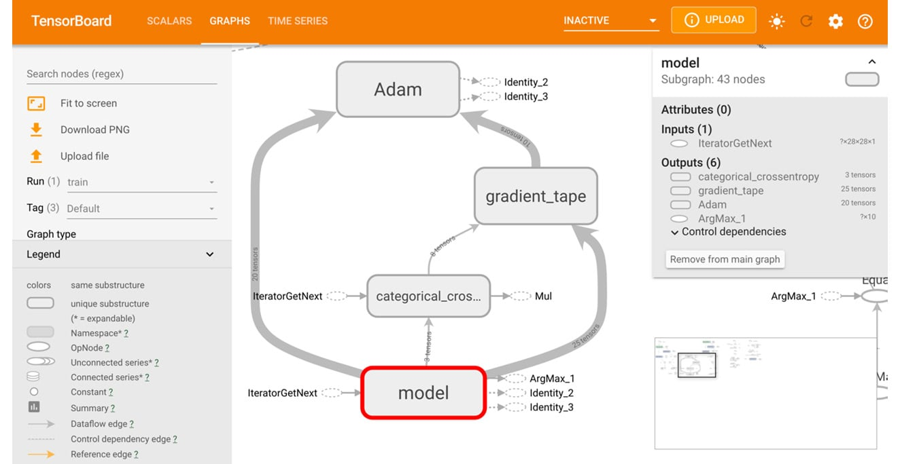


-   Viewing histograms and distributions of variables and tracking how
    they change over time.
-   Displaying images, text, and audio data. For example, the
    following figure displays images from the Fashion MNIST dataset
    ([https://www.tensorflow.org/datasets/catalog/fashion\_mnist]):
    
    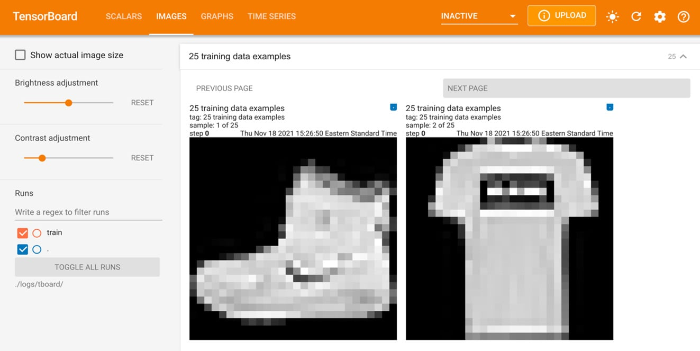


-   Plotting graphs of model evaluation metrics as a function of epoch
    during model training:
    
    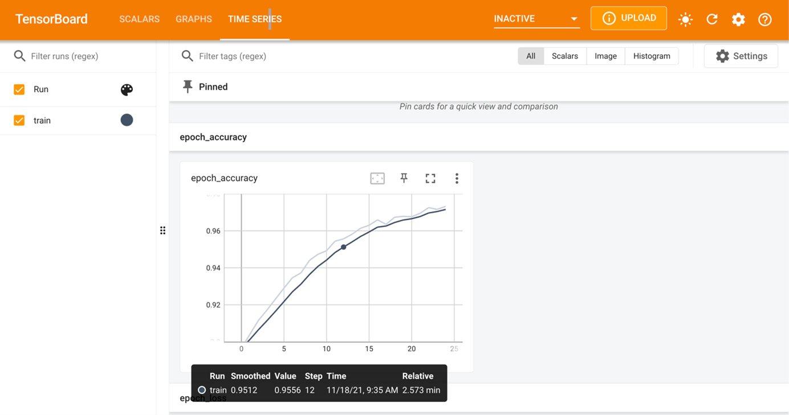


-   Dimensionality reduction for visualizing embedding vectors:
    
    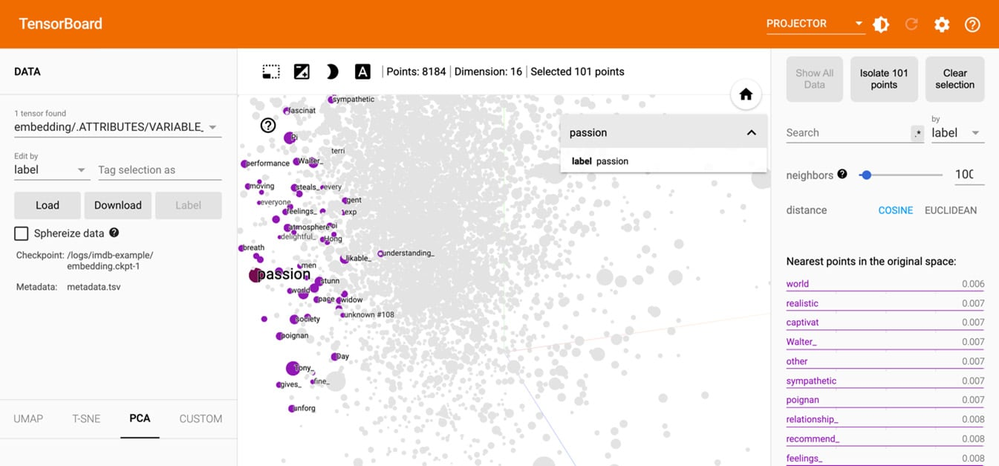


TensorBoard creates visualizations from logs that are written during the
development process. In order to create the logs to visualize the graph,
a file writer object needs to be initialized within your development
code, providing the location for the logs as an argument. The file
writer is typically created at the beginning of a Jupyter notebook or
equivalent development environment before any logs are written. This can
be done as follows:


```
logdir = 'logs/'
writer = tf.summary.create_file_writer(logdir)
```


In the preceding code, the directory for writing the logs is set, and if
this directory does not already exist a new one will be created
automatically in the working directory after you run the preceding code.
The file writer object writes a file to the log directory when the logs
are exported. To begin tracing, the following code must be executed:


```
tf.summary.trace_on(graph=True, profiler=True)
```


The preceding command turns on the trace that records the computation
graph that occurs from the time the command is executed. Without turning
on the trace, nothing is logged, and so, nothing can be visualized in
TensorBoard. Once the tracing of the computational graph is complete,
the logs can be written to the log directory using the file writer
object, as follows:


```
with writer.as_default():
    tf.summary.trace_export(name="my_func_trace",\
                            step=0, profiler_outdir=logdir)
```


When writing the logs, you will need to employ the following parameters:

-   `name`: This parameter describes the name of the summary.
-   `step`: This parameter describes the monotonic step value
    for the summary and can be set to `0` if the object does
    not change over time.
-   `profiler_outdir`: This parameter describes the location
    to write the logs and is required if not provided when the file
    writer object is defined.

After logs have been written to a directory, TensorBoard can be launched
through the command line using the following command, thereby passing in
the directory for the logs as the `logdir` parameter:


```
tensorboard --logdir=./logs
```


Some versions of Jupyter Notebooks allow TensorBoard to be run directly
within the notebook. However, library dependencies and conflicts can
often prevent TensorBoard from running in notebook environments, in
which case you can launch TensorBoard in a separate process from the
command line. In this book, you will be using TensorFlow version 2.6 and
TensorBoard version 2.1, and you will always use the command line to
launch TensorBoard.

In the first exercise, you will learn how to use TensorBoard to
visualize a graph process. You will create a function to perform tensor
multiplication and then visualize the computational graph in
TensorBoard.

Exercise 3.01: Using TensorBoard to Visualize Matrix Multiplication
-------------------------------------------------------------------

In this exercise, you will perform matrix multiplication of
`7x7` matrices with random values and trace the computation
graph and profiling information. Following that, you will view the
computation graph using TensorBoard. This exercise will be performed in
a Jupyter notebook. Launching TensorBoard will require running a command
on the command line, as shown in the final step.

Follow these steps:

1.  Open a new Jupyter notebook and import the TensorFlow library, and
    then set a seed for reproducibility. Since you are generating random
    values, setting a seed will ensure that the values generated are the
    same if the seed set is the same each time the code is run:
    
    ```
    import tensorflow as tf
    tf.random.set_seed(42)
    ```


2.  Create a `file_writer` object and set the directory for
    which the logs will be stored:
    
    ```
    logdir = 'logs/'
    writer = tf.summary.create_file_writer(logdir)
    ```


3.  Create a TensorFlow function to multiply two matrices together:
    
    ```
    @tf.function
    def my_matmult_func(x, y):
        result = tf.matmul(x, y)
        return result
    ```


4.  Create sample data in the form of two tensors with the shape
    `7x7` with random variables:
    
    ```
    x = tf.random.uniform((7, 7))
    y = tf.random.uniform((7, 7))
    ```


5.  Turn on graph tracing using TensorFlow\'s `summary` class:
    
    ```
    tf.summary.trace_on(graph=True, profiler=True)
    ```


6.  Apply the function that was created in *step 3* to the sample
    tensors that were created in *step 4*. Next, export the trace to the
    `log` directory, set the `name` argument for the
    graph for reference, and the `log` directory for the
    `profiler_outdir` argument. The `step` argument
    indicates the monotonic step value for the summary; the value should
    be nonzero if the values being traced vary, in which case they can
    be visualized with a step size dictated by this argument. For static
    objects, such as your graph trace here, it should be set to zero:
    
    ```
    z = my_matmult_func(x, y)
    with writer.as_default():
        tf.summary.trace_export(name="my_func_trace",\
                                step=0,\
                                profiler_outdir=logdir)
    ```


7.  Finally, launch TensorBoard in the current working directory using
    the command line to view a visual representation of the graph.
    TensorBoard can be viewed in a web browser by visiting the URL that
    is provided after launching TensorBoard:

    
    ```
    tensorboard --logdir=./logs
    ```


    For those running Windows, in the Anaconda prompt, run the
    following:

    
    ```
    tensorboard --logdir=logs
    ```


    By running the preceding code, you will be able to visualize the
    following model graph:

    
    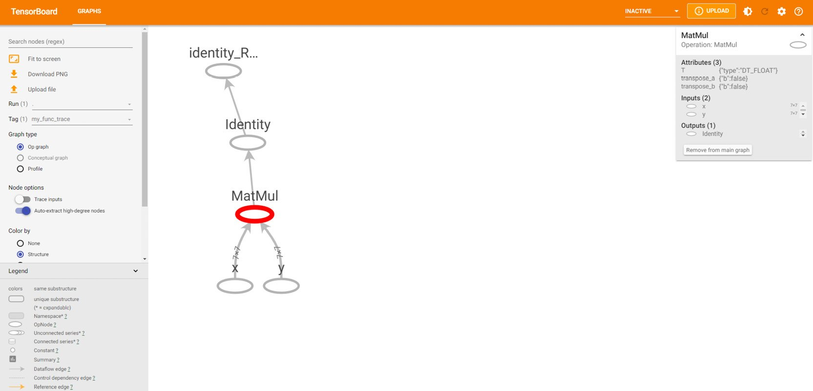


In TensorBoard, you can view the process of a tensor multiplying the two
matrices to produce another matrix. By selecting the various elements,
you can view information about each individual object in the
computational graph, depending on the type of object. Here, you have
created two tensors, named `x` and `y`, represented
by the nodes at the bottom. By selecting one of the nodes, you can view
attributes about the tensor, including its data type
(`float`), its user-specified name (`x` or
`y`), and the name of the output node (`MatMul`).
These nodes representing the input tensors are then input into another
node representing the tensor multiplication process labeled
`MatMul` after the TensorFlow function. Selecting this node
reveals attributes of the function, including the input arguments, the
input nodes (`x` and `y`), and the output node
(`Identity`). The final two nodes, labeled
`Identity` and `identity_RetVal`, represent the
creation of the output tensor.

In this exercise, you used TensorBoard to visualize a computational
graph. You created a simple function to multiply two tensors together
and you recorded the process by tracing the graph and logging the
results. After logging the graph, you were able to visualize it by
launching TensorBoard and directing the tool to the location of the
logs.

In the first activity, you will practice using TensorBoard to visualize
a more complicated tensor transformation. In fact, any tensor process
and transformation can be visualized in TensorBoard and the process
demonstrated in the previous exercise is a good guide for creating and
writing logs.

Activity 3.01: Using TensorBoard to Visualize Tensor Transformations
--------------------------------------------------------------------

You are given two tensors of shape `5x5x5`. You are required
to create TensorFlow functions to perform a tensor transformation and
view a visual representation of the transformation.

The steps you will take are as follows:

1.  Import the TensorFlow library and set the seed to `42`.
2.  Set a log directory and initialize a file writer object to write the
    trace.
3.  Create a TensorFlow function to multiply two tensors, add a value of
    `1` to all elements in the resulting tensor using the
    `ones_like` function to create a tensor of the same shape
    as the result of the matrix multiplication. Then, apply a
    `sigmoid` function to each value of the tensor.
4.  Create two tensors with the shape `5x5x5`.
5.  Turn on graph tracing.
6.  Apply the function to the two tensors and export the trace to the
    log directory.
7.  Launch TensorBoard in the command line and view the graph in a web
    browser:
    
    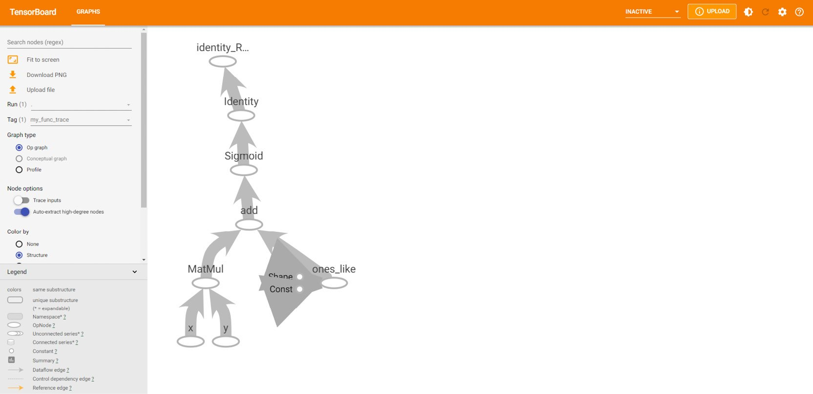


Note

The solution to this activity can be found via [this link].

However, TensorBoard is not only for visualizing computational graphs.
Images, scalar variables, histograms, and distributions can all be
viewed in TensorBoard by writing them to the log directory using the
appropriate TensorFlow `summary` method. For example, images
can be written to the logs as follows:


```
with file_writer.as_default():
    tf.summary.image("Training data", training_images, step=0)
```


The output of this will be a file added to the log directory named
`Training data` that contains the images written by the file
writer. Images can be viewed in TensorBoard by selecting the tab labeled
`IMAGES`.

In the same manner, scalar variables can be written to the logs for
viewing in TensorBoard as follows:


```
with file_writer.as_default():
    tf.summary.scalar('scalar variable', variable, step=0)
```


Audio files can be written to the logs for playback in TensorBoard in
the following way:


```
with file_writer.as_default():
    tf.summary.audio('audio file', data, sample_rate=44100, \
                     step=0)
```


A histogram can be logged by passing in data as follows:


```
with file_writer.as_default():
    tf.summary.histogram('histogram', data, step=0)
```


In each of these examples of writing data to the logs, the
`step` argument is set to zero since this is a required
argument and must not be null. Setting the argument to zero indicates
that the value is static and does not change with time. Each data type
will be visible in a different tab in TensorBoard.

In the next exercise, you will write images to TensorBoard so that they
can be viewed directly within the platform. With TensorBoard, this
becomes a facile process that otherwise would require writing custom
code to view images. You may want to visualize images of batches to
verify the labels, check the augmentation process, or validate the
images in general.

Exercise 3.02: Using TensorBoard to Visualize Image Batches
-----------------------------------------------------------

In this exercise, you will use TensorBoard to view image batches. You
will create a file writer and a data generator for the images, and then
write one batch of images to the log files. Finally, you will view the
images in TensorBoard.

Note

You can find the images in the `image_data` folder here:
[https://github.com/fenago/deep-learning-essentials/tree/main/Lab03/Datasets].

Follow these steps:

1.  Import the TensorFlow library and the `ImageDataGenerator`
    class:
    
    ```
    import tensorflow as tf
    from tensorflow.keras.preprocessing.image import \
        ImageDataGenerator
    ```


2.  Create a `file_writer` object and set the directory to
    which the logs will be stored:
    
    ```
    logdir = 'logs/'
    writer = tf.summary.create_file_writer(logdir)
    ```


3.  Initialize an `ImageDataGenerator` object:
    
    ```
    train_datagen = ImageDataGenerator(rescale = 1./255)
    ```


4.  Use the data generator\'s `flow_from_directory` method to
    create a batch image loader:

    
    ```
    batch_size = 25
    training_set = train_datagen.flow_from_directory\
                   ('image_data',\ 
                    target_size = (224, 224),\ 
                    batch_size = batch_size,\ 
                    class_mode = 'binary') 
    ```


    Note

    Make sure you change the path (highlighted) to the location of the
    directory on your system. If you\'re running the Jupyter notebook
    from the same directory where the dataset is stored, you can run the
    preceding code without any modification.

5.  Take the images from the first batch and write them to the logs
    using the file writer:
    
    ```
    with file_writer.as_default():
        tf.summary.image("Training data", \
                         next(training_set)[0], \
                         max_outputs=batch_size, \
                         step=0)
    ```


6.  Launch TensorBoard in the command line to view a visual
    representation of the graph. TensorBoard can be viewed in a web
    browser by visiting the URL that is provided after launching
    TensorBoard. The default URL provided is
    `http://localhost:6006/`:

    
    ```
    tensorboard --logdir=./logs
    ```


    For those running Windows, in the Anaconda prompt, run the
    following:

    
    ```
    tensorboard --logdir=logs
    ```


    Images in the directory will be displayed in TensorBoard as follows:

    
    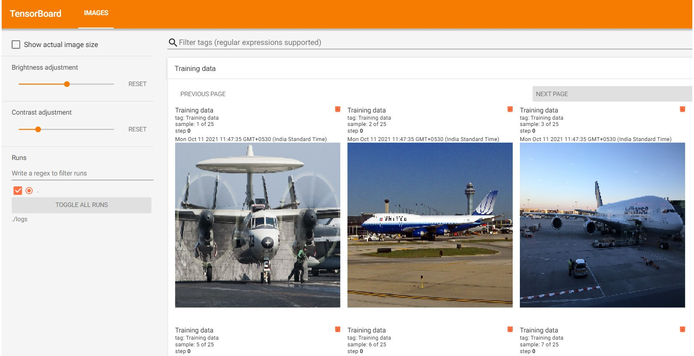


Note

Images on your system may vary.

The result in TensorBoard is the images from the first batch. You can
see that they are images of boats and planes. TensorBoard also provides
you with the ability to adjust the brightness and contrast of the
images; however, that affects only the images in TensorBoard and not the
underlying image data.

In this exercise, you viewed a batch of images from an image data
generator using TensorBoard. This is an excellent way to verify the
quality of your training data. It may not be necessary to verify every
image for quality, but sample batches can be viewed easily using
TensorBoard.

This section has introduced one resource that TensorFlow offers to help
data science and machine learning practitioners understand and visualize
their data and algorithms: TensorBoard. You have used the resource to
visualize computational graphs and image batches. In the next section,
you will explore TensorFlow Hub, which is a repository for machine
learning modules that can be accessed and incorporated into custom
applications easily. The models are created by experts in the field, and
you will learn how to access them for your own applications.


TensorFlow Hub
==============


TensorFlow Hub is an online repository of machine learning modules. The
modules contain assets with the associated weights that are needed to
use any model (for instance, for predictions or transfer learning) where
the knowledge gained in training one model is used to solve a different
but related problem. These modules can be used directly to create
applications that they were trained for, or they can be used as a
starting point to build new applications. The platform can be visited at
the following URL: [https://tfhub.dev/]. When you visit the
website, you will be greeted by the following page:

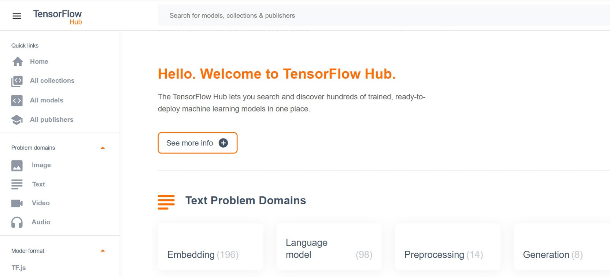


Once here, you can browse through models of various domains. The most
popular domains include image, text, and video; many models exist for
these domains:

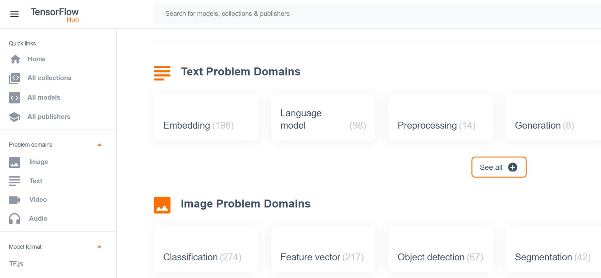


There are many models available on TensorFlow Hub that take images as
their input data. These models are generally created for tasks including
image classification, segmentation, embedding, generation, augmentation,
and style transfer. Models created for text data are generally used for
text embedding, and models used on video data are used for video
classification. There are also audio data models for tasks including
command detection and pitch extraction. TensorFlow Hub is consistently
updated with new state-of-the-art models that can be used for all sorts
of applications.

Selecting a model will land you on the following page, which will tell
you information about the model, such as the size of the model, its
architecture, the dataset on which it was trained, and the URL for
reference:

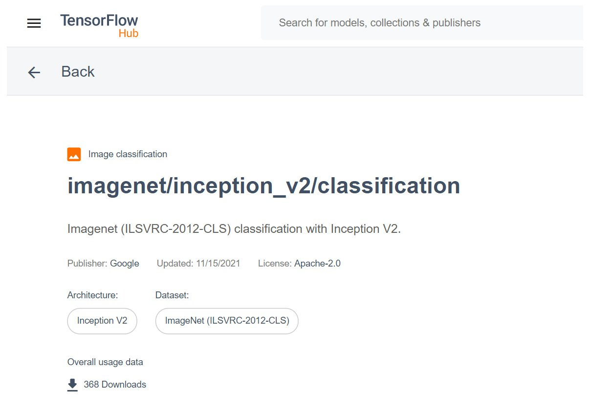


When referencing models for your own applications, you will need the URL
of the model\'s page to load it in.

Models can be accessed in notebook environments from TensorFlow Hub by
utilizing the `tensorflow_hub` library. The library can be
imported as follows:


```
import tensorflow_hub as hub
```


Models can be loaded by utilizing the library\'s `load`
function and passing in the reference URL of the model:


```
module = hub.load("https://tfhub.dev/google/imagenet"\
                  "/inception_resnet_v2/classification/4")
```


Assets of the model\'s module, such as its architecture, can be viewed
by accessing the `signatures` attribute. Each model may have
different keys within the `signatures` attribute; however,
much of the pertinent information will be contained within the
`default` key:


```
model = module.signatures['default']
```


The model can also be used directly in training by treating the whole
model like a single Keras layer using the `KerasLayer` method:


```
layer = hub.KerasLayer("https://tfhub.dev/google/imagenet"\
                       "/inception_resnet_v2/classification/4")
```


The process of using the model as layers for your own application is
known as **transfer learning**, which will be explored in more depth in
later chapters.

Viewing a model in TensorFlow Hub can be done by writing the model graph
to the logs using a file writer as follows:


```
from tensorflow.python.client import session
from tensorflow.python.summary import summary
from tensorflow.python.framework import ops
with session.Session(graph=ops.Graph()) as sess:
    file_writer = summary.FileWriter(logdir)
    file_writer.add_graph(model.graph)
```


In the following exercise, you will download a model from TensorFlow
Hub. After loading in the model, you will view the model\'s architecture
using TensorBoard.

Exercise 3.03: Downloading a Model from TensorFlow Hub
------------------------------------------------------

In this exercise, you will download a model from TensorFlow Hub and then
view the architecture of the model in TensorBoard. The model that will
be downloaded is the `InceptionV3` model. This model was
created in TensorFlow 1 and so requires some additional steps for
displaying the model details as we\'re using TensorFlow 2. This model
contains two parts: a part that includes convolutional layers to extract
features from the images, and a classification part with fully connected
layers.

The distinct layers will be visible in TensorBoard as they have been
named appropriately by the original author.

Note

You can get the `InceptionV3` model here:
[https://tfhub.dev/google/imagenet/inception\_v3/classification/5].

Follow these steps to complete this exercise:

1.  Import the following libraries from TensorFlow:

    
    ```
    import tensorflow as tf
    import tensorflow_hub as hub
    from tensorflow.python.client import session
    from tensorflow.python.summary import summary
    from tensorflow.python.framework import ops
    ```


    The TensorFlow and TensorFlow Hub libraries are required to import
    and build the model, and the other classes from the TensorFlow
    library are required to visualize models that are created in
    TensorFlow 1 using TensorFlow 2, which is what you are using in this
    book.

2.  Create a variable for the logs to be stored:
    
    ```
    logdir = 'logs/'
    ```


3.  Load in a model module by using the `load` method from the
    `tensorflow_hub` library and pass in the URL for the
    model:
    
    ```
    module = hub.load('https://tfhub.dev/google/imagenet'\
                      '/inception_v3/classification/5')
    ```


4.  Load the model from the `signatures` attribute of the
    module:
    
    ```
    model = module.signatures['default']
    ```


5.  Write the model graph to TensorBoard using a file writer:
    
    ```
    with session.Session(graph=ops.Graph()) as sess:
        file_writer = summary.FileWriter(logdir)
        file_writer.add_graph(model.graph)
    ```


6.  Launch TensorBoard in the command line to view a visual
    representation of the graph. TensorBoard can be viewed in a web
    browser by visiting the URL that is provided after launching
    TensorBoard:

    
    ```
    tensorboard --logdir=./logs
    ```


    For those running Windows, in the Anaconda prompt, run the
    following:

    
    ```
    tensorboard --logdir=logs
    ```


    You should get something like the following image:

    
    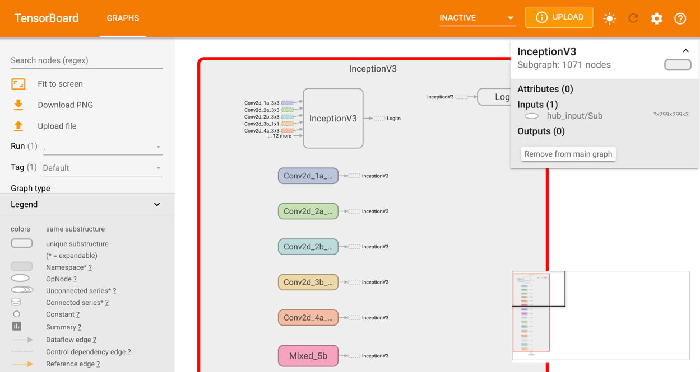


The result in TensorBoard is the architecture of the
`InceptionV3` model. Here, you can view all the details about
each layer of the model, including the input, output, and activation
functions.

In this exercise, you successfully downloaded a model into a Jupyter
notebook environment using the TensorFlow Hub library. Once the model
was loaded into the environment, you visualized the architecture of the
model using TensorBoard. This can be a helpful way to visualize your
model\'s architecture for debugging purposes.

In this section, you have explored how to use TensorFlow Hub as a way to
utilize the many brilliant models that have been created by experts in
the machine learning field. As you will discover in later chapters,
these models can be used to solve slightly different applications than
those for which they were developed; this is known as transfer learning.
In the next section, you will learn how to use Google Colab, an
environment similar to Jupyter Notebooks that can be used to
collaboratively develop applications in Python online, on Google
servers.


Google Colab
============


Google Colab enables users to execute code on Google servers and is
designed specifically for data science practitioners to develop code for
machine learning in a collaborative environment. The platform is
available at [https://colab.research.google.com/] and offers
an opportunity to develop in the Python programming language directly
within a web browser with no code executing on your local machine. The
environment comes pre-loaded with up-to-date libraries for data science
and machine learning and offers a convenient alternative to setting up a
development environment using Jupyter Notebooks. Moreover, the platform
has a free tier that includes access to GPUs and TPUs, there is no
configuration required, and sharing notebooks between collaborators is
easy.

Google Colab has a very similar development experience to Jupyter
Notebooks, and there are some advantages and disadvantages of using
Google Colab over Jupyter Notebooks.

Advantages of Google Colab
--------------------------

The following are a few of the main advantages of using Google Colab:

-   **Collaborative**: Many users can access the same notebook and work
    collaboratively together.
-   **Managed environment**: Google Colab runs on Google servers, which
    can be helpful if local computational resources are limited. There
    is no need to set up a development environment since many packages
    come pre-installed.
-   **Easy accessibility**: Google Colab saves directly to Google Drive,
    offering seamless integration. Since the notebooks are saved in the
    cloud, they are available wherever Google Drive can be accessed.
-   **Accelerated training times**: GPU and TPU servers are available,
    which can offer accelerated training times for training machine
    learning models, especially ANNs with many hidden layers.
-   **Interactive widgets**: Widgets can be added to a notebook that can
    offer a way to easily vary input parameters and variables in an
    interactive manner.

Disadvantages of Google Colab
-----------------------------

The following are a few of the disadvantages of using Google Colab:

-   **Restrained runtime**: Only two versions of TensorFlow are
    available on Google Colab, 1.X and 2.X, and they are updated, so
    specific functions may change over time, resulting in broken code.
    Additionally, the versions of TensorFlow may not interact well with
    other packages.
-   **Internet dependence**: Since the Python code is executed on Google
    servers, Google Colab can only be accessed with an internet
    connection.
-   **No automatic save**: Notebooks must be saved consistently, which
    is different from the automatic saving of Jupyter Notebooks.
-   **Session timeout**: Notebooks running on the virtual machines have
    a maximum lifetime of 12 hours and environments that are left idle
    for too long will be disconnected.
-   **Interactive library**: Libraries that contain interactive elements
    such as OpenCV or `geoplotlib` may not be capable of
    displaying interactive elements due to incompatibilities with the
    pre-loaded libraries.

Development on Google Colab
---------------------------

Since Google Colab uses notebooks, the development environment is very
similar to Jupyter Notebooks. In fact, IPython notebooks can be loaded
into Google Colab. They can be loaded in via direct upload, Google
Drive, or a GitHub repository. Alternatively, the platform provides
example notebooks to get started. When you navigate to the platform,
[https://colab.research.google.com/], you will be greeted by
the following screen, which provides notebooks to open or the option to
select a new notebook to begin developing:

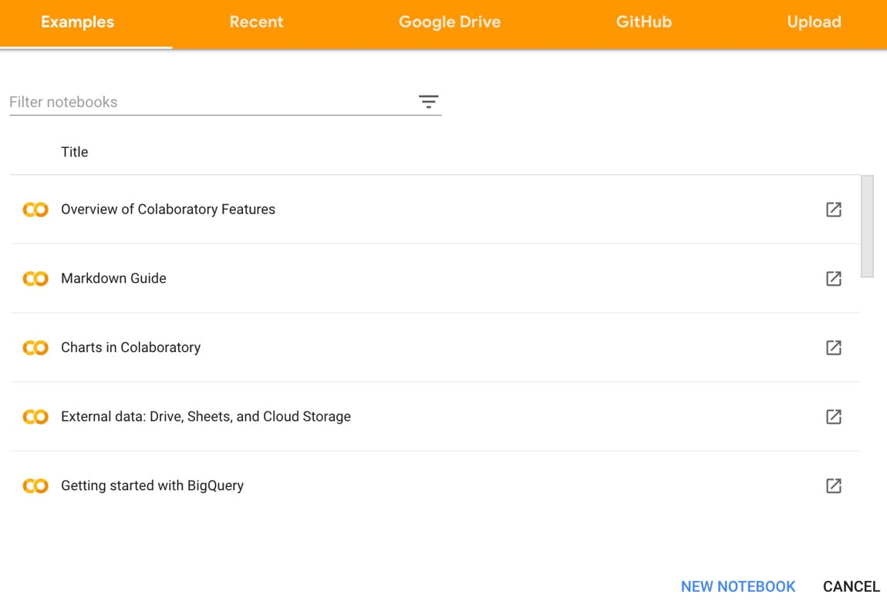


If a new notebook is selected, you are greeted by the following screen,
which may be very reminiscent of developing in Jupyter Notebooks and has
many of the same features. You can create code or text snippets in the
exact same way and many practitioners find the transition from Jupyter
seamless:

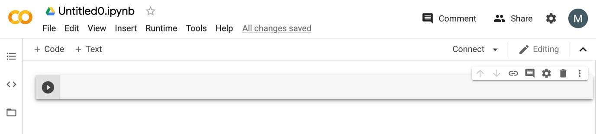


In the next exercise, you will use Google Colab to import and manipulate
data. One of the main differences between working in Google Colab
compared to Jupyter Notebooks is that by working in Google Colab, you
are developing on a remote server. This means that any data for analysis
or training models must either be loaded on Google Drive or available
directly online. In the following exercise, you will import CSV data
directly from a GitHub repository for this book.

Exercise 3.04: Using Google Colab to Visualize Data
---------------------------------------------------

In this exercise, you will load a dataset from a GitHub repository that
has bias correction data for next-day maximum and minimum air
temperature forecasts for Seoul, South Korea.

Note

You can find the `Bias_correction_ucl.csv` file here:
[https://github.com/fenago/deep-learning-essentials/blob/main/Lab03/Datasets/Bias_correction_ucl.csv].

To perform the exercise, you will have to navigate to
[https://colab.research.google.com/] and create a new
notebook to work in. You will need to connect to a GPU-enabled
environment to speed up TensorFlow operations such as tensor
multiplication. Once the data has been loaded into the development
environment, you will view the first five rows. Next, you\'ll drop the
`Date` field since matrix multiplication requires numerical
fields. Then, you will perform tensor multiplication of the dataset with
a tensor or uniformly random variables.

Follow these steps to complete this exercise:

1.  Import TensorFlow and check the version of the library:

    
    ```
    import tensorflow as tf
    print('TF version:', tf.__version__)
    ```


    You should get the version of the TensorFlow library:

    
    


2.  Navigate to the `Edit` tab, go to
    `Notebook Settings`, and then select `GPU` from
    the `Hardware Acceleration` dropdown. Verify that the GPU
    is enabled by displaying the GPU device name:

    
    ```
    tf.test.gpu_device_name()
    ```


    You should get the name of the GPU device:

    
    


3.  Import the `pandas` library and load in the dataset
    directly from the GitHub repository:
    
    ```
    import pandas as pd
    df = pd.read_csv('https://raw.githubusercontent.com'\
                     '/fenago/deep-learning-essentials'\
                     '/main/Lab03/Datasets'\
                     '/Bias_correction_ucl.csv')
    ```


4.  View the first five rows of the dataset using the `head` method:

    
    ```
    df.head()
    ```


    You should get the following output:

    
    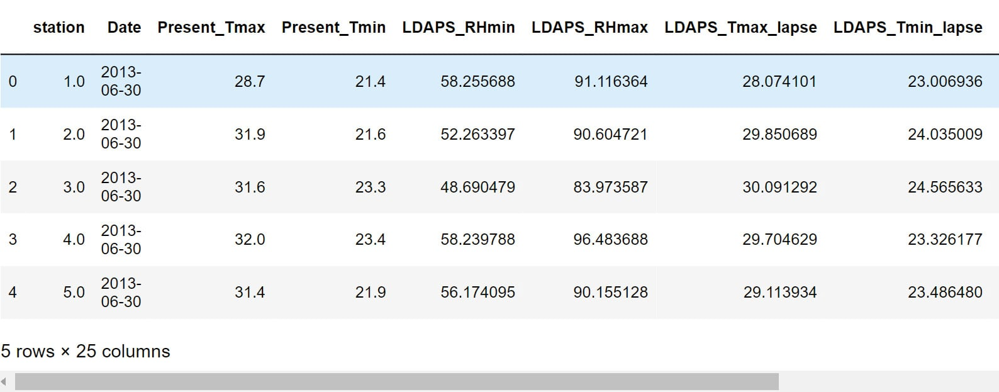


5.  Drop the `Date` field since you\'ll be performing matrix
    multiplication, which requires numerical fields:
    
    ```
    df.drop('Date', axis=1, inplace=True)
    ```


6.  Import NumPy, convert the DataFrame to a NumPy array, and then
    create a TensorFlow tensor of uniform random variables. The value of
    the first axis of the tensor will be equal to the number of fields
    of the dataset, and the second axis will be equal to `1`:
    
    ```
    import numpy as np
    df = np.asarray(df).astype(np.float32)
    random_tensor = tf.random.normal((df.shape[1],1))
    ```


7.  Perform tensor multiplication on the dataset and the random tensor
    using TensorFlow\'s `matmul` function and print the
    result:

    
    ```
    tf.matmul(df, random_tensor)
    ```


    You should get output like the following:

    
    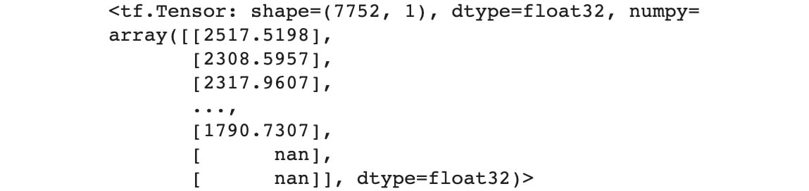


The result from executing the multiplication is a new tensor with the
shape `7752x1`.

In this exercise, you learned how to use Google Colab. You observed that
Google Colab provides a convenient environment to build machine learning
models and comes pre-loaded with many of the libraries that may be
needed for any machine learning application. You can also see that the
latest versions of the libraries are used. Unfortunately, the versions
of TensorFlow cannot be modified, so using Google Colab in production
environments may not be the most appropriate application. However, it is
great for development environments.

In the following activity, you will practice further how to use Google
Colab in a development environment. You will use TensorFlow Hub in the
same way that was achieved in Jupyter Notebooks. This activity will be
similar to what was achieved in *Exercise 2.04*, *Loading Text Data for
TensorFlow Models*, in which text data was processed by using a
pre-trained word embedding model. Utilizing pre-trained models will be
covered in future chapters, but this activity will show how easy it is
to utilize a pre-trained model from TensorFlow Hub.

Activity 3.02: Performing Word Embedding from a Pre-Trained Model from TensorFlow Hub
-------------------------------------------------------------------------------------

In this activity, you will practice working in the Google Colab
environment. You will download a universal sentence encoder from
TensorFlow Hub from the following URL:
[https://tfhub.dev/google/universal-sentence-encoder/4]. Once
the model has been loaded into memory, you will use it to encode some
sample text.

Follow these steps:

1.  Import TensorFlow and TensorFlow Hub and print the version of the
    library.

2.  Set the handle for the module as the URL for the universal sentence
    encoder.

3.  Use the TensorFlow Hub `KerasLayer` class to create a hub
    layer, passing in the following arguments:
    `module_handle`, `input_shape`, and
    `dtype`.

4.  Create a list containing a string,
    `The TensorFlow Workshop`, to encode with the encoder.

5.  Apply `hub_layer` to the text to embed the sentence as a
    vector.

    Your final output should be like the following:

    
    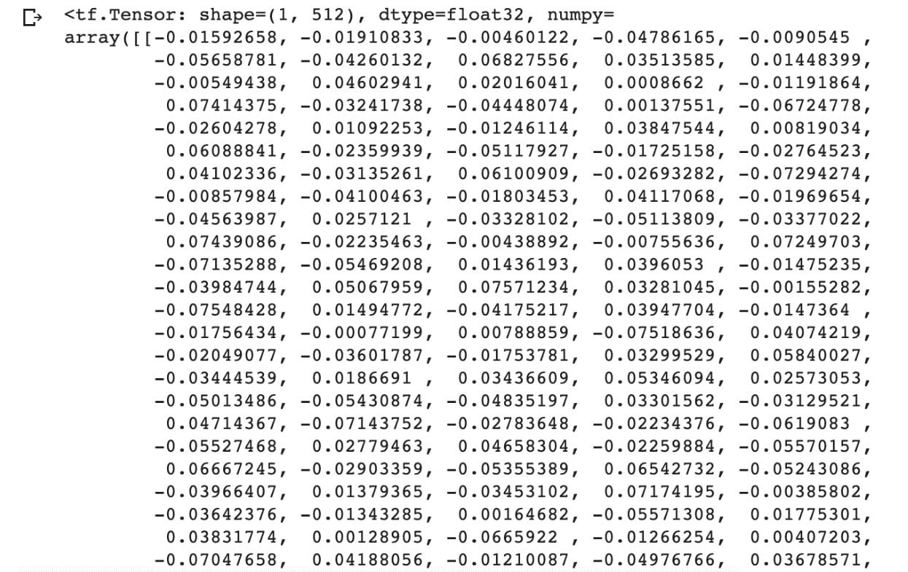


Note

The solution to this activity can be found via [this link].

This section introduced Google Colab, an online development environment
used to run Python code on Google servers. This can allow any
practitioner with an internet connection to begin building machine
learning models. Moreover, you can browse the selection of pre-trained
models to begin creating models for your own applications using another
resource you learned about in this lab, TensorFlow Hub. Google Colab
provides practitioners with a zero-configuration, up-to-date
environment, and even access to GPUs and TPUs for faster model training
times.


Summary
=======


In this lab, you used a variety of TensorFlow resources, including
TensorBoard, TensorFlow Hub, and Google Colab. TensorBoard offers users
a method to visualize computational model graphs, metrics, and any
experimentation results. TensorFlow Hub allows users to accelerate their
machine learning development using pre-trained models built by experts
in the field. Google Colab provides a collaborative environment to
develop machine learning models on Google servers. Developing performant
machine learning models is an iterative process of trial and error, and
the ability to visualize every step of the process can help
practitioners debug and improve their models. Moreover, understanding
how experts in the field have built their models and being able to
utilize the pre-learned weights in the networks can drastically reduce
training time. All of these resources are used to provide an environment
to develop and debug machine learning algorithms in an
efficient workflow.
