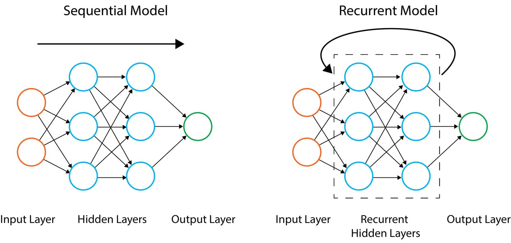
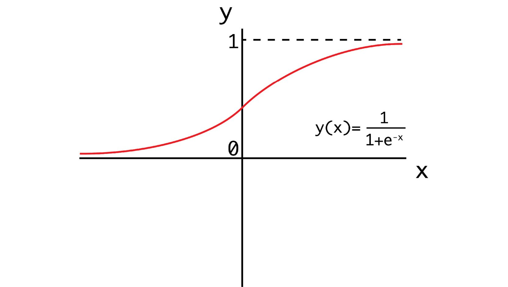

Lab 4: Regression and Classification Models
===========================================


Overview

In this lab, you will learn how to build regression and
classification models using TensorFlow. You will build models with
TensorFlow utilizing Keras layers, which are a simple approach to model
building that offer a high-level API for building and training models.
You will create models to solve regression and classification tasks,
including the classification of the binding properties of various
molecules. You will also use TensorBoard to visualize the architecture
of TensorFlow models and view the training process.


Introduction
============


In the previous lab, you learned how to use some TensorFlow
resources to aid in development. These included TensorBoard (for
visualizing computational graphs), TensorFlow Hub (an online repository
for machine learning modules), and Google Colab (an online Python
development environment for running code on Google servers). All these
resources help machine learning practitioners develop
models efficiently.

In this lab, you will explore how to create ANNs using TensorFlow.
You will build ANNs with different architectures to solve regression and
classification tasks. Regression tasks aim to predict continuous
variables from the input training data, while classification tasks aim
to classify the input data into two or more classes. For example, a
model to predict whether or not it will rain on a given day is a
classification task since the result of the model will be of two
classes---rain or no rain. However, a model to predict the amount of
rain on a given day would be an example of a regression task since the
output of the model would be a continuous variable---the amount of rain.

Models that are used to tackle these tasks represent a large class of
machine learning models, and a huge amount of machine learning problems
fall into these two categories. This lab will demonstrate how
regression and classification models can be created, trained, and
evaluated in TensorFlow. You will use much of the learning covered in
the previous chapters (including using TensorBoard to monitor the model
training process) to understand how to build performant models.

This lab introduces the various parameters used to build ANNs (known
as **hyperparameters**), which include activation functions, loss
functions, and optimizers. Other hyperparameters to select in the
model-fitting process include the number of epochs and batch size, which
vary the number of times the entire dataset is used to update the
weights and the number of data points for each update, respectively. You
will also learn how to log variables during the model-fitting process so
that they can be visualized in TensorBoard. This allows you to determine
whether the model is under- or overfitting the training data. Finally,
after building your model, you will learn how to evaluate it on the
dataset to see how well it performs.


Sequential Models
=================


A sequential model is used to build regression and classification
models. In sequential models, information propagates through the network
from the input layer at the beginning to the output layer at the end.
Layers are stacked in the model sequentially, with each layer having an
input and an output.

Other types of ANN models exist, such as recurrent neural networks (in
which the output feeds back into the input), which will be covered in
later chapters. The difference between sequential and recurrent neural
networks is shown in *Figure 4.01*. In both the models, the information
flows from the input layer through the hidden layers to the output
layer, as indicated by the direction of the arrows. However, in
recurrent architectures, the output of the hidden layers feeds back into
the input of the hidden layers:




In the following section, you will learn how to create sequential models
in TensorFlow that form the basis of regression and classification
models. You will utilize the Keras API, which is now included as part of
the TensorFlow library for sequential models, since the high-level API
provides a simple interface for creating these models. Using the API,
you will find that adding more layers to a model is incredibly easy and
is great for new practitioners learning the field.

A sequential model can be initialized as follows:


```
model = tf.keras.Sequential()
```


Once the model has been initialized, layers can be added to the model.
In this section, you will also explore how to add Keras layers to the
model.

Keras Layers
------------

Keras layers are included in the TensorFlow package. Keras layers are a
collection of commonly used layers that can be added easily to your
sequential models.

Note

You can check out all the possible options for Keras layers here:
[https://www.tensorflow.org/api\_docs/python/tf/keras/layers].

To add layers to a model of the `Sequential` class, you can
use the model\'s `add` method. One optional layer that can be
added to the beginning of a sequential model is an **input layer** as an
entry point to the network. Input layers can take the following common
input arguments:

-   `input_shape` (required): The shape of the input tensor,
    not including the batch axis
-   `batch_size`: An optional argument indicating the input
    batch size
-   `name`: Optional name of the input layer

Input layers can be added to a model as follows. The following code
snippet is used to add a layer, expecting inputs to have eight features:


```
model.add(tf.keras.layers.InputLayer(input_shape=(8,), \
                                     name='Input_layer'))
```


By providing a `name` argument, you can label the layers,
which will be useful when visualizing the model in TensorBoard. Another
type of layer that is commonly used when building regression and
classification models is the **dense layer**. The dense layer is a fully
connected layer, which means that all the nodes in the layer receive
inputs from every node in the layer prior and then connect to every node
of the next layer. A dense layer can be used as the first layer of the
model with `input_shape` provided as an argument. The
following are the common input arguments for layers of the
`Dense` class:

-   `units` (required): This is a positive integer denoting
    the number of units in the layer.
-   `input_shape`: This is the shape of the input tensor but
    is not required unless it is the first layer of the model.
-   `activation`: This is an optional argument indicating
    which activation function to apply to the output of the layer.
-   `use_bias`: This is a Boolean argument indicating whether
    to use bias in the layer. The default is set to `True`.
-   `name`: This refers to the name of the layer. One will be
    generated if this argument is not provided.
-   `kernel_initializer`: This is the initializer for the
    kernel weights. The **Glorot uniform initializer**, which has a
    normal distribution centered on zero and a standard deviation that
    is dependent on the number of units in the layer, is used by
    default.
-   `bias_initializer`: This is the initializer for the bias.
    The default of this parameter is used to set the bias values to
    zero.
-   `kernel_regularizer`: This is the regularizer to use on
    the kernel weights. There are none applied by default.
-   `bias_regularizer`: This is the regularizer to use on the
    bias. There are none applied by default.

The following is an example of adding a dense layer to a model with
`12` units, adding a `sigmoid` activation function
at the output of the layer, and naming the layer
`Dense_layer_1`:


```
model.add(tf.keras.layers.Dense(units=12, name='Dense_layer_1', \
                                activation='sigmoid'))
```


Now that you understand how to initialize sequential models and add
layers to them, you will create a Keras sequential model using
TensorFlow in the first exercise. You will initialize a model, add
layers to the model, add activation functions to the output of the
model, and pass data through the model to simulate creating a
prediction.

Exercise 4.01: Creating an ANN with TensorFlow
----------------------------------------------

In this exercise, you will create your first sequential ANN in
TensorFlow. You will have an input layer, a hidden layer with four units
and a ReLU activation function, and an output layer with one unit. Then,
you will create some simulation data by generating random numbers and
passing it through the model, using the model\'s `predict`
method to simulate a prediction for each data example.

Perform the following steps to complete the exercise:

1.  Open a Jupyter notebook and import the TensorFlow library:
    
    ```
    import tensorflow as tf
    ```


2.  Initialize a Keras model of the sequential class:
    
    ```
    model = tf.keras.Sequential()
    ```


3.  Add an input layer to the model using the model\'s `add`
    method, and add the `input_shape` argument with size
    `(8,)` to represent input data with eight features:
    
    ```
    model.add(tf.keras.layers.InputLayer(input_shape=(8,), \
                                         name='Input_layer'))
    ```


4.  Add two layers of the `Dense` class to the model. The
    first will represent your hidden layer with four units and a ReLU
    activation function, and the second will represent your output layer
    with one unit:
    
    ```
    model.add(tf.keras.layers.Dense(4, activation='relu', \
                                    name='First_hidden_layer'))
    model.add(tf.keras.layers.Dense(1, name='Output_layer'))
    ```


5.  View the weights by calling the `variables` attribute of
    the model:

    
    ```
    model.variables
    ```


    You should get the following output:

    
    


    This output shows all the variables that compose the model; they
    include the values for all weights and biases in each layer.

6.  Create a tensor of size `32x8`, which represents a tensor
    with 32 records and 8 features:
    
    ```
    data = tf.random.normal((32,8))
    ```


7.  Call the `predict` method of the model and pass in the
    sample data:

    
    ```
    model.predict(data)
    prediction
    ```


    You should get the following result:

    
    


Calling the `predict()` method on the sample data will
propagate the data through the network. In each layer, there will be a
matrix multiplication of the data with the weights, and the bias will be
added before the data is passed as input data to the next layer. This
process continues until the final output layer.

In this exercise, you created a sequential model with multiple layers.
You initialized a model, added an input layer to accept data with eight
features, added a hidden layer with four units, and added an output
layer with one unit. Before fitting a model to training data, you must
first compile the model with an optimizer and choose a loss function to
minimize the value it computes by updating weights in the
training process.

In the next section, you will explore how to compile models, then fit
them to training data.


Model Fitting
=============


Once a model has been initialized and layers have been added to the ANN,
the model must be configured with an optimizer, losses, and any
evaluation metrics through the compilation process. A model can be
compiled using the model\'s `compile` method, as follows:


```
model.compile(optimizer='adam', loss='binary_crossentropy', \
              metrics=['accuracy'])
```


Optimizers can be chosen by simply naming the optimizer as the argument.
The following optimizers are available as default for Keras models:

-   **Stochastic gradient descent** (**SGD**): This updates the weights
    for each example in the dataset. You can find more information about
    SGD here: [https://keras.io/api/optimizers/sgd/].
-   **RMSprop**: This is an adaptive optimizer that varies the weights
    during training by using a decaying average of the gradients at each
    update. You can find more information about RMSprop here:
    [https://keras.io/api/optimizers/rmsprop/].
-   **Adam**: This is also an adaptive optimizer that implements the
    Adam algorithm, updating the learning rates based on the first- and
    second-order gradients. You can find more information about Adam
    here: [https://keras.io/api/optimizers/adam/].
-   **Adagrad**: This adaptive gradient optimizer adapts the learning
    rate at each weight update. The learning rate is adapted for each
    feature using the prior gradients and observations. You can find
    more information about Adagrad here:
    [https://keras.io/api/optimizers/adagrad/].
-   **Adadelta**: This is a more robust version of Adagrad that uses a
    sliding window of gradient updates to adapt the learning rate. You
    can find more information about Adadelta here:
    [https://keras.io/api/optimizers/adadelta/].
-   **Adamax**: This is an adaptive optimizer that is a variant of the
    Adam optimizer. You can find more information about Adamax here:
    [https://keras.io/api/optimizers/adamax/].
-   **Nadam**: This is another adaptive optimizer that is a variant of
    the Adam optimizer with Nesterov momentum. You can find more
    information about Nadam here:
    [https://keras.io/api/optimizers/Nadam/].
-   **Ftrl**: This is an optimizer that implements the FTRL algorithm.
    You can find more information about Ftrl here:
    [https://keras.io/api/optimizers/ftrl/].

Custom optimizers can also be added to Keras models if the provided ones
are not relevant. Selecting the most appropriate optimizer is often a
matter of trying each and identifying which optimizer produces the
lowest error. This process is known as **hyperparameter tuning** and
will be covered in a later lab. In the next section, you will
uncover another option when compiling models: the loss function. The
goal of training a model is to minimize the value computed by the loss
function.

The Loss Function
-----------------

The loss function is the measure of error between the predicted results
and the true results. You use the loss function during the training
process to determine whether varying any of the weights and biases will
create a better model by minimizing the loss function\'s value through
the optimization process.

There are many different types of loss functions that can be used, and
the specific one will depend on the problem and goal. In general,
regression and classification tasks will have different loss functions.
Since regression models predict continuous variables, loss functions for
regression models typically aim to summarize how far, on average, the
predictions are from the true values. For classification models, loss
functions aim to determine how the quantity of true positive, true
negative, false positive, and false negative classifications of the
predicted classes vary compared to the true classes.

**True positives** are defined as correct predictions labeled positive
by the classifier; similarly, **true negatives** are correct predictions
labeled negative. **False positives** are predictions labeled positive
where the true value is negative, and **false negatives** are
predictions labeled negative that are actually positive. Loss functions
that are directly available to use in Keras sequential models for
regression include the following:

-   **Mean squared error**: This is a loss function that calculates the
    squared difference between the true and predicted value for each
    data point, `(true value – predicted value)^2`, and
    returns the average across the entire dataset. This loss function is
    primarily used for regression problems, and the squaring of the
    difference between the two values ensures the loss function results
    in a positive number.
-   **Mean absolute error**: This is another loss function primarily
    used for regression problems that calculates the absolute value of
    the difference between the true and predicted value for each data
    point, `|true value – predicted value|`, and returns the
    average across the dataset. This method also ensures that the result
    is a positive value.
-   **Mean absolute percentage error**: This is another loss function
    used for regression problems that calculates the absolute value of
    the percentage error for each data point,
    `|(true value– predicted value) / true value|`, and
    returns the average across the dataset as a percentage.

For classification, loss functions that are available include the
following:

-   **Binary cross-entropy**: This is a loss function used for binary
    classification problems that outputs a value between `0`
    and `1`, with values closer to `1` representing
    a greater number of true positive classifications.
-   **Categorical cross-entropy**: This is a loss function similar to
    binary cross-entropy; however, it is suitable for multi-class
    classification problems and also outputs values between
    `0` and `1`.

When compiling a model, other metrics can also be passed in as an
argument to the method. They will be calculated after each epoch and
saved during the training process. The metrics that are available to be
calculated for Keras models include the following:

-   **Accuracy**: This is the proportion of correct results out of the
    total results.
-   **Precision**: This is the proportion of true positives out of the
    total positives predicted.
-   **Recall**: This is the proportion of true positives out of the
    actual positives.
-   **AUC**: This metric represents the area under the ROC curve.

These metrics can be incredibly valuable in understanding the
performance of the model during the training process. All the metrics
have values between `0` and `1`, with higher values
representing better performance. Once the model has been compiled, it
can be fit to the training data. This can be accomplished by calling the
`fit` method and passing in the following arguments:

-   `x`: This is the feature data as a TensorFlow tensor or
    NumPy array.
-   `y`: This is the target data as a TensorFlow tensor or
    NumPy array.
-   `epochs`: This refers to the number of epochs to run the
    model for. An epoch is an iteration over the entire training
    dataset.
-   `batch_size`: This is the number of training data samples
    to use per gradient update.
-   `validation_split`: This is the proportion of the training
    data to be used for validation that is evaluated after each epoch.
    This proportion of data is not used in the weight update process.
-   `shuffle`: This indicates whether to shuffle the training
    data before each epoch.

To fit the model to the training data, the `fit` method can be
applied to a model in the following way:


```
model.fit(x=features, y=target, epochs=10, batch_size=32, \
         validation_split=0.2, shuffle=False)
```


Once the `fit` method has been called, the model will begin
fitting to the training data. After each epoch, the loss is returned for
the training. If a validation split is defined, then the loss is also
evaluated on the validation split.

Model Evaluation
----------------

Once models are trained, they can be evaluated by utilizing the model\'s
`evaluate` method. The `evaluate` method assesses
the performance of the model according to the loss function used to
train the model and any metrics that were passed to the model. The
method is best used when determining how the model will perform on new,
unseen data by passing in a feature and target dataset that has not been
used in the training process or out-of-sample dataset. The method can be
called as follows:


```
eval_metrics = model.evaluate(features, target)
```


The result of the method is first the loss calculated on the input data,
and then, if any metrics were passed in the model compilation process,
they will also be calculated when the `evaluate` method is
executed. Model evaluation is an important step in determining how well
your model is performing. Since there is an enormous number of
hyperparameters (such as the number of hidden layers, the number of
units in each layer, and the choice of activation functions, to name a
few), model evaluation is necessary to determine which combination of
hyperparameters is optimal. Effective model evaluation can help provide
an unbiased view on which model architecture will perform best overall.

In the following exercise, you will undertake the process of creating an
ANN, compiling the model, fitting the model to training data, and
finally, evaluating the model on the training data. You will recreate
the linear regression algorithm with an ANN, which can be interpreted as
an ANN with only one layer and one unit. Furthermore, you will view the
architecture of the model and model training process in TensorBoard.

Exercise 4.02: Creating a Linear Regression Model as an ANN with TensorFlow
---------------------------------------------------------------------------

In this exercise, you will create a linear regression model as an ANN
using TensorFlow. The dataset, `Bias_correction_ucl.csv`,
describes the bias correction of air temperature forecasts of Seoul,
South Korea. The fields represent temperature measurements of the given
date, the weather station at which the metrics were measured, model
forecasts of weather-related metrics such as humidity, and projections
for the temperature the following day. You are required to predict the
next maximum and minimum temperature given measurements of the prior
timepoints and attributes of the weather station.

Note

The `Bias_correction_ucl.csv` file can be found here:
[https://github.com/fenago/deep-learning-essentials/blob/main/Lab04/Datasets/Bias_correction_ucl.csv].

Perform the following steps to complete this exercise:

1.  Open a new Jupyter notebook to implement this exercise. 

2.  In a new Jupyter Notebook cell, import the TensorFlow and pandas
    libraries:
    
    ```
    import tensorflow as tf
    import pandas as pd
    ```


3.  Load in the dataset using the pandas `read_csv` function:

    
    ```
    df = pd.read_csv('Bias_correction_ucl.csv')
    ```


    Note

    Make sure you change the path (highlighted) to the CSV file based on
    its location on your system. If you\'re running the Jupyter notebook
    from the same directory where the CSV file is stored, you can run
    the preceding code without any modification.

4.  Drop the `date` column and drop any rows that have null
    values since your model requires numerical values only:
    
    ```
    df.drop('Date', inplace=True, axis=1)
    df.dropna(inplace=True)
    ```


5.  Create target and feature datasets. The target dataset will contain
    the columns named `Next_Tmax` and `Next_Tmin`,
    while the feature dataset will contain all columns except those
    named `Next_Tmax` and `Next_Tmin`:
    
    ```
    target = df[['Next_Tmax', 'Next_Tmin']]
    features = df.drop(['Next_Tmax', 'Next_Tmin'], axis=1)
    ```


6.  Rescale the feature dataset:
    
    ```
    from sklearn.preprocessing import MinMaxScaler
    scaler = MinMaxScaler()
    feature_array = scaler.fit_transform(features)
    features = pd.DataFrame(feature_array, columns=features.columns)
    ```


7.  Initialize a Keras model of the `Sequential` class:
    
    ```
    model = tf.keras.Sequential()
    ```


8.  Add an input layer to the model using the model\'s `add`
    method, and set `input_shape` to be the number of columns
    in the feature dataset:
    
    ```
    model.add(tf.keras.layers.InputLayer\
             (input_shape=(features.shape[1],), \
                           name='Input_layer'))
    ```


9.  Add the output layer of the `Dense` class to the model
    with a size of `2`, representing the two target variables:
    
    ```
    model.add(tf.keras.layers.Dense(2, name='Output_layer'))
    ```


10. Compile the model with an RMSprop optimizer and a mean squared error
    loss:
    
    ```
    model.compile(tf.optimizers.RMSprop(0.001), loss='mse')
    ```


11. Add a callback for TensorBoard:
    
    ```
    tensorboard_callback = tf.keras.callbacks\
                             .TensorBoard(log_dir="./logs")
    ```


12. Fit the model to the training data:

    
    ```
    model.fit(x=features.to_numpy(), y=target.to_numpy(),\
              epochs=50, callbacks=[tensorboard_callback])
    ```


    You should get the following output:

    
    


13. Evaluate the model on the training data:

    
    ```
    loss = model.evaluate(features.to_numpy(), target.to_numpy())
    print('loss:', loss)
    ```


    This results in the following output:

    
    ```
    loss: 3.5468221449764012
    ```


14. View the model architecture and model-fitting process on TensorBoard
    by calling the following on the command line:

    
    ```
    mkdir -p logs && chmod -R 777 logs

    tensorboard --bind_all --logdir=logs/
    ```


    You can see its execution in a web browser by visiting the URL that
    is provided after launching TensorBoard. The default URL provided is
    `http://HOSTNAME:6006/`:

    
    


The loss function can be visualized as shown in the following figure:


You can see the architecture of the model in the `GRAPHS` tab.
The architecture shows the input layer and output layer in the model, as
well as the calculated loss. During the model-fitting process, the loss
is calculated after each epoch and is displayed in TensorBoard in the
`SCALARS` tab. The loss is that which is defined in the
compilation process; so, in this case, the loss is the mean squared
error. From TensorBoard, you can see that the mean squared error reduces
after each epoch, indicating that the model is learning from the
training data, updating the weights in order to reduce the total loss.

In this exercise, you have learned how to create, train, and evaluate an
ANN with TensorFlow by using Keras layers. You recreated the linear
regression algorithm by creating an ANN with an input layer and an
output layer that has one unit for each output. Here, there were two
outputs representing the maximum and minimum values of the temperature;
thus, the output layer has two units.

In *Exercise 4.01*, *Creating an ANN with TensorFlow*, you created an
ANN with only one layer containing weights and the output layer. This is
an example of a **shallow neural network**. ANNs that have many hidden
layers containing weights are called **deep neural networks**, and the
process of training them is called **deep learning**. By increasing the
number of layers and making the ANN deeper, the model becomes more
flexible and will be able to model more complex functions. However, to
gain this increase in flexibility, you need more training data and more
computation power to train the model.

In the next exercise, you will create and train ANNs that have multiple
hidden layers.

Exercise 4.03: Creating a Multi-Layer ANN with TensorFlow
---------------------------------------------------------

In this exercise, you will create a multi-layer ANN using TensorFlow.
This model will have four hidden layers. You will add multiple layers to
the model and activation functions to the output of the layers. The
first hidden layer will have `16` units, the second will have
`8` units, and the third will have `4` units. The
output layer will have `2` units. You will utilize the same
dataset as in *Exercise 4.02*, *Creating a Linear Regression Model as an
ANN with TensorFlow*, which describes the bias correction of air
temperature forecasts for Seoul, South Korea. The exercise aims to
predict the next maximum and minimum temperature given measurements of
the prior timepoints and attributes of the weather station.

Perform the following steps to complete this exercise:

1.  Open a new Jupyter notebook to implement this exercise. 

2.  In a new Jupyter Notebook cell, import the TensorFlow and pandas
    libraries:
    
    ```
    import tensorflow as tf
    import pandas as pd
    ```


3.  Load in the dataset using the pandas `read_csv` function:

    
    ```
    df = pd.read_csv('Bias_correction_ucl.csv')
    ```


    Note

    Make sure you change the path (highlighted) to the CSV file based on
    its location on your system. If you\'re running the Jupyter notebook
    from the same directory where the CSV file is stored, you can run
    the preceding code without any modification.

4.  Drop the `Date` column and drop any rows that have null
    values:
    
    ```
    df.drop('Date', inplace=True, axis=1)
    df.dropna(inplace=True)
    ```


5.  Create target and feature datasets:
    
    ```
    target = df[['Next_Tmax', 'Next_Tmin']]
    features = df.drop(['Next_Tmax', 'Next_Tmin'], axis=1)
    ```


6.  Rescale the feature dataset:
    
    ```
    from sklearn.preprocessing import MinMaxScaler
    scaler = MinMaxScaler()
    feature_array = scaler.fit_transform(features)
    features = pd.DataFrame(feature_array, columns=features.columns)
    ```


7.  Initialize a Keras model of the `Sequential` class:
    
    ```
    model = tf.keras.Sequential()
    ```


8.  Add an input layer to the model using the model\'s `add`
    method, and set `input_shape` to the number of columns in
    the feature dataset:
    
    ```
    model.add(tf.keras.layers.InputLayer\
                             (input_shape=(features.shape[1],), \
                              name='Input_layer'))
    ```


9.  Add three hidden layers and an output layer of the `Dense`
    class to the model. The first hidden layer will have `16`
    units, the second will have `8` units, and the third will
    have `4` units. Label the layers appropriately. The output
    layer will have two units to match the target variable that has two
    columns:
    
    ```
    model.add(tf.keras.layers.Dense(16, name='Dense_layer_1'))
    model.add(tf.keras.layers.Dense(8, name='Dense_layer_2'))
    model.add(tf.keras.layers.Dense(4, name='Dense_layer_3'))
    model.add(tf.keras.layers.Dense(2, name='Output_layer'))
    ```


10. Compile the model with an RMSprop optimizer and mean squared error
    loss:
    
    ```
    model.compile(tf.optimizers.RMSprop(0.001), loss='mse')
    ```


11. Add a callback for TensorBoard:
    
    ```
    tensorboard_callback = tf.keras.callbacks\
                             .TensorBoard(log_dir="./logs")
    ```


12. Fit the model to the training data for `50` epochs and add
    a validation split equal to 20%:

    
    ```
    model.fit(x=features.to_numpy(), y=target.to_numpy(),\
              epochs=50, callbacks=[tensorboard_callback] , \
              validation_split=0.2)
    ```


    You should get the following output:

    
    


13. Evaluate the model on the training data:

    
    ```
    loss = model.evaluate(features.to_numpy(), target.to_numpy())
    print('loss:', loss)
    ```


    This will display the following result:

    
    ```
    loss: 1.664448248190068
    ```


14. View the model architecture and model-fitting process in
    TensorBoard:

    
    ```
    mkdir -p ./logs && chmod -R 777 ./logs

    tensorboard --bind_all --logdir=logs/
    ```


    You should get something like the following:

    
    


You can visualize the loss function as shown in the following
screenshot:


The network architecture shows the input layer and the four hidden
layers of the model as well as the calculated loss at the end. During
the model-fitting process, the loss is calculated after each epoch and
is displayed in TensorBoard in the `SCALARS` tab. Here, the
loss is the mean squared error. From TensorBoard, you can see that the
mean squared error reduces on the training set (the orange line) and the
validation set (the blue line), after each epoch, indicating that the
model is learning effectively from the training data.

In this exercise, you have created an ANN with multiple hidden layers.
The loss you obtained was lower than that achieved using linear
regression, which demonstrates the power of ANNs. With some tuning to
the hyperparameters (such as varying the number of layers, the number of
units within each layer, adding activation functions, and changing the
loss and optimizer), the loss could be even lower. In the next activity,
you will put your model-building skills into action on a new dataset.

Activity 4.01: Creating a Multi-Layer ANN with TensorFlow
---------------------------------------------------------

The feature dataset, `superconductivity.csv`, contains the
properties of superconductors including the atomic mass of the material
and its density. Importantly, the dataset also contains the critical
temperature of the material, which is the temperature at which the
material exhibits superconductive properties. In this activity, you are
tasked with finding the critical temperature of the material or the
temperature at which the material gains superconductive properties.

Note

The `superconductivity.csv` file can be found here:
[https://github.com/fenago/deep-learning-essentials/blob/main/Lab04/Datasets/superconductivity.csv].

Perform the following steps to complete this activity:

1.  Open a new Jupyter notebook to implement this activity.

2.  Import the TensorFlow and pandas libraries.

3.  Load in the `superconductivity.csv` dataset.

4.  Drop any rows that have null values.

5.  Set the target as the `critical_temp` column and the
    feature dataset as the remaining columns.

6.  Rescale the feature dataset using a standard scaler.

7.  Initialize a model of the Keras `Sequential` class.

8.  Add an input layer, four hidden layers of sizes `64`,
    `32`, `16`, and `8`, and an output
    layer of size `1` to the model. Add a ReLU activation
    function to the first hidden layer.

9.  Compile the model with an RMSprop optimizer with a learning rate
    equal to `0.001` and the mean squared error for the loss.

10. Add a callback to write logs to TensorBoard.

11. Fit the model to the training data for `100` epochs, with
    a batch size equal to `32` and a validation split equal to
    20%.

12. Evaluate the model on the training data.

13. View the model architecture in TensorBoard.

    You should get an output like the following:

    
    


14. Visualize the model-fitting process in TensorBoard. You should get
    the following output:
    
    


In the next section, you will explore classification models, which
attempt to classify data into distinct classes. You will begin with
binary classification models that classify data into just two classes.
This is the simplest form of a classification model. Once binary
classifiers are mastered, more complicated models can be tackled, such
as multi-label and multi-class classification.


Classification Models
=====================


The goal of classification models is to classify data into distinct
classes. For example, a spam filter is a classification model that aims
to classify emails into \"spam\" (referring to unsolicited and unwanted
email) or \"ham\" (a legitimate email). Spam filters are an example of a
binary classifier since there are two classes. The input to the filter
may include the content of the email, the email address of the sender,
and the subject line, among other features, and the output will be the
predicted class, `spam` or `ham`. Classification
models can classify data into more than two distinct classes (known as
**multi-class classification**) or classify data with multiple positive
labels (known as **multi-label classification**).

There are several different algorithms that can be used for
classification tasks. Some popular ones include logistic regression,
decision trees, and ANNs. ANNs are a great choice for classification
models since they can learn complex relationships between the features
and the target, and results can be achieved with the appropriate
activation function on the output layer of the ANN.

A common activation function to use for classification models is the
sigmoid function, which is the same function used in logistic
regression. In fact, a logistic regression model can be created by
building an ANN with a single layer with one unit and a sigmoid
activation function. The sigmoid function is a transformation in which
the input is any real value, and the output is a number strictly between
`0` and `1`. A visual representation is shown in the
following figure.

The output of the sigmoid transformation can be interpreted as a
probability of a value being in the positive class; a value closer to a
value of `1` indicates a higher probability of being in the
positive class:




After the sigmoid function has been applied, a threshold is applied,
above which the data is classified as the positive class and below as
the negative class. The default threshold for a sigmoid function is
`0.5`, meaning that any value at or above `0.5` is
classified as positive.

In the next exercise, you will create a logistic regression model with
TensorFlow. You will achieve this by creating a single-layer ANN, the
process of which is similar to that of the linear regression model in
*Exercise 4.02*, *Creating a Linear Regression Model as an ANN with
TensorFlow*. The difference is that you will add a sigmoid activation
function to the output of the ANN. Another difference that separates the
two exercises is the loss function that you will use to calculate the
loss.

Exercise 4.04: Creating a Logistic Regression Model as an ANN with TensorFlow
-----------------------------------------------------------------------------

In this exercise, you will create a logistic regression model as an ANN
using TensorFlow. The dataset, `qsar_androgen_receptor.csv`,
is used to develop classification models for the discrimination of
binder/non-binder molecules given various attributes of the molecules.
Here, the molecule attributes represent the features of your dataset,
and their binding properties represent the target variable, in which a
positive value represents a binding molecule, and a negative value
represents a non-binding molecule. You will create a logistic regression
model to predict the binding properties of the molecule given attributes
of the molecule provided in the dataset.

Note

The `qsar_androgen_receptor.csv` file can be found here:
[https://github.com/fenago/deep-learning-essentials/blob/main/Lab04/Datasets/qsar_androgen_receptor.csv].

Perform the following steps to complete this exercise:

1.  Open a new Jupyter notebook to implement this exercise.

2.  Import the TensorFlow and pandas libraries:
    
    ```
    import tensorflow as tf
    import pandas as pd
    ```


3.  Load in the dataset using the pandas `read_csv` function:

    
    ```
    df = pd.read_csv('qsar_androgen_receptor.csv', \
                     sep=';')
    ```


    Note

    Make sure you change the path (highlighted) to the CSV file based on
    its location on your system. If you\'re running the Jupyter notebook
    from the same directory where the CSV file is stored, you can run
    the preceding code without any modification.

4.  Drop any rows that have null values:
    
    ```
    df.dropna(inplace=True)
    ```


5.  Create target and feature datasets:
    
    ```
    target = df['positive'].apply(lambda x: 1 if x=='positive' else 0)
    features = df.drop('positive', axis=1)
    ```


6.  Initialize a Keras model of the `Sequential` class:
    
    ```
    model = tf.keras.Sequential()
    ```


7.  Add an input layer to the model using the model\'s `add`
    method and set `input_shape` to be the number of columns
    in the feature dataset:
    
    ```
    model.add(tf.keras.layers.InputLayer\
             (input_shape=(features.shape[1],), \
                           name='Input_layer'))
    ```


8.  Add the output layer of the `Dense` class to the model
    with a size of `1`, representing the target variable:
    
    ```
    model.add(tf.keras.layers.Dense(1, name='Output_layer', \
                                    activation='sigmoid'))
    ```


9.  Compile the model with an RMSprop optimizer and binary cross-entropy
    for the loss, and compute the accuracy:
    
    ```
    model.compile(tf.optimizers.RMSprop(0.0001), \
                  loss='binary_crossentropy', metrics=['accuracy'])
    ```


10. Create a TensorBoard callback:
    
    ```
    tensorboard_callback = tf.keras.callbacks.TensorBoard\
                           (log_dir="./logs")
    ```


11. Fit the model to the training data for `50` epochs, adding
    the TensorBoard callback with a validation split of 20%:

    
    ```
    model.fit(x=features.to_numpy(), y=target.to_numpy(), \
             epochs=50, callbacks=[tensorboard_callback] , \
             validation_split=0.2)
    ```


    Your output should be similar to the following figure:

    
    


12. Evaluate the model on the training data:

    
    ```
    loss, accuracy = model.evaluate(features.to_numpy(), \
                                    target.to_numpy())
    print(f'loss: {loss}, accuracy: {accuracy}')
    ```


    You should get output something like the following:

    
    ```
    loss: 0.2781583094794838, accuracy: 0.9110320210456848
    ```


13. Visualize the model-fitting process in TensorBoard by calling the
    following command on the command line:

    
    ```
    mkdir -p ./logs && chmod -R 777 ./logs

    tensorboard --bind_all --logdir=logs/
    ```


    You should get a screen similar to the following in the browser:

    
    


The loss function can be represented as follows:


You can see from TensorBoard that, with the addition of the
`metrics` argument that was added in the model compilation
process, there is an additional node in the architecture for the
calculation of the accuracy metric. There is also an additional chart in
the `SCALARS` tab showing the accuracy metric as a function of
the epoch for the training and validation split.

You can see from the charts that, for the training set, the accuracy
increases, and the loss decreases over time, which is a positive
indication that the model is learning. However, on the validation split,
the accuracy begins to decrease, and the loss begins to increase, which
is a sign that the model may be overfitting to the training data.

In this exercise, you have learned how to build a classification model
to discriminate between the binding properties of various molecules
based on their other molecular attributes. The classification model was
equivalent to a logistic regression model since it had only one layer
and was preceded by a sigmoid activation function. With only one layer,
there is a weight for each input feature and a single value for the
bias. The sigmoid activation function transforms the output of the layer
into a value between `0` and `1`, which is then
rounded to represent your two classes. `0.5` and above
represents one class, the molecule with binding properties, and below
`0.5` represents the other class, molecules with non-binding
properties.

The next activity will summarize your learning in this lab by
combining your knowledge of creating multi-layer ANNs as you
accomplished in *Exercise 4.03*, *Creating a Multi-Layer ANN with
TensorFlow*, and *Activity 4.01*, *Creating a Multi-Layer ANN with
TensorFlow*, with your knowledge of creating classification models from
*Exercise 4.04*, *Creating a Logistic Regression Model as an ANN with
TensorFlow*. You will use the same dataset as in the preceding activity
but change the target variable to make it more suitable for a
classification task.

Activity 4.02: Creating a Multi-Layer Classification ANN with TensorFlow
------------------------------------------------------------------------

The feature dataset, `superconductivity.csv`, contains the
properties of superconductors including the atomic mass of the material
and its density. Importantly, the dataset also contains the critical
temperature of the material, which is the temperature at which the
material exhibits superconductive properties. You are required to
determine which superconductors will express superconductive properties
above the boiling point of nitrogen (77.36 K), thereby allowing
superconductivity using liquid nitrogen, which is readily available.
Your target variable will have a `true` value when the
critical temperature is above 77.36 K and `false` below,
indicating whether the material expresses superconductive properties
above the boiling point of nitrogen.

Note

The `superconductivity.csv` file can be found here:
[https://github.com/fenago/deep-learning-essentials/blob/main/Lab04/Datasets/superconductivity.csv].

Perform the following steps to complete this activity:

1.  Open a Jupyter notebook to complete the activity.

2.  Import the TensorFlow and pandas libraries.

3.  Load in the `superconductivity.csv` dataset.

4.  Drop any rows that have null values.

5.  Set the target values to `true` when values of the
    `critical_temp` column are above `77.36` and
    `false` when below. The feature dataset is the remaining
    columns in the dataset.

6.  Rescale the feature dataset using a standard scaler.

7.  Initialize a model of the Keras `Sequential` class.

8.  Add an input layer, three hidden layers of sizes `32`,
    `16`, and `8`, and an output layer with a
    `sigmoid` activation function of size `1` to the
    model.

9.  Compile the model with an RMSprop optimizer with a learning rate
    equal to `0.0001` and binary cross-entropy for the loss
    and compute the accuracy metric.

10. Add a callback to write logs to TensorBoard.

11. Fit the model to the training data for `50` epochs and a
    validation split equal to 0%.

12. Evaluate the model on the training data.

13. View the model architecture and model-fitting process in
    TensorBoard.


In this section, you have begun your foray into building, training, and
evaluating classification models using TensorFlow. You have seen that
they are built in much the same way as ANNs for regression tasks with
the primary difference being the activation function on the output
layer.


Summary
=======


In this lab, you began your journey into creating ANNs in
TensorFlow. You saw how simple it is to create regression and
classification models by utilizing Keras layers. Keras layers are
distinct classes that exist in a separate library that uses TensorFlow
in the backend. Due to their popularity and ease of use, they are now
included in TensorFlow and can be called in the same way as any other
TensorFlow class.

You created ANNs with fully connected layers, varying layers, beginning
with an ANN that resembles a linear regression algorithm, which is
equivalent to a single-layer ANN. Then, you added layers to your ANN and
added activation functions to the output of the layers. Activation
functions can be used to determine whether a unit is fired or can be
used to bind the value of the output from a given unit. Regression
models aim to predict a continuous variable from the data provided. In
the exercises and activities throughout this lab, you attempted to
predict the temperature in Seoul given data from weather stations, and
the critical temperature of superconducting materials given various
material properties.

Finally, you explored classification models, which aim to classify data
into distinct classes. These models are similar to regression models in
the way they are set up; however, an activation is used on the final
output to bind the output values between two numbers that represent
whether or not the data point is classified into the class. You began
with binary classification models, which aim to classify the data into
two classes, and demonstrated the concept of binary classification with
an exercise in which you classified molecules into classes that
represent their binding properties based on other attributes of the
molecules\' properties.
