Lab 4: Regression and Classification Models
===========================================

In this lab, you will learn how to build regression and
classification models using TensorFlow. You will build models with
TensorFlow utilizing Keras layers, which are a simple approach to model
building that offer a high-level API for building and training models.
You will create models to solve regression and classification tasks,
including the classification of the binding properties of various
molecules. You will also use TensorBoard to visualize the architecture
of TensorFlow models and view the training process.


In the first exercise. You will initialize a model, add
layers to the model, add activation functions to the output of the
model, and pass data through the model to simulate creating a
prediction.

Exercise 4.01: Creating an ANN with TensorFlow
----------------------------------------------

In this exercise, you will create your first sequential ANN in
TensorFlow. You will have an input layer, a hidden layer with four units
and a ReLU activation function, and an output layer with one unit. Then,
you will create some simulation data by generating random numbers and
passing it through the model, using the model\'s `predict`
method to simulate a prediction for each data example.

Perform the following steps to complete the exercise:

1.  Open a Jupyter notebook and import the TensorFlow library:
    
    ```
    import tensorflow as tf
    ```


2.  Initialize a Keras model of the sequential class:
    
    ```
    model = tf.keras.Sequential()
    ```


3.  Add an input layer to the model using the model\'s `add`
    method, and add the `input_shape` argument with size
    `(8,)` to represent input data with eight features:
    
    ```
    model.add(tf.keras.layers.InputLayer(input_shape=(8,), \
                                         name='Input_layer'))
    ```


4.  Add two layers of the `Dense` class to the model. The
    first will represent your hidden layer with four units and a ReLU
    activation function, and the second will represent your output layer
    with one unit:
    
    ```
    model.add(tf.keras.layers.Dense(4, activation='relu', \
                                    name='First_hidden_layer'))
    model.add(tf.keras.layers.Dense(1, name='Output_layer'))
    ```


5.  View the weights by calling the `variables` attribute of
    the model:

    
    ```
    model.variables
    ```


    You should get the following output:

    
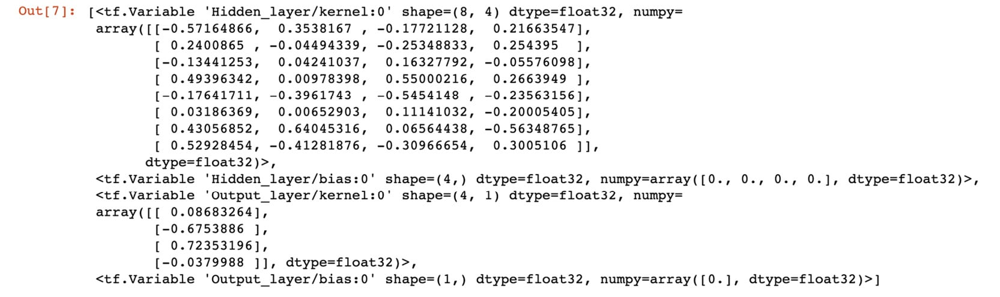


    This output shows all the variables that compose the model; they
    include the values for all weights and biases in each layer.

6.  Create a tensor of size `32x8`, which represents a tensor
    with 32 records and 8 features:
    
    ```
    data = tf.random.normal((32,8))
    ```


7.  Call the `predict` method of the model and pass in the
    sample data:

    
    ```
    model.predict(data)
    prediction
    ```


    You should get the following result:

    
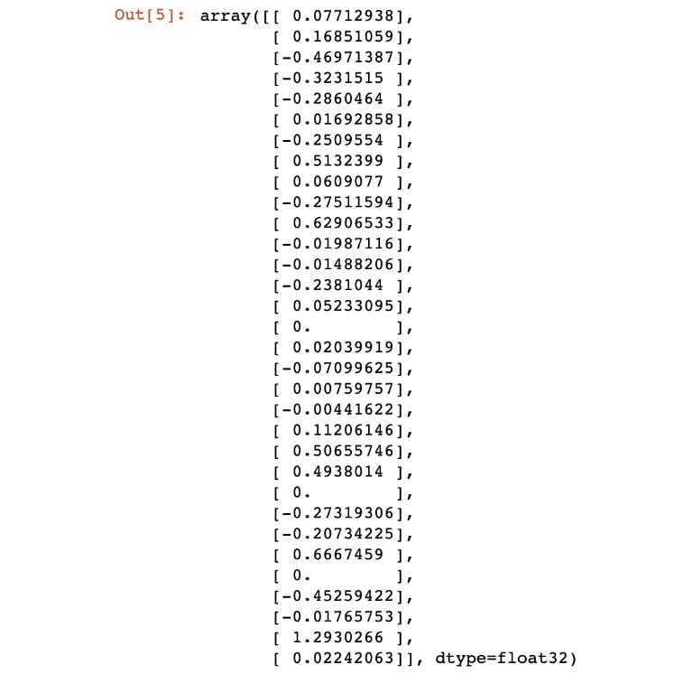


Calling the `predict()` method on the sample data will
propagate the data through the network. In each layer, there will be a
matrix multiplication of the data with the weights, and the bias will be
added before the data is passed as input data to the next layer. This
process continues until the final output layer.

In this exercise, you created a sequential model with multiple layers.
You initialized a model, added an input layer to accept data with eight
features, added a hidden layer with four units, and added an output
layer with one unit. Before fitting a model to training data, you must
first compile the model with an optimizer and choose a loss function to
minimize the value it computes by updating weights in the
training process.


In the following exercise, you will undertake the process of creating an
ANN, compiling the model, fitting the model to training data, and
finally, evaluating the model on the training data. You will recreate
the linear regression algorithm with an ANN, which can be interpreted as
an ANN with only one layer and one unit. Furthermore, you will view the
architecture of the model and model training process in TensorBoard.

Exercise 4.02: Creating a Linear Regression Model as an ANN with TensorFlow
---------------------------------------------------------------------------

In this exercise, you will create a linear regression model as an ANN
using TensorFlow. The dataset, `Bias_correction_ucl.csv`,
describes the bias correction of air temperature forecasts of Seoul,
South Korea. The fields represent temperature measurements of the given
date, the weather station at which the metrics were measured, model
forecasts of weather-related metrics such as humidity, and projections
for the temperature the following day. You are required to predict the
next maximum and minimum temperature given measurements of the prior
timepoints and attributes of the weather station.

Note

The `Bias_correction_ucl.csv` file can be found here:
[https://github.com/fenago/deep-learning-essentials/blob/main/Lab04/Datasets/Bias_correction_ucl.csv].

Perform the following steps to complete this exercise:

1.  Open a new Jupyter notebook to implement this exercise. 

2.  In a new Jupyter Notebook cell, import the TensorFlow and pandas
    libraries:
    
    ```
    import tensorflow as tf
    import pandas as pd
    ```


3.  Load in the dataset using the pandas `read_csv` function:

    
    ```
    df = pd.read_csv('Bias_correction_ucl.csv')
    ```


    Note

    Make sure you change the path (highlighted) to the CSV file based on
    its location on your system. If you\'re running the Jupyter notebook
    from the same directory where the CSV file is stored, you can run
    the preceding code without any modification.

4.  Drop the `date` column and drop any rows that have null
    values since your model requires numerical values only:
    
    ```
    df.drop('Date', inplace=True, axis=1)
    df.dropna(inplace=True)
    ```


5.  Create target and feature datasets. The target dataset will contain
    the columns named `Next_Tmax` and `Next_Tmin`,
    while the feature dataset will contain all columns except those
    named `Next_Tmax` and `Next_Tmin`:
    
    ```
    target = df[['Next_Tmax', 'Next_Tmin']]
    features = df.drop(['Next_Tmax', 'Next_Tmin'], axis=1)
    ```


6.  Rescale the feature dataset:
    
    ```
    from sklearn.preprocessing import MinMaxScaler
    scaler = MinMaxScaler()
    feature_array = scaler.fit_transform(features)
    features = pd.DataFrame(feature_array, columns=features.columns)
    ```


7.  Initialize a Keras model of the `Sequential` class:
    
    ```
    model = tf.keras.Sequential()
    ```


8.  Add an input layer to the model using the model\'s `add`
    method, and set `input_shape` to be the number of columns
    in the feature dataset:
    
    ```
    model.add(tf.keras.layers.InputLayer\
             (input_shape=(features.shape[1],), \
                           name='Input_layer'))
    ```


9.  Add the output layer of the `Dense` class to the model
    with a size of `2`, representing the two target variables:
    
    ```
    model.add(tf.keras.layers.Dense(2, name='Output_layer'))
    ```


10. Compile the model with an RMSprop optimizer and a mean squared error
    loss:
    
    ```
    model.compile(tf.optimizers.RMSprop(0.001), loss='mse')
    ```


11. Add a callback for TensorBoard:
    
    ```
    tensorboard_callback = tf.keras.callbacks\
                             .TensorBoard(log_dir="./logs")
    ```


12. Fit the model to the training data:

    
    ```
    model.fit(x=features.to_numpy(), y=target.to_numpy(),\
              epochs=50, callbacks=[tensorboard_callback])
    ```


    You should get the following output:

    
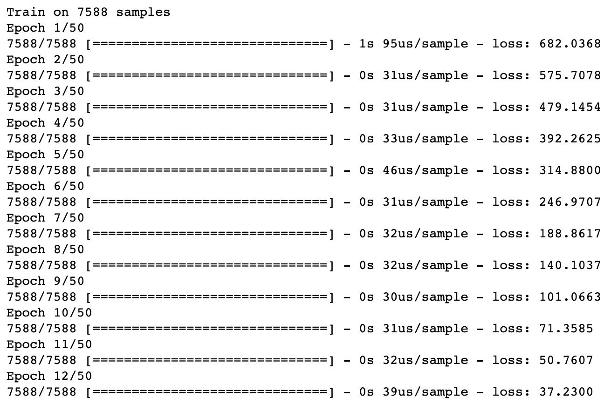


13. Evaluate the model on the training data:

    
    ```
    loss = model.evaluate(features.to_numpy(), target.to_numpy())
    print('loss:', loss)
    ```


    This results in the following output:

    
    ```
    loss: 3.5468221449764012
    ```


14. View the model architecture and model-fitting process on TensorBoard
    by calling the following on the command line:

    
    ```
    mkdir -p logs && chmod -R 777 logs

    tensorboard --bind_all --logdir=logs/
    ```


    You can see its execution in a web browser by visiting the URL that
    is provided after launching TensorBoard. The default URL provided is
    `http://HOSTNAME:6006/`:

    
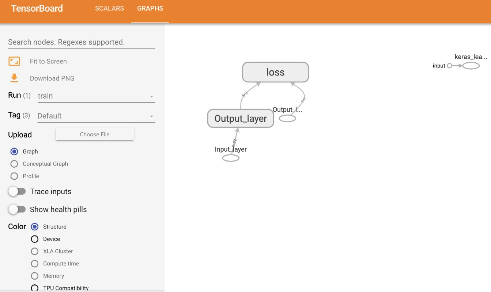


The loss function can be visualized as shown in the following figure:

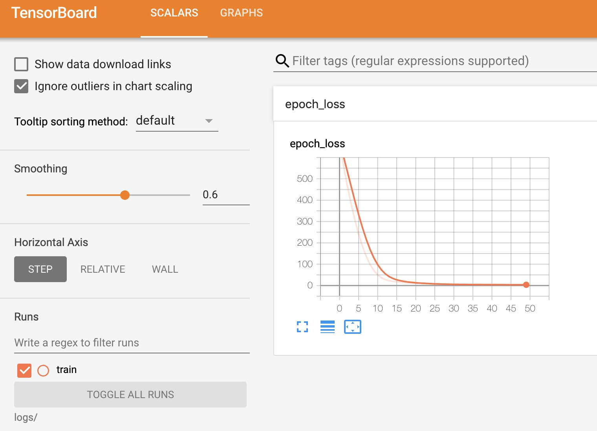


You can see the architecture of the model in the `GRAPHS` tab.
The architecture shows the input layer and output layer in the model, as
well as the calculated loss. During the model-fitting process, the loss
is calculated after each epoch and is displayed in TensorBoard in the
`SCALARS` tab. The loss is that which is defined in the
compilation process; so, in this case, the loss is the mean squared
error. From TensorBoard, you can see that the mean squared error reduces
after each epoch, indicating that the model is learning from the
training data, updating the weights in order to reduce the total loss.

In this exercise, you have learned how to create, train, and evaluate an
ANN with TensorFlow by using Keras layers. You recreated the linear
regression algorithm by creating an ANN with an input layer and an
output layer that has one unit for each output. Here, there were two
outputs representing the maximum and minimum values of the temperature;
thus, the output layer has two units.

In *Exercise 4.01*, *Creating an ANN with TensorFlow*, you created an
ANN with only one layer containing weights and the output layer. This is
an example of a **shallow neural network**. ANNs that have many hidden
layers containing weights are called **deep neural networks**, and the
process of training them is called **deep learning**. By increasing the
number of layers and making the ANN deeper, the model becomes more
flexible and will be able to model more complex functions. However, to
gain this increase in flexibility, you need more training data and more
computation power to train the model.

In the next exercise, you will create and train ANNs that have multiple
hidden layers.

Exercise 4.03: Creating a Multi-Layer ANN with TensorFlow
---------------------------------------------------------

In this exercise, you will create a multi-layer ANN using TensorFlow.
This model will have four hidden layers. You will add multiple layers to
the model and activation functions to the output of the layers. The
first hidden layer will have `16` units, the second will have
`8` units, and the third will have `4` units. The
output layer will have `2` units. You will utilize the same
dataset as in *Exercise 4.02*, *Creating a Linear Regression Model as an
ANN with TensorFlow*, which describes the bias correction of air
temperature forecasts for Seoul, South Korea. The exercise aims to
predict the next maximum and minimum temperature given measurements of
the prior timepoints and attributes of the weather station.

Perform the following steps to complete this exercise:

1.  Open a new Jupyter notebook to implement this exercise. 

2.  In a new Jupyter Notebook cell, import the TensorFlow and pandas
    libraries:
    
    ```
    import tensorflow as tf
    import pandas as pd
    ```


3.  Load in the dataset using the pandas `read_csv` function:

    
    ```
    df = pd.read_csv('Bias_correction_ucl.csv')
    ```


    Note

    Make sure you change the path (highlighted) to the CSV file based on
    its location on your system. If you\'re running the Jupyter notebook
    from the same directory where the CSV file is stored, you can run
    the preceding code without any modification.

4.  Drop the `Date` column and drop any rows that have null
    values:
    
    ```
    df.drop('Date', inplace=True, axis=1)
    df.dropna(inplace=True)
    ```


5.  Create target and feature datasets:
    
    ```
    target = df[['Next_Tmax', 'Next_Tmin']]
    features = df.drop(['Next_Tmax', 'Next_Tmin'], axis=1)
    ```


6.  Rescale the feature dataset:
    
    ```
    from sklearn.preprocessing import MinMaxScaler
    scaler = MinMaxScaler()
    feature_array = scaler.fit_transform(features)
    features = pd.DataFrame(feature_array, columns=features.columns)
    ```


7.  Initialize a Keras model of the `Sequential` class:
    
    ```
    model = tf.keras.Sequential()
    ```


8.  Add an input layer to the model using the model\'s `add`
    method, and set `input_shape` to the number of columns in
    the feature dataset:
    
    ```
    model.add(tf.keras.layers.InputLayer\
                             (input_shape=(features.shape[1],), \
                              name='Input_layer'))
    ```


9.  Add three hidden layers and an output layer of the `Dense`
    class to the model. The first hidden layer will have `16`
    units, the second will have `8` units, and the third will
    have `4` units. Label the layers appropriately. The output
    layer will have two units to match the target variable that has two
    columns:
    
    ```
    model.add(tf.keras.layers.Dense(16, name='Dense_layer_1'))
    model.add(tf.keras.layers.Dense(8, name='Dense_layer_2'))
    model.add(tf.keras.layers.Dense(4, name='Dense_layer_3'))
    model.add(tf.keras.layers.Dense(2, name='Output_layer'))
    ```


10. Compile the model with an RMSprop optimizer and mean squared error
    loss:
    
    ```
    model.compile(tf.optimizers.RMSprop(0.001), loss='mse')
    ```


11. Add a callback for TensorBoard:
    
    ```
    tensorboard_callback = tf.keras.callbacks\
                             .TensorBoard(log_dir="./logs")
    ```


12. Fit the model to the training data for `50` epochs and add
    a validation split equal to 20%:

    
    ```
    model.fit(x=features.to_numpy(), y=target.to_numpy(),\
              epochs=50, callbacks=[tensorboard_callback] , \
              validation_split=0.2)
    ```


    You should get the following output:

    
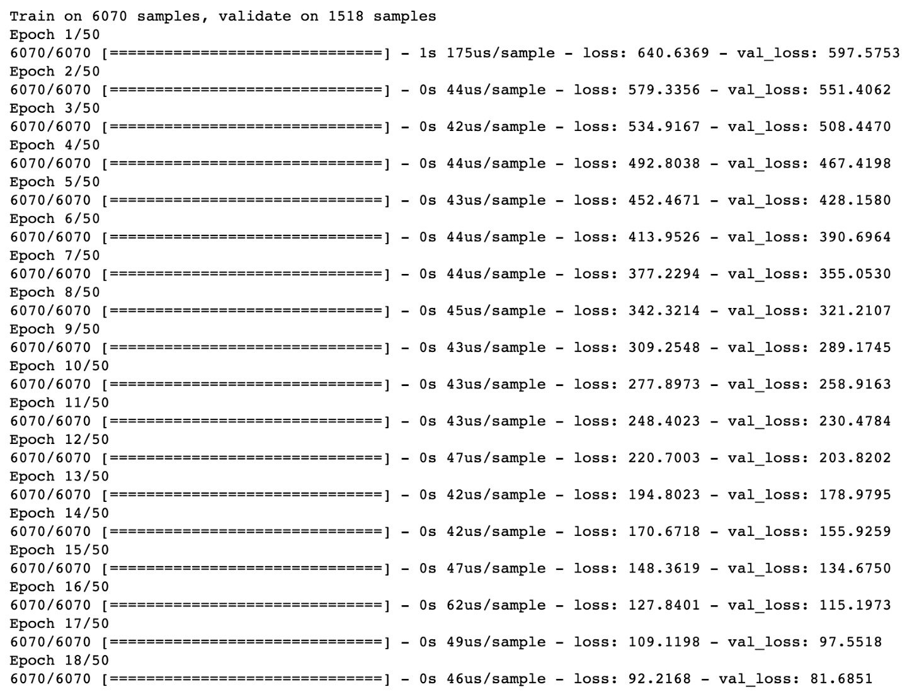


13. Evaluate the model on the training data:

    
    ```
    loss = model.evaluate(features.to_numpy(), target.to_numpy())
    print('loss:', loss)
    ```


    This will display the following result:

    
    ```
    loss: 1.664448248190068
    ```


14. View the model architecture and model-fitting process in
    TensorBoard:

    
    ```
    mkdir -p ./logs && chmod -R 777 ./logs

    tensorboard --bind_all --logdir=logs/
    ```


    You should get something like the following:

    


You can visualize the loss function as shown in the following
screenshot:

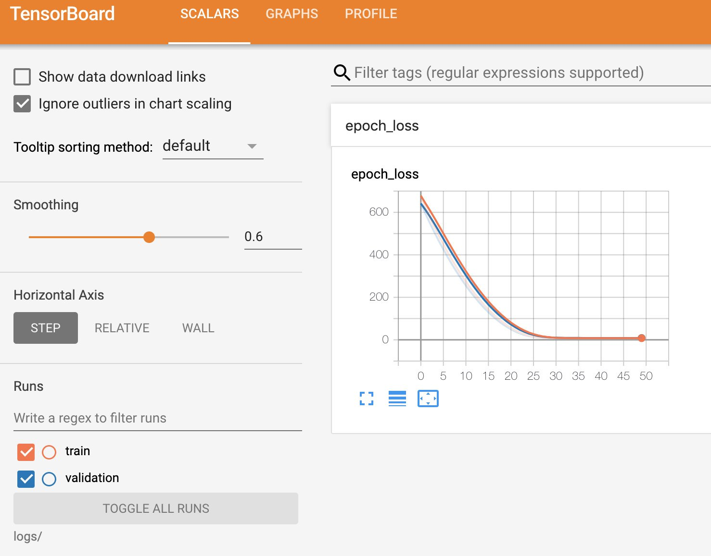


The network architecture shows the input layer and the four hidden
layers of the model as well as the calculated loss at the end. During
the model-fitting process, the loss is calculated after each epoch and
is displayed in TensorBoard in the `SCALARS` tab. Here, the
loss is the mean squared error. From TensorBoard, you can see that the
mean squared error reduces on the training set (the orange line) and the
validation set (the blue line), after each epoch, indicating that the
model is learning effectively from the training data.

In this exercise, you have created an ANN with multiple hidden layers.
The loss you obtained was lower than that achieved using linear
regression, which demonstrates the power of ANNs. With some tuning to
the hyperparameters (such as varying the number of layers, the number of
units within each layer, adding activation functions, and changing the
loss and optimizer), the loss could be even lower. In the next activity,
you will put your model-building skills into action on a new dataset.

Activity 4.01: Creating a Multi-Layer ANN with TensorFlow
---------------------------------------------------------

The feature dataset, `superconductivity.csv`, contains the
properties of superconductors including the atomic mass of the material
and its density. Importantly, the dataset also contains the critical
temperature of the material, which is the temperature at which the
material exhibits superconductive properties. In this activity, you are
tasked with finding the critical temperature of the material or the
temperature at which the material gains superconductive properties.

Note

The `superconductivity.csv` file can be found here:
[https://github.com/fenago/deep-learning-essentials/blob/main/Lab04/Datasets/superconductivity.csv].

Perform the following steps to complete this activity:

1.  Open a new Jupyter notebook to implement this activity.

2.  Import the TensorFlow and pandas libraries.

3.  Load in the `superconductivity.csv` dataset.

4.  Drop any rows that have null values.

5.  Set the target as the `critical_temp` column and the
    feature dataset as the remaining columns.

6.  Rescale the feature dataset using a standard scaler.

7.  Initialize a model of the Keras `Sequential` class.

8.  Add an input layer, four hidden layers of sizes `64`,
    `32`, `16`, and `8`, and an output
    layer of size `1` to the model. Add a ReLU activation
    function to the first hidden layer.

9.  Compile the model with an RMSprop optimizer with a learning rate
    equal to `0.001` and the mean squared error for the loss.

10. Add a callback to write logs to TensorBoard.

11. Fit the model to the training data for `100` epochs, with
    a batch size equal to `32` and a validation split equal to
    20%.

12. Evaluate the model on the training data.

13. View the model architecture in TensorBoard.

    You should get an output like the following:

    
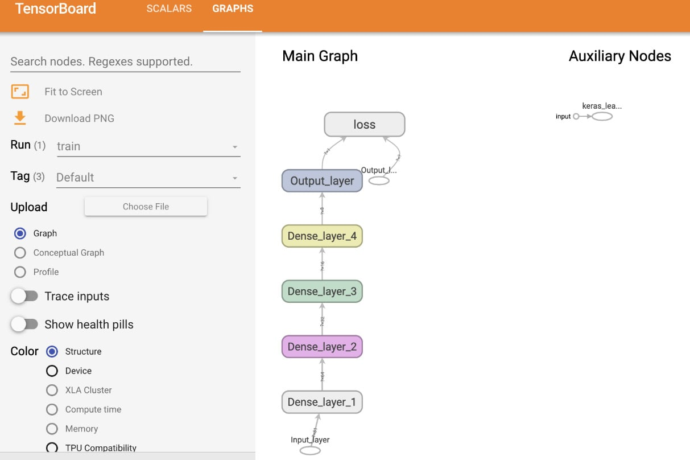


14. Visualize the model-fitting process in TensorBoard. You should get
    the following output:
    
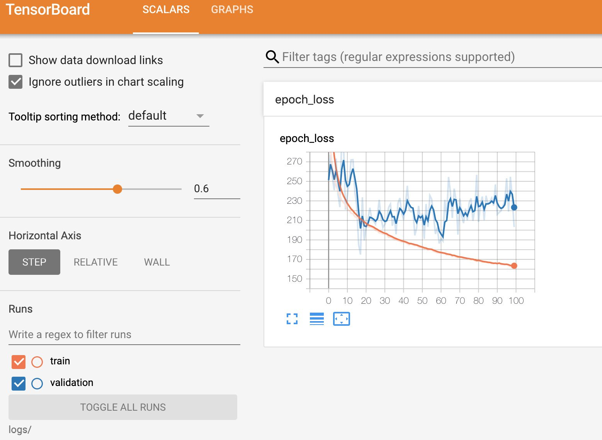


In the next section, you will explore classification models, which
attempt to classify data into distinct classes. You will begin with
binary classification models that classify data into just two classes.
This is the simplest form of a classification model. Once binary
classifiers are mastered, more complicated models can be tackled, such
as multi-label and multi-class classification.


Classification Models
=====================

In the next exercise, you will create a logistic regression model with
TensorFlow. You will achieve this by creating a single-layer ANN, the
process of which is similar to that of the linear regression model in
*Exercise 4.02*, *Creating a Linear Regression Model as an ANN with
TensorFlow*. The difference is that you will add a sigmoid activation
function to the output of the ANN. Another difference that separates the
two exercises is the loss function that you will use to calculate the
loss.

Exercise 4.04: Creating a Logistic Regression Model as an ANN with TensorFlow
-----------------------------------------------------------------------------

In this exercise, you will create a logistic regression model as an ANN
using TensorFlow. The dataset, `qsar_androgen_receptor.csv`,
is used to develop classification models for the discrimination of
binder/non-binder molecules given various attributes of the molecules.
Here, the molecule attributes represent the features of your dataset,
and their binding properties represent the target variable, in which a
positive value represents a binding molecule, and a negative value
represents a non-binding molecule. You will create a logistic regression
model to predict the binding properties of the molecule given attributes
of the molecule provided in the dataset.

Note

The `qsar_androgen_receptor.csv` file can be found here:
[https://github.com/fenago/deep-learning-essentials/blob/main/Lab04/Datasets/qsar_androgen_receptor.csv].

Perform the following steps to complete this exercise:

1.  Open a new Jupyter notebook to implement this exercise.

2.  Import the TensorFlow and pandas libraries:
    
    ```
    import tensorflow as tf
    import pandas as pd
    ```


3.  Load in the dataset using the pandas `read_csv` function:

    
    ```
    df = pd.read_csv('qsar_androgen_receptor.csv', \
                     sep=';')
    ```


    Note

    Make sure you change the path (highlighted) to the CSV file based on
    its location on your system. If you\'re running the Jupyter notebook
    from the same directory where the CSV file is stored, you can run
    the preceding code without any modification.

4.  Drop any rows that have null values:
    
    ```
    df.dropna(inplace=True)
    ```


5.  Create target and feature datasets:
    
    ```
    target = df['positive'].apply(lambda x: 1 if x=='positive' else 0)
    features = df.drop('positive', axis=1)
    ```


6.  Initialize a Keras model of the `Sequential` class:
    
    ```
    model = tf.keras.Sequential()
    ```


7.  Add an input layer to the model using the model\'s `add`
    method and set `input_shape` to be the number of columns
    in the feature dataset:
    
    ```
    model.add(tf.keras.layers.InputLayer\
             (input_shape=(features.shape[1],), \
                           name='Input_layer'))
    ```


8.  Add the output layer of the `Dense` class to the model
    with a size of `1`, representing the target variable:
    
    ```
    model.add(tf.keras.layers.Dense(1, name='Output_layer', \
                                    activation='sigmoid'))
    ```


9.  Compile the model with an RMSprop optimizer and binary cross-entropy
    for the loss, and compute the accuracy:
    
    ```
    model.compile(tf.optimizers.RMSprop(0.0001), \
                  loss='binary_crossentropy', metrics=['accuracy'])
    ```


10. Create a TensorBoard callback:
    
    ```
    tensorboard_callback = tf.keras.callbacks.TensorBoard\
                           (log_dir="./logs")
    ```


11. Fit the model to the training data for `50` epochs, adding
    the TensorBoard callback with a validation split of 20%:

    
    ```
    model.fit(x=features.to_numpy(), y=target.to_numpy(), \
             epochs=50, callbacks=[tensorboard_callback] , \
             validation_split=0.2)
    ```


    Your output should be similar to the following figure:

    


12. Evaluate the model on the training data:

    
    ```
    loss, accuracy = model.evaluate(features.to_numpy(), \
                                    target.to_numpy())
    print(f'loss: {loss}, accuracy: {accuracy}')
    ```


    You should get output something like the following:

    
    ```
    loss: 0.2781583094794838, accuracy: 0.9110320210456848
    ```


13. Visualize the model-fitting process in TensorBoard by calling the
    following command on the command line:

    
    ```
    mkdir -p ./logs && chmod -R 777 ./logs

    tensorboard --bind_all --logdir=logs/
    ```


    You should get a screen similar to the following in the browser:

    
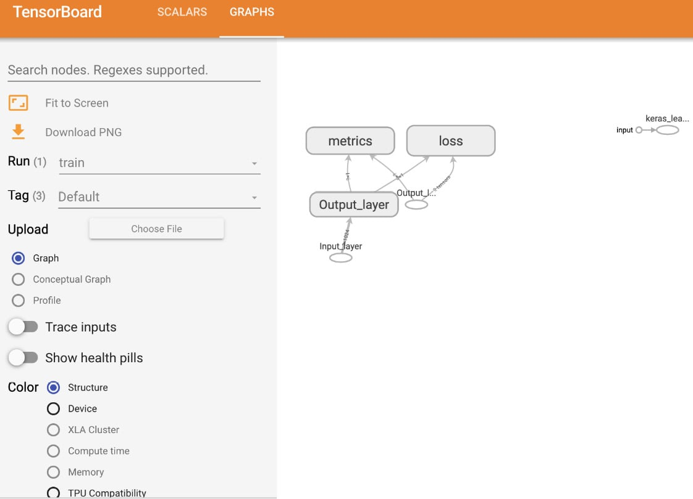


The loss function can be represented as follows:

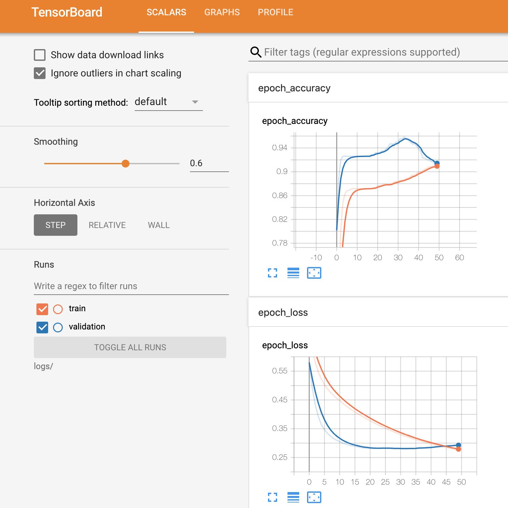


You can see from TensorBoard that, with the addition of the
`metrics` argument that was added in the model compilation
process, there is an additional node in the architecture for the
calculation of the accuracy metric. There is also an additional chart in
the `SCALARS` tab showing the accuracy metric as a function of
the epoch for the training and validation split.

You can see from the charts that, for the training set, the accuracy
increases, and the loss decreases over time, which is a positive
indication that the model is learning. However, on the validation split,
the accuracy begins to decrease, and the loss begins to increase, which
is a sign that the model may be overfitting to the training data.


The next activity will summarize your learning in this lab by
combining your knowledge of creating multi-layer ANNs as you
accomplished in *Exercise 4.03*, *Creating a Multi-Layer ANN with
TensorFlow*, and *Activity 4.01*, *Creating a Multi-Layer ANN with
TensorFlow*, with your knowledge of creating classification models from
*Exercise 4.04*, *Creating a Logistic Regression Model as an ANN with
TensorFlow*. You will use the same dataset as in the preceding activity
but change the target variable to make it more suitable for a
classification task.

Activity 4.02: Creating a Multi-Layer Classification ANN with TensorFlow
------------------------------------------------------------------------

The feature dataset, `superconductivity.csv`, contains the
properties of superconductors including the atomic mass of the material
and its density. Importantly, the dataset also contains the critical
temperature of the material, which is the temperature at which the
material exhibits superconductive properties. You are required to
determine which superconductors will express superconductive properties
above the boiling point of nitrogen (77.36 K), thereby allowing
superconductivity using liquid nitrogen, which is readily available.
Your target variable will have a `true` value when the
critical temperature is above 77.36 K and `false` below,
indicating whether the material expresses superconductive properties
above the boiling point of nitrogen.

Note

The `superconductivity.csv` file can be found here:
[https://github.com/fenago/deep-learning-essentials/blob/main/Lab04/Datasets/superconductivity.csv].

Perform the following steps to complete this activity:

1.  Open a Jupyter notebook to complete the activity.

2.  Import the TensorFlow and pandas libraries.

3.  Load in the `superconductivity.csv` dataset.

4.  Drop any rows that have null values.

5.  Set the target values to `true` when values of the
    `critical_temp` column are above `77.36` and
    `false` when below. The feature dataset is the remaining
    columns in the dataset.

6.  Rescale the feature dataset using a standard scaler.

7.  Initialize a model of the Keras `Sequential` class.

8.  Add an input layer, three hidden layers of sizes `32`,
    `16`, and `8`, and an output layer with a
    `sigmoid` activation function of size `1` to the
    model.

9.  Compile the model with an RMSprop optimizer with a learning rate
    equal to `0.0001` and binary cross-entropy for the loss
    and compute the accuracy metric.

10. Add a callback to write logs to TensorBoard.

11. Fit the model to the training data for `50` epochs and a
    validation split equal to 0%.

12. Evaluate the model on the training data.

13. View the model architecture and model-fitting process in
    TensorBoard.


In this section, you have begun your foray into building, training, and
evaluating classification models using TensorFlow. You have seen that
they are built in much the same way as ANNs for regression tasks with
the primary difference being the activation function on the output
layer.


Summary
=======

1. Learned to create ANNs for regression and classification using Keras layers integrated with TensorFlow.
2. Built fully connected ANNs, starting with a single-layer model resembling linear regression, then added layers and activation functions to enhance model complexity.
3. Explored regression models to predict continuous variables, such as temperature, and classification models for categorizing data into distinct classes, like binary classification of molecular properties.
4. Highlighted the role of activation functions in controlling model outputs and improving predictions.
