Lab 5: Classification Models
============================


In this lab, you will explore different types of classification
models. You will gain hands-on experience of using TensorFlow to build
binary, multi-class, and multi-label classifiers. Finally, you will
learn the concepts of model evaluation and how you can use different
metrics to assess the performance of a model.

By the end of this lab, you will have a good understanding of what
classification models are and how programming with TensorFlow works.


Exercise 5.01: Building a Logistic Regression Model
---------------------------------------------------

In this exercise, you will build and train a logistic regression model
in TensorFlow that will predict the winning team in a game of Dota 2
using some information about the game, such as the mode and type used.

You will be working on the Dota 2 dataset. Dota 2 is a popular computer
game. The dataset contains information related to the game and the
target variable indicates which team won.

Note

The training dataset can be accessed in the GitHub repo.

The test dataset can be accessed in the GitHub repo.

The original dataset can be found here:
[https://archive.ics.uci.edu/ml/datasets/Dota2+Games+Results].

1.  Open a new Jupyter notebook.

2.  Import the pandas library and use `pd` as the alias:
    
    ```
    import pandas as pd
    ```


3.  Create a variable called `train_url` that contains the URL
    to the training set:
    
    ```
    train_url = 'https://raw.githubusercontent.com/fenago'\
                '/deep-learning-essentials/main/Lab05'\
                '/dataset/dota2Train.csv'
    ```


4.  Load the training dataset into a `DataFrame()` function
    called `X_train` using `read_csv()` method,
    provide the URL to the CSV file, and set `header=None` as
    the dataset doesn\'t provide column names. Print the first five rows
    of the DataFrame using `head()`method:

    
    ```
    X_train = pd.read_csv(train_url, header=None)
    X_train.head()
    ```


    The expected output will be as follows:

    
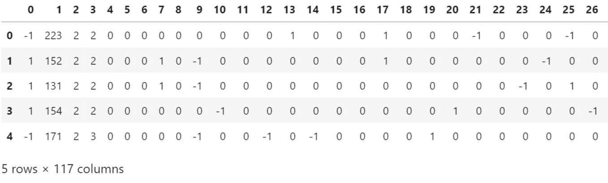


    You can see that the dataset contains 117 columns, and they are all
    numeric. Note also that the target variable (column `0`)
    contains two different values: `-1` and `1`. As
    you will train a logistic regression model, the possible values
    should be `0` and `1`. You will need to replace
    the `-1` values with `0`.

5.  Extract the target variable (column 0) using the `pop()`
    method and save it in a variable called `y_train`:
    
    ```
    y_train = X_train.pop(0)
    ```


6.  Replace all values with `-1` with `0` from the
    target variable using `replace()`, and print the first
    five rows using `head()` method:

    
    ```
    y_train = y_train.replace(-1,0)
    y_train.head()
    ```


    The expected output will be as follows:

    


    Now all the values from the target variable of the training set are
    either `0` or `1`.

7.  Create a variable called `test_url` that contains the URL
    to the test set:
    
    ```
    test_url = 'https://raw.githubusercontent.com/fenago'\
               '/deep-learning-essentials/main/Lab05/dataset'\
               '/dota2Test.csv'
    ```


8.  Load the test dataset into a `DataFrame()` function called
    `X_test` using `read_csv()` method, provide the
    URL to the CSV file, and set `header=None` as the dataset
    doesn\'t provide column names. Print the first five rows using
    `head()` method:

    
    ```
    X_test = pd.read_csv(test_url, header=None)
    X_test.head()
    ```


    The expected output will be as follows:

    
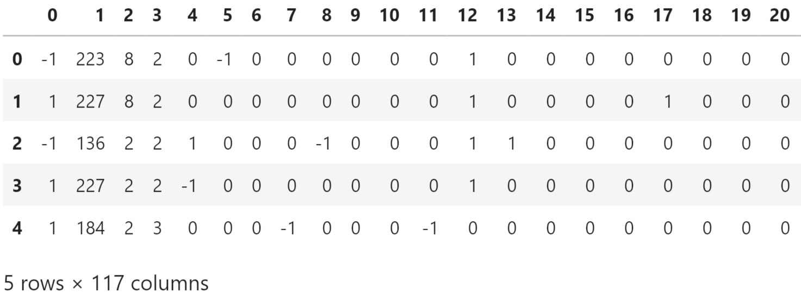


    The test set is very similar to the training one, and you will need
    to perform the same transformation on it.

9.  Extract the target variable (column 0) using the `pop()`
    method and save it in a variable called `y_test`:
    
    ```
    y_test = X_test.pop(0)
    ```


10. Replace all values with `-1` with `0` from the
    target variable using `replace()` method and print the
    first five rows using `head()` method:

    
    ```
    y_test = y_test.replace(-1,0)
    y_test.head()
    ```


    The expected output will be as follows:

    


11. Import TensorFlow library and use `tf` as the alias:
    
    ```
    import tensorflow as tf
    ```


12. Set the seed for TensorFlow as `8`, using
    `tf.random.set_seed()` to get reproducible results:
    
    ```
    tf.random.set_seed(8)
    ```


13. Instantiate a sequential model using
    `tf.keras.Sequential()` and store it in a variable called
    `model`:
    
    ```
    model = tf.keras.Sequential()
    ```


14. Import the `Dense()` class from
    `tensorflow.keras.layers`:
    
    ```
    from tensorflow.keras.layers import Dense
    ```


15. Create a fully connected layer of `512` units with
    `Dense()` and specify ReLu as the activation function and
    the input shape as `(116,)`, which corresponds to the
    number of features from the dataset. Save it in a variable called
    `fc1`:
    
    ```
    fc1 = Dense(512, input_shape=(116,), activation='relu')
    ```


16. Create a fully connected layer of `512` units with
    `Dense()` and specify ReLu as the activation function.
    Save it in a variable called `fc2`:
    
    ```
    fc2 = Dense(512, activation='relu')
    ```


17. Create a fully connected layer of `128` units with
    `Dense()` and specify ReLu as the activation function.
    Save it in a variable called `fc3`:
    
    ```
    fc3 = Dense(128, activation='relu')
    ```


18. Create a fully connected layer of `128` units with
    `Dense()` and specify ReLu as the activation function.
    Save it in a variable called `fc4`:
    
    ```
    fc4 = Dense(128, activation='relu')
    ```


19. Create a fully connected layer of `128` units with
    `Dense()` and specify sigmoid as the activation function.
    Save it in a variable called `fc5`:
    
    ```
    fc5 = Dense(1, activation='sigmoid')
    ```


20. Sequentially add all five fully connected layers to the model using
    `add()` method:
    
    ```
    model.add(fc1)
    model.add(fc2)
    model.add(fc3)
    model.add(fc4)
    model.add(fc5)
    ```


21. Print the summary of the model using `summary()` method:

    
    ```
    model.summary()
    ```


    The expected output will be as follows:

    
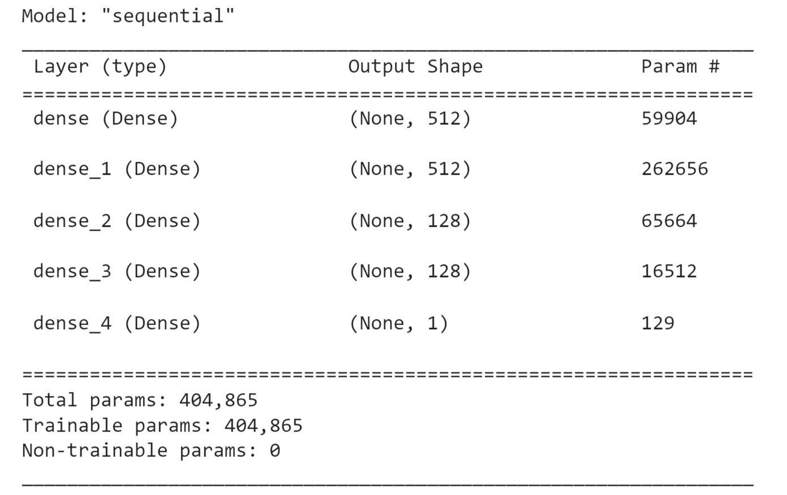


    The preceding output shows that there are five layers in your model
    (as expected) and displays the number of parameters at each layer.
    For example, the first layer contains 59,904 parameters, and the
    total number of parameters for this model is 404,855. All these
    parameters will be trained while fitting the model.

22. Instantiate a `BinaryCrossentropy()` function from
    `tf.keras.losses` and save it in a variable called
    `loss`:
    
    ```
    loss = tf.keras.losses.BinaryCrossentropy()
    ```


23. Instantiate `Adam()` from `tf.keras.optimizers`
    with `0.001` as the learning rate and save it in a
    variable called `optimizer`:
    
    ```
    optimizer = tf.keras.optimizers.Adam(0.001)
    ```


24. Compile the model using the `compile()` function and
    specify the optimizer and loss you just created in previous steps:
    
    ```
    model.compile(optimizer=optimizer, loss=loss)
    ```


25. Start the model training process using `fit()` method on
    the training set for five epochs:

    
    ```
    model.fit(X_train, y_train, epochs=5)
    ```


    The expected output will be as follows:

    
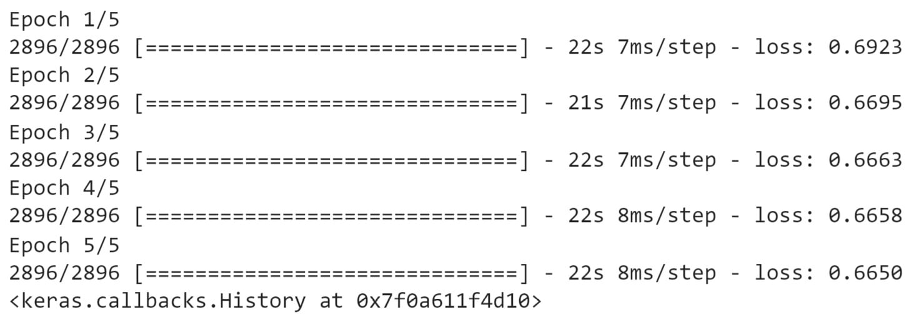


    The preceding output shows the logs of each epoch during the
    training of the model. Note that it took around 15 seconds to
    process a single epoch and the loss value decreased from
    `0.6923` (first epoch) to `0.6650` (fifth
    epoch), so the model is slowly improving its performance by reducing
    the binary cross-entropy loss.

26. Predict the results of the test set using `predict()`
    method. Save it in a variable called `preds` and display
    its first five values:

    
    ```
    preds = model.predict(X_test)
    preds[:5]
    ```


    The expected output will be as follows:

    


    The preceding output shows the probability of each prediction. Each
    value below `0.5` will be classified as `0`
    (first and last observation in this output) and all values greater
    than or equal to `0.5` will be `1` (second to
    fourth observations).

27. Display the first five true labels of the test set:

    
    ```
    y_test[:5]
    ```


    The expected output will be as follows:

    


Comparing this output with the model predictions on the first five rows
of the test set, there are some incorrect values: the third prediction
(index `2`) should be a value of `0` and the last
one should be `0`. So, out of these five observations, your
binary classifiers made two mistakes.

In the section ahead, you will see how to properly evaluate the
performance of a model with different metrics.


Metrics for Classifiers
=======================


In the previous section, you learned how to train a binary classifier to
predict the right output: either `0` or `1`. In
*Exercise 5.01*, *Building a Logistic Regression Model*, you looked at a
few samples to assess the performance of the models that were built.
Usually, you would evaluate a model not just on a small subset but on
the whole dataset using a performance metric such as accuracy or F1
score.

TensorFlow provides a class, `tf.keras.metrics.Accuracy`, that
can calculate the accuracy score from tensors. This class has a method
called `update_state()` that takes two tensors as input
parameters and will compute the accuracy score between them. You can
access this score by calling the `result()` method. The output
result will be a tensor. You can use the `numpy()` method to
convert it into a NumPy array. Here is an example of how to calculate
the accuracy score:


```
from tensorflow.keras.metrics import Accuracy
preds = [1, 1, 1, 1, 0, 0]
target = [1, 0, 1, 0, 1, 0]
acc = Accuracy()
acc.update_state(preds, target)
acc.result().numpy()
```


This will result in the following accuracy score:


```
0.5
```


Note

TensorFlow doesn\'t provide a class for the null accuracy metric, but
you can easily compute it using `Accuracy()` and provide a
tensor with only `1` (or `0`) as the predictions.

Precision, Recall, and the F1 Score
-----------------------------------

In the previous section, you learned how to use the accuracy metric to
assess the performance of a model and compare it against a baseline
called the null accuracy. The accuracy score is widely used as it is
well known to non-technical audiences, but it does have some
limitations. Consider the following example.

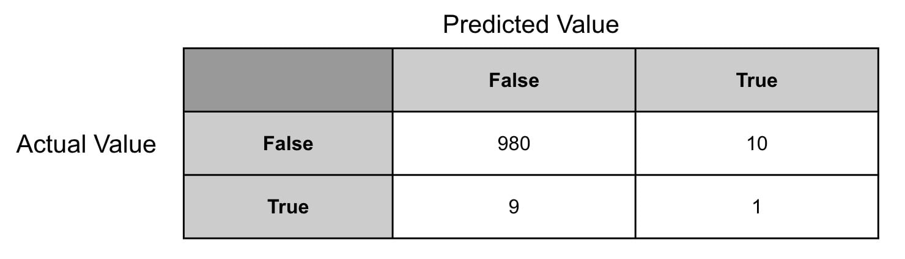


You can easily calculate precision and recall with TensorFlow by using
the respective classes of `Precision()` and
`Recall()`:


```
from tensorflow.keras.metrics import Precision, Recall
preds = [1, 1, 1, 1, 0, 0]
target = [1, 0, 1, 0, 1, 0]
prec = Precision()
prec.update_state(preds, target)
print(f"Precision: {prec.result().numpy()}")
rec = Recall()
rec.update_state(preds, target)
print(f"Recall: {rec.result().numpy()}")
```


This results in the following output:


Note

TensorFlow doesn\'t provide a class to calculate the F1 score, but this
can easily be done by creating a custom metric. This will be covered in
*Exercise 5.02*, *Classification Evaluation Metrics*.

Confusion Matrices
------------------

A confusion matrix is not a performance metric *per se*, but more a
graphical tool used to visualize the predictions of a model against the
actual values. You have actually already seen an example of this in the
previous section with *Figure 5.18*.

A confusion matrix will show all the possible values of the predictions
on one axis (for example, the horizontal axis) and the actual values on
the other axis (the vertical axis). At the intersection of each
combination of predicted and actual values, you will record the number
of observations that fall under this case.

For a binary classification, the confusion matrix will look like the
following:


The ideal situation will be that all the values sit on the diagonal of
this matrix. This will mean your model is correctly predicting all
possible values. All values outside of this diagonal are where your
model made some mistakes.

Note

Confusion matrices can also be used for multi-class classification and
are not specific to binary classification only.

Run the code below to see the confusion matrix:


```
from tensorflow.math import confusion_matrix
preds = [1, 1, 1, 1, 0, 0]
target = [1, 0, 1, 0, 1, 0]
print(confusion_matrix(target, preds))
```


This will display the following output:


The preceding output shows the confusion matrix. From it, you can see
that the model has predicted the following results: two TPs, one TN, two
FPs, and one FN.

In the next exercise, you will apply these performance metrics to the
same logistic regression model that you created in *Exercise 5.01*,
*Building a Logistic Regression Model*.

Exercise 5.02: Classification Evaluation Metrics
------------------------------------------------

In this exercise, you will reuse the same logistic regression model as
in *Exercise 5.01*, *Building a Logistic Regression Model*, and assess
its performance by looking at different performance metrics: accuracy,
precision, recall, and F1 score.

The original dataset was shared by Stephen Tridgell from the University
of Sydney.

Note

The training dataset can be accessed in the GitHub repo.

The test dataset can be accessed in the GitHub repo.

The model from *Exercise 5.01*, *Building a Logistic Regression Model*,
can be found here: [https://raw.githubusercontent.com/fenago/deep-learning-essentials/main/Lab05/model/exercise5_01_model.h5].

Now, run the following instructions:

1.  Open a new Jupyter notebook.

2.  Import the pandas library and use `pd` as the alias:
    
    ```
    import pandas as pd
    ```


3.  Create a variable called `train_url` that contains the URL
    to the training set:
    
    ```
    train_url = 'https://raw.githubusercontent.com/fenago'\
                '/deep-learning-essentials/main/Lab05/dataset'\
                '/dota2PreparedTrain.csv'
    ```


4.  Load the training dataset into a `DataFrame()` function
    called `X_train` using `read_csv()` method,
    provide the URL to the CSV file, and set `header=None` as
    the dataset doesn\'t provide column names:
    
    ```
    X_train = pd.read_csv(train_url, header=None)
    ```


5.  Extract the target variable (column `0`) using the
    `pop()` method and save it in a variable called
    `y_train`:
    
    ```
    y_train = X_train.pop(0)
    ```


6.  Create a variable called `test_url` that contains the URL
    to the test set:
    
    ```
    test_url = 'https://raw.githubusercontent.com/fenago'\
               '/deep-learning-essentials/main/Lab05/dataset'\
               '/dota2PreparedTest.csv'
    ```


7.  Load the test dataset into a `DataFrame()` function called
    `X_test` using `read_csv()` method, provide the
    URL to the CSV file, and set `header=None` as the dataset
    doesn\'t provide column names:
    
    ```
    X_test = pd.read_csv(test_url, header=None)
    ```


8.  Extract the target variable (column `0`) using the
    `pop()` method and save it in a variable called
    `y_test`:
    
    ```
    y_test = X_test.pop(0)
    ```


9.  Import the `tensorflow` library using `tf` as
    the alias and import the `get_file()` method from
    `tensorflow.keras.utils`:
    
    ```
    import tensorflow as tf
    from tensorflow.keras.utils import get_file
    ```


10. Create a variable called `model_url` that contains the URL
    to the model:
    
    ```
    model_url = 'https://github.com/fenago'\
                '/deep-learning-essentials/blob/main/Lab05'\
                'model/exercise5_01_model.h5?raw=true'
    ```


11. Download the model locally using the `get_file()` method
    by providing the name (`exercise5_01_model.h5`) of the
    file and its URL. Save the output to a variable called
    `model_path`:
    
    ```
    model_path = get_file('exercise5_01_model.h5', model_url)
    ```


12. Load the model with `tf.keras.models.load_model()` and
    specify the local path to the model:
    
    ```
    model = tf.keras.models.load_model(model_path)
    ```


13. Print the model summary using the `summary()` method:

    
    ```
    model.summary()
    ```


    The expected output will be as follows:

    
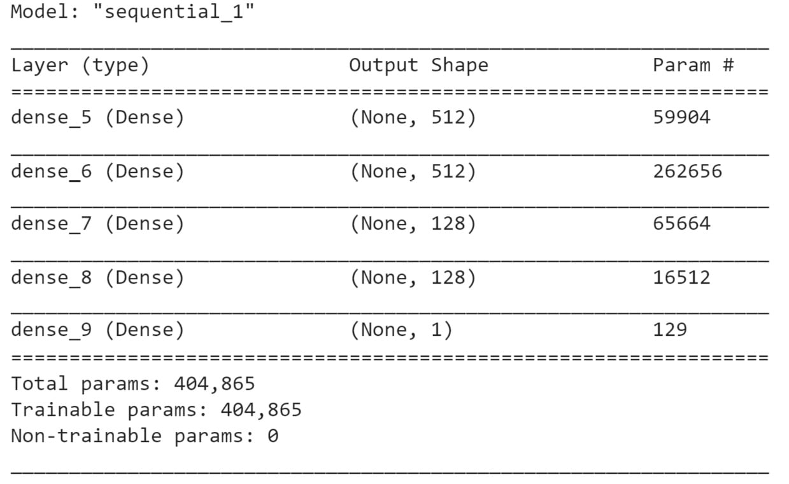


    The preceding output shows the same architecture as the model from
    *Exercise 5.01*, *Building a Logistic Regression Model*.

14. Predict the results of the test set using `predict()`
    method. Save it in a variable called `preds_proba` and
    display its first five values:

    
    ```
    preds_proba = model.predict(X_test)
    preds_proba[:5]
    ```


    The expected output will be as follows:

    


    The outputs are the predicted probabilities of being `1`
    (or true) for each observation. You need to convert these
    probabilities into `0` and `1` only. To do so,
    you will need to consider all cases with a probability greater than
    or equal to `0.5` to be `1` (or true), and
    `0` (or false) for the records with a probability lower
    than `0.5`.

15. Convert the predicted probabilities into `1` when the
    probability is greater than or equal to `0.5`, and
    `0` when below `0.5`. Save the results in a
    variable called `preds` and print its first five rows:

    
    ```
    preds = preds_proba >= 0.5
    preds[:5]
    ```


    The expected output will be as follows:

    


    Now the predictions have been converted to binary values: true
    (which equals `1`) and false (which equals `0`).

16. Import `Accuracy`, `Precision`, and
    `Recall` from `tensorflow.keras.metrics`:
    
    ```
    from tensorflow.keras.metrics import Accuracy, Precision, Recall
    ```


17. Instantiate `Accuracy`, `Precision`, and
    `Recall` objects and save them in variables called
    `acc`, `pres`, and `rec`,
    respectively:
    
    ```
    acc = Accuracy()
    prec = Precision()
    rec = Recall()
    ```


18. Calculate the accuracy score on the test set with the
    `update_state()`, `result()`, and
    `numpy()` methods. Save the results in a variable called
    `acc_results` and print its content:

    
    ```
    acc.update_state(preds, y_test)
    acc_results = acc.result().numpy()
    acc_results
    ```


    The expected output will be as follows:

    
    ```
    0.59650314
    ```


    This model achieved an accuracy score of `0.597`.

19. Calculate the precision score on the test set with the
    `update_state()`, `result()`, and
    `numpy()` methods. Save the results in a variable called
    `prec_results` and print its content:

    
    ```
    prec.update_state(preds, y_test)
    prec_results = prec.result().numpy()
    prec_results
    ```


    The expected output will be as follows:

    
    ```
    0.59578335
    ```


    This model achieved a precision score of `0.596`.

20. Calculate the recall score on the test set with the
    `update_state()`, `result()`, and
    `numpy()` methods. Save the results in a variable called
    `rec_results` and print its content:

    
    ```
    rec.update_state(preds, y_test)
    rec_results = rec.result().numpy()
    rec_results
    ```


    The expected output will be as follows:

    
    ```
    0.6294163
    ```


    This model achieved a recall score of `0.629`.

21. Calculate the F1 score by applying the formula shown in the previous
    section. Save the result in a variable called `f1` and
    print its content:

    
    ```
    f1 = 2*(prec_results * rec_results) / (prec_results + rec_results)
    f1
    ```


    The expected output will be as follows:

    
    ```
    0.6121381493171637
    ```


    Overall, the model has achieved quite a low score close to
    `0.6` for all four different metrics: accuracy, precision,
    recall, and F1 score. So, this model is making almost as many
    correct predictions as bad ones. You may try on your own to build
    another model and see whether you can improve its performance.

In the section ahead, you will be looking at expanding classification to
more than two possible values with multi-class classification.


Multi-Class Classification
==========================


With binary classification, you were limited to dealing with target
variables that can only take two possible values: `0` and
`1` (false or true). Multi-class classification can be seen as
an extension of this and allows the target variable to have more than
two values (or you can say binary classification is just a subset of
multi-class classification). For instance, a model that predicts
different levels of disease severity for a patient or another one that
classifies users into different groups based on their past shopping
behaviors will be multi-class classifiers.


Exercise 5.03: Building a Multi-Class Model
-------------------------------------------

In this exercise, you will build and train a multi-class classifier in
TensorFlow that will predict the radiator position of a space shuttle
from eight different values using the nine different numerical features
provided in this dataset.

The target variable (last column) contains seven different levels:
`Rad.Flow`, `Fpv.Close`, `Fpv.Open`,
`High`, `Bypass`, `Bpv.Close`, and
`Bpv.Open`. Your goal is to accurately predict one of these
seven levels using the nine features from the dataset.

Note

The training dataset can be accessed in the GitHub repo.

The test dataset can be accessed in the GitHub repo.

The original dataset can be found here:
[http://archive.ics.uci.edu/ml/datasets/Statlog+%28Shuttle%29].

Perform the following steps to complete the exercise:

1.  Open a new Jupyter notebook.

2.  Import the pandas library and use `pd` as the alias:
    
    ```
    import pandas as pd
    ```


3.  Create a variable called `train_url` that contains the URL
    to the training set:
    
    ```
    train_url = 'https://raw.githubusercontent.com/fenago'\
                '/deep-learning-essentials/main/Lab05'\
                '/dataset/shuttle.trn'
    ```


4.  Load the training dataset into a DataFrame called
    `X_train` using the `read_table()` method,
    provide the URL to the CSV file, use `header=None` as the
    dataset doesn\'t provide column names, and use `sep=' '`
    as each column is separated by spaces in this dataset. Print the
    first five rows using `head()` method:

    
    ```
    X_train = pd.read_table(train_url, header=None, sep=' ')
    X_train.head()
    ```


    The expected output will be as follows:

    
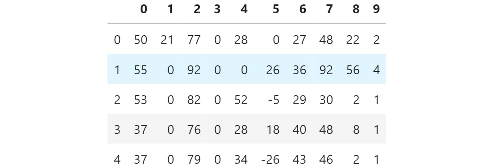


    You can see that the dataset contains 10 columns, and they are all
    numeric. Also, note that the target variable (column `9`)
    contains different class values.

5.  Extract the target variable (column `9`) using the
    `pop()` method and save it in a variable called
    `y_train`:
    
    ```
    y_train = X_train.pop(9)
    ```


6.  Create a variable called `test_url` that contains the URL
    to the test set:
    
    ```
    test_url = 'https://raw.githubusercontent.com/fenago'\
               '/deep-learning-essentials/main/Lab05/dataset'\
               '/shuttle.tst'
    ```


7.  Load the test dataset into a DataFrame called `X_test`
    using `read_table()`, provide the URL to the CSV file, set
    `header=None` as the dataset doesn\'t provide column
    names, and use `sep=' '` as each column is separated by a
    space in this dataset. Print the first five rows using
    `head()` method.

    
    ```
    X_test = pd.read_table(test_url, header=None, sep=' ')
    X_test.head()
    ```


    The expected output will be as follows:

    
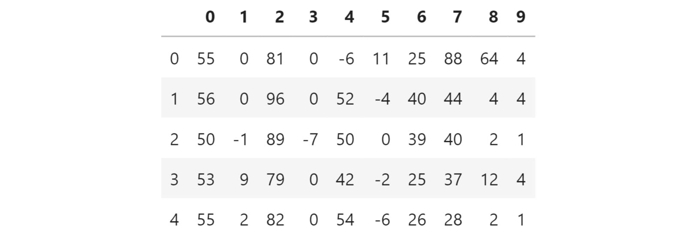


    You can see that the test set is very similar to the training one.

8.  Extract the target variable (column `9`) using the
    `pop()` method and save it in a variable called
    `y_test`:
    
    ```
    y_test = X_test.pop(9)
    ```


9.  Import the TensorFlow library and use `tf` as the alias:
    
    ```
    import tensorflow as tf
    ```


10. Set the seed for TensorFlow as `8` using
    `tf.random.set_seed()` to get reproducible results:
    
    ```
    tf.random.set_seed(8)
    ```


11. Instantiate a sequential model using
    `tf.keras.Sequential()` and store it in a variable called
    `model`:
    
    ```
    model = tf.keras.Sequential()
    ```


12. Import the `Dense()` class from
    `tensorflow.keras.layers`:
    
    ```
    from tensorflow.keras.layers import Dense
    ```


13. Create a fully connected layer of `512` units with
    `Dense()` and specify ReLu as the activation function and
    the input shape as `(9,)`, which corresponds to the number
    of features from the dataset. Save it in a variable called
    `fc1`:
    
    ```
    fc1 = Dense(512, input_shape=(9,), activation='relu')
    ```


14. Create a fully connected layer of `512` units with
    `Dense()` and specify ReLu as the activation function.
    Save it in a variable called `fc2`:
    
    ```
    fc2 = Dense(512, activation='relu')
    ```


15. Create a fully connected layer of `128` units with
    `Dense()` and specify ReLu as the activation function.
    Save it in a variable called `fc3`:
    
    ```
    fc3 = Dense(128, activation='relu')
    ```


16. Again, create a fully connected layer of `128` units with
    `Dense()` and specify ReLu as the activation function.
    Save it in a variable called `fc4`:
    
    ```
    fc4 = Dense(128, activation='relu')
    ```


17. Create a fully connected layer of 128 units with `Dense()`
    and specify softmax as the activation function. Save it in a
    variable called `fc5`:
    
    ```
    fc5 = Dense(8, activation='softmax')
    ```


18. Sequentially add all five fully connected layers to the model using
    `add()` method.
    
    ```
    model.add(fc1)
    model.add(fc2)
    model.add(fc3)
    model.add(fc4)
    model.add(fc5)
    ```


19. Print the summary of the model using `summary()` method:

    
    ```
    model.summary()
    ```


    The expected output will be as follows:

    
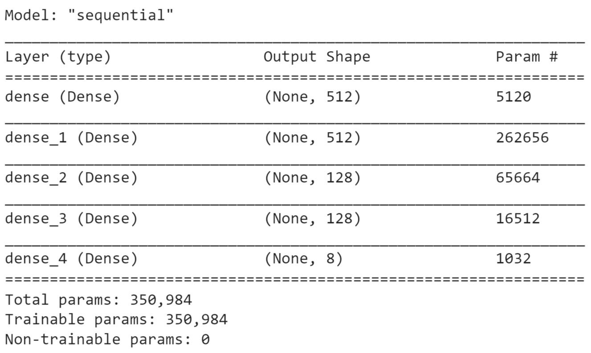


    The preceding output shows that there are five layers in your model
    (as expected) and tells you the number of parameters at each layer.
    For example, the first layer contains `5,120` parameters
    and the total number of parameters for this model is
    `350,984`. All these parameters will be trained while
    fitting the model.

20. Instantiate `SparseCategoricalCrossentropy()` from
    `tf.keras.losses` and save it in a variable called
    `loss`:
    
    ```
    loss = tf.keras.losses.SparseCategoricalCrossentropy()
    ```


21. Instantiate `Adam()` from `tf.keras.optimizers`
    with `0.001` as the learning rate and save it in a
    variable called `optimizer`:
    
    ```
    optimizer = tf.keras.optimizers.Adam(0.001)
    ```


22. Compile the model using the `compile()` method and specify
    the optimizer and loss parameters, with accuracy as the metric to be
    reported:
    
    ```
    model.compile(optimizer=optimizer, loss=loss, \
                  metrics=['accuracy'])
    ```


23. Start the model training process using `fit()` method on
    the training set for five epochs:

    
    ```
    model.fit(X_train, y_train, epochs=5)
    ```


    The expected output will be as follows:

    
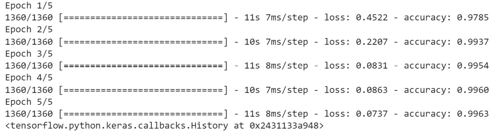


    The preceding output shows the logs of each epoch during the
    training of the model. Note that it took around 7 seconds to process
    a single epoch, and the loss value decreased from `0.5859`
    (first epoch) to `0.0351` (fifth epoch).

24. Evaluate the performance of the model on the test set using the
    `evaluate()` method:

    
    ```
    model.evaluate(X_test, y_test)
    ```


    The expected output will be as follows:

    
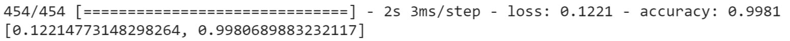


In this exercise, you learned how to build and train a multi-class
classifier to predict an outcome composed of eight different classes.
Your model achieved an accuracy score close to `0.997` on both
the training and test sets, which is quite remarkable. This implies that
your model correctly predicts the right class in the majority of cases.

Now, let\'s consolidate your learning in the following activity.

Activity 5.01: Building a Character Recognition Model with TensorFlow
---------------------------------------------------------------------

In this activity, you are tasked with building and training a
multi-class classifier that will recognize the 26 letters of the
alphabet from images. In this dataset, the images have been converted
into 16 different statistical measures that will constitute our
features. The goal of this model is to determine which of the 26
characters each observation belongs to.

The original dataset was shared by David J. Slate of the Odesta
Corporation, and can be found here:
[http://archive.ics.uci.edu/ml/datasets/Letter+Recognition].

The dataset can be accessed in the GitHub repo.

The following steps will help you to complete the activity:

1.  Load the data with `read_csv()` from pandas.

2.  Extract the target variable with `pop()` method from
    pandas.

3.  Split the data into training (the first 15,000 rows) and test (the
    last 5,000 rows) sets.

4.  Build the multi-class classifier with five fully connected layers of
    `512`, `512`, `128`, `128`,
    and `26` units, respectively.

5.  Train this model on the training set.

6.  Evaluate its performance on the test set with `evaluate()`
    method from TensorFlow.

7.  Print the confusion matrix with `confusion_matrix()` from
    TensorFlow.

    The expected output is as follows:

    
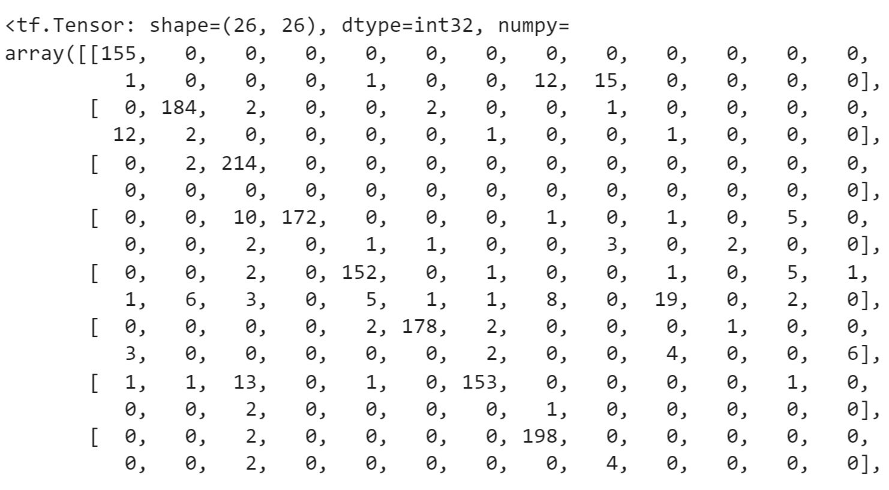


Multi-Label Classification
==========================


Multi-label classification is another type of classification where you
predict not only one target variable as in binary or multi-class
classification, but several response variables at the same time. For
instance, you can predict multiple outputs for the different objects
present in an image (for instance, a model will predict whether there is
a cat, a man, and a car in a given picture) or you can predict multiple
topics for an article (such as whether the article is about the economy,
international news, and manufacturing).

Implementing a multi-label classification with neural networks is
extremely easy, and you have already learned everything required to
build one. In TensorFlow, a multi-label classifier\'s architecture will
look the same as for multi-class, with a final output layer with
multiple units corresponding to the number of target variables you want
to predict. But instead of using softmax as the activation function and
categorical cross-entropy as the loss function, you will use sigmoid and
binary cross-entropy as the activation and loss functions, respectively.

The sigmoid function will predict the probability of occurrence for each
target variable:

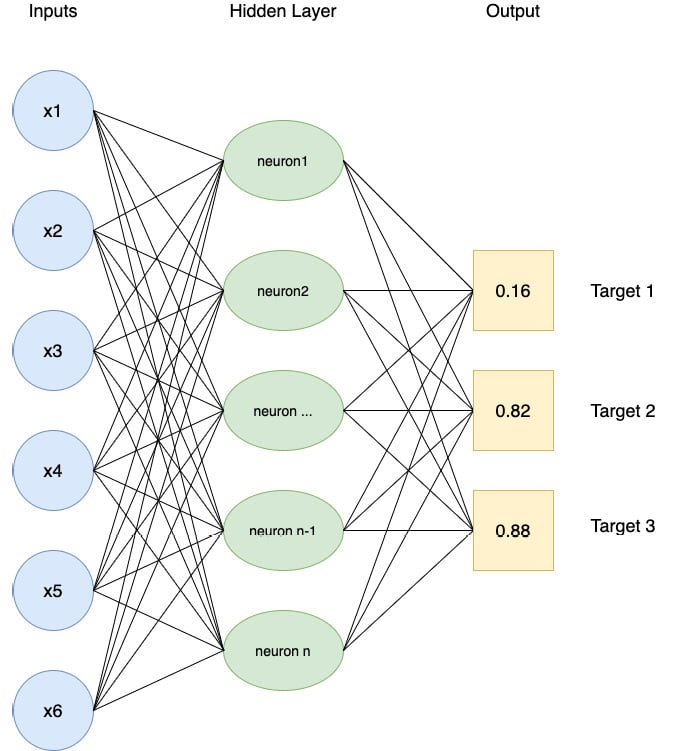


In the preceding example, you have three target variables and each of
them has a probability of occurrence that is independent of the others
(their sum will not equal 1). This model predicts that targets
`2` and `3` are very likely to be the outputs for
this observation.

Conceptually, multi-label classification combines several logistic
regression models. They will share the same parameters (weights and
biases) but with independent binary outputs. The last layer of the
example of a multi-class classifier in TensorFlow will look like this:


```
from tensorflow.keras.layers import Dense
Dense(3, activation='sigmoid')
```


The loss function to be used will be binary cross-entropy:


```
from tensorflow.keras.losses import BinaryCrossentropy
bce = BinaryCrossentropy()
```


Now, put into action what you have learned so far in the following
activity.

Activity 5.02: Building a Movie Genre Tagging a Model with TensorFlow
---------------------------------------------------------------------

In this activity, you are tasked with building and training a
multi-label classifier that will predict the genre of a movie from 28
possible values. Each movie can be assigned to multiple genres at a
time. The features are the top keywords extracted from its synopsis. The
dataset used for this activity is a subset of the original one and
contains only 20,000 rows.

The original dataset was shared by IMDb and can be found here:
[http://www.uco.es/kdis/mllresources/\#ImdbDesc].

The features of the dataset can be accessed in the GitHub repo.

The targets of the dataset can be accessed in the GitHub repo.

The following steps will help you to complete the activity:

1.  Load the features and targets with `read_csv()` from
    pandas.

2.  Split the data into training (the first 15,000 rows) and test (the
    last 5,000 rows) sets.

3.  Build the multi-class classifier with five fully connected layers of
    `512`, `512`, `128`, `128`,
    and `28` units, respectively.

4.  Train this model on the training set.

5.  Evaluate its performance on the test set with `evaluate()`
    method from TensorFlow.

    The expected output is as follows:

    
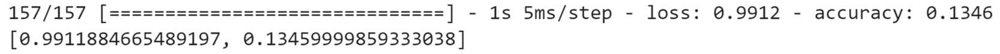


Summary
=======

1. Learned the difference between classification and regression models, focusing on classification models with limited target values.
2. Explored binary classification using logistic regression with TensorFlow, building a binary classifier for predicting Dota 2 outcomes.
3. Studied performance metrics for classifiers, including accuracy, precision, recall, F1 scores, and confusion matrix visualization.
4. Covered multi-class classification, utilizing softmax activation and categorical cross-entropy loss for models with multiple possible outcomes.
5. Examined multi-label classification, using sigmoid activation and binary cross-entropy for predicting multiple classes simultaneously.
