Lab 5: Classification Models
============================


Overview

In this lab, you will explore different types of classification
models. You will gain hands-on experience of using TensorFlow to build
binary, multi-class, and multi-label classifiers. Finally, you will
learn the concepts of model evaluation and how you can use different
metrics to assess the performance of a model.

By the end of this lab, you will have a good understanding of what
classification models are and how programming with TensorFlow works.


Introduction
============


In the previous lab, you learned about regression problems where the
target variable is continuous. A continuous variable can take any value
between a minimum and maximum value. You learned how to train such
models with TensorFlow.

In this lab, you will look at another type of supervised learning
problem called classification, where the target variable is discrete ---
meaning it can only take a finite number of values. In industry, you
will most likely encounter such projects where variables are aggregated
into groups such as product tiers, or classes of users, customers, or
salary ranges. The objective of a classifier is to learn the patterns
from the data and predict the right class for observation.

For instance, in the case of a loan provider, a classification model
will try to predict whether a customer is most likely to default in the
coming year based on their profile and financial position. This outcome
can only take two possible values (`yes` or `no`),
which is a binary classification. Another classifier model could predict
the ratings from 1 to 5 of a new movie for a user given their previous
ratings and the information about this movie. When the outcome can be
more than two possible values, you are dealing with a multi-class
classification. Finally, there is a third type of classifier called
multi-label where the model will predict more than a class. For example,
a model will analyze an input image and predict whether there is a cat,
a dog, or a mouse in the image. In such a case, the model will predict
three different binary outputs (or labels).

You will go through each type of classifier in this lab, detail
their specificities, and explore how to measure the performance of these
models.


Binary Classification
=====================


As mentioned previously, binary classification refers to a type of
supervised learning where the target variable can only take two possible
values (or classes) such as true/false or yes/no. For instance, in the
medical industry, you may want to predict whether a patient is more
likely to have a disease based on their personal information such as
age, height, weight, and/or medical measurements. Similarly, in
marketing, advertisers might utilize similar information to optimize
email campaigns.

Machine learning algorithms such as the random forest classifier,
support vector classifier, or logistic regression work well for
classification. Neural networks can also achieve good results for binary
classification. It is extremely easy to turn a regression model such as
those in the previous lab into a binary classifier. There are only
two key changes required: the activation function for the last layer and
the loss function.

Logistic Regression
-------------------

**Logistic regression** is one of the most popular algorithms for
dealing with binary classification. As its name implies, it is an
extension of the linear regression algorithm. A linear regression model
predicts an output that can take an infinite number of values within a
range. For logistic regression, you want your model to predict values
between `0` and `1`. The value `0` usually
corresponds to `false` (or `no`) while the value
`1` refers to `true` (or `yes`).

In other terms, the output of logistic regression will be the
probability of it being true. For example, if the output is
`0.3`, you can say there is a probability of 30% that the
result should be true (or yes). But as there are only two possible
values, this will also mean there is a probability of 70% (100% -- 30%)
of having the outcome of false (or no):

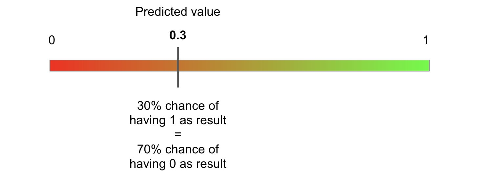


Now that you know what the output of logistic regression is, you just
need to find a function that can transform an input value that is
continuous into a value between `0` and `1`.
Luckily, such a mathematical function does exist, and it is called the
**sigmoid function**. The formula for this function is as follows:


corresponds to the
exponential function applied to `x`. The exponential function
ranges from 0 to positive infinity. So, if `x` has a value
close to positive infinite, the value of sigmoid will tend to
`1`. On the other hand, if `x` is very close to
negative infinite, then the value of sigmoid will tend to `0`:

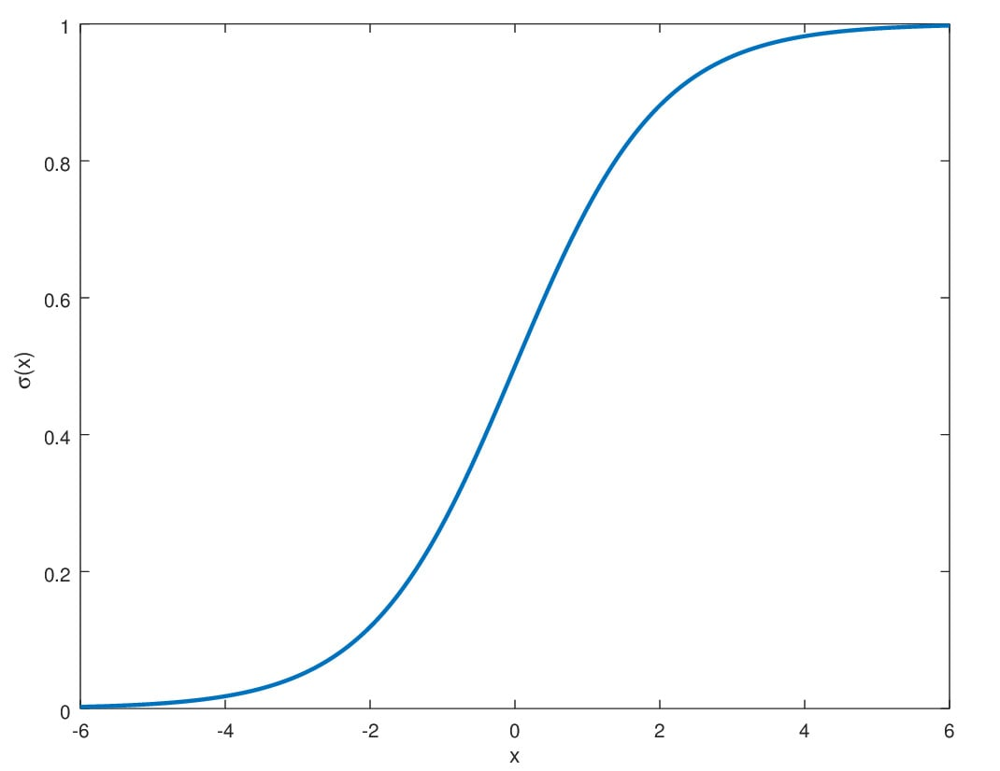


So, applying the sigmoid function on the output of a linear regression
model turns it into logistic regression. The same logic holds for neural
networks: if you apply the sigmoid function on a perceptron model
(linear regression), you will get a binary classifier. To do so, you
just need to specify sigmoid as the activation function of the last
fully connected layer of a perceptron model. In TensorFlow, you specify
the `activation` parameter as:


```
from tensorflow.keras.layers import Dense
Dense(1, activation='sigmoid')
```


The preceding code snippet shows how to define a fully connected layer
with a single unit that can output any value and apply the sigmoid
activation function to it. The result will then be within `0`
and `1`. Now that you know how to modify a neural network\'s
regression model to turn it into a binary classifier, you need to
specify the relevant loss function.

Binary Cross-Entropy
--------------------

In the previous section, you learned how to turn a linear regression
model into a binary classifier. With neural networks, it is as simple as
adding sigmoid as the activation function for the last fully connected
layer. But there is another consideration that will impact the training
of this model: the choice of the loss function.

For linear regression, the most frequently used loss functions are
**mean squared error** and **mean absolute error** as seen in *Lab
4*, *Regression and Classification Models*. These functions will
calculate the difference between the predicted and the actual values,
and the neural network model will update all its weights accordingly
during backpropagation. For a binary classification, the typical loss
function is **binary cross-entropy** (also called **log loss**). The
formula for this function is as follows:


 represents the actual value
for the observation `i`.

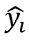 represents the predicted
probability for the observation `i`.

`N` represents the total number of observations.

This formula looks quite complicated, but its logic is quite simple.
Consider the following example of a single observation: the actual value
is `1` and the predicted probability is `0.8`. If
the preceding formula is applied, the result will be as follows:

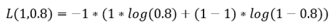

Notice that the right-hand side of the equation is approximately zero:

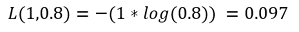

So, the loss value will be very small as the predicted value is very
close to the actual one.

Now consider another example where the actual value is `0` and
the predicted probability is `0.99`. The result will be as
follows:

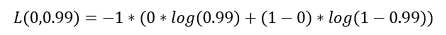

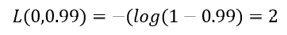

The loss will be high in this case as the prediction is very different
from the actual value.

The **binary cross-entropy function** is a good fit for assessing the
difference between predicted and actual values for a binary
classification. TensorFlow provides a class called
`BinaryCrossentropy` that computes this loss:


```
from tensorflow.keras.losses import BinaryCrossentropy
bce = BinaryCrossentropy()
```


Binary Classification Architecture
----------------------------------

The architecture for binary classifiers is extremely similar to that of
linear regression as seen in *Lab 4*, *Regression and Classification
Models*. It is composed of an input layer that reads each observation of
the input dataset, an output layer responsible for predicting the
response variable, and some hidden layers that learn the patterns
leading to the correct predictions. The following diagram shows an
example of such an architecture:

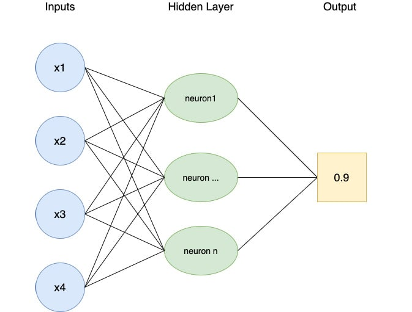


The only difference compared to linear regression is the output, which
is a probability value between `0` and `1`. This
probability indicates the likelihood of the occurrence for one of the
two possible values. As seen previously, this is achieved using the
sigmoid activation function and binary cross-entropy for
backpropagation.

Now that you have seen all the elements to build a binary classifier,
you can put this into practice with an exercise.

Exercise 5.01: Building a Logistic Regression Model
---------------------------------------------------

In this exercise, you will build and train a logistic regression model
in TensorFlow that will predict the winning team in a game of Dota 2
using some information about the game, such as the mode and type used.

You will be working on the Dota 2 dataset. Dota 2 is a popular computer
game. The dataset contains information related to the game and the
target variable indicates which team won.

Note

The training dataset can be accessed in the GitHub repo.

The test dataset can be accessed in the GitHub repo.

The original dataset can be found here:
[https://archive.ics.uci.edu/ml/datasets/Dota2+Games+Results].

1.  Open a new Jupyter notebook.

2.  Import the pandas library and use `pd` as the alias:
    
    ```
    import pandas as pd
    ```


3.  Create a variable called `train_url` that contains the URL
    to the training set:
    
    ```
    train_url = 'https://raw.githubusercontent.com/fenago'\
                '/deep-learning-essentials/main/Lab05'\
                '/dataset/dota2Train.csv'
    ```


4.  Load the training dataset into a `DataFrame()` function
    called `X_train` using `read_csv()` method,
    provide the URL to the CSV file, and set `header=None` as
    the dataset doesn\'t provide column names. Print the first five rows
    of the DataFrame using `head()`method:

    
    ```
    X_train = pd.read_csv(train_url, header=None)
    X_train.head()
    ```


    The expected output will be as follows:

    
    


    You can see that the dataset contains 117 columns, and they are all
    numeric. Note also that the target variable (column `0`)
    contains two different values: `-1` and `1`. As
    you will train a logistic regression model, the possible values
    should be `0` and `1`. You will need to replace
    the `-1` values with `0`.

5.  Extract the target variable (column 0) using the `pop()`
    method and save it in a variable called `y_train`:
    
    ```
    y_train = X_train.pop(0)
    ```


6.  Replace all values with `-1` with `0` from the
    target variable using `replace()`, and print the first
    five rows using `head()` method:

    
    ```
    y_train = y_train.replace(-1,0)
    y_train.head()
    ```


    The expected output will be as follows:

    
    


    Now all the values from the target variable of the training set are
    either `0` or `1`.

7.  Create a variable called `test_url` that contains the URL
    to the test set:
    
    ```
    test_url = 'https://raw.githubusercontent.com/fenago'\
               '/deep-learning-essentials/main/Lab05/dataset'\
               '/dota2Test.csv'
    ```


8.  Load the test dataset into a `DataFrame()` function called
    `X_test` using `read_csv()` method, provide the
    URL to the CSV file, and set `header=None` as the dataset
    doesn\'t provide column names. Print the first five rows using
    `head()` method:

    
    ```
    X_test = pd.read_csv(test_url, header=None)
    X_test.head()
    ```


    The expected output will be as follows:

    
    


    The test set is very similar to the training one, and you will need
    to perform the same transformation on it.

9.  Extract the target variable (column 0) using the `pop()`
    method and save it in a variable called `y_test`:
    
    ```
    y_test = X_test.pop(0)
    ```


10. Replace all values with `-1` with `0` from the
    target variable using `replace()` method and print the
    first five rows using `head()` method:

    
    ```
    y_test = y_test.replace(-1,0)
    y_test.head()
    ```


    The expected output will be as follows:

    
    


11. Import TensorFlow library and use `tf` as the alias:
    
    ```
    import tensorflow as tf
    ```


12. Set the seed for TensorFlow as `8`, using
    `tf.random.set_seed()` to get reproducible results:
    
    ```
    tf.random.set_seed(8)
    ```


13. Instantiate a sequential model using
    `tf.keras.Sequential()` and store it in a variable called
    `model`:
    
    ```
    model = tf.keras.Sequential()
    ```


14. Import the `Dense()` class from
    `tensorflow.keras.layers`:
    
    ```
    from tensorflow.keras.layers import Dense
    ```


15. Create a fully connected layer of `512` units with
    `Dense()` and specify ReLu as the activation function and
    the input shape as `(116,)`, which corresponds to the
    number of features from the dataset. Save it in a variable called
    `fc1`:
    
    ```
    fc1 = Dense(512, input_shape=(116,), activation='relu')
    ```


16. Create a fully connected layer of `512` units with
    `Dense()` and specify ReLu as the activation function.
    Save it in a variable called `fc2`:
    
    ```
    fc2 = Dense(512, activation='relu')
    ```


17. Create a fully connected layer of `128` units with
    `Dense()` and specify ReLu as the activation function.
    Save it in a variable called `fc3`:
    
    ```
    fc3 = Dense(128, activation='relu')
    ```


18. Create a fully connected layer of `128` units with
    `Dense()` and specify ReLu as the activation function.
    Save it in a variable called `fc4`:
    
    ```
    fc4 = Dense(128, activation='relu')
    ```


19. Create a fully connected layer of `128` units with
    `Dense()` and specify sigmoid as the activation function.
    Save it in a variable called `fc5`:
    
    ```
    fc5 = Dense(1, activation='sigmoid')
    ```


20. Sequentially add all five fully connected layers to the model using
    `add()` method:
    
    ```
    model.add(fc1)
    model.add(fc2)
    model.add(fc3)
    model.add(fc4)
    model.add(fc5)
    ```


21. Print the summary of the model using `summary()` method:

    
    ```
    model.summary()
    ```


    The expected output will be as follows:

    
    


    The preceding output shows that there are five layers in your model
    (as expected) and displays the number of parameters at each layer.
    For example, the first layer contains 59,904 parameters, and the
    total number of parameters for this model is 404,855. All these
    parameters will be trained while fitting the model.

22. Instantiate a `BinaryCrossentropy()` function from
    `tf.keras.losses` and save it in a variable called
    `loss`:
    
    ```
    loss = tf.keras.losses.BinaryCrossentropy()
    ```


23. Instantiate `Adam()` from `tf.keras.optimizers`
    with `0.001` as the learning rate and save it in a
    variable called `optimizer`:
    
    ```
    optimizer = tf.keras.optimizers.Adam(0.001)
    ```


24. Compile the model using the `compile()` function and
    specify the optimizer and loss you just created in previous steps:
    
    ```
    model.compile(optimizer=optimizer, loss=loss)
    ```


25. Start the model training process using `fit()` method on
    the training set for five epochs:

    
    ```
    model.fit(X_train, y_train, epochs=5)
    ```


    The expected output will be as follows:

    
    


    The preceding output shows the logs of each epoch during the
    training of the model. Note that it took around 15 seconds to
    process a single epoch and the loss value decreased from
    `0.6923` (first epoch) to `0.6650` (fifth
    epoch), so the model is slowly improving its performance by reducing
    the binary cross-entropy loss.

26. Predict the results of the test set using `predict()`
    method. Save it in a variable called `preds` and display
    its first five values:

    
    ```
    preds = model.predict(X_test)
    preds[:5]
    ```


    The expected output will be as follows:

    
    


    The preceding output shows the probability of each prediction. Each
    value below `0.5` will be classified as `0`
    (first and last observation in this output) and all values greater
    than or equal to `0.5` will be `1` (second to
    fourth observations).

27. Display the first five true labels of the test set:

    
    ```
    y_test[:5]
    ```


    The expected output will be as follows:

    
    


Comparing this output with the model predictions on the first five rows
of the test set, there are some incorrect values: the third prediction
(index `2`) should be a value of `0` and the last
one should be `0`. So, out of these five observations, your
binary classifiers made two mistakes.

In the section ahead, you will see how to properly evaluate the
performance of a model with different metrics.


Metrics for Classifiers
=======================


In the previous section, you learned how to train a binary classifier to
predict the right output: either `0` or `1`. In
*Exercise 5.01*, *Building a Logistic Regression Model*, you looked at a
few samples to assess the performance of the models that were built.
Usually, you would evaluate a model not just on a small subset but on
the whole dataset using a performance metric such as accuracy or F1
score.

Accuracy and Null Accuracy
--------------------------

One of the most widely used metrics for classification problems is
accuracy. Its formula is quite simple:


The maximum value for accuracy is `1`, which means the model
correctly predicts 100% of the cases. Its minimum value is
`0`, where the model can\'t predict any case correctly.

For a binary classifier, the number of correct predictions is the number
of observations with a value of `0` or `1` as the
correctly predicted value:

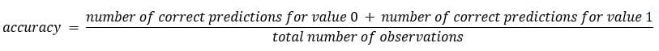

Say you are assessing the performance of two different binary
classifiers predicting the outcome on 10,000 observations on the test
set. The first model correctly predicted 5,000 instances of value
`0` and 3,000 instances of value `1`. Its accuracy
score will be as follows:


The second model correctly predicted the value `0` for 500
cases and the value `1` for 1,500 observations. Its accuracy
score will be as follows:


The first model predicts accurately 80% of the time, while the second
model is only 20% accurate. In this case, you can say that model 1 is
better than model 2.

Even though `0.8` is usually a relatively good score, this
does not necessarily mean your model is performing well. For instance,
say your dataset contains 9,000 cases of value `0` and 1,000
cases of value `1`. A very simple model that always predicts
value `0` will achieve an accuracy score of 0.9. In this case,
the first model is performing even less well than this extremely simple
model. This characteristic of such a model that always predicts the most
frequent value of a dataset is called the **null accuracy**. It is used
as a baseline to compare with other trained models. In the preceding
example, the null accuracy is `0.9` since the simple model
predicts `0`, which is correct 90% of the time.

Note

The accuracy and null accuracy metrics are not specific to binary
classification but can also be applied to other types of classification.

TensorFlow provides a class, `tf.keras.metrics.Accuracy`, that
can calculate the accuracy score from tensors. This class has a method
called `update_state()` that takes two tensors as input
parameters and will compute the accuracy score between them. You can
access this score by calling the `result()` method. The output
result will be a tensor. You can use the `numpy()` method to
convert it into a NumPy array. Here is an example of how to calculate
the accuracy score:


```
from tensorflow.keras.metrics import Accuracy
preds = [1, 1, 1, 1, 0, 0]
target = [1, 0, 1, 0, 1, 0]
acc = Accuracy()
acc.update_state(preds, target)
acc.result().numpy()
```


This will result in the following accuracy score:


```
0.5
```


Note

TensorFlow doesn\'t provide a class for the null accuracy metric, but
you can easily compute it using `Accuracy()` and provide a
tensor with only `1` (or `0`) as the predictions.

Precision, Recall, and the F1 Score
-----------------------------------

In the previous section, you learned how to use the accuracy metric to
assess the performance of a model and compare it against a baseline
called the null accuracy. The accuracy score is widely used as it is
well known to non-technical audiences, but it does have some
limitations. Consider the following example.


This model achieves an accuracy score of 0.981 , which is
quite high. But if this model is used to predict whether a person has a
disease, it will only predict correctly in a single case. It incorrectly
predicted in nine cases that these people are not sick while they
actually have the given disease. At the same time, it incorrectly
predicted sickness for 10 people who were actually healthy. This
model\'s performance, then, is clearly unsatisfactory. Unfortunately,
the accuracy score is simply an overall score, and it doesn\'t tell you
where the model is performing badly.

Luckily, other metrics provide a better assessment of a model, such as
precision, recall, or F1 score. All three of these metrics have the same
range of values as the accuracy score: `1` is the perfect
score, wherein all observations are predicted correctly, and
`0` is the worst, wherein there is no correct prediction at
all.

But before looking at them, you need to be familiar with the following
definitions:

-   **True Positive (TP)**: All the observations where the actual value
    and the corresponding prediction are both true
-   **True Negative (TN)**: All the observations where the actual value
    and the corresponding prediction are both false
-   **False Positive (FP)**: All the observations where the prediction
    is true, but the values are actually false
-   **False Negative (FN)**: All the observations where the prediction
    is false, but the values are actually true

Taking the same example as *Figure 5.18*, you will get the following:

-   TP = 1
-   TN = 980
-   FP = 10
-   FN = 9

This is seen in the following table:

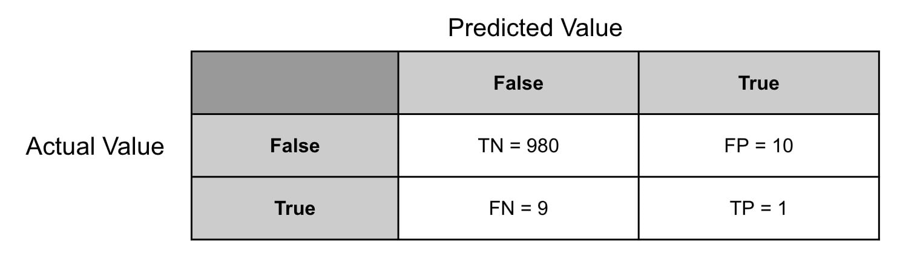


The precision score is a metric that assesses whether a model has
predicted a lot of FPs. Its formula is as follows:


In the preceding example, the precision score will be . You can see this model is
making a lot of mistakes and has predicted a lot of FPs compared to the
actual TP.

Recall is used to assess the number of FNs compared to TPs. Its formula
is as follows:


In the preceding example, the recall score will be . With this metric, you can
see that the model is not performing well and is predicting a lot of
FNs.

Finally, the F1 score is a metric that combines both precision and
recall (it is the harmonic mean of precision and recall). Its formula is
as follows:


Taking the same example as the preceding, the F1 score will be
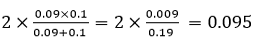

The model has achieved an F1 score of `0.095`, which is very
different from its accuracy score of `0.981`. So, the F1 score
is a good performance metric when you want to emphasize the incorrect
predictions---the score considers the number of FNs and FPs in the
score, as well as the TPs and TNs.

Note

As with accuracy, precision, and recall performance metrics, the F1
score can also be applied to other types of classification.

You can easily calculate precision and recall with TensorFlow by using
the respective classes of `Precision()` and
`Recall()`:


```
from tensorflow.keras.metrics import Precision, Recall
preds = [1, 1, 1, 1, 0, 0]
target = [1, 0, 1, 0, 1, 0]
prec = Precision()
prec.update_state(preds, target)
print(f"Precision: {prec.result().numpy()}")
rec = Recall()
rec.update_state(preds, target)
print(f"Recall: {rec.result().numpy()}")
```


This results in the following output:


Note

TensorFlow doesn\'t provide a class to calculate the F1 score, but this
can easily be done by creating a custom metric. This will be covered in
*Exercise 5.02*, *Classification Evaluation Metrics*.

Confusion Matrices
------------------

A confusion matrix is not a performance metric *per se*, but more a
graphical tool used to visualize the predictions of a model against the
actual values. You have actually already seen an example of this in the
previous section with *Figure 5.18*.

A confusion matrix will show all the possible values of the predictions
on one axis (for example, the horizontal axis) and the actual values on
the other axis (the vertical axis). At the intersection of each
combination of predicted and actual values, you will record the number
of observations that fall under this case.

For a binary classification, the confusion matrix will look like the
following:


The ideal situation will be that all the values sit on the diagonal of
this matrix. This will mean your model is correctly predicting all
possible values. All values outside of this diagonal are where your
model made some mistakes.

Note

Confusion matrices can also be used for multi-class classification and
are not specific to binary classification only.

Run the code below to see the confusion matrix:


```
from tensorflow.math import confusion_matrix
preds = [1, 1, 1, 1, 0, 0]
target = [1, 0, 1, 0, 1, 0]
print(confusion_matrix(target, preds))
```


This will display the following output:


The preceding output shows the confusion matrix. From it, you can see
that the model has predicted the following results: two TPs, one TN, two
FPs, and one FN.

In the next exercise, you will apply these performance metrics to the
same logistic regression model that you created in *Exercise 5.01*,
*Building a Logistic Regression Model*.

Exercise 5.02: Classification Evaluation Metrics
------------------------------------------------

In this exercise, you will reuse the same logistic regression model as
in *Exercise 5.01*, *Building a Logistic Regression Model*, and assess
its performance by looking at different performance metrics: accuracy,
precision, recall, and F1 score.

The original dataset was shared by Stephen Tridgell from the University
of Sydney.

Note

The training dataset can be accessed in the GitHub repo.

The test dataset can be accessed in the GitHub repo.

The model from *Exercise 5.01*, *Building a Logistic Regression Model*,
can be found here: [https://raw.githubusercontent.com/fenago/deep-learning-essentials/main/Lab05/model/exercise5_01_model.h5].

Now, run the following instructions:

1.  Open a new Jupyter notebook.

2.  Import the pandas library and use `pd` as the alias:
    
    ```
    import pandas as pd
    ```


3.  Create a variable called `train_url` that contains the URL
    to the training set:
    
    ```
    train_url = 'https://raw.githubusercontent.com/fenago'\
                '/deep-learning-essentials/main/Lab05/dataset'\
                '/dota2PreparedTrain.csv'
    ```


4.  Load the training dataset into a `DataFrame()` function
    called `X_train` using `read_csv()` method,
    provide the URL to the CSV file, and set `header=None` as
    the dataset doesn\'t provide column names:
    
    ```
    X_train = pd.read_csv(train_url, header=None)
    ```


5.  Extract the target variable (column `0`) using the
    `pop()` method and save it in a variable called
    `y_train`:
    
    ```
    y_train = X_train.pop(0)
    ```


6.  Create a variable called `test_url` that contains the URL
    to the test set:
    
    ```
    test_url = 'https://raw.githubusercontent.com/fenago'\
               '/deep-learning-essentials/main/Lab05/dataset'\
               '/dota2PreparedTest.csv'
    ```


7.  Load the test dataset into a `DataFrame()` function called
    `X_test` using `read_csv()` method, provide the
    URL to the CSV file, and set `header=None` as the dataset
    doesn\'t provide column names:
    
    ```
    X_test = pd.read_csv(test_url, header=None)
    ```


8.  Extract the target variable (column `0`) using the
    `pop()` method and save it in a variable called
    `y_test`:
    
    ```
    y_test = X_test.pop(0)
    ```


9.  Import the `tensorflow` library using `tf` as
    the alias and import the `get_file()` method from
    `tensorflow.keras.utils`:
    
    ```
    import tensorflow as tf
    from tensorflow.keras.utils import get_file
    ```


10. Create a variable called `model_url` that contains the URL
    to the model:
    
    ```
    model_url = 'https://github.com/fenago'\
                '/deep-learning-essentials/blob/main/Lab05'\
                'model/exercise5_01_model.h5?raw=true'
    ```


11. Download the model locally using the `get_file()` method
    by providing the name (`exercise5_01_model.h5`) of the
    file and its URL. Save the output to a variable called
    `model_path`:
    
    ```
    model_path = get_file('exercise5_01_model.h5', model_url)
    ```


12. Load the model with `tf.keras.models.load_model()` and
    specify the local path to the model:
    
    ```
    model = tf.keras.models.load_model(model_path)
    ```


13. Print the model summary using the `summary()` method:

    
    ```
    model.summary()
    ```


    The expected output will be as follows:

    
    


    The preceding output shows the same architecture as the model from
    *Exercise 5.01*, *Building a Logistic Regression Model*.

14. Predict the results of the test set using `predict()`
    method. Save it in a variable called `preds_proba` and
    display its first five values:

    
    ```
    preds_proba = model.predict(X_test)
    preds_proba[:5]
    ```


    The expected output will be as follows:

    
    


    The outputs are the predicted probabilities of being `1`
    (or true) for each observation. You need to convert these
    probabilities into `0` and `1` only. To do so,
    you will need to consider all cases with a probability greater than
    or equal to `0.5` to be `1` (or true), and
    `0` (or false) for the records with a probability lower
    than `0.5`.

15. Convert the predicted probabilities into `1` when the
    probability is greater than or equal to `0.5`, and
    `0` when below `0.5`. Save the results in a
    variable called `preds` and print its first five rows:

    
    ```
    preds = preds_proba >= 0.5
    preds[:5]
    ```


    The expected output will be as follows:

    
    


    Now the predictions have been converted to binary values: true
    (which equals `1`) and false (which equals `0`).

16. Import `Accuracy`, `Precision`, and
    `Recall` from `tensorflow.keras.metrics`:
    
    ```
    from tensorflow.keras.metrics import Accuracy, Precision, Recall
    ```


17. Instantiate `Accuracy`, `Precision`, and
    `Recall` objects and save them in variables called
    `acc`, `pres`, and `rec`,
    respectively:
    
    ```
    acc = Accuracy()
    prec = Precision()
    rec = Recall()
    ```


18. Calculate the accuracy score on the test set with the
    `update_state()`, `result()`, and
    `numpy()` methods. Save the results in a variable called
    `acc_results` and print its content:

    
    ```
    acc.update_state(preds, y_test)
    acc_results = acc.result().numpy()
    acc_results
    ```


    The expected output will be as follows:

    
    ```
    0.59650314
    ```


    This model achieved an accuracy score of `0.597`.

19. Calculate the precision score on the test set with the
    `update_state()`, `result()`, and
    `numpy()` methods. Save the results in a variable called
    `prec_results` and print its content:

    
    ```
    prec.update_state(preds, y_test)
    prec_results = prec.result().numpy()
    prec_results
    ```


    The expected output will be as follows:

    
    ```
    0.59578335
    ```


    This model achieved a precision score of `0.596`.

20. Calculate the recall score on the test set with the
    `update_state()`, `result()`, and
    `numpy()` methods. Save the results in a variable called
    `rec_results` and print its content:

    
    ```
    rec.update_state(preds, y_test)
    rec_results = rec.result().numpy()
    rec_results
    ```


    The expected output will be as follows:

    
    ```
    0.6294163
    ```


    This model achieved a recall score of `0.629`.

21. Calculate the F1 score by applying the formula shown in the previous
    section. Save the result in a variable called `f1` and
    print its content:

    
    ```
    f1 = 2*(prec_results * rec_results) / (prec_results + rec_results)
    f1
    ```


    The expected output will be as follows:

    
    ```
    0.6121381493171637
    ```


    Overall, the model has achieved quite a low score close to
    `0.6` for all four different metrics: accuracy, precision,
    recall, and F1 score. So, this model is making almost as many
    correct predictions as bad ones. You may try on your own to build
    another model and see whether you can improve its performance.

In the section ahead, you will be looking at expanding classification to
more than two possible values with multi-class classification.


Multi-Class Classification
==========================


With binary classification, you were limited to dealing with target
variables that can only take two possible values: `0` and
`1` (false or true). Multi-class classification can be seen as
an extension of this and allows the target variable to have more than
two values (or you can say binary classification is just a subset of
multi-class classification). For instance, a model that predicts
different levels of disease severity for a patient or another one that
classifies users into different groups based on their past shopping
behaviors will be multi-class classifiers.

In the next section, you will dive into the softmax function, which is
used for multi-class classification.

The Softmax Function
--------------------

Binary classifiers require a specific activation function for the last
fully connected layer of a neural network, which is sigmoid. The
activation function specific to multi-class classifiers is different. It
is softmax. Its formula is as follows:


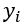 corresponds to the
predicted value for class `i`.

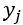 corresponds to the
predicted value for class `j`.

This formula will be applied to each possible value of the target
variable. If you have 10 possible values, then this activation function
will calculate 10 different softmax values.

Note that softmax exponentiates the predicted values on both the
numerator and the denominator. The reason behind this is that the
exponential function magnifies small changes between predicted values
and makes probabilities lie closer to `0` or `1` for
the purpose of interpreting the resulting output. For instance,
`exp(2) = 7.39` while `exp(2.2) = 9.03`. So, if two
classes have predicted values close to each other, the difference
between their exponentiated values will be much bigger and therefore it
will be easier to select the higher one.

The result of the softmax function is between `0` and
`1` as the method divides the value for one class by the sum
of all the classes. So, the actual output of a softmax function is the
probability of the relevant class being the final prediction:

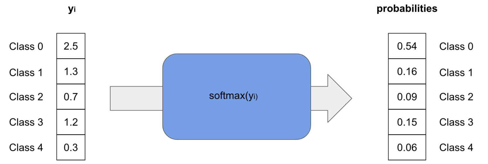


In the preceding example, the target variable has five different values,
and the softmax function transforms them into probabilities. The first
class (`0`) is the one with the highest probability, and this
will be the final prediction.

Categorical Cross-Entropy
-------------------------

Multi-class classification also requires a specific loss function that
is different from the binary cross-entropy for binary classifiers. For
multi-class classification, the loss function is categorical
cross-entropy. Its formula is as follows:


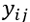 represents the probability
of the actual value for the observation `i` to be of
class `j`.

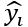represents the predicted
probability for the observation `i` to be of class
`j`.

TensorFlow provides two different classes for this loss function:
`CategoricalCrossentropy()` and
`SparseCategoricalCrossentropy()`:


```
from tensorflow.keras.losses import CategoricalCrossentropy, 
                                    SparseCategoricalCrossentropy
cce = CategoricalCrossentropy()
scce = SparseCategoricalCrossentropy()
```


The difference between them lies in the format of the target variable.
If the actual values are stored as a one-hot encoding representing the
actual class, then you will need to use
`CategoricalCrossentropy()`. On the other hand, if the
response variable is stored as integers for representing the actual
classes, you will have to use
`SparseCategoricalCrossentropy()`:

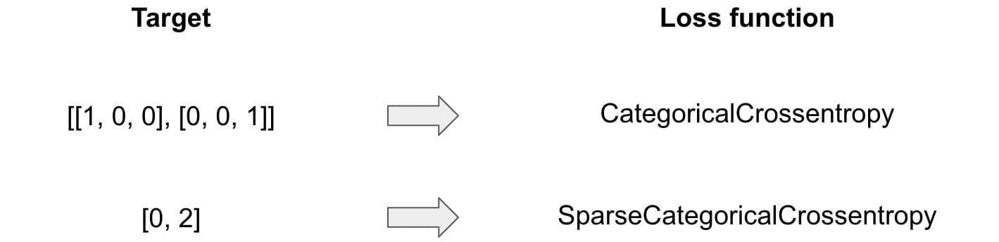


The output of a multi-class model will be a vector containing
probabilities for each class of the target variable, such as the
following:


```
import numpy as np
preds_proba = np.array([0.54, 0.16, 0.09, 0.15, 0.06])
```


The first value (`0.54`) corresponds to the probability of
having the class at index 0, `0.016` is the probability of the
class at index 1, while `0.09` corresponds to the probability
for the class of index 2, and so on.

In order to get the final prediction (that is, the class with the
highest probability), you need to use the `argmax()` function,
which will look at all the values from a vector, find the maximum one,
and return the index associated with it:


```
preds_proba.argmax()
```


This will display the following output:


```
0
```


In the preceding example, the final prediction is `class 0`,
which corresponds to the vector index with the highest probability
(`0.54`).

Multi-Class Classification Architecture
---------------------------------------

The architecture for a multi-class classifier is very similar to
logistic regression, except that the last layer will contain more units.
Each of them corresponds to a class of the target variable. For
instance, if you are building a model that takes as input a vector of
size 6 and predicts a response with three different values with a single
hidden layer, its architecture will look like the following:

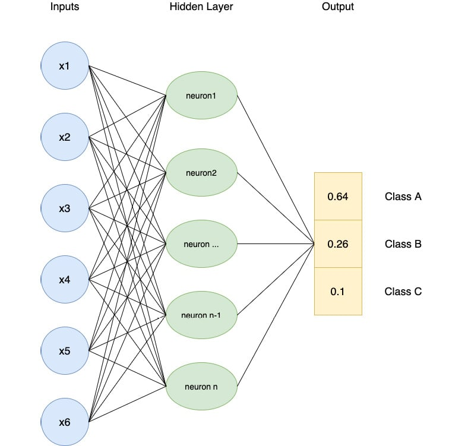


The softmax activation function at the last layer provides a probability
of occurrence for each of the possible classes: `A`,
`B`, and `C`. These probabilities are dependent on
each other as there should be only one class predicted at the end. If
class `A` is more likely to be the prediction (as in the
preceding example), then the probabilities for the remaining classes
(`B` and `C`) should be lower. Note that the sum of
all the class probabilities equals `1`. So, they are indeed
dependent on one another.

Now that you know all the building blocks, you can build a multi-class
classifier in the following exercise.

Exercise 5.03: Building a Multi-Class Model
-------------------------------------------

In this exercise, you will build and train a multi-class classifier in
TensorFlow that will predict the radiator position of a space shuttle
from eight different values using the nine different numerical features
provided in this dataset.

The target variable (last column) contains seven different levels:
`Rad.Flow`, `Fpv.Close`, `Fpv.Open`,
`High`, `Bypass`, `Bpv.Close`, and
`Bpv.Open`. Your goal is to accurately predict one of these
seven levels using the nine features from the dataset.

Note

The training dataset can be accessed in the GitHub repo.

The test dataset can be accessed in the GitHub repo.

The original dataset can be found here:
[http://archive.ics.uci.edu/ml/datasets/Statlog+%28Shuttle%29].

Perform the following steps to complete the exercise:

1.  Open a new Jupyter notebook.

2.  Import the pandas library and use `pd` as the alias:
    
    ```
    import pandas as pd
    ```


3.  Create a variable called `train_url` that contains the URL
    to the training set:
    
    ```
    train_url = 'https://raw.githubusercontent.com/fenago'\
                '/deep-learning-essentials/main/Lab05'\
                '/dataset/shuttle.trn'
    ```


4.  Load the training dataset into a DataFrame called
    `X_train` using the `read_table()` method,
    provide the URL to the CSV file, use `header=None` as the
    dataset doesn\'t provide column names, and use `sep=' '`
    as each column is separated by spaces in this dataset. Print the
    first five rows using `head()` method:

    
    ```
    X_train = pd.read_table(train_url, header=None, sep=' ')
    X_train.head()
    ```


    The expected output will be as follows:

    
    


    You can see that the dataset contains 10 columns, and they are all
    numeric. Also, note that the target variable (column `9`)
    contains different class values.

5.  Extract the target variable (column `9`) using the
    `pop()` method and save it in a variable called
    `y_train`:
    
    ```
    y_train = X_train.pop(9)
    ```


6.  Create a variable called `test_url` that contains the URL
    to the test set:
    
    ```
    test_url = 'https://raw.githubusercontent.com/fenago'\
               '/deep-learning-essentials/main/Lab05/dataset'\
               '/shuttle.tst'
    ```


7.  Load the test dataset into a DataFrame called `X_test`
    using `read_table()`, provide the URL to the CSV file, set
    `header=None` as the dataset doesn\'t provide column
    names, and use `sep=' '` as each column is separated by a
    space in this dataset. Print the first five rows using
    `head()` method.

    
    ```
    X_test = pd.read_table(test_url, header=None, sep=' ')
    X_test.head()
    ```


    The expected output will be as follows:

    
    


    You can see that the test set is very similar to the training one.

8.  Extract the target variable (column `9`) using the
    `pop()` method and save it in a variable called
    `y_test`:
    
    ```
    y_test = X_test.pop(9)
    ```


9.  Import the TensorFlow library and use `tf` as the alias:
    
    ```
    import tensorflow as tf
    ```


10. Set the seed for TensorFlow as `8` using
    `tf.random.set_seed()` to get reproducible results:
    
    ```
    tf.random.set_seed(8)
    ```


11. Instantiate a sequential model using
    `tf.keras.Sequential()` and store it in a variable called
    `model`:
    
    ```
    model = tf.keras.Sequential()
    ```


12. Import the `Dense()` class from
    `tensorflow.keras.layers`:
    
    ```
    from tensorflow.keras.layers import Dense
    ```


13. Create a fully connected layer of `512` units with
    `Dense()` and specify ReLu as the activation function and
    the input shape as `(9,)`, which corresponds to the number
    of features from the dataset. Save it in a variable called
    `fc1`:
    
    ```
    fc1 = Dense(512, input_shape=(9,), activation='relu')
    ```


14. Create a fully connected layer of `512` units with
    `Dense()` and specify ReLu as the activation function.
    Save it in a variable called `fc2`:
    
    ```
    fc2 = Dense(512, activation='relu')
    ```


15. Create a fully connected layer of `128` units with
    `Dense()` and specify ReLu as the activation function.
    Save it in a variable called `fc3`:
    
    ```
    fc3 = Dense(128, activation='relu')
    ```


16. Again, create a fully connected layer of `128` units with
    `Dense()` and specify ReLu as the activation function.
    Save it in a variable called `fc4`:
    
    ```
    fc4 = Dense(128, activation='relu')
    ```


17. Create a fully connected layer of 128 units with `Dense()`
    and specify softmax as the activation function. Save it in a
    variable called `fc5`:
    
    ```
    fc5 = Dense(8, activation='softmax')
    ```


18. Sequentially add all five fully connected layers to the model using
    `add()` method.
    
    ```
    model.add(fc1)
    model.add(fc2)
    model.add(fc3)
    model.add(fc4)
    model.add(fc5)
    ```


19. Print the summary of the model using `summary()` method:

    
    ```
    model.summary()
    ```


    The expected output will be as follows:

    
    


    The preceding output shows that there are five layers in your model
    (as expected) and tells you the number of parameters at each layer.
    For example, the first layer contains `5,120` parameters
    and the total number of parameters for this model is
    `350,984`. All these parameters will be trained while
    fitting the model.

20. Instantiate `SparseCategoricalCrossentropy()` from
    `tf.keras.losses` and save it in a variable called
    `loss`:
    
    ```
    loss = tf.keras.losses.SparseCategoricalCrossentropy()
    ```


21. Instantiate `Adam()` from `tf.keras.optimizers`
    with `0.001` as the learning rate and save it in a
    variable called `optimizer`:
    
    ```
    optimizer = tf.keras.optimizers.Adam(0.001)
    ```


22. Compile the model using the `compile()` method and specify
    the optimizer and loss parameters, with accuracy as the metric to be
    reported:
    
    ```
    model.compile(optimizer=optimizer, loss=loss, \
                  metrics=['accuracy'])
    ```


23. Start the model training process using `fit()` method on
    the training set for five epochs:

    
    ```
    model.fit(X_train, y_train, epochs=5)
    ```


    The expected output will be as follows:

    
    


    The preceding output shows the logs of each epoch during the
    training of the model. Note that it took around 7 seconds to process
    a single epoch, and the loss value decreased from `0.5859`
    (first epoch) to `0.0351` (fifth epoch).

24. Evaluate the performance of the model on the test set using the
    `evaluate()` method:

    
    ```
    model.evaluate(X_test, y_test)
    ```


    The expected output will be as follows:

    
    


In this exercise, you learned how to build and train a multi-class
classifier to predict an outcome composed of eight different classes.
Your model achieved an accuracy score close to `0.997` on both
the training and test sets, which is quite remarkable. This implies that
your model correctly predicts the right class in the majority of cases.

Now, let\'s consolidate your learning in the following activity.

Activity 5.01: Building a Character Recognition Model with TensorFlow
---------------------------------------------------------------------

In this activity, you are tasked with building and training a
multi-class classifier that will recognize the 26 letters of the
alphabet from images. In this dataset, the images have been converted
into 16 different statistical measures that will constitute our
features. The goal of this model is to determine which of the 26
characters each observation belongs to.

The original dataset was shared by David J. Slate of the Odesta
Corporation, and can be found here:
[http://archive.ics.uci.edu/ml/datasets/Letter+Recognition].

The dataset can be accessed in the GitHub repo.

The following steps will help you to complete the activity:

1.  Load the data with `read_csv()` from pandas.

2.  Extract the target variable with `pop()` method from
    pandas.

3.  Split the data into training (the first 15,000 rows) and test (the
    last 5,000 rows) sets.

4.  Build the multi-class classifier with five fully connected layers of
    `512`, `512`, `128`, `128`,
    and `26` units, respectively.

5.  Train this model on the training set.

6.  Evaluate its performance on the test set with `evaluate()`
    method from TensorFlow.

7.  Print the confusion matrix with `confusion_matrix()` from
    TensorFlow.

    The expected output is as follows:

    
    


Note

The solution to this activity can be found via [this link].


Multi-Label Classification
==========================


Multi-label classification is another type of classification where you
predict not only one target variable as in binary or multi-class
classification, but several response variables at the same time. For
instance, you can predict multiple outputs for the different objects
present in an image (for instance, a model will predict whether there is
a cat, a man, and a car in a given picture) or you can predict multiple
topics for an article (such as whether the article is about the economy,
international news, and manufacturing).

Implementing a multi-label classification with neural networks is
extremely easy, and you have already learned everything required to
build one. In TensorFlow, a multi-label classifier\'s architecture will
look the same as for multi-class, with a final output layer with
multiple units corresponding to the number of target variables you want
to predict. But instead of using softmax as the activation function and
categorical cross-entropy as the loss function, you will use sigmoid and
binary cross-entropy as the activation and loss functions, respectively.

The sigmoid function will predict the probability of occurrence for each
target variable:


In the preceding example, you have three target variables and each of
them has a probability of occurrence that is independent of the others
(their sum will not equal 1). This model predicts that targets
`2` and `3` are very likely to be the outputs for
this observation.

Conceptually, multi-label classification combines several logistic
regression models. They will share the same parameters (weights and
biases) but with independent binary outputs. The last layer of the
example of a multi-class classifier in TensorFlow will look like this:


```
from tensorflow.keras.layers import Dense
Dense(3, activation='sigmoid')
```


The loss function to be used will be binary cross-entropy:


```
from tensorflow.keras.losses import BinaryCrossentropy
bce = BinaryCrossentropy()
```


Now, put into action what you have learned so far in the following
activity.

Activity 5.02: Building a Movie Genre Tagging a Model with TensorFlow
---------------------------------------------------------------------

In this activity, you are tasked with building and training a
multi-label classifier that will predict the genre of a movie from 28
possible values. Each movie can be assigned to multiple genres at a
time. The features are the top keywords extracted from its synopsis. The
dataset used for this activity is a subset of the original one and
contains only 20,000 rows.

The original dataset was shared by IMDb and can be found here:
[http://www.uco.es/kdis/mllresources/\#ImdbDesc].

The features of the dataset can be accessed in the GitHub repo.

The targets of the dataset can be accessed in the GitHub repo.

The following steps will help you to complete the activity:

1.  Load the features and targets with `read_csv()` from
    pandas.

2.  Split the data into training (the first 15,000 rows) and test (the
    last 5,000 rows) sets.

3.  Build the multi-class classifier with five fully connected layers of
    `512`, `512`, `128`, `128`,
    and `28` units, respectively.

4.  Train this model on the training set.

5.  Evaluate its performance on the test set with `evaluate()`
    method from TensorFlow.

    The expected output is as follows:

    
    


Note

The solution to this activity can be found via [this link].


Summary
=======


You started your journey in this lab with an introduction to
classification models and their differences compared with regression
models. You learned that the target variable for classifiers can only
contain a limited number of possible values.

You then explored binary classification, wherein the response variable
can only be from two possible values: `0` or `1`.
You uncovered the specificities for building a logistic regression model
with TensorFlow using the sigmoid activation function and binary
cross-entropy as the loss function, and you built your own binary
classifier for predicting the winning team on the video game Dota 2.

After this, you went through the different performance metrics that can
be used to assess the performance of classifier models. You practiced
calculating accuracy, precision, recall, and F1 scores with TensorFlow,
and also plotted a confusion matrix, which is a visual tool to see where
the model made correct and incorrect predictions.

Then you dove into the topic of multi-class classification. The
difference between such models and binary classifiers is that their
response variables can take more than two possible values. You looked at
the softmax activation function and the categorical cross-entropy loss
function, which are used for training such models in TensorFlow.

Finally, in the last section, you learned about multi-label
classification, wherein the output can be multiple classes at the same
time. In TensorFlow, such models can be easily built by constructing an
architecture similar to multi-class classification but using sigmoid and
binary cross-entropy, respectively, as the activation and
loss functions.
