Lab 6: Regularization and Hyperparameter Tuning
===============================================

In this lab, you will be introduced to hyperparameter tuning. You
will get hands-on experience in using TensorFlow to perform
regularization on deep learning models to reduce overfitting. You will
explore concepts such as L1, L2, and dropout regularization. Finally,
you will look at the Keras Tuner package for performing automatic
hyperparameter tuning.

By the end of the lab, you will be able to apply regularization and
tune hyperparameters in order to reduce the risk of overfitting your
model and improve its performance.


Regularization Techniques
=========================


The main goal of a data scientist is to train a model that achieves high
performance and generalizes to unseen data well. The model should be
able to predict the right outcome on both data used during the training
process and new data. This is the reason why a model is always assessed
on the test set. This set of data serves as a proxy to evaluate the
ability of the model to output correct results while in production.

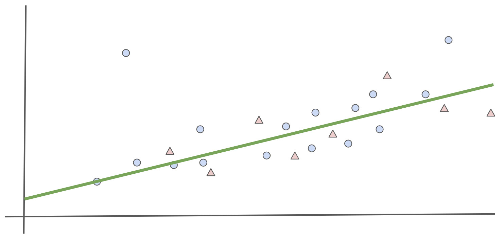


Fortunately, there are **regularization techniques** that a data
scientist can use to reduce and prevent overfitting, defined in the
following sections.

L1 Regularization
-----------------

For deep learning models, overfitting happens when some of the features
have higher weights than they should. The model puts too much emphasis
on these features as it believes they are extremely important for
predicting the training set. Unfortunately, these features are less
relevant for the test set or any new unseen data. Regularization
techniques try to penalize such weights and reduce their importance to
the model predictions.

There are multiple ways to perform regularization. One of them is to add
a regularization component to the cost function:


The addition of this regularization component will lead the weights of
the model to be smaller as neural networks try to reduce the cost
function while performing forward and backward propagations.

One very popular regularization component is L1. Its formula is as
follows:


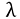 is a hyperparameter that
defines the level of penalization of the L1 regularization.
`W` is the weight of the model. With L1 regularization, you
add the sum of the absolute value of the weights to the model loss.

L1 regularization is sometimes referred to as **feature selection** as
it tends to push the weights of non-relevant features to `0`.
Therefore, only the relevant features are used for making predictions.

In TensorFlow, you can define L1 regularization with the following code
snippet:


```
from tensorflow.keras.regularizers import l1
l1_reg = l1(l=0.01)
```


The `l` parameter corresponds to the  hyperparameter. The instantiated L1
regularization can then be added to any layer from TensorFlow Keras:


```
from tensorflow.keras.layers import Dense
Dense(10, kernel_regularizer=l1_reg)
```


In the preceding example, you added the L1 regularizer that you defined
earlier to a fully connected layer of `10` units.

L2 Regularization
-----------------

*L2* regularization is similar to *L1* in that it adds a regularization
component to the cost function, but its formula is different:


L2 regularization tends to decrease the weights of the non-relevant
features. They will be close to `0`, but not exactly
`0`. So, it reduces the impact of these features but does not
disable them as L1 does.

In TensorFlow, you can define L2 regularization as follows:


```
from tensorflow.keras.regularizers import l2
from tensorflow.keras.layers import Dense
l2_reg = l2(l=0.01)
Dense(20, kernel_regularizer=l2_reg)
```


In the preceding example, you defined an L2 regularizer and added it to
a fully connected layer of `20` units.

TensorFlow provides another regularizer class that combines both L1 and
L2 regularizers. You can instantiate it with the following code snippet:


```
from tensorflow.keras.regularizers 
import l1_l2
l1_l2_reg = l1_l2(l1=0.01, l2=0.001)
```


In the preceding example, you instantiated L1 and L2 regularizers and
specified the factors for L1 and L2 as `0.01` and
`0.001`, respectively. You can observe that more weights are
put on the L1 regularization compared to L2. These values are
hyperparameters that can be fine-tuned depending on the dataset.

In the next exercise, you will put this into practice as you apply L2
regularization to a model.

Exercise 6.01: Predicting a Connect-4 Game Outcome Using the L2 Regularizer
---------------------------------------------------------------------------

In this exercise, you will build and train two multi-class models in
TensorFlow that will predict the class outcome for player one in the
game Connect-4.

Each observation of this dataset contains different situations of the
game with different positions. For each of these situations, the model
tries to predict the outcome for the first player: win, loss, or draw.
The first model will not have any regularization, while the second will
have L2 regularization:

Note

The dataset can be accessed here: [https://github.com/fenago/deep-learning-essentials/blob/main/Lab06/dataset/connect-4.csv].

The original dataset can be found here:
[http://archive.ics.uci.edu/ml/datasets/Connect-4].

1.  Open a new Jupyter notebook.

2.  Import the pandas library and use `pd` as the alias:
    
    ```
    import pandas as pd
    ```


3.  Create a variable called `file_url` that contains the URL
    to the dataset:
    
    ```
    file_url = 'https://raw.githubusercontent.com/fenago'\
              '/deep-learning-essentials/main/Lab06/dataset'\
              '/connect-4.csv'
    ```


4.  Load the dataset into a DataFrame called `data` using the
    `read_csv()` function and provide the URL to the CSV file.
    Print the first five rows using the `head()` function:

    
    ```
    data = pd.read_csv(file_url)
    data.head()
    ```


    The expected output will be as follows:

    
    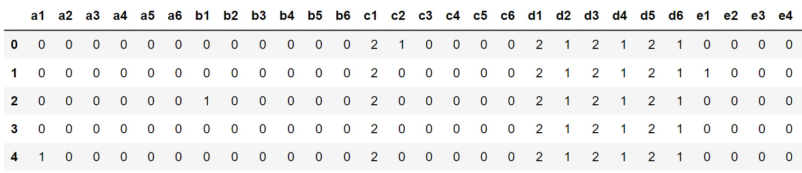


    The preceding figure shows the first five rows of the dataset.

5.  Extract the target variable (the `class` column) using the
    `pop()` method and save it in a variable named
    `target`:
    
    ```
    target = data.pop('class')
    ```


6.  Import the TensorFlow library and use `tf` as the alias.
    Then, import the `Dense` class from
    `tensorflow.keras.layers`:
    
    ```
    import tensorflow as tf
    from tensorflow.keras.layers import Dense
    ```


7.  Set the seed as `8` to get reproducible results:
    
    ```
    tf.random.set_seed(8)
    ```


8.  Instantiate a sequential model using
    `tf.keras.Sequential()` and store it in a variable called
    `model`:
    
    ```
    model = tf.keras.Sequential()
    ```


9.  Create a fully connected layer of `512` units with
    `Dense()` and specify ReLu as the activation function and
    the input shape as `(42,)`, which corresponds to the
    number of features from the dataset. Save it in a variable called
    `fc1`:
    
    ```
    fc1 = Dense(512, input_shape=(42,), activation='relu')
    ```


10. Create three fully connected layers of `512`,
    `128`, and `128` units with `Dense()`
    and specify ReLu as the activation function. Save them in three
    variables, called `fc2`, `fc3`, and
    `fc4`, respectively:
    
    ```
    fc2 = Dense(512, activation='relu')
    fc3 = Dense(128, activation='relu')
    fc4 = Dense(128, activation='relu')
    ```


11. Create a fully connected layer of three units (corresponding to the
    number of classes) with `Dense()` and specify softmax as
    the activation function. Save it in a variable called
    `fc5`:
    
    ```
    fc5 = Dense(3, activation='softmax')
    ```


12. Sequentially add all five fully connected layers to the model using
    the `add()` method:
    
    ```
    model.add(fc1)
    model.add(fc2)
    model.add(fc3)
    model.add(fc4)
    model.add(fc5)
    ```


13. Print the summary of the model using the `summary()`
    method:

    
    ```
    model.summary()
    ```


    The expected output will be as follows:

    
    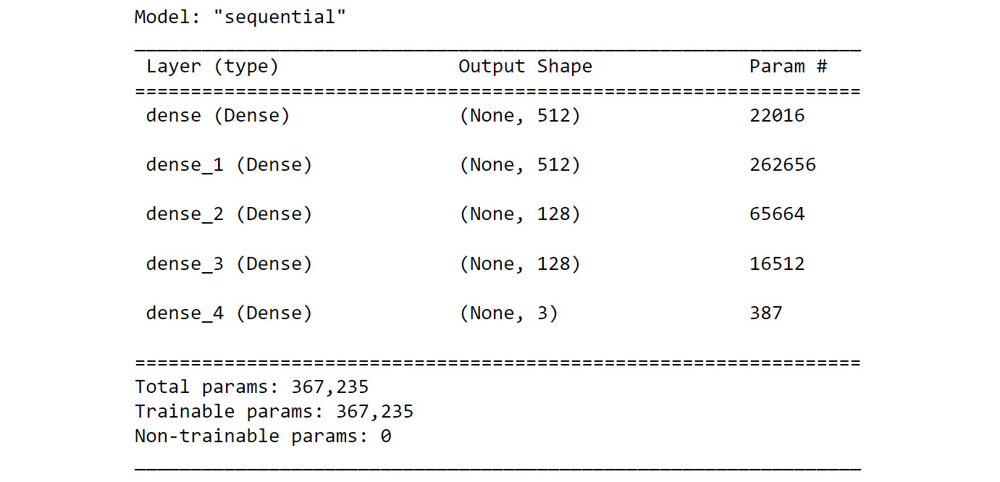


14. Instantiate a `SparseCategoricalCrossentropy()` function
    from `tf.keras.losses` and save it in a variable called
    `loss`:
    
    ```
    loss = tf.keras.losses.SparseCategoricalCrossentropy()
    ```


15. Instantiate `Adam()` from `tf.keras.optimizers`
    with `0.001` as the learning rate and save it in a
    variable called `optimizer`:
    
    ```
    optimizer = tf.keras.optimizers.Adam(0.001)
    ```


16. Compile the model using the `compile()` method, and
    specify the optimizer and loss you created in *steps 14* and *15*
    and `accuracy` as the metric to be displayed:
    
    ```
    model.compile(optimizer=optimizer, loss=loss, \
                  metrics=['accuracy'])
    ```


17. Start the model training process using the `fit()` method
    for five epochs and split the data into a validation set with 20% of
    the data:

    
    ```
    model.fit(data, target, epochs=5, validation_split=0.2)
    ```


    The expected output will be as follows:

    
    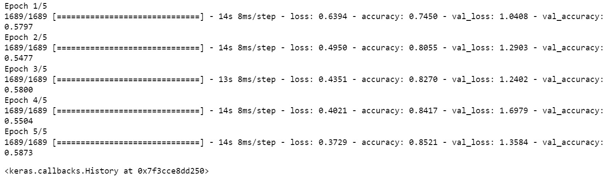


    The preceding output reveals that the model is overfitting. It
    achieved an accuracy score of `0.85` on the training set
    and only `0.58` on the validation set. Now, train another
    model with L2 regularization.

18. Create five fully connected layers similar to the previous model\'s
    and specify the L2 regularizer for the
    `kernel_regularizer` parameters. Use the
    value `0.001` for the regularizer factor. Save the layers
    in five variables, called `reg_fc1`, `reg_fc2`,
    `reg_fc3`, `reg_fc4`, and `reg_fc5`:
    
    ```
    reg_fc1 = Dense(512, input_shape=(42,), activation='relu', \
                    kernel_regularizer=tf.keras.regularizers\
                                         .l2(l=0.1))
    reg_fc2 = Dense(512, activation='relu', \
                    kernel_regularizer=tf.keras.regularizers\
                                         .l2(l=0.1))
    reg_fc3 = Dense(128, activation='relu', \
                    kernel_regularizer=tf.keras.regularizers\
                                         .l2(l=0.1))
    reg_fc4 = Dense(128, activation='relu', \
                    kernel_regularizer=tf.keras.regularizers\
                                         .l2(l=0.1))
    reg_fc5 = Dense(3, activation='softmax')
    ```


19. Instantiate a sequential model using
    `tf.keras.Sequential()`, store it in a variable called
    `model2`, and add sequentially all five fully connected
    layers to the model using the `add()` method:
    
    ```
    model2 = tf.keras.Sequential()
    model2.add(reg_fc1)
    model2.add(reg_fc2)
    model2.add(reg_fc3)
    model2.add(reg_fc4)
    model2.add(reg_fc5)
    ```


20. Print the summary of the model:

    
    ```
    model2.summary()
    ```


    The expected output will be as follows:

    
    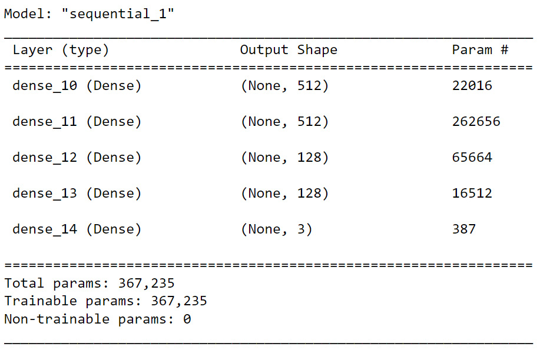


21. Compile the model using the `compile()` method, and
    specify the optimizer and loss you created in *steps 14* and *15*
    and `accuracy` as the metric to be displayed:
    
    ```
    model2.compile(optimizer=optimizer, loss=loss, \
                   metrics=['accuracy'])
    ```


22. Start the model training process using the `fit()` method
    for five epochs and split the data into a validation set with 20% of
    the data:

    
    ```
    model2.fit(data, target, epochs=5, validation_split=0.2)
    ```


    The expected output will be as follows:

    
    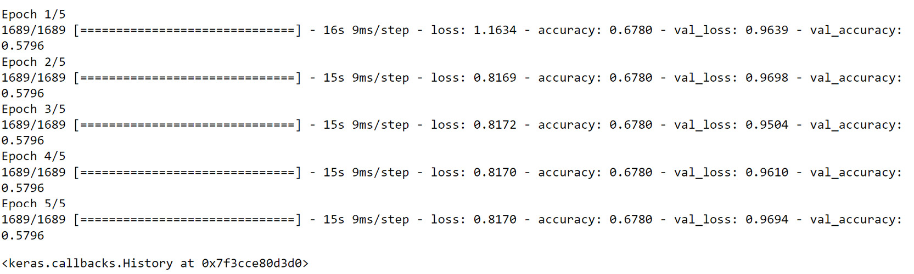


With the addition of L2 regularization, the model now has similar
accuracy scores between the training (`0.68`) and test
(`0.58`) sets. The model is not overfitting as much as before,
but its performance is not great.

Now that you know how to apply L1 and L2 regularization to neural
networks, the next section will introduce another regularization
technique, called **dropout**.

Dropout Regularization
----------------------

Unlike L1 and L2 regularization, dropout is a regularization technique
specific to neural networks. The logic behind it is very simple: the
networks will randomly change the weights of some features to
`0`. This will force the model to rely on other features that
would have been ignored and, therefore, bump up their weights.

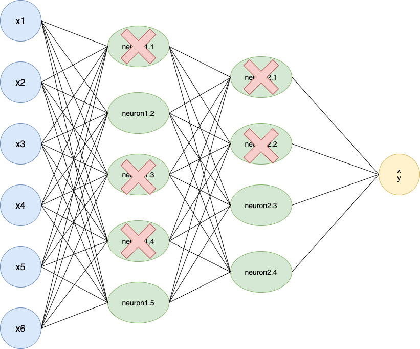


The preceding example shows an architecture with a dropout of 50%. This
means that 50% of the units of the model are turned off at each
iteration. The following code snippet shows you how to create a dropout
layer of 50% in TensorFlow:


```
from tensorflow.keras.layers import Dropout
do = Dropout(0.5)
```


In the next exercise, you will extend the previous model by applying
dropout.

Exercise 6.02: Predicting a Connect-4 Game Outcome Using Dropout
----------------------------------------------------------------

In this exercise, you will be using the same dataset as for *Exercise
6.01*, *Predicting a Connect-4 Game Outcome Using the L2 Regularizer*.
You will build and train a multi-class model in TensorFlow that will
predict the class outcome for player 1 in the game Connect-4 using the
dropout technique as a regularizer:

Note

The dataset can be accessed here: [https://github.com/fenago/deep-learning-essentials/blob/main/Lab06/dataset/connect-4.csv].

The original dataset can be found here:
[http://archive.ics.uci.edu/ml/datasets/Connect-4].

1.  Open a new Jupyter notebook.

2.  Import the pandas library and use `pd` as the alias:
    
    ```
    import pandas as pd
    ```


3.  Create a variable, `file_url`, to store the URL of the
    dataset:
    
    ```
    file_url = 'https://raw.githubusercontent.com/fenago'\
               '/deep-learning-essentials/main/Lab06/dataset'\
               '/connect-4.csv'
    ```


4.  Load the dataset into a DataFrame, `data`, using the
    `read_csv()` function and provide the URL of the CSV file.
    Print the first five rows using the `head()` function:

    
    ```
    data = pd.read_csv(file_url)
    data.head()
    ```


    The expected output will be as follows:

    
    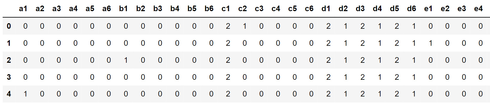


5.  Extract the target variable (the column called `class`)
    using the `pop()` method, and save it in a variable called
    `target`:
    
    ```
    target = data.pop('class')
    ```


6.  Import the TensorFlow library and use `tf` as the alias.
    Then, import the `Dense` class from
    `tensorflow.keras.layers`:
    
    ```
    import tensorflow as tf
    from tensorflow.keras.layers import Dense
    ```


7.  Set the seed as `8` to get reproducible results:
    
    ```
    tf.random.set_seed(8)
    ```


8.  Instantiate a sequential model using
    `tf.keras.Sequential()` and store it in a variable called
    `model`:
    
    ```
    model = tf.keras.Sequential()
    ```


9.  Create a fully connected layer of `512` units with
    `Dense()` and specify ReLu as the activation function and
    the input shape as `(42,)`, which corresponds to the
    number of features from the dataset. Save it in a variable called
    `fc1`:
    
    ```
    fc1 = Dense(512, input_shape=(42,), activation='relu')
    ```


10. Create three fully connected layers of `512`,
    `128`, and `128` units with `Dense()`
    and specify ReLu as the activation function. Save them in three
    variables, called `fc2`, `fc3`, and
    `fc4`, respectively:
    
    ```
    fc2 = Dense(512, activation='relu')
    fc3 = Dense(128, activation='relu')
    fc4 = Dense(128, activation='relu')
    ```


11. Create a fully connected layer of three units (corresponding to the
    number of classes) with `Dense()` and specify softmax as
    the activation function. Save it in a variable called
    `fc5`:
    
    ```
    fc5 = Dense(3, activation='softmax')
    ```


12. Sequentially add all five fully connected layers to the model with a
    dropout layer of `0.75` in between each of them using the
    `add()` method:
    
    ```
    model.add(fc1)
    model.add(Dropout(0.75))
    model.add(fc2)
    model.add(Dropout(0.75))
    model.add(fc3)
    model.add(Dropout(0.75))
    model.add(fc4)
    model.add(Dropout(0.75))
    model.add(fc5)
    ```


13. Print the summary of the model:

    
    ```
    model.summary()
    ```


    The expected output will be as follows:

    
    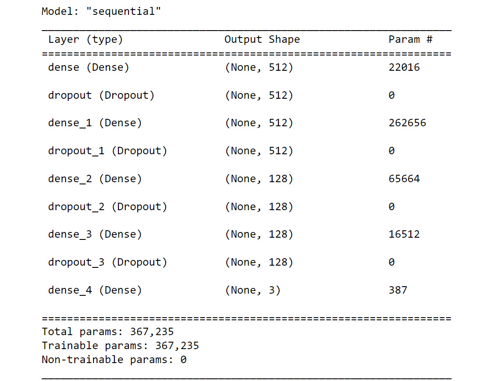


14. Instantiate a `SparseCategoricalCrossentropy()` function
    from `tf.keras.losses` and save it in a variable called
    `loss`:
    
    ```
    loss = tf.keras.losses.SparseCategoricalCrossentropy()
    ```


15. Instantiate `Adam()` from `tf.keras.optimizers`
    with `0.001` as the learning rate and save it in a
    variable called `optimizer`:
    
    ```
    optimizer = tf.keras.optimizers.Adam(0.001)
    ```


16. Compile the model using the `compile()` method, specify
    the optimizer and loss, and set `accuracy` as the metric
    to be displayed:
    
    ```
    model.compile(optimizer=optimizer, loss=loss, \
                  metrics=['accuracy'])
    ```


17. Start the model training process using the `fit()` method
    for five epochs and split the data into a validation set with 20% of
    the data:

    
    ```
    model.fit(data, target, epochs=5, validation_split=0.2)
    ```


    The output will be as follows:

    
    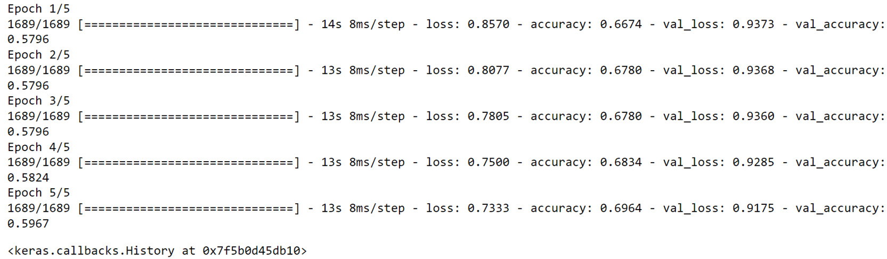


With the addition of dropout, the model now has similar accuracy scores
between the training (`0.69`) and test (`0.59`)
sets. The model is not overfitting as much as before, but its
performance is still less than ideal.

You have now seen how to apply L1, L2, or dropout as regularizers for a
model. In deep learning, there is another very simple technique that you
can apply to avoid overfitting---that is, early stopping.

Early Stopping
--------------

Another reason why neural networks overfit is due to the training
process. The more you train the model, the more it will try to improve
its performance. By training the model for a longer duration (more
epochs), it will at some point start finding patterns that are only
relevant to the training set. In such a case, the difference between the
scores of the training and test (or validation) sets will start
increasing after a certain number of epochs.

To prevent this situation, you can stop the model training when the
difference between the two sets starts to increase. This technique is
called **early stopping**.

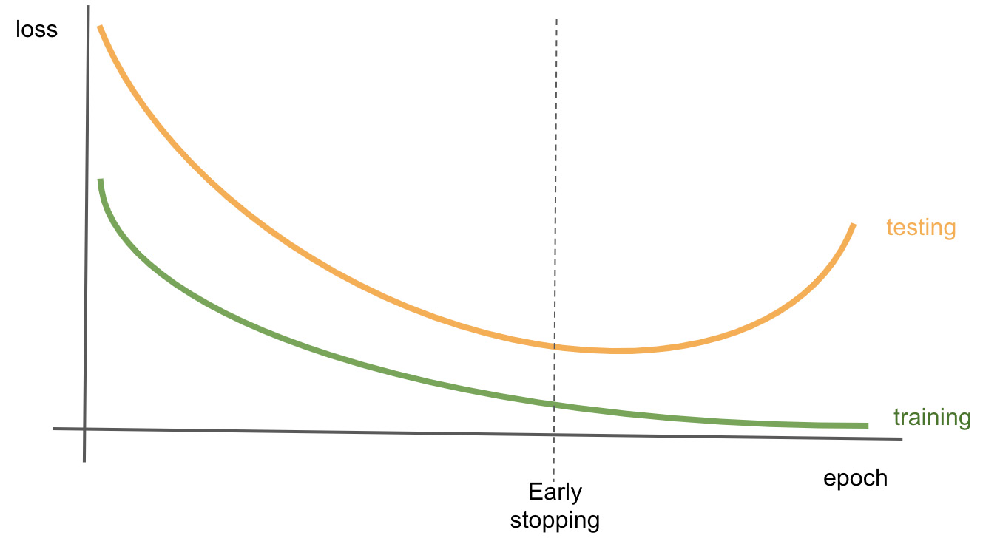


The preceding graph shows the loss value of a model on the training and
test (or validation) sets according to the number of epochs. In early
epochs, the loss value is quite different between the two sets. As the
training goes on, the models start learning the relevant patterns for
making predictions and both losses converge. But after a while, they
start diverging. The loss of the training set keeps decreasing while the
one for the test (or validation) set is increasing. You can observe that
the model is overfitting and is optimizing only for the training set.
Stopping the training at the point when the difference between the two
losses starts to increase prevents the model from overfitting.

In TensorFlow, you can achieve this by setting up callbacks that analyze
the performance of the models at each epoch and compare its score
between the training and test sets. To define an early stopping
callback, you will do the following:


```
from tensorflow.keras.callbacks import EarlyStopping
EarlyStopping(monitor='val_accuracy', patience=5)
```


The preceding code shows you how to instantiate an
`EarlyStopping` class that will monitor the accuracy score of
the validation set and wait for five successive epochs with no
improvement before stopping the training process.

In the next activity, you will practice applying both L1 and L2
regularization to a model.

Activity 6.01: Predicting Income with L1 and L2 Regularizers
------------------------------------------------------------

The `census-income-train.csv` dataset contains weighted census
data extracted from the 1994 and 1995 current population surveys
conducted by the US Census Bureau. The dataset is the subset of the
original dataset shared by the US Census Bureau. In this activity, you
are tasked with building and training a regressor to predict the income
of a person based on their census data. The dataset can be accessed
here: [https://raw.githubusercontent.com/fenago/deep-learning-essentials/main/Lab06/dataset/census-income-train.csv].

The following steps will help you to complete the activity:

1.  Open a new Jupyter notebook.

2.  Import the required libraries.

3.  Create a list called `usecols` containing the column names
    `AAGE`, `ADTIND`, `ADTOCC`,
    `SEOTR`, `WKSWORK`, and `PTOTVAL`.

4.  Load the data using the `read_csv()` method.

5.  Split the data into training (the first 15,000 rows) and test (the
    last 5,000 rows) sets.

6.  Build the multi-class classifier with five fully connected layers
    of, respectively, `512`, `512`, `128`,
    `128`, and `26` units.

7.  Train the model on the training set.

    The expected output will be as follows:

    
    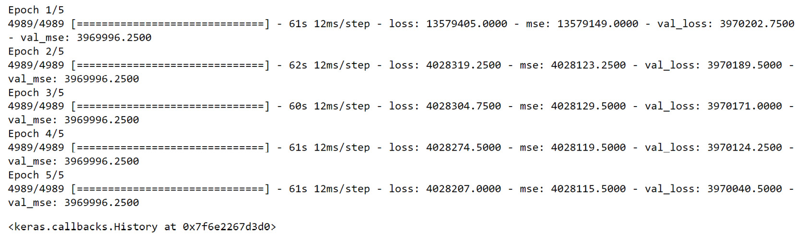


In the section ahead, you will see how to tune hyperparameters to
achieve better results.


Hyperparameter Tuning
=====================


Previously, you saw how to deal with a model that is overfitting by
using different regularization techniques. These techniques help the
model to better generalize to unseen data but, as you have seen, they
can also lead to inferior performance and make the model underfit.

With neural networks, data scientists have access to different
hyperparameters they can tune to improve the performance of a model. For
example, you can try different learning rates and see whether one leads
to better results, you can try different numbers of units for each
hidden layer of a network, or you can test to see whether different
ratios of dropout can achieve a better trade-off between overfitting
and underfitting.

However, the choice of one hyperparameter can impact the effect of
another one. So, as the number of hyperparameters and values you want to
tune grows, the number of combinations to be tested will increase
exponentially. It will also take a lot of time to train models for all
these combinations---especially if you have to do it manually. There are
some packages that can automatically scan the hyperparameter search
space you defined and find the best combination overall for you. In the
section ahead, you will see how to use one of them: Keras Tuner.

Keras Tuner
-----------

Unfortunately, this package is not included in TensorFlow. You will need
to install it manually by running the following command:


```
pip install keras-tuner==1.0.1
```


This package is very simple to use. There are two concepts to
understand: **hyperparameters** and **tuners**.

Hyperparameters are the classes used to define a parameter that will be
assessed by the tuner. You can use different types of hyperparameters.
The main ones are the following:

-   `hp.Boolean`: A choice between `True` and
    `False`
-   `hp.Int`: A choice with a range of integers
-   `hp.Float`: A choice with a range of decimals
-   `hp.Choice`: A choice within a list of possible values

The following code snippet shows you how to define a hyperparameter
called `learning_rate` that can only take one of four
values---`0.1`, `0.01`, `0.001`,
or `0.0001`:


```
hp.Choice('learning_rate', values = [0.1, 0.01, 0.001, 0.0001])
```


A tuner in the Keras Tuner package is an algorithm that will look at the
hyperparameter search space, test some combinations, and find the one
that gives the best result. The Keras Tuner package provides different
tuners, and in the section ahead, you will look at three of them:
**random search**, **Hyperband**, and **Bayesian optimization**.

Once defined with the algorithm of your choice, you can call the
`search()` method to start the hyperparameter tuning process
on the training and test sets, as follows:


```
tuner.search(X_train, y_train, validation_data=(X_test, y_test))
```


Once the search is complete, you can access the best combination with
`get_best_hyperparameters()` and then look specifically at one
of the hyperparameters you defined:


```
best_hps = tuner.get_best_hyperparameters()[0]
best_hps.get('learning_rate')
```


Finally, the `hypermodel.build()` method will instantiate a
TensorFlow Keras model with the best hyperparameters found:


```
model = tuner.hypermodel.build(best_hps)
```


It\'s as simple as that. Now, let\'s have a look at the random search
tuner.

Random Search
-------------

Random search is one of the available algorithms in this package. As its
name implies, it randomly defines the combinations to be tested by
sampling through the search space. Even though this algorithm doesn\'t
test every single possible combination, random search provides very good
results.

Note

The algorithm that tests every single combination of the search space is
called grid search.

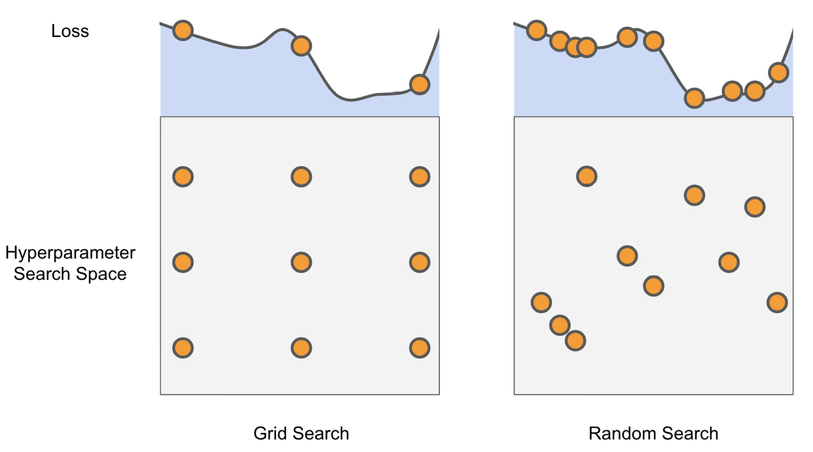


The preceding figure shows an example of the difference between grid
search and random search. You can see that grid search splits the search
space into a grid and tests each of the combinations, but some may lead
to the same loss value, which makes it less efficient. On the other
side, random search covers the search space more efficiently and helps
find the optimal solution.

In Keras Tuner, before instantiating a tuner, you need to define a
model-building function that will define the architecture of the
TensorFlow Keras model to be trained with the hyperparameters you want
to test. Here is an example of such a function:


```
def model_builder(hp):
    model = tf.keras.Sequential()
    hp_lr = hp.Choice('learning_rate', \
                      values = [0.1, 0.01, 0.001, 0.0001])
    model.add(Dense(512, input_shape=(100,), activation='relu'))
    model.add(Dense(128, activation='relu'))
    model.add(Dense(10, activation='softmax'))
    loss = tf.keras.losses.SparseCategoricalCrossentropy()
    optimizer = tf.keras.optimizers.Adam(hp_lr)
    model.compile(optimizer=optimizer, loss=loss, \
                  metrics=['accuracy'])
    return model
```


In the preceding code snippet, you created a model composed of three
fully connected layers of `512`, `128`, and
`10` units that will be trained with a
categorical cross-entropy loss function and the Adam optimizer. You
defined the `learning_rate` hyperparameter that will be
assessed by Keras Tuner.

Once the model-building function is defined, you can instantiate a
random search tuner like the following:


```
import kerastuner as kt
tuner = kt.RandomSearch(model_builder, objective='val_accuracy', \
                        max_trials=10)
```


In the preceding code, you instantiated a `RandomSearch` tuner
that will look at the model and hyperparameters defined in the
`model_builder` function using the validation accuracy as the
`objective` metric and will run for a maximum of
`10` trials.

In the next exercise, you will use random search to find the best set of
hyperparameters for a model.

Exercise 6.03: Predicting a Connect-4 Game Outcome Using Random Search from Keras Tuner
---------------------------------------------------------------------------------------

In this exercise, you will be using the same dataset as for *Exercise
6.01*, *Predicting a Connect-4 Game Outcome Using the L2 Regularizer*.
You will build and train a multi-class model in TensorFlow that will
predict the class outcome for player 1 in the game Connect-4 using the
Keras Tuner package to find the best regularization factor for L2
regularization through random search:

Note

The dataset can be accessed here: [https://github.com/fenago/deep-learning-essentials/blob/main/Lab06/dataset/connect-4.csv].

The original dataset can be found here:
[http://archive.ics.uci.edu/ml/datasets/Connect-4].

1.  Open a new Jupyter notebook.

2.  Import the pandas library and use `pd` as the alias:
    
    ```
    import pandas as pd
    ```


3.  Create a variable called `file_url` that contains the URL
    to the dataset:
    
    ```
    file_url = 'https://raw.githubusercontent.com/fenago'\
              '/deep-learning-essentials/main/Lab06/dataset'\
              '/connect-4.csv'
    ```


4.  Load the dataset into a DataFrame called `data` using the
    `read_csv()` method and provide the URL to the CSV file.
    Print the first five rows using the `head()` method:

    
    ```
    data = pd.read_csv(file_url)
    data.head()
    ```


    The output will be as follows:

    
    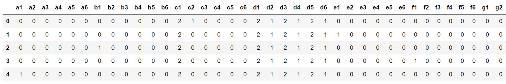


5.  Extract the target variable (the column called `class`)
    using the `pop()` method and save it in a variable called
    `target`:
    
    ```
    target = data.pop('class')
    ```


6.  Import `train_test_split` from
    `sklearn.model_selection`:
    
    ```
    from sklearn.model_selection import train_test_split
    ```


7.  Split the data into training and test sets using
    `train_test_split()`, with 20% of the data for testing and
    `42` for `random_state`:
    
    ```
    X_train, X_test, y_train, y_test = train_test_split\
                                       (data, target, \
                                        test_size=0.2, \
                                        random_state=42)
    ```


8.  Install the `kerastuner` package and then import it and
    assign it the `kt` alias:
    
    ```
    !pip install keras-tuner==1.0.1
    import kerastuner as kt
    ```


9.  Import the TensorFlow library and use `tf` as the alias.
    Then, import the `Dense` class from
    `tensorflow.keras.layers`:
    
    ```
    import tensorflow as tf
    from tensorflow.keras.layers import Dense
    ```


10. Set the seed as `8` using `tf.random.set_seed()`
    to get reproducible results:
    
    ```
    tf.random.set_seed(8)
    ```


11. Define a function called `model_builder` that will create
    a sequential model with the same architecture as *Exercise 6.02*,
    *Predicting a Connect-4 Game Outcome Using Dropout*, with L2
    regularization, but this time, provide an `hp.Choice`
    hyperparameter for the regularization factor:
    
    ```
    def model_builder(hp):
        model = tf.keras.Sequential()
        p_l2 = hp.Choice('l2', values = [0.1, 0.01, 0.001, 0.0001])
        reg_fc1 = Dense(512, input_shape=(42,), activation='relu', \
                        kernel_regularizer=tf.keras.regularizers\
                                             .l2(l=hp_l2))
        reg_fc2 = Dense(512, activation='relu', \
                        kernel_regularizer=tf.keras.regularizers\
                                             .l2(l=hp_l2))
        reg_fc3 = Dense(128, activation='relu', \
                        kernel_regularizer=tf.keras.regularizers\
                                             .l2(l=hp_l2))
        reg_fc4 = Dense(128, activation='relu', \
                        kernel_regularizer=tf.keras.regularizers\
                                             .l2(l=hp_l2))
        reg_fc5 = Dense(3, activation='softmax')
      
        model.add(reg_fc1)
        model.add(reg_fc2)
        model.add(reg_fc3)
        model.add(reg_fc4)
        model.add(reg_fc5)
        loss = tf.keras.losses.SparseCategoricalCrossentropy()
        optimizer = tf.keras.optimizers.Adam(0.001)
        model.compile(optimizer = optimizer, loss = loss, \
                      metrics = ['accuracy'])
        return model
    ```


12. Instantiate a `RandomSearch` tuner and assign
    `val_accuracy` to `objective` and `10`
    to `max_trials`:
    
    ```
    tuner = kt.RandomSearch(model_builder, objective='val_accuracy', \
                            max_trials=10)
    ```


13. Launch the hyperparameter search with the `search()`
    method on the training and test sets:
    
    ```
    tuner.search(X_train, y_train, validation_data=(X_test, y_test))
    ```


14. Extract the best hyperparameter combination (index `0`)
    with `get_best_hyperparameters()` and save it in a
    variable called `best_hps`:
    
    ```
    best_hps = tuner.get_best_hyperparameters()[0]
    ```


15. Extract the best value for the `l2` regularization
    hyperparameter, save it in a variable called `best_l2`,
    and print its value:

    
    ```
    best_l2 = best_hps.get('l2')
    best_l2
    ```


    You should get the following result:

    
    ```
    0.0001
    ```


    The best value for the `l2` hyperparameter found by random
    search is `0.0001`.

16. Start the model training process using the `fit()` method
    for five epochs and use the test set for
    `validation_data`:

    
    ```
    model = tuner.hypermodel.build(best_hps)
    model.fit(X_train, y_train, epochs=5, \
              validation_data=(X_test, y_test))
    ```


    You will get the following output:

    
    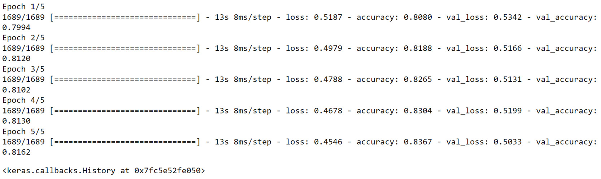


Using a random search tuner, you found the best value for L2
regularization (`0.0001`), which helped the model to achieve
an accuracy of `0.83` on the training set and `0.81`
on the test set. These scores are quite an improvement on those from
*Exercise 6.01*, *Predicting a Connect-4 Game Outcome Using the L2
Regularizer* (`0.69` for the training set and `0.59`
for the test set).

In the next section, you will use another Keras tuner, called Hyperband.

Hyperband
---------

Hyperband is another tuner available in the Keras Tuner package. Like
random search, it randomly picks candidates from the search space, but
more efficiently. The idea behind it is to test a set of combinations
for just one or two iterations, keeping only the best performers and
training them for longer. So, the algorithm doesn\'t waste time in
training non-performing combinations as with random search. Instead, it
simply discards them from the next run. Only the ones that achieve
higher performance are kept for longer training. To instantiate a
Hyperband tuner, execute the following command:


```
tuner = kt.Hyperband(model_builder, objective='val_accuracy', \
                     max_epochs=5)
```


This tuner takes a model-building function and an objective metric as
input parameters, as for random search. But it requires an additional
one, `max_epochs`, corresponding to the maximum number of
epochs a model is allowed to train for during the hyperparameter search.

Exercise 6.04: Predicting a Connect-4 Game Outcome Using Hyperband from Keras Tuner
-----------------------------------------------------------------------------------

In this exercise, you will be using the same dataset as for *Exercise
6.01*, *Predicting a Connect-4 Game Outcome Using the L2 Regularizer*.
You will build and train a multi-class model in TensorFlow that will
predict the class outcome for player 1 in the game Connect-4 using the
Keras Tuner package to find the best learning rate and the number of
units for the input layer through Hyperband:

Note

The dataset can be accessed here: [https://github.com/fenago/deep-learning-essentials/blob/main/Lab06/dataset/connect-4.csv].

The original dataset can be found here:
[http://archive.ics.uci.edu/ml/datasets/Connect-4].

1.  Open a new Jupyter notebook.

2.  Import the pandas library and use `pd` as the alias:
    
    ```
    import pandas as pd
    ```


3.  Create a variable called `file_url` that contains the URL
    to the dataset:
    
    ```
    file_url = 'https://raw.githubusercontent.com/fenago'\
               '/deep-learning-essentials/main/Lab06/dataset'\
               '/connect-4.csv'
    ```


4.  Load the dataset into a DataFrame called `data` using the
    `read_csv()` method and provide the URL to the CSV file.
    Print the first five rows using the `head()`  method:

    
    ```
    data = pd.read_csv(file_url)
    data.head()
    ```


    The output will be as follows:

    
    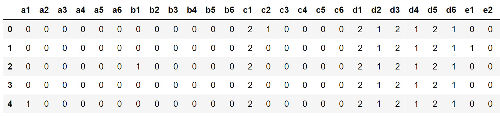


5.  Extract the target variable (`class`) using the
    `pop()` method, and save it in a variable called
    `target`:
    
    ```
    target = data.pop('class')
    ```


6.  Import `train_test_split` from
    `sklearn.model_selection`:
    
    ```
    from sklearn.model_selection import train_test_split
    ```


7.  Split the data into training and test sets using
    `train_test_split()`, with 20% of the data for testing and
    `42` for `random_state`:
    
    ```
    X_train, X_test, y_train, y_test = train_test_split\
                                       (data, target, \
                                        test_size=0.2, \
                                        random_state=42)
    ```


8.  Install the `keras-tuner` package, and then import it and
    assign it the `kt` alias:
    
    ```
    !pip install keras-tuner==1.0.1
    import kerastuner as kt
    ```


9.  Import the TensorFlow library and use `tf` as the alias,
    and then import the `Dense` class from
    `tensorflow.keras.layers`:
    
    ```
    import tensorflow as tf
    from tensorflow.keras.layers import Dense
    ```


10. Set the seed as `8` using `tf.random.set_seed()`
    to get reproducible results:
    
    ```
    tf.random.set_seed(8)
    ```


11. Define a function called `model_builder` to create a
    sequential model with the same architecture as *Exercise 6.02*,
    *Predicting a Connect-4 Game Outcome Using Dropout*, with L2
    regularization and a `0.0001` regularization factor. But,
    this time, provide a hyperparameter, `hp.Choice`, for the
    learning rate (`0.01`, `0.001`, or
    `0.0001`) and an `hp.Int` function for the
    number of units (between `128` and `512` with a
    step of `64`) for the input fully connected layer:
    
    ```
    def model_builder(hp):
        model = tf.keras.Sequential()
        hp_units = hp.Int('units', min_value=128, max_value=512, \
                          step=64)
        reg_fc1 = Dense(hp_units, input_shape=(42,), \
                        activation='relu', \
                        kernel_regularizer=tf.keras.regularizers\
                                             .l2(l=0.0001))
        reg_fc2 = Dense(512, activation='relu', \
                        kernel_regularizer=tf.keras.regularizers\
                                             .l2(l=0.0001))
        reg_fc3 = Dense(128, activation='relu', \
                        kernel_regularizer=tf.keras.regularizers\
                                             .l2(l=0.0001))
        reg_fc4 = Dense(128, activation='relu', \
                        kernel_regularizer=tf.keras.regularizers\
                                             .l2(l=0.0001))
        reg_fc5 = Dense(3, activation='softmax')
        model.add(reg_fc1)
        model.add(reg_fc2)
        model.add(reg_fc3)
        model.add(reg_fc4)
        model.add(reg_fc5)
        loss = tf.keras.losses.SparseCategoricalCrossentropy()
        hp_learning_rate = hp.Choice('learning_rate', \
                                     values = [0.01, 0.001, 0.0001])
        optimizer = tf.keras.optimizers.Adam(hp_learning_rate)
        model.compile(optimizer = optimizer, loss = loss, \
                      metrics = ['accuracy'])
        return model
    ```


12. Instantiate a Hyperband tuner, and assign `val_accuracy`
    to the `objective` metric and `5` to
    `max_epochs`:
    
    ```
    tuner = kt.Hyperband(model_builder, objective='val_accuracy', \
                         max_epochs=5)
    ```


13. Launch the hyperparameter search with `search()` on the
    training and test sets:
    
    ```
    tuner.search(X_train, y_train, validation_data=(X_test, y_test))
    ```


14. Extract the best hyperparameter combination (index `0`)
    with `get_best_hyperparameters()` and save it in a
    variable called `best_hps`:
    
    ```
    best_hps = tuner.get_best_hyperparameters()[0]
    ```


15. Extract the best value for the number of units for the input layer,
    save it in a variable called `best_units`, and print its
    value:

    
    ```
    best_units = best_hps.get('units')
    best_units
    ```


    You will get the following output:

    
    ```
    192
    ```


    The best value for the number of units of the input layer found by
    Hyperband is `192`.

16. Extract the best value for the learning rate, save it in a variable
    called `best_lr`, and print its value:
    
    ```
    best_lr = best_hps.get('learning_rate')
    best_lr
    ```


17. The output will be the following:

    
    ```
    0.001
    ```


    The best value for the learning rate hyperparameter found by
    Hyperband is `0.001`.

18. Start the model training process using the `fit()` method
    for five epochs and use the test set for
    `validation_data`:

    
    ```
    model.fit(X_train, y_train, epochs=5, \
              validation_data=(X_test, y_test))
    ```


    You will get the following output:

    
    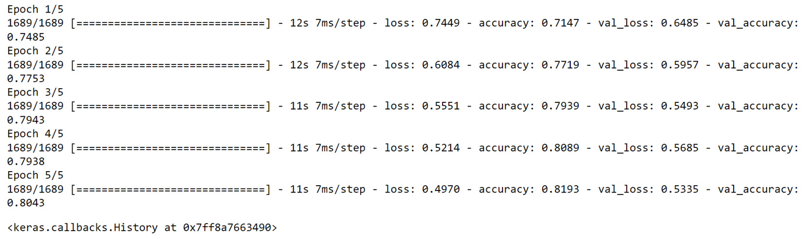


Using Hyperband as the tuner, you found the best number of units for the
input layer (`192`) and learning rate (`0.001`).
With these hyperparameters, the final model achieved an accuracy of
`0.81` on both the training and test sets. It is not
overfitting much and achieved a satisfactory accuracy score.

Another very popular tuner is Bayesian optimization, which you will
learn about in the following section.

Bayesian Optimization
---------------------

Bayesian optimization is another very popular algorithm used for
automatic hyperparameter tuning. It uses probabilities to determine the
best combination of hyperparameters. The objective is to iteratively
build a probability model that optimizes the objective function from a
set of hyperparameters. At each iteration, the probability model is
updated from the results obtained. Therefore, unlike random search and
Hyperband, Bayesian optimization takes past results into account to
improve new ones. The following code snippet will show you how to
instantiate a Bayesian optimizer in Keras Tuner:


```
tuner = kt.BayesianOptimization(model_builder, \
                                objective='val_accuracy', \
                                max_trials=10)
```


The expected parameters are similar to random search, including the
model-building function, the `objective` metric, and the
maximum number of trials.

In the following activity, you will use Bayesian optimization to predict
the income of a person.

Activity 6.02: Predicting Income with Bayesian Optimization from Keras Tuner
----------------------------------------------------------------------------

In this activity, you will use the same dataset as used in *Activity
6.01*, *Predicting Income with L1 and L2 Regularizers*. You are tasked
with building and training a regressor to predict the income of a person
based on their census data. You will perform automatic hyperparameter
tuning with Keras Tuner and find the best combination of hyperparameters
for the learning rate, the number of units for the input layer, and L2
regularization with Bayesian optimization.

The following steps will help you to complete the activity:

1.  Load the data with `read_csv()` from pandas.

2.  Extract the target variable with the `pop()` method.

3.  Split the data into training (the first 15,000 rows) and test (the
    last 5,000 rows) sets.

4.  Create the model-building function multi-class classifier with five
    fully connected layers of `512`, `512`,
    `128`, `128`, and `26` units and the
    three different hyperparameters to be tuned: the learning rate
    (between `0.01` and `0.001`), the number of
    units for the input layer (between `128` and
    `512` and a step of `64`), and L2 regularization
    (between `0.1`, `0.01`, and `0.001`).

5.  Find the best combination of hyperparameters with Bayesian
    optimization.

6.  Train the model on the training set with the best hyperparameters
    found.

    The expected output will be as follows:

    
    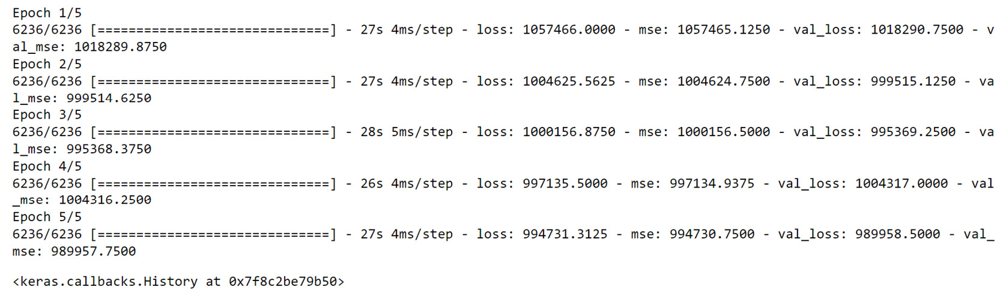


Summary
=======


You started your journey in this lab with an introduction to the
different scenarios of training a model. A model is overfitting when its
performance is much better on the training set than the test set. An
underfitting model is one that can achieve good results only after
training. Finally, a good model achieves good performance on both the
training and test sets.

Then, you encountered several regularization techniques that can help
prevent a model from overfitting. You first looked at the L1 and L2
regularizations, which add a penalty component to the cost function.
This additional penalty helps to simplify the model by reducing the
weights of some features. Then, you went through two different
techniques specific to neural networks: dropout and early stopping.
Dropout randomly drops some units in the model architecture and forces
it to consider other features to make predictions. Early stopping is a
mechanism that automatically stops the training of a model once the
performance of the test set starts to deteriorate.

After this, you learned how to use the Keras Tuner package for automatic
hyperparameter tuning. You considered three specific types of tuners:
random search, Hyperband, and Bayesian optimization. You saw how to
instantiate them, perform a hyperparameter search, and extract the best
values and model. This process helped you to achieve better performance
on the models trained for the exercises and activities.
