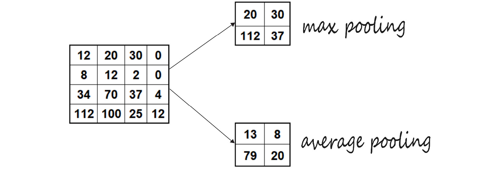

Lab 7: Convolutional Neural Networks
================================


Overview

In this lab, you will learn how **convolutional neural networks**
(**CNNs**) process image data. You will also learn how to correctly use
a CNN on image data.

By the end of the lab, you will be able to create your own CNN for
classification and object identification on any image dataset
using TensorFlow.


Introduction
============


This lab covers CNNs. CNNs use convolutional layers that are
well-suited to extracting features from images. They use learning
filters that correlate with the task at hand. Simply put, they are very
good at finding patterns in images.

In the previous lab, you explored regularization and hyperparameter
tuning. You used L1 and L2 regularization and added dropout to a
classification model to prevent overfitting on the `connect-4`
dataset.

You will now be shifting gears quite a bit as you dive into deep
learning with CNNs. In this lab, you will learn the fundamentals of
how CNNs process image data and how to apply those concepts to your own
image classification problem. This is truly where TensorFlow shines.


CNNs
====


CNNs share many common components with the ANNs you have built so far.
The key difference is the inclusion of one or more convolutional layers
within the network. Convolutional layers apply convolutions of input
data with filters, also known as kernels. Think of a **convolution** as
an **image transformer**. You have an input image, which goes through
the CNN and gives you an output label. Each layer has a unique function
or special ability to detect patterns such as curves or edges in an
image. CNNs combine the power of deep neural networks and kernel
convolutions to transform images and make these image edges or curves
easy for the model to see. There are three key components in a CNN:

-   **Input image**: The raw image data
-   **Filter/kernel**: The image transformation mechanism
-   **Output label**: The image classification

The following figure is an example of a CNN in which the image is input
into the network on the left-hand side and the output is generated on
the right-hand side. The image components are identified throughout the
hidden layers with more basic components, such as edges, identified in
earlier hidden layers. Image components combine in the hidden layers to
form recognizable features from the dataset. For example, in a CNN to
classify images into planes or cars, the recognizable features may be
filters that resemble a wheel or propellor. Combinations of these
features will be instrumental in determining whether the image is a
plane or a car.

Finally, the output layer is a dense layer used to determine the
specific output of the model. For a binary classification model, this
may be a dense layer with one unit with a sigmoid activation function.
For a more complex multi-class classification, it may be a dense layer
with many units, determined by the number of classes, and a softmax
activation function to determine one output label for each image
presented to the model.


A common CNN configuration includes a convolutional layer followed by a
pooling layer. These layers are often used together in this order, as
pairs (convolution and pooling). We\'ll get into the reason for this
later in the lab, but for now, think of these pooling layers as
decreasing the size of input images by summarizing the filter results.

Before you move deeper into convolutional layers, you first need to
understand what the data looks like from the computer\'s perspective.


Image Representation
====================


First, consider how a computer processes an image. To a computer, images
are numbers. To be able to work with images for classification or object
identification, you need to understand how a model transforms an image
input into data. A **pixel** in an image file is just a piece of data.

In the following figure, you can see an example of pixel values for a
grayscale image of the number eight. For the `28x28`-pixel
image, there are a total of `784` pixels. Each pixel has a
value between `0` and `255` identifying how light or
dark the pixel is. On the right side, there is one large column vector
with each pixel value listed. This is used by the model to identify the
image.


Now that you know what the input data looks like, it\'s time to get a
closer look at the convolutional process---more specifically, the
convolutional layer.


The Convolutional Layer
=======================


Think of a convolution as nothing more than an image transformer with
three key elements. First, there is an input image, then a filter, and
finally, a feature map.

This section will cover each of these in turn to give you a solid idea
of how images are filtered in a convolutional layer. The convolution is
the process of passing a filter window over the input data, which will
result in a map of activations known as a **feature map**. The input
data may be the input image to the model or the output of a prior,
intermediary layer of the model. The filter is generally a much smaller
array, such as `3x3` for two-dimensional data, in which the
specific values of the filter are learned during the training process.
The filter passes across the input data with a window size equal to the
size of the filter, then, the scalar product of the filter and section
of the input data is applied, producing what\'s known as an
**activation**. As this process continues across the entire input data
using the same filter, the map of activations is produced, also known as
the **feature map**.

This concept is illustrated in the following figure, which has two
convolutional layers, producing two sets of feature maps. After the
feature maps are produced from the first convolutional layer, they are
passed into the second convolutional layer. The feature map of the
second convolutional layer is passed into a classifier:


The distance, or number of steps, the filter moves with each operation
is known as the **stride**. If the filter goes off the edge, you can do
what\'s called **padding with zeros**. This way, the output map size is
the same as the input map size. This is called **same padding**.
However, if the filter cannot take its required stride without leaning
over the edge somewhat, it will count any value over the edge as
`0`. This is known as **valid padding**.

Let\'s recap some keywords. There\'s a **kernel**, which is a small
matrix that is used to apply an effect, and what you saw in the example
was a `2x2` kernel. There\'s **stride**, which is the number
of pixels that you move the kernel by. Lastly, there\'s **padding with
zeros** around the image, whether or not you add pixels. This ensures
that the output is the same size as the input.

Creating the Model
------------------

From the very first lab, you encountered different types of
dimensional tensors. One important thing to note is that you will only
be working with `Conv2D`. The layer name `Conv2D`
refers only to the movement of a **filter** or **kernel**. So, if you
recall the description of what the convolutional process is doing, it\'s
simply sliding a kernel across a 2D space. So, for a flat, square image,
the kernel only slides in two dimensions.

When you implement `Conv2D`, you need to pass in certain
parameters:

1.  The first parameter is `filter`. The filters are the
    dimensionality of the output space.
2.  Specify `strides`, which is how many pixels will move the
    kernel across.
3.  Then, specify `padding`, which is usually
    `valid` or `same` depending on whether you want
    an output that is of the same dimension as the input.
4.  Finally, you can also have `activation`. Here, you will
    specify what sort of activation you would like to apply to the
    outputs. If you don\'t specify an activation, it\'s simply a linear
    activation.

Before you continue, recall from *Lab 4*, *Regression and
Classification Models*, that a dense layer is one in which every neuron
is connected to every neuron in the previous layer. As you can see in
the following code, you can easily add a dense layer with
`model.add(Dense(32))`. `32` is the number of
neurons, followed by the input shape. **AlexNet** is an example of a CNN
with multiple convolution kernels that extracts interesting information
from an image.


Note

AlexNet is the name of a CNN designed by Alex Krizhevsky.

A sequential model can be used to build a CNN. Different methods can be
used to add a layer; here, we will use the framework of sequentially
adding layers to the model using the model\'s `add` method or
passing in a list of all layers when the model is instantiated:


```
model = models.Sequential()
model.add(Dense(32, input_shape=(250,)))
```


The following is a code block showing the code that you\'ll be using
later in the chapter:


```
our_cnn_model = models.Sequential([layers.Conv2D\
                                   (filters = 32, \
                                    kernel_size = (3,3),
                                    input_shape=(28, 28, 1)), \
                                   layers.Activation('relu'), \
                                   layers.MaxPool2D\
                                   (pool_size = (2, 2)), \
                                   layers.Conv2D\
                                   (filters = 64, \
                                    kernel_size = (3,3)), \
                                   layers.Activation('relu'), \
                                   layers.MaxPool2D\
                                   (pool_size = (2,2)), \
                                   layers.Conv2D\
                                   (filters = 64, \
                                    kernel_size = (3,3)), \
                                    layers.Activation('relu')])
```


Use the `Conv2D` layer when working with data that you want to
convolve in two dimensions, such as images. For parameters, set the
number of filters to `32`, followed by the kernel size of
`3x3` pixels (`(3, 3)` in the example). In the first
layer, you will always need to specify the `input_shape`
dimensions, the height, width, and depth. `input_shape` is the
size of the images you will be using. You can also select the activation
function to be applied at the end of the layer.

Now that you have learned how to build a CNN layer in your model, you
will practice doing so in your first exercise. In this exercise, you
will build the first constructs of a CNN, initialize the model, and add
a single convolutional layer to the model.

Exercise 7.01: Creating the First Layer to Build a CNN
------------------------------------------------------

As a TensorFlow freelancer, you\'ve been asked to show your potential
employer a few lines of code that demonstrate how you might build the
first layer in a CNN. They ask that you keep it simple but provide the
first few steps to create a CNN layer. In this exercise, you will
complete the first step in creating a CNN---that is, adding the first
convolutional layer.

Follow these steps to complete this exercise:

1.  Open a new Jupyter notebook.

2.  Import the TensorFlow library and the `models` and
    `layers` classes from `tensorflow.keras`:
    
    ```
    import tensorflow as tf
    from tensorflow.keras import models, layers
    ```


3.  Check the TensorFlow version:

    
    ```
    print(tf.__version__)
    ```


    You should get the following output:

    
    ```
    2.6.0
    ```


4.  Now, use `models.Sequential` to create your model. The
    first layer (`Conv2D`) will require the number of nodes
    (`filters`), the filter size (`3,3`), and the
    shape of the input. `input_shape` for your first layer
    will determine the shape of your input images. Add a ReLU activation
    layer:

    
    ```
    image_shape = (300, 300, 3)
    our_first_layer = models.Sequential([layers.Conv2D\
                                        (filters = 16, \
                                        kernel_size = (3,3), \
                                        input_shape = image_shape), \
                                        layers.Activation('relu')])
    ```


    Simple enough. You have just taken the first steps in creating your
    first CNN.

You will now move on to the type of layer that usually follows a
convolutional layer---the pooling layer.


Pooling Layer
=============


Pooling is an operation that is commonly added to a CNN to reduce the
dimensionality of an image by reducing the number of pixels in the
output from the convolutional layer it follows. **Pooling layers**
shrink the input image to increase computational efficiency and reduce
the number of parameters to limit the risk of **overfitting**.

A **pooling layer** immediately follows a convolution layer and is
considered another important part of the CNN structure. This section
will focus on two types of pooling:

-   Max pooling
-   Average pooling

Max Pooling
-----------

With max pooling, a filter or kernel only retains the largest pixel
value from an input matrix. To get a clearer idea of what is happening,
consider the following example. Say you have a `4x4` input.
This first step in max pooling would be to divide the `4x4`
matrix into four quadrants. Each quadrant will be of the size
`2x2`. Apply a filter of size `2`. This means that
your filter will look exactly like a `2x2` matrix.

Begin by placing the filter on top of your input. For max pooling, this
filter will look at all values within the `2x2` area that it
covers. It will find the largest value, send that value to your output,
and store it there in the upper-left corner of the feature map.


Then, the filter will move over to the right and repeat the same
process, storing the value in the upper-right corner of the
`2x2` matrix. Once this operation is complete, the filter will
slide down and start at the far left, again repeating the same process,
looking for the largest (or maximum) value, and then storing it in the
correct place on the `2x2` matrix.

Recall that the sliding movement is referred to as **stride**. So, the
filter was moving over two places. This would mean it has a stride value
of `2`. This process is repeated until the maximum values in
each of the four quadrants are `8`, `5`,
`7`, and `5`, respectively. Again, to get these
numbers, you used a filter of `2x2` and filtered for the
largest number within that `2x2` matrix.

So, in this case, you had a stride of two because you moved two pixels.
These are the **hyperparameters** for max pooling. The values of
`filter` and `stride` are `2`. *Figure
7.6* shows what an implementation of max pooling might look like with a
filter size of 3 x 3 and a `stride` of `1`.

There are two steps shown in *Figure 7.6*. Start at the upper left of
the feature map. With the `3x3` filter, you would look at the
following numbers, `2`, `8`, `2`,
`5`, `4`, `9`, `8`,
`4`, and `6`, and choose the largest value,
`9`. The `9` would be placed in the upper-left box
of our pooled feature map. With a stride of `1`, you would
slide the filter one place to the right, as shown in gray.

Now, look for the largest values from `8`, `2`,
`1`, `4`, `9`, `6`,
`4`, `6`, and `4`. Again, `9` is
the largest value, so add a `9` to the middle place in the top
row of the pooled feature map (shown in gray).


The preceding pool size is `(2, 2)`. It specifies factors that
you will downscale with. Here\'s a more detailed look at what you could
do to implement `MaxPool2D`:


```
layers.MaxPool2D(pool_size=(2, 2), strides=None, \
                 padding='valid')
```


**MaxPool2D**: The preceding code snippet introduces a
`MaxPool2D` instance. The code snippet initializes a max
pooling layer with a pool size of `2x2` and the
`stride` value is not specified, so it will default to the
pool size value. The `padding` parameter is set to
`valid`, meaning there is no padding added. The following code
snippet demonstrates its use within a CNN:


```
image_shape = (300, 300, 3)
our_first_model = models.Sequential([
    layers.Conv2D(filters = 16, kernel_size = (3,3), \
                  input_shape = image_shape), \
    layers.Activation('relu'), \
    layers.MaxPool2D(pool_size = (2, 2)), \
    layers.Conv2D(filters = 32, kernel_size = (3,3)), \
    layers.Activation('relu')])
```


In the preceding example, a sequential model is created with two
convolutional layers, after each layer is a ReLU activation function,
and after the activation function of the first convolutional layer is a
max pooling layer.

Now that you have explored max pooling, let\'s look at the other type of
pooling: average pooling.

Average Pooling
---------------

**Average pooling** operates in a similar way to max pooling, but
instead of extracting the largest weight value within the filter, it
calculates the average. It then passes along that value to the feature
map. *Figure 7.7* highlights the difference between max pooling and
average pooling.

In *Figure 7.7*, consider the `4x4` matrix on the left. The
average of the numbers in the upper-left quadrant is `13`.
This would be the average pooling value. The same upper-left quadrant
would output `20` to its feature map if it were max pooled
because `20` is the largest value within the filter frame.
This is a comparison between max pooling and average pooling with
hyperparameters, with the `filter` and `stride`
parameters both set to `2`:




For average pooling, you would use `AveragePooling2D` in place
of `MaxPool2D`.

To implement the average pooling code, you could use the following:


```
layers.AveragePooling2D(pool_size=(2, 2), strides=None, \
                        padding='valid')
```


**AveragePooling2D**: The preceding code snippet demonstrates how to
invoke an `AveragePooling2D` layer. In a similar manner to max
pooling, the `pool_size`, `strides`, and
`padding` parameters can be modified. The following code
snippet demonstrates its use within a CNN:


```
image_shape = (300, 300, 3)
our_first_model = models.Sequential([
    layers.Conv2D(filters = 16, kernel_size = (3,3), \
                  input_shape = image_shape), \
    layers.Activation('relu'), \
    layers.AveragePooling2D(pool_size = (2, 2)), \
    layers.Conv2D(filters = 32, kernel_size = (3,3)), \
    layers.Activation('relu')])
```


It\'s a good idea to keep in mind the benefits of using pooling layers.
One of these benefits is that if you down-sample the image, the *image
shrinks*. This means that you have *less data to process* and fewer
multiplications to do, which, of course, speeds things up.

Up to this point, you\'ve created your first CNN layer and learned how
to use pooling layers. Now you\'ll use what you\'ve learned so far to
build a pooling layer for the CNN in the following exercise.

Exercise 7.02: Creating a Pooling Layer for a CNN
-------------------------------------------------

You receive an email from your potential employer for the TensorFlow
freelancing job that you applied for in *Exercise 7.01*, *Creating the
First Layer to Build a CNN*. The email asks whether you can show how you
would code a pooling layer for a CNN. In this exercise, you will build
your base model by adding a pooling layer, as requested by your
potential employer:

1.  Open a new Jupyter notebook and import the TensorFlow library:
    
    ```
    import tensorflow as tf
    from tensorflow.keras import models, layers
    ```


2.  Create your model using `models.Sequential`. The first
    layer, `Conv2D`, will require the number of nodes, the
    filter size, and the shape of the tensor, as in the previous
    exercise. It will be followed by an activation layer, a node at the
    end of the neural network:
    
    ```
    image_shape = (300, 300, 3)
    our_first_model = models.Sequential([
        layers.Conv2D(filters = 16, kernel_size = (3,3), \
                      input_shape = image_shape), \
        layers.Activation('relu')])
    ```


3.  Now, add a `MaxPool2D` layer by using the model\'s
    `add` method:

    
    ```
    our_first_model.add(layers.MaxPool2D(pool_size = (2, 2))
    ```


    In this model, you have created a CNN with a convolutional layer,
    followed by a ReLU activation function then a max pooling layer. The
    models take images of size `300x300` with three color
    channels.

Now that you have successfully added a `MaxPool2D` layer to
your CNN, the next step is to add a **flattening layer** so that your
model can use all the data.

Flattening Layer
----------------

Adding a flattening layer is an important step as you will need to
provide the neural network with data in a form that it can process.
Remember that after you perform the convolution operation, it will still
be multi-dimensional. So, to change your data back into one-dimensional
form, you will use a flattening layer. To achieve this, you take the
pooled feature map and flatten it into a column, as shown in the
following figure. In *Figure 7.8*, you can see that you start with the
input matrix on the left side of the diagram, use a final pooled feature
map, and stretch it out into a single column vector:


The following is an implemented flattening layer:


```
image_shape = (300, 300, 3)
our_first_model = models.Sequential([
    layers.Conv2D(filters = 16, kernel_size = (3,3), \
                  input_shape = image_shape), \
    layers.Activation('relu'), \
    layers.MaxPool2D(pool_size = (2, 2)), \
    layers.Conv2D(filters = 32, kernel_size = (3,3)), \
    layers.Activation('relu'), \
    layers.MaxPool2D(pool_size = (2, 2)), \
    layers.Flatten()])
```


Here, a flatten layer is added as the final layer to this model. Now
that you\'ve created your first CNN and pooling layers, you will put all
the pieces together and build a CNN in the upcoming exercise.

Exercise 7.03: Building a CNN
-----------------------------

You were hired as a freelancer from your work in *Exercise 7.01*,
*Creating the First Layer to Build a CNN*, and *Exercise 7.02*,
*Creating a Pooling Layer for a CNN*. Now that you\'ve got the job, your
first assignment is to help your start-up company build its prototype
product to show to investors and raise capital. The company is trying to
develop a horse or human classifier app, and they want you to get
started right away. They tell you that they just need the classifier to
work for now and that there will be room for improvements on it soon.

In this exercise, you will build a convolutional base layer for your
model using the `horses_or_humans` dataset. In this dataset,
the images aren\'t centered. The target images are displayed at all
angles and at different positions in the frame. You will continue to
build on this foundation throughout the lab, adding to it piece
by piece.

Note

The dataset can be downloaded using the `tensorflow_datasets`
package.

1.  Import all the necessary libraries:

    
    ```
    import numpy as np
    import matplotlib.pyplot as plt
    import matplotlib.image as mpimg
    import tensorflow as tf
    import tensorflow_datasets as tfds
    from tensorflow.keras import models, layers
    from tensorflow.keras.optimizers import RMSprop
    from keras_preprocessing import image as kimage
    ```


    First, you need to import the TensorFlow library. You will use
    `tensorflow_datasets` to load your dataset,
    `tensorflow.keras.models` to build a sequential TensorFlow
    model, `tensorflow.keras.layers` to add layers to your CNN
    model, `RMSprop` as your optimizer, and
    `matplotlib.pyplot` and `matplotlib.image` for
    some quick visualizations.

2.  Load your dataset from the `tensorflow_datasets` package:

    
    ```
    (our_train_dataset, our_test_dataset), \
    dataset_info = tfds.load('horses_or_humans',\
                             split = ['train', 'test'],\
                             data_dir = 'content/',\
                             shuffle_files = True,\
                             with_info = True)
    assert isinstance(our_train_dataset, tf.data.Dataset)
    ```


    Here, you used the `tensorflow_datasets` package imported
    as `tfds`. You used the `tfds.load()` function
    to load the `horses_or_humans` dataset. It is a binary
    image classification dataset with two classes: horses and humans.

    Note

    More information on the dataset can be found at
    [https://laurencemoroney.com/datasets.html].

    More information on the `tensorflow_datasets` package can
    be found at [https://www.tensorflow.org/datasets].

    The `split = ['train', 'test']` argument specifies which
    split of the data you want to load. In this example, you are loading
    the train and test splits into `our_train_dataset` and
    `our_test_dataset`, respectively. Specify
    `with_info = True` to load the metadata about the dataset
    into the `dataset_info` variable. After loading, use
    `assert` to make sure that the loaded dataset is an
    instance of the `tf.data.Dataset` object class.

3.  View information about the dataset using the loaded metadata in
    `dataset_info`:

    
    ```
    image_shape = dataset_info.features["image"].shape
    print(f'Shape of Images in the Dataset: \t{image_shape}')
    print(f'Number of Classes in the Dataset: \
          \t{dataset_info.features["label"].num_classes}')
    names_of_classes = dataset_info.features["label"].names
    for name in names_of_classes:
        print(f'Label for class "{name}": \
              \t\t{dataset_info.features["label"].str2int(name)}')
    ```


    You should get the following output:

    
    


4.  Now, view the number of images in the dataset and its distribution
    of classes:

    
    ```
    print(f'Total examples in Train Dataset: \
          \t{len(our_train_dataset)}')
    pos_tr_samples = sum(i['label'] for i in our_train_dataset)
    print(f'Horses in Train Dataset: \t\t{len(our_train_dataset) \
                                          - pos_tr_samples}')
    print(f'Humans in Train Dataset: \t\t{pos_tr_samples}')
    print(f'\nTotal examples in Test Dataset: \
          \t{len(our_test_dataset)}')
    pos_ts_samples = sum(i['label'] for i in our_test_dataset)
    print(f'Horses in Test Dataset: \t\t{len(our_test_dataset) \
                                         - pos_ts_samples}')
    print(f'Humans in Test Dataset: \t\t{pos_ts_samples}') 
    ```


    You should get the following output:

    
    


5.  Now, view some sample images in the training dataset, using the
    `tfds.show_examples()` function:

    
    ```
    fig = tfds.show_examples(our_train_dataset, dataset_info)
    ```


    This function is for interactive use, and it displays and returns a
    plot of images from the training dataset.

    Your output should be something like the following:

    
    


6.  View some sample images in the test dataset:

    
    ```
    fig = tfds.show_examples(our_test_dataset, dataset_info)
    ```


    You will get the following output:

    
    


7.  Finally, create your model with
    `our_model = models.Sequential`. Set up the first
    `Conv2D` layer and set `filters` to
    `16`. The kernel is `3x3`. Use ReLU activation.
    Because this is the first convolutional layer, you also need to set
    `input_shape` to `image_shape`, the dimensions
    of the color images you\'re working with. Now, add the
    `MaxPool2D` pooling layer. Then, add another
    `Conv2D` and `MaxPool2D` pair for more model
    depth, followed by the flatten and dense layers:
    
    ```
    our_cnn_model = models.Sequential([
        layers.Conv2D(filters = 16, kernel_size = (3,3), \
                      input_shape = image_shape),\
        layers.Activation('relu'),\
        layers.MaxPool2D(pool_size = (2, 2)),\
        layers.Conv2D(filters = 32, kernel_size = (3,3)),\
        layers.Activation('relu'),\
        layers.MaxPool2D(pool_size = (2, 2)),\
        layers.Flatten(),\
        layers.Dense(units = 512),\
        layers.Activation('relu'),\
        layers.Dense(units = 1),\
        layers.Activation('sigmoid')
    ])
    ```


8.  Compile the model with `RMSProp` for `optimizer`
    set to the recommended default of `0.001`,
    `loss` as `binary_crossentropy`, and
    `metrics` set to `acc` for accuracy. Print the
    model summary using the `summary()` method:

    
    ```
    our_cnn_model.compile(optimizer=RMSprop(learning_rate=0.001), \
                          loss='binary_crossentropy',\
                          metrics=['acc'], loss_weights=None,\
                          weighted_metrics=None, run_eagerly=None,\
                          steps_per_execution=None)
    print(our_cnn_model.summary())
    ```


    This will print the model summary with details on the layer type,
    output shape, and parameters:

    
    


In the preceding screenshot, you can see that there are layers and types
listed on the left side. The layers are listed in order from first to
last, top to bottom. The output shape is shown in the middle. There are
several parameters for each layer listed alongside the assigned layer.
At the bottom, you\'ll see a count of the total parameters, trainable
parameters, and non-trainable parameters.

You\'ve been able to explore the convolutional layer and pooling layers
quite a bit. Let\'s now dive into another important component when using
image data: image augmentation.


Image Augmentation
==================


Augmentation is defined as making something better by making it greater
in size or amount. This is exactly what data or image augmentation does.
You use augmentation to provide the model with more versions of your
image training data. Remember that the more data you have, the better
the model\'s performance will be. By *augmenting* your data, you can
transform your images in a way that makes the model generalize better on
real data. To do this, you *transform* the images that you have at your
disposal so that you can use your augmented images alongside your
original image dataset to train with a greater variation and variety
than you would have otherwise. This improves results and prevents
overfitting. Take a look at the following three images:


It\'s clear that this is the same leopard in all three images. They\'re
just in different positions. Neural networks can still make sense of
this due to convolution. However, with the use of image augmentation,
you can improve the model\'s ability to learn **translational
invariance**.

Unlike most other types of data with images, you can shift, rotate, and
move the images around to make variations of the original image. This
creates more data, and with CNNs, more data and data variation will
create a better-performing model. To be able to create these image
augmentations, take a look at how you would do this in TensorFlow with
the loaded `tf.data.Dataset` object. You will use the
`dataset.map()` function to map preprocessing image
augmentation functions to your dataset, that is,
`our_train_dataset`:


```
from tensorflow import image as tfimage
from tensorflow.keras.preprocessing import image as kimage
```


You will use the `tensorflow.image` and
`tensorflow.keras.preprocessing.image` packages for this
purpose. These packages have a lot of image manipulation functions that
can be used for image data augmentation:


```
augment_dataset(image, label):
    image = kimage.random_shift(image, wrg = 0.1, hrg = 0.1)
    image = tfimage.random_flip_left_right(image)
    return image, label
```


Additional functions include the following:

-   `kimage.random_rotation`: This function allows you to
    rotate an image randomly between specified degrees.
-   `kimage.random_brightness`: This function randomly adjusts
    the brightness level.
-   `kimage.random_shear`: This function applies shear
    transformations.
-   `kimage.random_zoom`: This function randomly zooms images.
-   `tfimage.random_flip_left_right`: This function randomly
    flips images horizontally.
-   `tfimage.random_flip_up_down`: This function randomly
    flips images vertically.

In the next step, you will pass in the data that you want to augment
with the `tf.data.Dataset.map()` function:


```
augment_dataset(image, label):
    image = kimage.random_shift(image, wrg = 0.1, hrg = 0.1)
    image = tfimage.random_flip_left_right(image)
    return image, label    
our_train_dataset = our_train_dataset.map(augment_dataset)
model.fit(our_train_dataset,\
          epochs=50,\
          validation_data=our_test_dataset)
```


In the preceding code block, with `fit()`, you just need to
pass the generator that you have already created. You need to pass in
the `epochs` value. If you don\'t do this, the generator will
never stop. The `fit()` function returns the history (plots
loss per iteration and so on).

You need some more functions to add to `our_train_dataset`
before you can train the model on it. With `batch()` function,
you specify how many images per batch you will train. With
`cache()` function, you fit your dataset in memory to improve
performance. With `shuffle()` function, you set the shuffle
buffer of your dataset to the entire length of the dataset, for true
randomness. `prefetch()` function is also used for good
performance:


```
our_train_dataset = our_train_dataset.cache()
our_train_dataset = our_train_dataset.map(augment_dataset)
our_train_dataset = our_train_dataset.shuffle\
                    (len(our_train_dataset))
our_train_dataset = our_train_dataset.batch(128)
our_train_dataset = our_train_dataset.prefetch\
                    (tf.data.experimental.AUTOTUNE)
```


Now that you\'ve seen how you would implement augmentation in your
training model, take a closer look at what some of those transformations
are doing.

Here\'s an example of `random_rotation`,
`random_shift`, and `random_brightnes`
implementation. Use the following code to randomly rotate an image up to
an assigned value:


```
image = kimage.random_rotation(image, rg = 135)
```


In *Figure 7.15*, you can see the outcome of
`random_rotation`.


The images were randomly rotated up to 135 degrees.

`random_shift` is used to randomly shift the pixels
width-wise. Notice the `.15` in the following code, which
means the image can be randomly shifted up to 15 pixels:


```
image = kimage.random_shift(image, wrg = 0.15, hrg = 0) 
```


The following figure shows the random adjustment of an image\'s width by
up to 15 pixels:


Again, `random_shift` is used here, which randomly adjusts the
height by 15 pixels:


```
image = kimage.random_shift(image, wrg = 0, hrg = 0.15)
```


*Figure 7.17* shows the random adjustment of an image\'s height by up to
15 pixels:


For random brightness levels using `random_brightness`, you
will use a float value range to lighten or darken the image by
percentage. Anything below `1.0` will darken the image. So, in
this example, the images are being darkened randomly between 10% and
90%:


```
image = kimage.random_brightness(image, brightness_range=(0.1,0.9))
```


In the following figure, you\'ve adjusted the brightness with
`random_brightness`:


Now that you\'ve been exposed to some of the image augmentation options,
take a look at how you can use batch normalization to drive performance
improvement in models.

Batch Normalization
-------------------

In 2015, **batch normalization**, also called **batch norm**, was
introduced by *Christian Szegedy* and *Sergey Ioffe*. Batch norm is a
technique that reduces the number of training epochs to improve
performance. Batch norm standardizes the inputs for a mini-batch and
\"normalizes\" the input layer. It is most commonly used following a
convolutional layer, as shown in the following figure:


The following figure shows one common way that batch normalization is
implemented. In the following example, you can see that you have a batch
norm layer following a convolutional layer three times. Then you have a
flattening layer, followed by two dense layers:


Batch norm helps the model generalize better. With each batch that batch
norm trains, the model has a different mean and standard deviation.
Because the batch means and standard deviations each vary slightly from
the true overall mean and standard deviation, these changes act as noise
that you are training with, making the model perform better overall.

The following is an example of `BatchNormalization`
implementation. You can simply add a batch norm layer, followed by an
activation layer:


```
model.add(layers.Conv2D(filters = 64, kernel_size = (3, 3), use_bias=False))
model.add(layers.BatchNormalization())
model.add(layers.Activation("relu"))
```


So far, you\'ve created a CNN model and learned how to utilize image
augmentation. Now you will bring everything together and build a CNN
with some additional convolutional layers in the following exercise.

Exercise 7.04: Building a CNN with Additional Convolutional Layers
------------------------------------------------------------------

Your new employers were happy with what you were able to make in
*Exercise 7.03*, *Building a CNN*. Now that the **Minimal Viable
Product** (**MVP**), or prototype, is complete, it\'s time to build a
better model.

In this exercise, you will add additional ANN layers to your model. You
will be adding additional layers to your convolutional base layer that
you created earlier. You will be using the `horses_or_humans`
dataset again.

Let\'s get started.

Because you\'re expanding on *Exercise 7.03*, *Building a CNN*, and
using the same data, begin from where you left off with the last step in
the previous exercise:

1.  Create a function to rescale the images then apply the function to
    the train and test datasets using the `map` method.
    Continue building your train and test dataset pipelines using the
    `cache`, `shuffle`, `batch`, and
    `prefetch` methods of the dataset:
    
    ```
    normalization_layer = layers.Rescaling(1./255)
    our_train_dataset = our_train_dataset.map\
                        (lambda x: (normalization_layer(x['image']), \
                                                        x['label']), \
                         num_parallel_calls = \
                         tf.data.experimental.AUTOTUNE)
    our_train_dataset = our_train_dataset.cache()
    our_train_dataset = our_train_dataset.shuffle\
                        (len(our_train_dataset))
    our_train_dataset = our_train_dataset.batch(128)
    our_train_dataset = \
    our_train_dataset.prefetch(tf.data.experimental.AUTOTUNE)
    our_test_dataset = our_test_dataset.map\
                       (lambda x: (normalization_layer(x['image']), \
                                                       x['label']),\
                        num_parallel_calls = \
                        tf.data.experimental.AUTOTUNE)
    our_test_dataset = our_test_dataset.cache()
    our_test_dataset = our_test_dataset.batch(32)
    our_test_dataset = our_test_dataset.prefetch\
                       (tf.data.experimental.AUTOTUNE)
    ```


2.  Fit the model. Specify the values of `epochs` and
    `validation_steps` and set `verbose` equal to
    `1`:

    
    ```
    history = our_cnn_model.fit\
              (our_train_dataset, \
              validation_data = our_test_dataset, \
              epochs=15, \
              validation_steps=8, \
              verbose=1)
    ```


    The output looks like this:

    
    


3.  Take a batch from the test dataset and plot the first image from the
    batch. Convert the image to an array, then use the model to predict
    what the image shows:

    
    ```
    from matplotlib.pyplot import imshow
    for images, lables in our_test_dataset.take(1):
        imshow(np.asarray(images[0]))
        image_to_test = kimage.img_to_array(images[0])
        image_to_test = np.array([image_to_test])
        prediction = our_cnn_model.predict(image_to_test)
        print(prediction)
        if prediction > 0.5:
            print("Image is a human")
            else:
            print("Image is a horse")
    ```


    The output will have the following details:

    
    


    For prediction, you have a picture of a person from the test set to
    see what the classification would be.

4.  Take a look at what\'s happening with each successive layer. Do this
    by creating a list containing all names of the layers within the CNN
    and another list containing predictions on a random sample from each
    of the layers in the list created previously. Next, iterate through
    the list of names of the layers and their respective predictions and
    plot the features:

    
    ```
    layer_outputs = []
    for layer in our_cnn_model.layers[1:]:
        layer_outputs.append(layer.output)
    layer_names = []
    for layer in our_cnn_model.layers:
        layer_names.append(layer.name)
    features_model = models.Model(inputs = our_cnn_model.input, \
                                  outputs = layer_outputs)
    random_sample = our_train_dataset.take(1)
    layer_predictions = features_model.predict(random_sample)
    for layer_name, prediction in zip(layer_names, \
                                      layer_predictions):
        if len(prediction.shape) != 4:
            continue
        num_features = prediction.shape[-1]
        size = prediction.shape[1]
        grid = np.zeros((size, size * num_features))
        for i in range(num_features):
            img = prediction[0, :, :, i]
            img = ((((img - img.mean()) / img.std()) * 64) + 128)
            img = np.clip(img, 0, 255).astype('uint8')
            grid[:, i * size : (i + 1) * size] = img
        scale = 20. / num_features
        plt.figure(figsize=(scale * num_features, scale))
        plt.title(layer_name)
        plt.imshow(grid)
    ```


    You should get something like the following:

    
    


Now that you have created your own CNN model and used it to determine
whether an image was a horse or a human, you\'re now going to focus on
how you can classify whether an image is or isn\'t a specific class.


Binary Image Classification
===========================


Binary classification is the simplest approach for classification models
as it classifies images into just two categories. In this lab, we
started with the convolutional operation and discussed how you use it as
an image transformer. Then, you learned what a pooling layer does and
the differences between max and average pooling. Next, we also looked at
how a flattening layer converts a pooled feature map into a single
column. Then, you learned how and why to use image augmentation, and how
to use batch normalization. These are the key components that
differentiate CNNs from other ANNs.

After convolutional base layers, pooling, and normalization layers, CNNs
are often structured like many ANNs you\'ve built thus far, with a
series of one or more dense layers. Much like other binary classifiers,
binary image classifiers terminate with a dense layer with one unit and
a sigmoid activation function. To provide more utility, image
classifiers can be outfitted to classify more than two objects. Such
classifiers are known generally as object classifiers, which you will
learn about in the next section.


Object Classification
=====================


In this section, you will learn about object detection and
classification. The next step involves image classification for a
dataset with more than two classes. The three different types of models
for object classification we will cover are **image classification**,
**classification with localization**, and **detection**:

-   **Image classification**: This involves training with a set number
    of classes and then trying to determine which of those classes is
    shown in the image. Think of the MNIST handwriting dataset. For
    these problems, you\'ll use a traditional CNN.
-   **Classification with localization**: With this type, the model
    tries to predict where the object is in the image space. For these
    models, you use a simplified **You Only Look Once** (**YOLO**) or
    R-CNN.
-   **Detection**: The last type is detection. This is where your model
    can detect several different objects and where they are located. For
    this, you use YOLO or an R-CNN:
    
    


Now, you\'ll take a brief look at image classification with the
`Fashion-MNIST` dataset. `Fashion-MNIST` was
compiled from a dataset of Zalando\'s article images. Zalando is a
fashion-focused e-commerce company based in Berlin, Germany. The dataset
consists of 10 classes with a training set of 60,000 `28x28`
grayscale images and 10,000 test images.

1.  Import TensorFlow:
    
    ```
    import tensorflow as tf
    ```


2.  Next, make some additional imports, such as for NumPy, Matplotlib,
    and of course, layers and models. You\'ll notice here that you will
    be using additional dropout layers. If you recall, dropout layers
    help prevent overfitting:
    
    ```
    import numpy as np
    import matplotlib.pyplot as plt
    import tensorflow_datasets as tfds
    from tensorflow.keras.layers import Input, Conv2D, Dense, Flatten, \
        Dropout, GlobalMaxPooling2D, Activation, Rescaling
    from tensorflow.keras.models import Model
    from sklearn.metrics import confusion_matrix, ConfusionMatrixDisplay
    import itertools
    import matplotlib.pyplot as plt
    ```


3.  Load the `Fashion-MNIST` dataset using `tdfs` in
    any one of the datasets that they have decided to include. Others
    include `CIFAR-10` and `CIFAR-100`, just to name
    a couple:
    
    ```
    (our_train_dataset, our_test_dataset), \
    dataset_info = tfds.load(\
                             'fashion_mnist'
                              , split = ['train', 'test']
                              , data_dir = 'content/FashionMNIST/'
                              , shuffle_files = True
                              , as_supervised = True
                              , with_info = True)
    assert isinstance(our_train_dataset, tf.data.Dataset)
    ```


4.  Check the data for its properties:

    
    ```
    image_shape = dataset_info.features["image"].shape
    print(f'Shape of Images in the Dataset: \t{image_shape}')
    num_classes = dataset_info.features["label"].num_classes
    print(f'Number of Classes in the Dataset: \t{num_classes}')
    names_of_classes = dataset_info.features["label"].names
    print(f'Names of Classes in the Dataset: \t{names_of_classes}\n')
    for name in names_of_classes:
        print(f'Label for class \
              "{name}":  \t\t{dataset_info.features["label"].\
              str2int(name)}')
    ```


    This will give you the following output:

    
    


5.  Now, print the total examples of the train and test data:

    
    ```
    print(f'Total examples in Train Dataset: \
          \t{len(our_train_dataset)}')
    print(f'Total examples in Test Dataset: \
          \t{len(our_test_dataset)}')
    ```


    This will give you the following output:

    
    


6.  Build your model with the functional API:
    
    ```
    input_layer = Input(shape=image_shape)
    x = Conv2D(filters = 32, kernel_size = (3, 3), \
               strides=2)(input_layer)
    x = Activation('relu')(x)
    x = Conv2D(filters = 64, kernel_size = (3, 3), strides=2)(x)
    x = Activation('relu')(x)
    x = Conv2D(filters = 128, kernel_size = (3, 3), strides=2)(x)
    x = Activation('relu')(x)
    x = Flatten()(x)
    x = Dropout(rate = 0.2)(x)
    x = Dense(units = 512)(x)
    x = Activation('relu')(x)
    x = Dropout(rate = 0.2)(x)
    x = Dense(units = num_classes)(x)
    output = Activation('softmax')(x)
    our_classification_model = Model(input_layer, output)
    ```


7.  Compile and fit your model. With `compile()` method, use
    `adam` as your optimizer, set the loss to
    `sparse_categorical_crossentropy`, and set the
    `accuracy` metric. Then, call `model.fit()` on
    your training and validation sets:

    
    ```
    our_classification_model.compile(
                       optimizer='adam', \
                       loss='sparse_categorical_crossentropy',
                       metrics=['accuracy'], loss_weights=None,
                       weighted_metrics=None, run_eagerly=None,
                       steps_per_execution=None
    )
    history = our_classification_model.fit(our_train_dataset, validation_data=our_test_dataset, epochs=15)
    ```


    This will give the following as output:

    
    


8.  Use `matplotlib.pyplot` to plot the loss and accuracy:

    
    ```
    def plot_trend_by_epoch(tr_values, val_values, title):
        epoch_number = range(len(tr_values))
        plt.plot(epoch_number, tr_values, 'r')
        plt.plot(epoch_number, val_values, 'b')
        plt.title(title)
        plt.xlabel('epochs')
        plt.legend(['Training '+title, 'Validation '+title])
        plt.figure()
    hist_dict = history.history
    tr_accuracy, val_accuracy = hist_dict['accuracy'], \
                                hist_dict['val_accuracy']
    plot_trend_by_epoch(tr_accuracy, val_accuracy, "Accuracy")
    ```


    This will give the following plot as output:

    
    


9.  Plot the validation loss and training loss. Use the following code:

    
    ```
    tr_loss, val_loss = hist_dict['loss'], hist_dict['val_loss']
    plot_trend_by_epoch(tr_loss, val_loss, "Loss")
    ```


    This will give the following plot as output:

    
    


As you can see from the accuracy and loss curves as a function of
epochs, the accuracy increases, and loss decreases. On the validation
set, both begin to plateau, which is a good signal to stop training to
prevent overfitting to the training dataset.

In the next exercise, you will build a CNN to classify images into 10
distinct classes from the `CIFAR-10` dataset.

Exercise 7.05: Building a CNN
-----------------------------

The start-up now wants to expand its capabilities and to work with more
classes and larger image datasets. Your challenge is to accurately
predict the class of an image.

The dataset you will be using is the `CIFAR-10` dataset, a
dataset containing 60,000 `32x32` color images across 10
classes: airplanes, automobiles, birds, cats, deer, dogs, frogs, horses,
ships, and trucks. Each class has 6,000 images and the entire dataset
contains 50,000 training images and 10,000 test images.

More info on the dataset can be found at *Learning Multiple Layers of
Features from Tiny Images*
([http://www.cs.toronto.edu/\~kriz/learning-features-2009-TR.pdf]),
*Alex Krizhevsky*, *2009*:

1.  Start a new Jupyter notebook and import the TensorFlow library:
    
    ```
    import tensorflow as tf
    ```


2.  Import the other additional libraries that are needed:
    
    ```
    import numpy as np
    import matplotlib.pyplot as plt
    import tensorflow_datasets as tfds
    from tensorflow.keras.layers import Input, Conv2D, Dense, Flatten, \
        Dropout, GlobalMaxPooling2D, Activation, Rescaling
    from tensorflow.keras.models import Model
    from sklearn import metrics import confusion_matrix, \
        ConfusionMatrixDisplay
    import itertools
    import matplotlib.pyplot as plt
    ```


3.  Load the `CIFAR-10` dataset directly from `tfds`
    as follows:
    
    ```
    (our_train_dataset, our_test_dataset), \
    dataset_info = tfds.load('cifar10',\
                             split = ['train', 'test'],\
                             data_dir = 'content/Cifar10/',\
                             shuffle_files = True,\
                             as_supervised = True,\
                             with_info = True)
    assert isinstance(our_train_dataset, tf.data.Dataset)
    ```


4.  Print the properties of your dataset using the following code:

    
    ```
    image_shape = dataset_info.features["image"].shape
    print(f'Shape of Images in the Dataset: \t{image_shape}')
    num_classes = dataset_info.features["label"].num_classes
    print(f'Number of Classes in the Dataset: \t{num_classes}')
    names_of_classes = dataset_info.features["label"].names
    print(f'Names of Classes in the Dataset: \t{names_of_classes}\n')
    for name in names_of_classes:
        print(f'Label for class "{name}": \
              \t\t{dataset_info.features["label"].str2int(name)}')
    print(f'Total examples in Train Dataset: \
          \t{len(our_train_dataset)}')
    print(f'Total examples in Test Dataset: \
          \t{len(our_test_dataset)}')
    ```


    This will give the following output with the properties and the
    number of classes:

    
    


5.  Build the train and test data pipelines, as shown in *Exercise
    7.03*, *Building a CNN*:
    
    ```
    normalization_layer = Rescaling(1./255)
    our_train_dataset = our_train_dataset.map\
                        (lambda x, y: (normalization_layer(x), y),\
                         num_parallel_calls = \
                         tf.data.experimental.AUTOTUNE)
    our_train_dataset = our_train_dataset.cache()
    our_train_dataset = our_train_dataset.shuffle\
                        (len(our_train_dataset))
    our_train_dataset = our_train_dataset.batch(128)
    our_train_dataset = our_train_dataset.prefetch\
                        (tf.data.experimental.AUTOTUNE)
    our_test_dataset = our_test_dataset.map\
                       (lambda x, y: (normalization_layer(x), y),\
                        num_parallel_calls = \
                        tf.data.experimental.AUTOTUNE)
    our_test_dataset = our_test_dataset.cache()
    our_test_dataset = our_test_dataset.batch(1024)
    our_test_dataset = our_test_dataset.prefetch\
                       (tf.data.experimental.AUTOTUNE)
    ```


6.  Build the model using the functional API. Set the shape, layer
    types, strides, and activation functions:
    
    ```
    input_layer = Input(shape=image_shape)
    x = Conv2D(filters = 32, \
               kernel_size = (3, 3), strides=2)(input_layer)
    x = Activation('relu')(x)
    x = Conv2D(filters = 64, kernel_size = (3, 3), strides=2)(x)
    x = Activation('relu')(x)
    x = Conv2D(filters = 128, kernel_size = (3, 3), strides=2)(x)
    x = Activation('relu')(x)
    x = Flatten()(x)
    x = Dropout(rate = 0.5)(x)
    x = Dense(units = 1024)(x)
    x = Activation('relu')(x)
    x = Dropout(rate = 0.2)(x)
    x = Dense(units = num_classes)(x)
    output = Activation('softmax')(x)
    our_classification_model = Model(input_layer, output)
    ```


7.  Compile and fit your model. Be sure to use your GPU for this, if
    possible, as it will speed up the process quite a bit. If you decide
    not to use the GPU and your machine has difficulty in terms of
    computation, you can decrease the number of epochs accordingly:

    
    ```
    our_classification_model.compile(
                          optimizer='adam', \
                          loss='sparse_categorical_crossentropy',
                          metrics=['accuracy'], loss_weights=None,
                          weighted_metrics=None, run_eagerly=None,
                          steps_per_execution=None
    )
    print(our_classification_model.summary())
    history = our_classification_model.fit(our_train_dataset, validation_data=our_test_dataset, epochs=15)
    ```


    The function will return the following history:

    
    


8.  Get a visual representation of the model\'s performance by plotting
    your loss and accuracy per epoch:

    
    ```
    def plot_trend_by_epoch(tr_values, val_values, title):
        epoch_number = range(len(tr_values))
        plt.plot(epoch_number, tr_values, 'r')
        plt.plot(epoch_number, val_values, 'b')
        plt.title(title)
        plt.xlabel('epochs')
        plt.legend(['Training '+title, 'Validation '+title])
        plt.figure()
    hist_dict = history.history
    tr_loss, val_loss = hist_dict['loss'], hist_dict['val_loss']
    plot_trend_by_epoch(tr_loss, val_loss, "Loss")
    ```


    This will produce the following plot:

    
    


9.  Next, get an accuracy plot by using the following code:

    
    ```
    tr_accuracy, val_accuracy = hist_dict['accuracy'], \
                                hist_dict['val_accuracy']
    plot_trend_by_epoch(tr_accuracy, val_accuracy, "Accuracy")
    ```


    This will give the following plot:

    
    


10. Plot the confusion matrix without normalization:

    
    ```
    test_labels = []
    test_images = []
    for image, label in tfds.as_numpy(our_test_dataset.unbatch()):
        test_images.append(image)
        test_labels.append(label)
    test_labels = np.array(test_labels)
    predictions = our_classification_model.predict(our_test_dataset).argmax(axis=1)
    conf_matrix = confusion_matrix(test_labels, predictions)
    disp = ConfusionMatrixDisplay(conf_matrix, \
                                  display_labels = names_of_classes)
    fig = plt.figure(figsize = (12, 12))
    axis = fig.add_subplot(111)
    disp.plot(values_format = 'd', ax = axis)
    ```


    This will give the following output:

    
    


11. Use the following code to plot the confusion matrix with
    normalization:

    
    ```
    conf_matrix = conf_matrix.astype\
                  ('float') / conf_matrix.sum(axis=1) \
                  [:, np.newaxis]
    disp = ConfusionMatrixDisplay(\
           conf_matrix, display_labels = names_of_classes)
    fig = plt.figure(figsize = (12, 12))
    axis = fig.add_subplot(111)
    disp.plot(ax = axis)
    ```


    The output will look like this:

    
    


12. Take a look at one of the images that the model got wrong. Plot one
    of the incorrect predictions with the following code:

    
    ```
    incorrect_predictions = np.where(predictions != test_labels)[0]
    index = np.random.choice(incorrect_predictions)
    plt.imshow(test_images[index])
    print(f'True label: {names_of_classes[test_labels[index]]}')
    print(f'Predicted label: {names_of_classes[predictions[index]]}')
    ```


    The output will look like this:

    
    


You\'ll notice it says `True label: bird` and
`Predicted label: cat`. This means that the model predicted
that this image was a cat, but it was a bird. The image is blurry since
the resolution is only `32x32`; however, the results are not
bad. It would be fair to say that it is difficult for a human to
identify whether the image was a dog or a cat.

Now that you have completed this lab, it\'s time to put everything
that you\'ve learned to the test with *Activity 7.01*, *Building a CNN
with More ANN Layers*, where you\'ll be building a CNN with additional
ANN layers.

Activity 7.01: Building a CNN with More ANN Layers
--------------------------------------------------

The start-up that you\'ve been working for has loved your work so far.
They have tasked you with creating a new model that is capable of
classifying images from 100 different classes.

In this activity, you\'ll be putting everything that you\'ve learned to
use as you build your own classifier with `CIFAR-100`.
`CIFAR-100` is a more advanced version of the
`CIFAR-10` dataset, with 100 classes, and is commonly used for
benchmarking performance in machine learning research.

1.  Start a new Jupyter notebook.

2.  Import the TensorFlow library.

3.  Import the additional libraries that you will need, including NumPy,
    Matplotlib, Input, Conv2D, Dense, Flatten, Dropout,
    GlobalMaxPooling2D, Activation, Model, confusion\_matrix, and
    itertools.

4.  Load the `CIFAR-100` dataset directly from
    `tensorflow_datasets` and view its properties from the
    metadata, and build a train and test data pipeline:

    
    


5.  Create a function to rescale images. Then, build a test and train
    data pipeline by rescaling, caching, shuffling, batching, and
    prefetching the images.

6.  Build the model using the functional API using `Conv2D`
    and `Flatten`, among others.

7.  Compile and fit the model using `model.compile` and
    `model.fit`:

    
    


8.  Plot the loss with `plt.plot`. Remember to use the history
    collected during the `model.fit()` procedure:

    
    


9.  Plot the accuracy with `plt.plot`:

    
    


10. Specify the labels for the different classes in your dataset.

11. Display a misclassified example with `plt.imshow`:
    
    


Note

The solution to this activity can be found via [this link].


Summary
=======


This lab covered CNNs. We reviewed core concepts such as neurons,
layers, model architecture, and tensors to understand how to create
effective CNNs.

You learned about the convolution operation and explored kernels and
feature maps. We analyzed how to assemble a CNN, and then explored the
different types of pooling layers and when to apply them.

You then learned about the stride operation and how padding is used to
create extra space around images if needed. Then, we delved into the
flattening layer and how it is able to convert data into a 1D array for
the next layer. You put everything that you learned to the test in the
final activity, as you were presented with several classification
problems, including `CIFAR-10` and even `CIFAR-100`.

In completing this lab, you are now well on your way to being able
to implement CNNs to confront image classification problems head-on and
with confidence.

