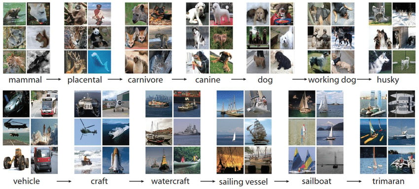
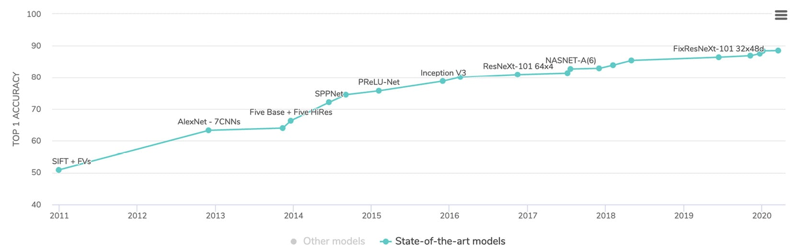
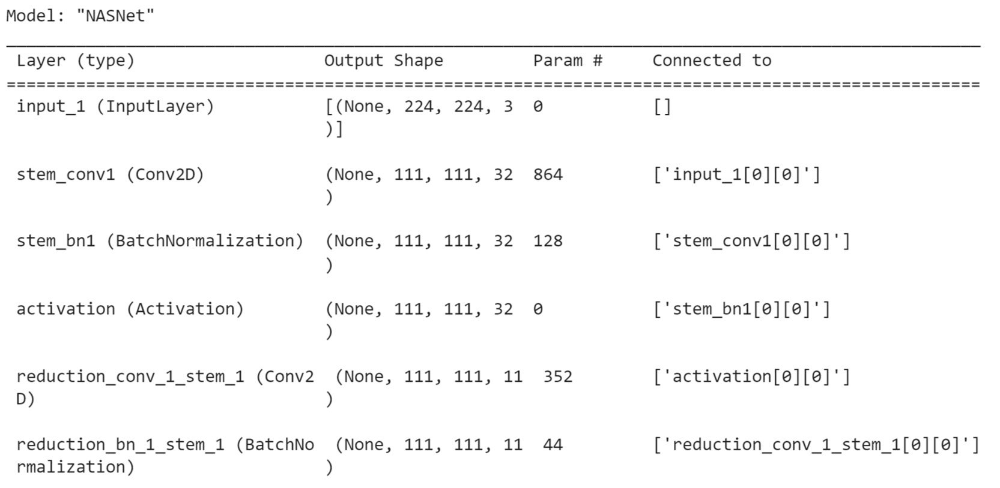
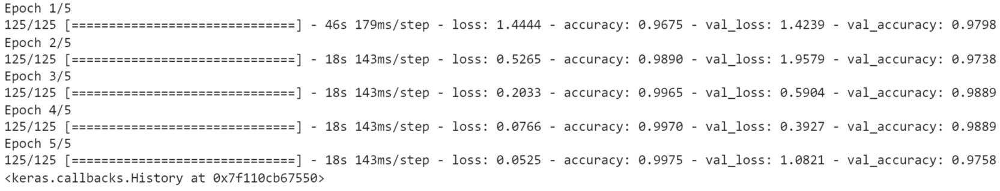
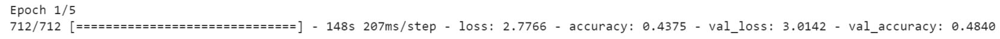
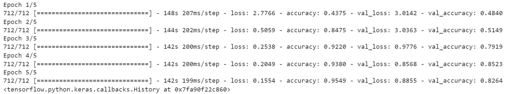
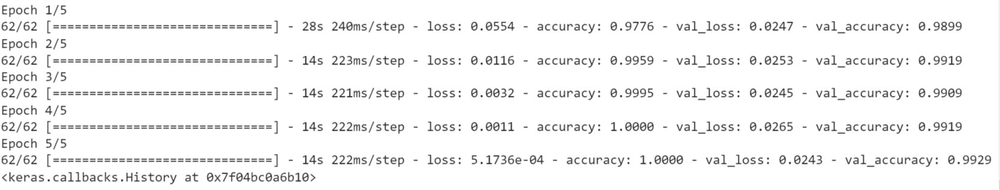

Lab 7: Pre-Trained Networks
===========================


Overview

In this lab, you will analyze pre-trained models. You will get
hands-on experience using the different state-of-the-art model
architectures available on TensorFlow. You will explore concepts such as
transfer learning and fine-tuning and look at TensorFlow Hub and its
published deep learning resources.

By the end of the lab, you will be able to use pre-trained models
directly from TensorFlow and TensorFlow Hub.


ImageNet
========

ImageNet is a large dataset containing more than 14 million images
annotated for image classification or object detection. It was first
consolidated by Fei-Fei Li and her team in 2007. The goal was to build a
dataset that computer vision researchers could benefit from.

The dataset was presented for the first time in 2009, and every year
since 2010, an annual competition called the **ImageNet Large-Scale
Visual Recognition Challenge** (**ILSVRC**) has been organized for image
classification and object detection tasks.




Over the years, some of the most famous CNN architectures (such as
AlexNet, Inception, VGG, and ResNet) have achieved amazing results in
this ILSVRC competition. In the following graph, you can see how some of
the most famous CNN architectures performed in this competition. In less
than 10 years, performance increased from 50% accuracy to almost 90%.



You will see in the next section how you can use transfer learning with
these models.


Transfer Learning
=================


In the previous lab, you got hands-on practice training different
CNN models for image classification purposes. Even though you achieved
good results, the models took quite some time to learn the relevant
parameters. If you kept training the models, you could have achieved
even better results. Using **graphical processing units** (**GPUs**) can
shorten the training time, but it will still take a bit of time,
especially for bigger or more complex datasets.

TensorFlow provides a list of state-of-the-art models pre-trained on the
ImageNet dataset for transfer learning in its Keras API.

Note

You can find the full list of pre-trained models available in TensorFlow
at the following link:
[https://www.tensorflow.org/api\_docs/python/tf/keras/applications].

Importing a pre-trained model is quite simple in TensorFlow, as shown
with the following example, where you load the `InceptionV3`
model:


```
import tensorflow as tf
from tensorflow.keras.applications import InceptionV3
```


Now that you have imported the class for the pre-trained model, you need
to instantiate it by specifying the dimensions of the input image and
`imagenet` as the pre-trained weights to be loaded:


```
model = InceptionV3(input_shape=(224, 224, 3), \
                    weights='imagenet', include_top=True)
```


The `include_top=True` parameter specifies that you will be
re-using the exact same top layer (which is the final layer) as for the
original model trained on ImageNet. This means that the last layer is
designed to predict the 1,000 classes that are in this dataset.

Now that you have instantiated your pre-trained model, you can make
predictions from it:


```
model.predict(input_image)
```


If you want to use this pre-trained model to predict different
categories than the ones from ImageNet, you will need to replace the top
layer with another one that will be trained to recognize the specific
categories of the input dataset.

First, you need to remove this layer by specifying
`include_top=False`:


```
model = InceptionV3(input_shape=(224, 224, 3), \
                    weights='imagenet', include_top=False)
```


In the preceding example, you have loaded an `InceptionV3`
model. The next step will be to *freeze* all the layers from this model
so that their weights will not be updated:


```
model.trainable = False
```


After this, you will instantiate a new fully connected layer with the
number of units and activation function of your choice. In the following
example, you want to predict 50 different classes. To do this, you
create a dense layer with `20` units and use softmax as the
activation function:


```
top_layer = tf.keras.layers.Dense(20, activation='softmax')
```


Then you need to add this fully connected layer to your base model with
the Sequential API from Keras:


```
new_model = tf.keras.Sequential([model, top_layer])
```


Now, you can train this model and only the top-layer weights will be
updated. All the other layers have been frozen:


```
new_model.compile(loss='sparse_categorical_crossentropy', \
                  optimizer=tf.keras.optimizers.Adam(0.001))
new_model.fit(X_train, t_train, epochs=50)
```


In just a few lines of code, you have loaded the Inception V3 model,
which is a state-of-the-art model that won the ILSVRC competition in
2016. You learned how to adapt it to your own project and dataset.

In the next exercise, you will have hands-on practice on transfer
learning.

Exercise 8.01: Classifying Cats and Dogs with Transfer Learning
---------------------------------------------------------------

In this exercise, you will use transfer learning to correctly classify
images as either cats or dogs. You will use a pre-trained model,
NASNet-Mobile, that is already available in TensorFlow. This model comes
with pre-trained weights on ImageNet.

Note

The original dataset used in this exercise has been provided by Google.
It contains 25,000 images of dogs and cats. It can be found here:
[https://storage.googleapis.com/mledu-datasets/cats\_and\_dogs\_filtered.zip].

1.  Open a new Jupyter notebook.

2.  Import the TensorFlow library:
    
    ```
    import tensorflow as tf
    ```


3.  Create a variable called `file_url` containing a link to
    the dataset:
    
    ```
    file_url = 'https://storage.googleapis.com'\
              '/mledu-datasets/cats_and_dogs_filtered.zip'
    ```


4.  Download the dataset using `tf.keras.get_file`, with
    `'cats_and_dogs.zip'`, `origin=file_url`, and
    `extract=True` as parameters, and save the result to a
    variable called `zip_dir`:
    
    ```
    zip_dir = tf.keras.utils.get_file('cats_and_dogs.zip', \
                                      origin=file_url, extract=True)
    ```


5.  Import the `pathlib` library:
    
    ```
    import pathlib
    ```


6.  Create a variable called `path` containing the full path
    to the `cats_and_dogs_filtered` directory using
    `pathlib.Path(zip_dir).parent`:
    
    ```
    path = pathlib.Path(zip_dir).parent / 'cats_and_dogs_filtered'
    ```


7.  Create two variables called `train_dir` and
    `validation_dir` that take the full path to the
    `train` and `validation` folders, respectively:
    
    ```
    train_dir = path / 'train'
    validation_dir = path / 'validation'
    ```


8.  Create four variables called `train_cats_dir`,
    `train_dogs_dir`, `validation_cats_dir`, and
    `validation_dogs_dir` that take the full path to the
    `cats` and `dogs` folders for the train and
    validation sets, respectively:
    
    ```
    train_cats_dir = train_dir / 'cats'
    train_dogs_dir = train_dir /'dogs'
    validation_cats_dir = validation_dir / 'cats'
    validation_dogs_dir = validation_dir / 'dogs'
    ```


9.  Import the `os` package. In the next step, you will need
    to count the number of images from a folder:
    
    ```
    import os
    ```


10. Create two variables called `total_train` and
    `total_val` that get the number of images for the training
    and validation sets:
    
    ```
    total_train = len(os.listdir(train_cats_dir)) \
                  + len(os.listdir(train_dogs_dir))
    total_val = len(os.listdir(validation_cats_dir)) \
                + len(os.listdir(validation_dogs_dir))
    ```


11. Import `ImageDataGenerator` from
    `tensorflow.keras.preprocessing`:
    
    ```
    from tensorflow.keras.preprocessing.image
        import ImageDataGenerator
    ```


12. Instantiate two `ImageDataGenerator` classes and call them
    `train_image_generator` and
    `validation_image_generator`. These will rescale images by
    dividing by `255`:
    
    ```
    train_image_generator = ImageDataGenerator(rescale=1./255)
    validation_image_generator = ImageDataGenerator(rescale=1./255)
    ```


13. Create three variables called `batch_size`,
    `img_height`, and `img_width` that take the
    values `16`, `224`, and `224`,
    respectively:
    
    ```
    batch_size = 16
    img_height = 224
    img_width = 224
    ```


14. Create a data generator called `train_data_gen` using
    `flow_from_directory()` method, and specify the batch
    size, the path to the training folder, the size of the target, and
    the mode of the class:
    
    ```
    train_data_gen = train_image_generator.flow_from_directory\
                     (batch_size = batch_size, \
                      directory = train_dir, \
                      shuffle=True, \
                      target_size = (img_height, img_width), \
                      class_mode='binary')
    ```


15. Create a data generator called `val_data_gen` using
    `flow_from_directory()` method and specify the batch size,
    the path to the validation folder, the size of the target, and the
    mode of the class:
    
    ```
    val_data_gen = validation_image_generator.flow_from_directory\
                   (batch_size = batch_size, \
                    directory = validation_dir, \
                    target_size=(img_height, img_width), \
                    class_mode='binary')
    ```


16. Import `numpy` as `np`, `tensorflow`
    as `tf`, and `layers` from
    `tensorflow.keras`:
    
    ```
    import numpy as np
    import tensorflow as tf
    from tensorflow.keras import layers
    ```


17. Set `8` (this is totally arbitrary) as `seed`
    for NumPy and TensorFlow:
    
    ```
    np.random.seed(8)
    tf.random.set_seed(8)
    ```


18. Import the `NASNETMobile` model from
    `tensorflow.keras.applications`:
    
    ```
    from tensorflow.keras.applications import NASNetMobile
    ```


19. Instantiate the model with the ImageNet weights, remove the top
    layer, and specify the correct input dimensions:
    
    ```
    base_model = NASNetMobile(include_top=False, \
                              input_shape=(img_height, img_width, 3),\
                              weights='imagenet')
    ```


20. Freeze all the layers of this model:
    
    ```
    base_model.trainable = False
    ```


21. Print a summary of the model using the `summary()` method:

    
    ```
    base_model.summary()
    ```


    The expected output will be as follows:

    
    


22. Create a new model that combines the `NASNETMobile` model
    with two new top layers with `500` and `1`
    unit(s) and ReLu and sigmoid as the activation functions:
    
    ```
    model = tf.keras.Sequential([base_model,\
                                 layers.Flatten(),
                                 layers.Dense(500, \
                                              activation='relu'),
                                 layers.Dense(1, \
                                              activation='sigmoid')])
    ```


23. Compile the model by providing `binary_crossentropy` as
    the `loss` function, an Adam optimizer with a learning
    rate of `0.001`, and `accuracy` as the metric to
    be displayed:
    
    ```
    model.compile(loss='binary_crossentropy', \
                  optimizer=tf.keras.optimizers.Adam(0.001), \
                  metrics=['accuracy'])
    ```


24. Fit the model, provide the train and validation data generators, and
    run it for five epochs:

    
    ```
    model.fit(train_data_gen, \
              steps_per_epoch = total_train // batch_size, \
              epochs=5, \
              validation_data = val_data_gen, \
              validation_steps = total_val // batch_size)
    ```


    The expected output is as follows:

    
    


You can observe that the model achieved an accuracy score of
`0.99` on the training set and `0.98` on the
validation set. This is quite a remarkable result given that you only
trained the last two layers, and it took less than a minute. This is the
benefit of applying transfer learning and using pre-trained
state-of-the-art models.

In the next section, you will see how you can apply fine-tuning to a
pre-trained model.


Fine-Tuning
===========

Transfer learning leverages pre-trained models like those from ImageNet to achieve impressive results by using learned parameters from large datasets. However, if your dataset differs significantly from ImageNet (e.g., satellite images vs. cat images), the weights from later layers may be less relevant. To address this, it's beneficial to retain weights from earlier layers for generic features and retrain the final layers to adapt the model to your specific dataset.

This technique is called fine-tuning. The idea behind it is quite
simple: you freeze early layers and update the weights of the final
layers only. Let\'s see how you can achieve this in TensorFlow:

1.  First, instantiate a pre-trained `MobileNetV2` model
    without the top layer:
    
    ```
    from tensorflow.keras.applications import MobileNetV2
    base_model = MobileNetV2(input_shape=(224, 224, 3), \
                             weights='imagenet', include_top=False)
    ```


2.  Next, iterate through the first layers and freeze them by setting
    them as non-trainable. In the following example, you will freeze
    only the first `100` layers:
    
    ```
    for layer in base_model.layers[:100]:
        layer.trainable = False
    ```


3.  Now you need to add your custom top layer to your base model. In the
    following example, you will be predicting 20 different classes, so
    you need to add a fully connected layer of `20` units with
    the softmax activation function:
    
    ```
    prediction_layer = tf.keras.layers.Dense(20, activation='softmax')
    model = tf.keras.Sequential([base_model, prediction_layer])
    ```


4.  Finally, you will compile and then train this model:

    
    ```
    model.compile(loss='sparse_categorical_crossentropy', \
                  optimizer = tf.keras.optimizers.Adam(0.001))
    model.fit(features_train, label_train, epochs=5)
    ```


    This will display a number of logs, as seen in the following
    screenshot:

    
    


That\'s it. You have just performed fine-tuning on a pre-trained
MobileNetV2 model. You have used the first 100 pre-trained weights from
ImageNet and only updated the weights from layer 100 onward according to
your dataset.

In the next activity, you will put into practice what you have just
learned and apply fine-tuning to a pre-trained model.

Activity 8.01: Fruit Classification with Fine-Tuning
----------------------------------------------------

The `Fruits 360` dataset
([https://arxiv.org/abs/1712.00580]), which was originally
shared by *Horea Muresan and Mihai Oltean, Fruit recognition from images
using deep learning, Acta Univ. Sapientiae, Informatica Vol. 10, Issue
1, pp. 26-42, 2018*, contains more than 82,000 images of 120 different
types of fruit. You will be using a subset of this dataset with more
than 16,000 images. The numbers of images in the training and validation
sets are `11398` and `4752` respectively.

In this activity, you are tasked with training a
`NASNetMobile` model to recognize images of different
varieties of fruits (classification into 120 different classes). You
will use fine-tuning to train the final layers of this model.

Note

The dataset can be found here: [https://github.com/fenago/deep-learning-essentials/blob/main/Lab08/dataset/fruits360.zip].

The following steps will help you to complete this activity:

1.  Import the dataset and unzip the file using TensorFlow.

2.  Create a data generator with the following data augmentation:
    
    ```
    Rescale = 1./255, 
    rotation_range = 40, 
    width_shift_range = 0.1, 
    height_shift_range = 0.1, 
    shear_range = 0.2, 
    zoom_range = 0.2, 
    horizontal_flip = True, 
    fill_mode = 'nearest
    ```


3.  Load a pre-trained `NASNetMobile` model from TensorFlow.

4.  Freeze the first `600` layers of the model.

5.  Add two fully connected layers on top of `NASNetMobile`:

    -- A fully connected layer with
    `Dense(1000, activation=relu)`

    -- A fully connected layer with
    `Dense(120, activation='softmax')`

6.  Specify an Adam optimizer with a learning rate of `0.001`.

7.  Train the model.

8.  Evaluate the model on the test set.

    The expected output is as follows:

    
    


Now that you know how to use pre-trained models from TensorFlow, you
will learn how models can be accessed from TensorFlow Hub in the
following section.


TensorFlow Hub
==============


TensorFlow Hub is a repository of TensorFlow modules shared by
publishers such as Google, NVIDIA, and Kaggle. TensorFlow modules are
self-contained models built on TensorFlow that can be reused for
different tasks. Put simply, it is an external collection of published
TensorFlow modules for transfer learning and fine-tuning. With
TensorFlow Hub, you can access different deep learning models or weights
than the ones provided directly from TensorFlow\'s core API.

Note

You can find more information about TensorFlow Hub here:
[https://tfhub.dev/].

In order to use it, you first need to install it:


```
pip install tensorflow-hub
```


Once it\'s installed, you can load available classification models with
the `load()` method by specifying the link to a module:


```
import tensorflow_hub as hub
MODULE_HANDLE = 'https://tfhub.dev/tensorflow/efficientnet'\
                '/b0/classification/1'
module = hub.load(MODULE_HANDLE)
```


In the preceding example, you have loaded the **EfficientNet B0** model,
which was trained on ImageNet. You can find more details on this at the
TensorFlow Hub page:
[https://tfhub.dev/tensorflow/efficientnet/b0/classification/1].

Note

TensorFlow Hub provides a search engine to find a specific module:
[https://tfhub.dev/s?subtype=module,placeholder].

By default, modules loaded from TensorFlow Hub contain the final layer
of a model without an activation function. For classification purposes,
you need to add an activation layer of your choice. To do so, you can
use the Sequential API from Keras. You just need to convert your model
into a Keras layer with the `KerasLayer` class:


```
import tensorflow as tf
model = tf.keras.Sequential([
    hub.KerasLayer(MODULE_HANDLE,input_shape=(224, 224, 3)),
    tf.keras.layers.Activation('softmax')
])
```


Then, you can use your final model to perform predictions:


```
model.predict(data)
```


You just performed transfer learning with a model from TensorFlow Hub.
This is very similar to what you learned previously using the Keras API,
where you loaded an entire model with `include_top=True`. With
TensorFlow Hub, you can access a library of pre-trained models for
object detection or image segmentation.

In the next section, you will learn how to extract features from
TensorFlow Hub pre-trained modules.


Feature Extraction
==================


TensorFlow Hub provides the option of downloading a model without the
final layer. In this case, you will be using a TensorFlow module as a
feature extractor; you can design your custom final layers on top of it.
In TensorFlow Hub, a module used for feature extraction is known as a
feature vector:


```
import tensorflow_hub as hub
MODULE_HANDLE = 'https://tfhub.dev/google/efficientnet/b0'\
                '/feature-vector/1'
module = hub.load(MODULE_HANDLE)
```


Note

To find all the available feature vectors on TensorFlow Hub, you can use
its search engine:
[https://tfhub.dev/s?module-type=image-feature-vector&tf-version=tf2].

Once loaded, you can add your own final layer to the feature vector with
the Sequential API:


```
model = tf.keras.Sequential([
    hub.KerasLayer(MODULE_HANDLE, input_shape=(224, 224, 3)),
    tf.keras.layers.Dense(20, activation='softmax')
])
```


In the preceding example, you added a fully connected layer of
`20` units with the softmax activation function. Next, you
need to compile and train your model:


```
model.compile(optimizer=optimizer, \
              loss='sparse_categorical_crossentropy', \
              metrics=['accuracy'])
model.fit(X_train, epochs=5)
```


And with that, you just used a feature vector from TensorFlow Hub and
added your custom final layer to train the final model on your dataset.

Now, test the knowledge you have gained so far in the next activity.

Activity 8.02: Transfer Learning with TensorFlow Hub
----------------------------------------------------

In this activity, you are required to correctly classify images of cats
and dogs using transfer learning. Rather than training a model from
scratch, you will benefit from the **EfficientNet B0** feature vector
from TensorFlow Hub, which contains pre-computed weights that can
recognize different types of objects.


The following steps will help you to complete this activity:

1.  Import the dataset and unzip the file using TensorFlow.

2.  Create a data generator that will perform rescaling.

3.  Load a pre-trained **EfficientNet B0** feature vector from
    TensorFlow Hub.

4.  Add two fully connected layers on top of the feature vector:

    -- A fully connected layer with
    `Dense(500, activation=relu)`

    -- A fully connected layer with
    `Dense(1, activation='sigmoid')`

5.  Specify an Adam optimizer with a learning rate of `0.001`.

6.  Train the model.

7.  Evaluate the model on the test set.

    The expected output is as follows:

    
    


The expected accuracy scores should be around `1.0` for the
training and validation sets.


Summary
=======

1. Explored transfer learning and fine-tuning to adapt pre-trained models to specific datasets.
2. Used TensorFlow's pre-trained models from ImageNet and other sources like TensorFlow Hub.
3. Practiced fine-tuning by freezing early layers and retraining the final layers to suit your dataset.
4. These techniques have democratized access to advanced deep learning models.