Lab 8:  Recurrent Neural Networks
=================================

In this lab, you will learn how to handle real sequential data. You
will extend your knowledge of **artificial neural network** (**ANN**)
models and **recurrent neural network** (**RNN**) architecture for
training sequential data. You will also learn how to build an RNN model
with an LSTM layer for natural language processing.

By the end of this lab, you will have gained hands-on experience of
applying multiple LSTM layers to build RNNs for stock price predictions.


Exercise 9.01: Training an ANN for Sequential Data -- Nvidia Stock Prediction
-----------------------------------------------------------------------------

In this exercise, you will build a simple ANN model to predict the
Nvidia stock price. But unlike examples from previous chapters, this
time the input data is sequential. So, you need to manually do some
processing to create a dataset that will contain the price of the stock
for a given day as the target variable and the price for the previous 60
days as features. You are required to split the data into training and
testing sets before and after the date `2019-01-01`.

Note

You can find the `NVDA.csv` dataset here:
[https://github.com/fenago/deep-learning-essentials/blob/main/Lab08/Datasets/NVDA.csv].

1.  Open a new Jupyter or Colab notebook.

2.  Import the libraries needed. Use `numpy` for computation,
    `matplotlib` for plotting visualization,
    `pandas` to help work with your dataset, and
    `MinMaxScaler` to scale the dataset between zero and one:
    
    ```
    import numpy as np
    import matplotlib.pyplot as plt
    import pandas as pd
    from sklearn.preprocessing import StandardScaler, MinMaxScaler
    ```


3.  Use the `read_csv()` function to read in the CSV file and
    store your dataset in a pandas DataFrame, `data`, for
    manipulation:
    
    ```
    import io
    data = pd.read_csv('NVDA.csv')
    ```


4.  Call the `head()` function on your data to take a look at
    the first five rows of your DataFrame:

    
    ```
    data.head()
    ```


    You should get the following output:

    
    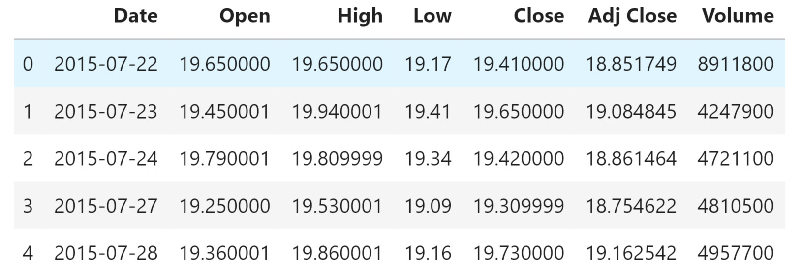


    The preceding table shows the raw data. You can see that each row
    represents a day where you have information about the stock price
    when the market opened and closed, the highest price, the lowest
    price, and the adjusted close price of the stock (taking into
    account dividend or stock split, for instance).

5.  Now, split the training data. Use all data that is older than
    `2019-01-01` using the `Date` column for your
    training data. Save it as `data_training`. Save this in a
    separate file by using the `copy()` method:
    
    ```
    data_training = data[data['Date']<'2019-01-01'].copy()
    ```


6.  Now, split the test data. Use all data that is more recent than or
    equal to `2019-01-01` using the `Date` column.
    Save it as `data_test`. Save this in a separate file by
    using the `copy()` method:
    
    ```
    data_test = data[data['Date']>='2019-01-01'].copy()
    ```


7.  Use `drop()` to remove your `Date` and
    `Adj Close` columns in your DataFrame. Remember that you
    used the `Date` column to split your training and test
    sets, so the date information is not needed. Use
    `axis = 1` to specify that you also want to drop labels
    from your columns. To make sure it worked, call the
    `head()` function to take a look at the first five rows of
    the DataFrame:

    
    ```
    training_data = data_training.drop\
                    (['Date', 'Adj Close'], axis = 1)
    training_data.head()
    ```


    You should get the following output:

    
    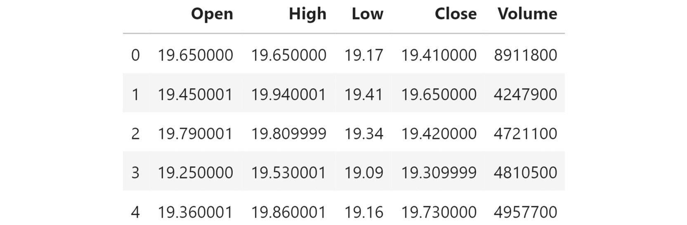


    This is the output you should get after removing those two columns.

8.  Create a scaler from `MinMaxScaler` to scale
    `training_data` to numbers between zero and one. Use the
    `fit_transform` function to fit the model to the data and
    then transform the data according to the fitted model:

    
    ```
    scaler = MinMaxScaler()
    training_data = scaler.fit_transform(training_data)
    training_data
    ```


    You should get the following output:

    
    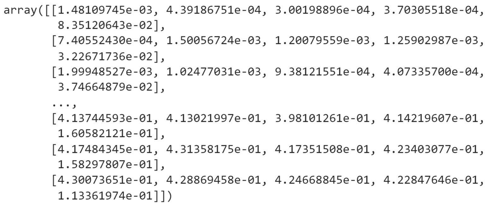


9.  Split your data into `X_train` and `y_train`
    datasets:
    
    ```
    X_train = []
    y_train = []
    ```


10. Check the shape of `training_data`:

    
    ```
    training_data.shape[0]
    ```


    You should get the following output:

    
    ```
    868
    ```


    You can see there are 868 observations in the training set.

11. Create a training dataset that has the previous 60 days\' stock
    prices so that you can predict the closing stock price for day 61.
    Here, `X_train` will have two columns. The first column
    will store the values from 0 to 59, and the second will store values
    from 1 to 60. In the first column of `y_train`, store the
    61st value at index 60, and in the second column, store the 62nd
    value at index 61. Use a `for` loop to create data in 60
    time steps:
    
    ```
    for i in range(60, training_data.shape[0]):
        X_train.append(training_data[i-60:i])
        y_train.append(training_data[i, 0])
    ```


12. Convert `X_train` and `y_train` into NumPy
    arrays:
    
    ```
    X_train, y_train = np.array(X_train), np.array(y_train)
    ```


13. Call the `shape()` function on `X_train` and
    `y_train`:

    
    ```
    X_train.shape, y_train.shape
    ```


    You should get the following output:

    
    ```
    ((808, 60, 5), (808,))
    ```


    The preceding snippet shows that the prepared training set contains
    `808` observations with `60` days of data for
    the five features you kept (`Open`, `Low`,
    `High`, `Close`, and `Volume`).

14. Transform the data into a 2D matrix with the shape of the sample
    (the number of samples and the number of features in each sample).
    Stack the features for all 60 days on top of each other to get an
    output size of `(808, 300)`. Use the following code for
    this purpose:

    
    ```
    X_old_shape = X_train.shape
    X_train = X_train.reshape(X_old_shape[0], \
                              X_old_shape[1]*X_old_shape[2]) 
    X_train.shape
    ```


    You should get the following output:

    
    ```
    (808, 300)
    ```


15. Now, build an ANN. You will need some additional libraries for this.
    Use `Sequential` to initialize the neural net,
    `Input` to add an input layer, `Dense` to add a
    dense layer, and `Dropout` to help prevent overfitting:
    
    ```
    from tensorflow.keras import Sequential
    from tensorflow.keras.layers import Input, Dense, Dropout
    ```


16. Initialize the neural network by calling
    `regressor_ann = Sequential()`.
    
    ```
    regressor_ann = Sequential()
    ```


17. Add an input layer with `shape` as `300`:
    
    ```
    regressor_ann.add(Input(shape = (300,)))
    ```


18. Then, add the first dense layer. Set it to `512` units,
    which will be your dimensionality for the output space. Use a ReLU
    activation function. Finally, add a dropout layer that will remove
    20% of the units during training to prevent overfitting:
    
    ```
    regressor_ann.add(Dense(units = 512, activation = 'relu'))
    regressor_ann.add(Dropout(0.2))
    ```


19. Add another dense layer with `128` units, ReLU as the
    activation function, and a dropout of `0.3`:
    
    ```
    regressor_ann.add(Dense(units = 128, activation = 'relu'))
    regressor_ann.add(Dropout(0.3))
    ```


20. Add another dense layer with `64` units, ReLU as the
    activation function, and a dropout of `0.4`:
    
    ```
    regressor_ann.add(Dense(units = 64, activation = 'relu'))
    regressor_ann.add(Dropout(0.4))
    ```


21. Again, add another dense layer with `128` units, ReLU as
    the activation function, and a dropout of `0.3`:
    
    ```
    regressor_ann.add(Dense(units = 16, activation = 'relu'))
    regressor_ann.add(Dropout(0.5))
    ```


22. Add a final dense layer with one unit:
    
    ```
    regressor_ann.add(Dense(units = 1))
    ```


23. Check the summary of the model:

    
    ```
    regressor_ann.summary()
    ```


    You will get valuable information about your model layers and
    parameters.

    
    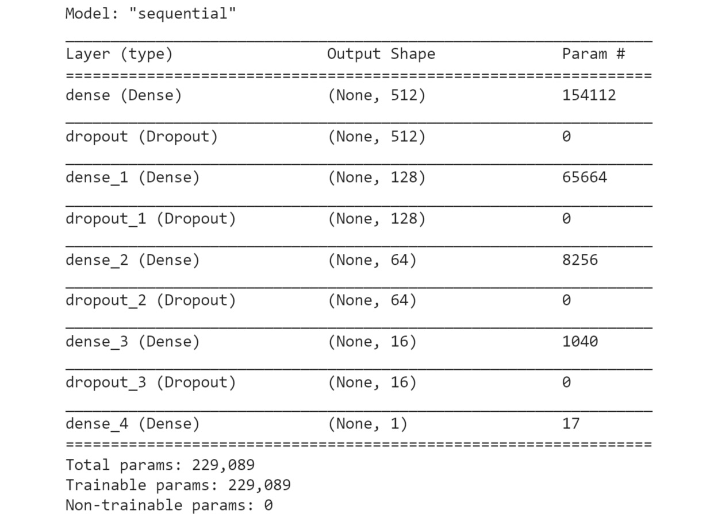


24. Use the `compile()` method to configure your model for
    training. Choose Adam as your optimizer and mean squared error to
    measure your loss function:
    
    ```
    regressor_ann.compile(optimizer='adam', \
                          loss = 'mean_squared_error')
    ```


25. Finally, fit your model and set it to run on `10` epochs.
    Set your batch size to `32`:

    
    ```
    regressor_ann.fit(X_train, y_train, epochs=10, batch_size=32)
    ```


    You should get the following output:

    
    


26. Test and predict the stock price and prepare the dataset. Check your
    data by calling the `head()` method:

    
    ```
    data_test.head()
    ```


    You should get the following output:

    
    


27. Use the `tail(60)` method to create a
    `past_60_days` variable, which consists of the last 60
    days of data in the training set. Add the `past_60_days`
    variable to the test data with the `append()` function.
    Assign `True` to `ignore_index`:
    
    ```
    past_60_days = data_training.tail(60)
    df = past_60_days.append(data_test, ignore_index = True)
    ```


28. Now, prepare your test data for predictions by repeating what you
    did for the training data in *steps 8* to *15*:

    
    ```
    df = df.drop(['Date', 'Adj Close'], axis = 1)
    inputs = scaler.transform(df) 
    X_test = []
    y_test = []
    for i in range(60, inputs.shape[0]):
        X_test.append(inputs[i-60:i])
        y_test.append(inputs[i, 0])
    X_test, y_test = np.array(X_test), np.array(y_test)
    X_old_shape = X_test.shape
    X_test = X_test.reshape(X_old_shape[0], \
                            X_old_shape[1] * X_old_shape[2])
    X_test.shape, y_test.shape
    ```


    You should get the following output:

    
    ```
    ((391, 300), (391,))
    ```


29. Test some predictions for your stock prices by calling the
    `predict()` method on `X_test`:
    
    ```
    y_pred = regressor_ann.predict(X_test)
    ```


30. Before looking at the results, reverse the scaling you did earlier
    so that the number you get as output will be at the correct scale
    using the `StandardScaler` utility class that you imported
    with `scaler.scale_`:

    
    ```
    scaler.scale_
    ```


    You should get the following output:

    
    


31. Use the first value in the preceding array to set your scale in
    preparation for the multiplication of `y_pred` and
    `y_test`. Recall that you are converting your data back
    from your earlier scale, in which you converted all values to
    between zero and one:

    
    ```
    scale = 1/3.70274364e-03
    scale 
    ```


    You should get the following output:

    
    ```
    270.0700067909643
    ```


32. Multiply `y_pred` and `y_test` by
    `scale` to convert your data back to the proper values:
    
    ```
    y_pred = y_pred*scale
    y_test = y_test*scale
    ```


33. Review the real Nvidia stock price and your predictions:

    
    ```
    plt.figure(figsize=(14,5))
    plt.plot(y_test, color = 'black', label = "Real NVDA Stock Price")
    plt.plot(y_pred, color = 'gray',\
             label = 'Predicted NVDA Stock Price')
    plt.title('NVDA Stock Price Prediction')
    plt.xlabel('time')
    plt.ylabel('NVDA Stock Price')
    plt.legend()
    plt.show()
    ```


    You should get the following output:

    
    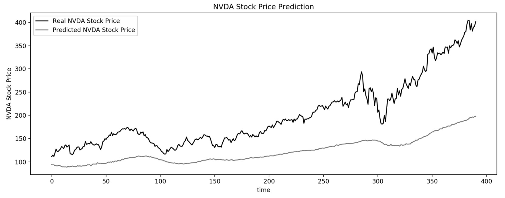


In the preceding graph, you can see that your trained model is able to
capture some of the trends of the Nvidia stock price. Observe that the
predictions are quite different from the real values. It is evident from
this result that ANNs are not suited for sequential data.

In this exercise, you saw the inability of simple ANNs to deal with
sequential data. In the next section, you will learn about recurrent
neural networks, which are designed to learn from the temporal
dimensionality of sequential data. Then, in *Exercise 9.02*, *Building
an RNN with LSTM Layer Nvidia Stock Prediction*, you will perform
predictions on the same Nvidia stock price dataset using RNNs and
compare your results.


RNN Architecture
----------------

The following snippet uses a simple RNN from
`keras.models.Sequential`. You specify the number of units as
`1` and set the first input dimension to `None` as
an RNN can process any number of time steps. A simple RNN uses tanh
activation by default:


```
model = keras.models.Sequential([
                                 keras.layers.SimpleRNN\
                                 (1, input_shape=[None, 1]) 
])
```


The preceding code creates a single layer with a single neuron.

That was easy enough. Now you need to stack some additional recurrent
layers. The code is similar, but there is a key difference here. You
will notice `return_sequences=True` on all but the last layer.
This is to ensure that the output is a 3D array. As you can see, the
first two layers each have `20` units:


```
model = keras.models.Sequential\
        ([Keras.layers.SimpleRNN\
          (20, return_sequences=True, input_shape=[None, 1]), \
          Keras.layers.SimpleRNN(20, return_sequences=True), \
          Keras.layers.SimpleRNN(1)])
```


The RNN is defined as a layer, and you can build it by inheriting it
from the layer class. You can also initialize your weight matrices and
the hidden state of your RNN cell to zero.

The key step here is defining the call function, which describes how you
make a forward pass through the network given an input `X`.
And, to break down this call function, you would first update the hidden
state according to the equation discussed previously.

Take the previous hidden state and the input `X`, multiply
them by the relevant weight matrices, add them together, and then pass
them through a non-linearity, like a hyperbolic tangent (tanh).

Then, the output is simply a transformed version of the hidden state,
and at each time step, you return both the current output and the
updated hidden state.

TensorFlow has made it easy by having a built-in dense layer. The same
applies to RNNs. TensorFlow has implemented these types of RNN cells
with the simple RNN layer. But this type of layer has some limitations,
such as vanishing gradients. You will look at this problem in the next
section before exploring different types of recurrent layers.


Long Short-Term Memory Network
------------------------------

LSTMs are well-suited to learning long-term dependencies and overcoming
the vanishing gradient problem. They are very performant models for
sequential data, and they\'re widely used by the deep learning
community.

LSTMs have a chain-like structure. In an LSTM, the repeating unit
contains different interacting layers. The key point is that these
layers interact to selectively control the flow of information within
the cell.

The key building block of the LSTM is a structure called a gate, which
functions to enable the LSTM to selectively add or remove information
from its cell state. Gates consist of a neural net layer like a sigmoid.


Consider the following LSTM model:


```
regressor = Sequential()
regressor.add(LSTM(units= 50, activation = 'relu', \
                   return_sequences = True, \
                   input_shape = (X_train.shape[1], 5)))
regressor.add(Dropout(0.2))
regressor.add(LSTM(units= 60, activation = 'relu', \
                   return_sequences = True))
regressor.add(Dropout(0.3))
regressor.add(LSTM(units= 80, activation = 'relu', \
                   return_sequences = True))
regressor.add(Dropout(0.4))
regressor.add(LSTM(units= 120, activation = 'relu'))
regressor.add(Dropout(0.5))
regressor.add(Dense(units = 1))
```


First, you have initialized a neural network by calling
`regressor = Sequential()`. Again, it\'s important to note
that in the last line you omit `return_sequences = True`
because it is the final output:


```
regressor = Sequential()
```


Then, the LSTM layer is added. In the first instance, set the LSTM layer
to `50` units. Use a relu activation function and specify the
shape of the training set. Finally, the dropout layer is added with
`regressor.add(Dropout(0.2)`. The `0.2` means that
20% of the layers will be removed. Set
`return_sequences = True`, which allows the return of the last
output.

Similarly, add three more LSTM layers and one dense layer to the LSTM
model.

Now that you are familiar with the basic concepts surrounding working
with sequential data, it\'s time to complete the following exercise
using some real data.

Exercise 9.02: Building an RNN with an LSTM Layer -- Nvidia Stock Prediction
----------------------------------------------------------------------------

In this exercise, you will be working on the same dataset as for
*Exercise 9.01*, *Training an ANN for Sequential Data -- Nvidia Stock
Prediction*. You will still try to predict the Nvidia stock price based
on the data of the previous 60 days. But this time, you will be training
an LSTM model. You will need to split the data into training and testing
sets before and after the date `2019-01-01`.

Note

You can find the `NVDA.csv` dataset here:
[https://github.com/fenago/deep-learning-essentials/blob/main/Lab08/Datasets/NVDA.csv].

You will need to prepare the dataset like in *Exercise 9.01*, *Training
an ANN for Sequential Data -- Nvidia Stock Prediction* (*steps 1* to
*15*) before applying the following code:

1.  Start building the LSTM. You will need some additional libraries for
    this. Use `Sequential` to initialize the neural net,
    `Dense` to add a dense layer, `LSTM` to add an
    LSTM layer, and `Dropout` to help prevent overfitting:
    
    ```
    from tensorflow.keras import Sequential
    from tensorflow.keras.layers import Dense, LSTM, Dropout
    ```


2.  Initialize the neural network by calling
    `regressor = Sequential()`. Add four LSTM layers with
    `50`, `60`, `80`, and `120`
    units each. Use a ReLU activation function and assign
    `True` to `return_sequences` for all but the
    last LSTM layer. Provide the shape of your training set to the first
    LSTM layer. Finally, add dropout layers with 20%, 30%, 40%, and 50%
    dropouts:
    
    ```
    regressor = Sequential()
    regressor.add(LSTM(units= 50, activation = 'relu',\
                       return_sequences = True,\
                       input_shape = (X_train.shape[1], 5)))
    regressor.add(Dropout(0.2))
    regressor.add(LSTM(units= 60, activation = 'relu', \
                  return_sequences = True))
    regressor.add(Dropout(0.3))
    regressor.add(LSTM(units= 80, activation = 'relu', \
                  return_sequences = True))
    regressor.add(Dropout(0.4))
    regressor.add(LSTM(units= 120, activation = 'relu'))
    regressor.add(Dropout(0.5))
    regressor.add(Dense(units = 1))
    ```


3.  Check the summary of the model using the `summary()`
    method:

    
    ```
    regressor.summary()
    ```


    You should get the following output:

    
    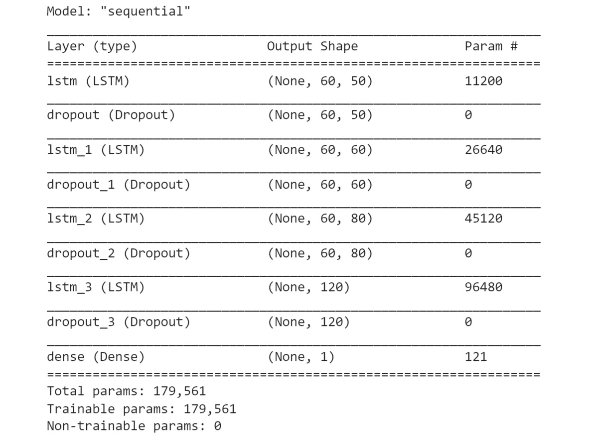


    As you can see from the preceding figure, the summary provides
    valuable information about all model layers and parameters. This is
    a good way to make sure that your layers are in the order you wish
    and that they have the proper output shapes and parameters.

4.  Use the `compile()` method to configure your model for
    training. Choose Adam as your optimizer and mean squared error to
    measure your loss function:
    
    ```
    regressor.compile(optimizer='adam', loss = 'mean_squared_error')
    ```


5.  Fit your model and set it to run on `10` epochs. Set your
    batch size equal to `32`:

    
    ```
    regressor.fit(X_train, y_train, epochs=10, batch_size=32)
    ```


    You should get the following output:

    
    


6.  Test and predict the stock price and prepare the dataset. Check your
    data by calling the `head()` function:

    
    ```
    data_test.head()
    ```


    You should get the following output:

    
    


7.  Call the `tail(60)` method to look at the last 60 days of
    data. You will use this information in the next step:

    
    ```
    data_training.tail(60)
    ```


    You should get the following output:

    
    


8.  Use the `tail(60)` method to create the
    `past_60_days` variable:
    
    ```
    past_60_days = data_training.tail(60)
    ```


9.  Add the `past_60_days` variable to your test data with the
    `append()` function. Set `True` to
    `ignore_index`. Drop the `Date` and
    `Adj Close` columns as you will not need that information:
    
    ```
    df = past_60_days.append(data_test, ignore_index = True)
    df = df.drop(['Date', 'Adj Close'], axis = 1)
    ```


10. Check the DataFrame to make sure that you successfully dropped
    `Date` and `Adj Close` by using the
    `head()` function:

    
    ```
    df.head()
    ```


    You should get the following output:

    
    


11. Use `scaler.transform` from `StandardScaler` to
    perform standardization on inputs:

    
    ```
    inputs = scaler.transform(df)
    inputs
    ```


    You should get the following output:

    
    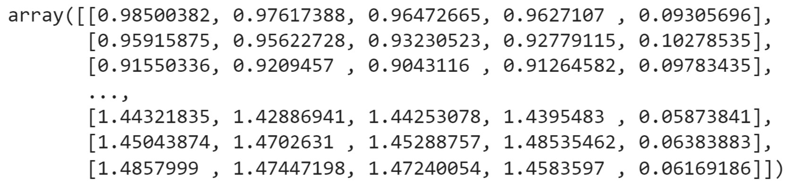


    From the preceding results, you can see that after standardization,
    all values are close to `0` now.

12. Split your data into `X_test` and `y_test`
    datasets. Create a test dataset that has the previous 60 days\'
    stock prices, so that you can test the closing stock price for the
    61st day. Here, `X_test` will have two columns. The first
    column will store the values from 0 to 59. The second column will
    store values from 1 to 60. In the first column of
    `y_test`, store the 61st value at index 60, and in the
    second column, store the 62nd value at index 61. Use a
    `for` loop to create data in 60 time steps:
    
    ```
    X_test = []
    y_test = []
    for i in range(60, inputs.shape[0]):
        X_test.append(inputs[i-60:i])
        y_test.append(inputs[i, 0])
    ```


13. Convert `X_test` and `y_test` into NumPy arrays:

    
    ```
    X_test, y_test = np.array(X_test), np.array(y_test)
    X_test.shape, y_test.shape
    ```


    You should get the following output:

    
    ```
    ((391, 60, 5), (391,))
    ```


    The preceding result shows that there are `391`
    observations and for each of them you have the last `60`
    days\' data for the following five features: `Open`,
    `High`, `Low`, `Close`, and
    `Volume`. The target variable, on the other hand, contains
    `391` values.

14. Test some predictions for stock prices by calling
    `regressor.predict(X_test)`:
    
    ```
    y_pred = regressor.predict(X_test)
    ```


15. Before looking at the results, reverse the scaling you did earlier
    so that the number you get as output will be at the correct scale
    using the `StandardScaler` utility class that you imported
    with `scaler.scale_`:

    
    ```
    scaler.scale_
    ```


    You should get the following output:

    
    


16. Use the first value in the preceding array to set your scale in
    preparation for the multiplication of `y_pred` and
    `y_test`. Recall that you are converting your data back
    from the scale you did earlier when converting all values to between
    zero and one:

    
    ```
    scale = 1/3.70274364e-03
    scale
    ```


    You should get the following output:

    
    ```
    270.0700067909643
    ```


17. Multiply `y_pred` and `y_test` by
    `scale` to convert your data back to the proper values:
    
    ```
    y_pred = y_pred*scale
    y_test = y_test*scale
    ```


18. Use `y_pred `to view predictions for NVIDIA stock:

    
    ```
    y_pred
    ```


    You should get the following output:

    
    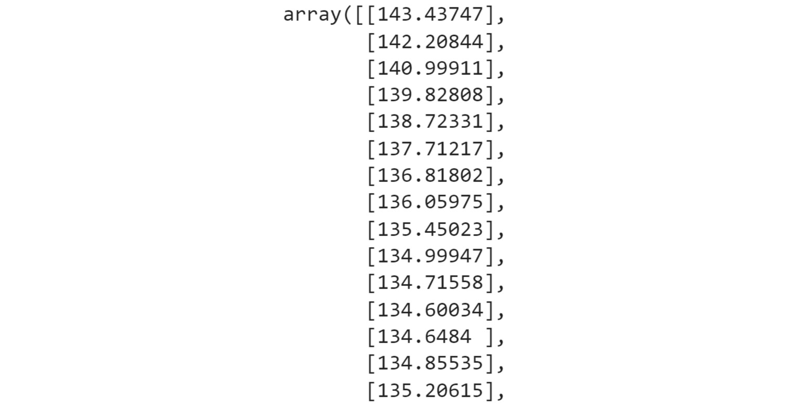


    The preceding results show the predicted Nvidia stock price for the
    future dates.

19. Plot the real Nvidia stock price and your predictions:

    
    ```
    plt.figure(figsize=(14,5))
    plt.plot(y_test, color = 'black', label = "Real NVDA Stock Price")
    plt.plot(y_pred, color = 'gray',\
             label = 'Predicted NVDA Stock Price')
    plt.title('NVDA Stock Price Prediction')
    plt.xlabel('time')
    plt.ylabel('NVDA Stock Price')
    plt.legend()
    plt.show()
    ```


    You should get the following output:

    
    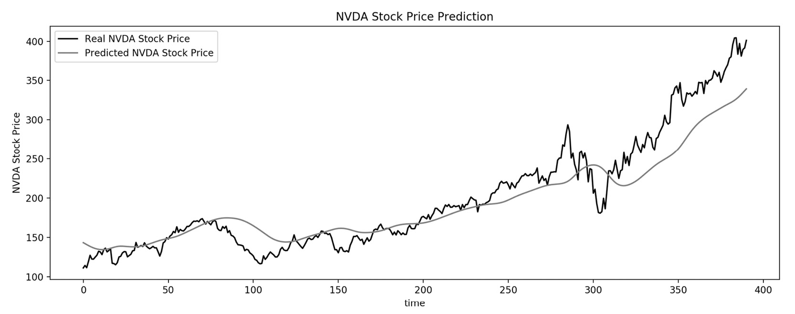


As you can see from the gray line in *Figure 9.32*, your prediction
model is pretty accurate, when compared to the actual stock price, which
is shown by the black line.

In this exercise, you built an RNN with an LSTM layer for Nvidia stock
prediction and completed the training, testing, and prediction steps.

Now, test the knowledge you\'ve gained so far in this lab in the
following activity.

Activity 9.01: Building an RNN with Multiple LSTM Layers to Predict Power Consumption
-------------------------------------------------------------------------------------

The `household_power_consumption.csv` dataset contains
information related to electric power consumption measurements for a
household over 4 years with a 1-minute sampling rate. You are required
to predict the power consumption of a given minute based on previous
measurements.

You are tasked with adapting an RNN model with additional LSTM layers to
predict household power consumption at the minute level. You will be
building an RNN model with three LSTM layers.

Note

You can find the dataset here: [https://github.com/fenago/deep-learning-essentials/blob/main/Lab08/Datasets/household_power_consumption.csv].

Perform the following steps to complete this activity:

1.  Load the data.

2.  Prepare the data by combining the `Date` and
    `Time` columns to form one single `Datetime`
    column that can be used then to sort the data and fill in
    missing values.

3.  Standardize the data and remove the `Date`,
    `Time`, `Global_reactive_power`, and
    `Datetime` columns as they won\'t be needed for the
    predictions.

4.  Reshape the data for a given minute to include the previous 60
    minutes\' values.

5.  Split the data into training and testing sets with, respectively,
    data before and after the index `217440`, which
    corresponds to the last month of data.

6.  Define and train an RNN model composed of three different layers of
    LSTM with `20`, `40`, and `80` units,
    followed by `50%` dropout and ReLU as the
    activation function.

7.  Make predictions on the testing set with the trained model.

8.  Compare the predictions against the actual values on the entire
    dataset.

    You should get the following output:

    
    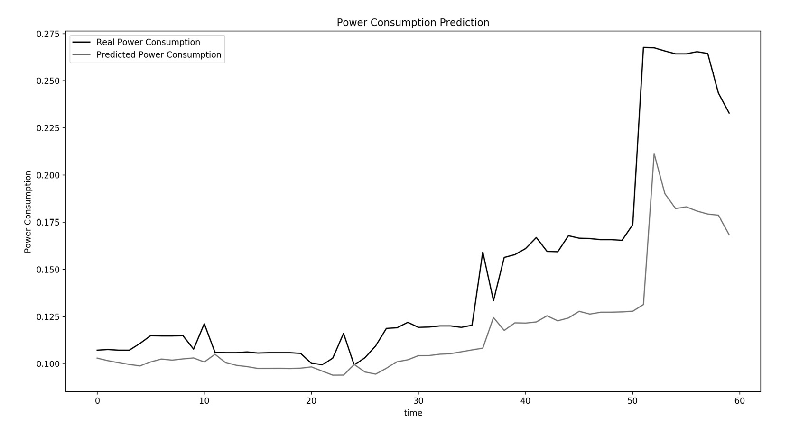


In the next section, you will learn how to apply RNNs to text.


Natural Language Processing
===========================


**Natural Language Processing** (**NLP**) is a quickly growing field
that is both challenging and rewarding. NLP takes valuable data that has
traditionally been very difficult for machines to make sense of and
turns it into information that can be used. This data can take the form
of sentences, words, characters, text, and audio, to name a few. Why is
this such a difficult task for machines? To answer that question,
consider the following examples.

Recall the two sentences: *it is what it is* and *is it what it is*.
These two sentences, though they have completely opposite semantic
meanings, would have the exact same representations in this bag of words
format. This is because they have the exact same words, just in a
different order. So, you know that you need to use a sequential model to
process this, but what else? There are several tools and techniques that
have been developed to solve these problems. But before you get to that,
you need to learn how to preprocess sequential data.

Data Preprocessing
------------------


The following sections provide a more in-depth description of the steps
that you will be using. For now, here\'s an overview of each step:

-   **Dataset cleaning** encompasses the conversion of case to
    lowercase, the removal of punctuation marks, and so on.
-   **Tokenization** is breaking up a character sequence into specified
    units called tokens.
-   **Padding** is a way to make input sentences of different sizes the
    same by padding them. Padding the sequences means ensuring that the
    sequences have a uniform length.
-   **Stemming** is truncating words down to their stem. For example,
    the words \"rainy\" and \"raining\" both have the stem \"rain\".

### Dataset Cleaning

Here, you create the `clean_text` function, which returns a
list containing words once it has been cleaned. You will save all text
as lowercase with `lower()` and encode it with
`utf8` for character standardization:


```
def clean_text(txt):
    txt = "".join(v for v in txt if v not in string.punctuation)\
            .lower()
    txt = txt.encode("utf8").decode("ascii",'ignore')
    return txt 
corpus = [clean_text(x) for x in all_headlines]
```


### Generating a Sequence and Tokenization

TensorFlow provides a dedicated class for generating a sequence of
N-gram tokens -- `Tokenizer` from
`keras.preprocessing.text`:


```
from keras.preprocessing.text import Tokenizer
tokenizer = Tokenizer()
```


Once you have instantiated a `Tokenizer()`, you can use the
`fit_on_texts()` method to extract tokens from a corpus. This
step will attribute an integer index to each unique word from the
corpus:


```
tokenizer.fit_on_texts(corpus)
```


After the tokenizer has been trained on a corpus, you can access the
indexes allocated to each word from your corpus with the
`word_index` attribute:


```
tokenizer.word_index
```


You can convert a sentence into a tokenized version using the
`texts_to_sequences()` method:


```
tokenizer.texts_to_sequences([sentence])
```


You can create a function that will generate an N-gram sequence of
tokenized sentences from an input corpus with the following snippet:


```
def get_seq_of_tokens(corpus):
    tokenizer.fit_on_texts(corpus)
    all_words = len(tokenizer.word_index) + 1
    
    input_sequences = []
    for line in corpus:
        token_list = tokenizer.texts_to_sequences([line])[0]
        for i in range(1, len(token_list)):
            n_gram_sequence = token_list[:i+1]
            input_sequences.append(n_gram_sequence)
    return input_sequences, all_words
inp_sequences, all_words = get_seq_of_tokens(corpus)
inp_sequences[:10]
```


The `get_seq_of_tokens()` function trains a
`Tokenizer()` on the given corpus. Then you need to iterate
through each line of the corpus and convert them into their tokenized
equivalents. Finally, for each tokenized sentence, you create the
different sequences of N-gram from it.

Next, you will see how you can deal with variable sentence length with
padding.

### Padding Sequences

As discussed previously, deep learning models expect fixed-length input.
But with text, the length of a sentence can vary. One way to overcome
this is to transform all sentences to have the same length. You will
need to set the maximum length of sentences. Then, for sentences that
are shorter than this threshold, you can add padding, which will add a
specific token value to fill the gap. On the other hand, longer
sentences will be truncated to fit this constraint. You can use
`pad_sequences()` to achieve this:


```
from keras.preprocessing.sequence import pad_sequences
```


You can create the `generate_padded_sequences` function, which
will take `input_sequences` and generate the padded version of
it:


```
def generate_padded_sequences(input_sequences):
    max_sequence_len = max([len(x) for x in input_sequences])
    input_sequences = np.array(pad_sequences\
                               (input_sequences, \
                                maxlen=max_sequence_len, \
                                padding='pre'))
    predictors, label = input_sequences[:,:-1], \
                        input_sequences[:,-1]
    label = ku.to_categorical(label, num_classes=all_words)
    return predictors, label, max_sequence_len
predictors, label, max_sequence_len = generate_padded_sequences\
                                      (inp_sequences)
```


Now that you know how to process raw text, have a look at the modeling
step in the next section.


Back Propagation Through Time (BPTT)
====================================

In the following exercise, you will see how to use an LSTM model for
predicting the next word of a text.

Exercise 9.03: Building an RNN with an LSTM Layer for Natural Language Processing
---------------------------------------------------------------------------------

In this exercise, you will use an RNN with an LSTM layer to predict the
final word of a news headline.

The `Articles.csv` dataset contains raw text that consists of
news titles. You will be training an LTSM model that will predict the
next word of a given sentence.

Note

You can find the dataset in the GitHub repo.

Perform the following steps to complete this exercise:

1.  Import the libraries needed:

    
    ```
    from keras.preprocessing.sequence import pad_sequences
    from keras.layers import Embedding, LSTM, Dense, Dropout
    from keras.preprocessing.text import Tokenizer
    from keras.callbacks import EarlyStopping
    from keras.models import Sequential
    import keras.utils as ku 
    import pandas as pd
    import numpy as np
    import string, os 
    import warnings
    warnings.filterwarnings("ignore")
    warnings.simplefilter(action='ignore', category=FutureWarning)
    ```


    You should get the following output:

    
    ```
    Using TensorFlow backend.
    ```


2.  Load the dataset locally by setting `curr_dir` to
    `content`. Create the `all_headlines` variable.
    Use a `for` loop to iterate over the files contained in
    the folder, and extract the headlines. Remove all headlines with the
    `Unknown` value. Print the length of
    `all_headlines`:

    
    ```
    curr_dir = '/content/'
    all_headlines = []
    for filename in os.listdir(curr_dir):
        if 'Articles' in filename:
            article_df = pd.read_csv(curr_dir + filename)
            all_headlines.extend(list(article_df.headline.values))
            break
    all_headlines = [h for h in all_headlines if h != "Unknown"]
    len(all_headlines)
    ```


    The output will be as follows:

    
    ```
    831
    ```


3.  Create the `clean_text` method to return a list containing
    words once it has been cleaned. Save all text as lowercase with the
    `lower()` method and encode it with `utf8` for
    character standardization. Finally, output 10 headlines from your
    corpus:

    
    ```
    def clean_text(txt):
        txt = "".join(v for v in txt \
                      if v not in string.punctuation).lower()
        txt = txt.encode("utf8").decode("ascii",'ignore')
        return txt 
    corpus = [clean_text(x) for x in all_headlines]
    corpus[:10]
    ```


    You should get the following output:

    
    


4.  Use `tokenizer.fit` to extract tokens from the corpus.
    Each integer output corresponds with a specific word. With
    `input_sequences`, train features that will be a
    `list []`. With
    `token_list = tokenizer.texts_to_sequences`, convert each
    sentence into its tokenized equivalent. With
    `n_gram_sequence = token_list`, generate the N-gram
    sequences. Using
    `input_sequences.append(n_gram_sequence)`, append each
    N-gram sequence to the list of your features:

    
    ```
    tokenizer = Tokenizer()
    def get_seq_of_tokens(corpus):
        tokenizer.fit_on_texts(corpus)
        all_words = len(tokenizer.word_index) + 1
        input_sequences = []
        for line in corpus:
            token_list = tokenizer.texts_to_sequences([line])[0]
            for i in range(1, len(token_list)):
                n_gram_sequence = token_list[:i+1]
                input_sequences.append(n_gram_sequence)
        return input_sequences, all_words
    inp_sequences, all_words = get_seq_of_tokens(corpus)
    inp_sequences[:10]
    ```


    You should get the following output:

    
    


5.  Pad the sequences and obtain the `predictors` and
    `target` variables. Use `pad_sequence` to pad
    the sequences and make their lengths equal:
    
    ```
    def generate_padded_sequences(input_sequences):
        max_sequence_len = max([len(x) for x in input_sequences])
        input_sequences = np.array\
                          (pad_sequences(input_sequences, \
                                         maxlen=max_sequence_len, \
                                         padding='pre'))
        predictors, label = input_sequences[:,:-1], \
                            input_sequences[:,-1]
        label = ku.to_categorical(label, num_classes=all_words)
        return predictors, label, max_sequence_len
    predictors, label, max_sequence_len = generate_padded_sequences\
                                          (inp_sequences)
    ```


6.  Prepare your model for training. Add an input embedding layer with
    `model.add(Embedding)`. Add a hidden LSTM layer with
    `100` units and add a dropout of 10%. Then, add a dense
    layer with a softmax activation function. With the
    `compile` method, configure your model for training,
    setting your loss function to `categorical_crossentropy`,
    and use the Adam optimizer:

    
    ```
    def create_model(max_sequence_len, all_words):
        input_len = max_sequence_len - 1
        model = Sequential()
        
        model.add(Embedding(all_words, 10, input_length=input_len))
        
        model.add(LSTM(100))
        model.add(Dropout(0.1))
        
        model.add(Dense(all_words, activation='softmax'))
        model.compile(loss='categorical_crossentropy', \
                      optimizer='adam')
        return model
    model = create_model(max_sequence_len, all_words)
    model.summary()
    ```


    You should get the following output:

    
    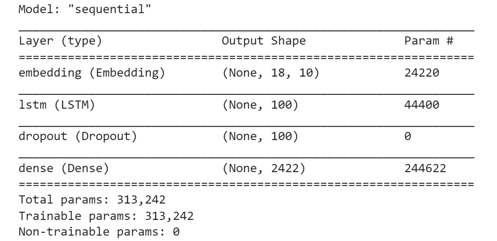


7.  Fit your model with `model.fit` and set it to run on
    `100` epochs. Set `verbose` equal to
    `5`:

    
    ```
    model.fit(predictors, label, epochs=100, verbose=5)
    ```


    You should get the following output:

    
    


8.  Write a function that will receive an input text, a model, and the
    number of next words to be predicted. This function will prepare the
    input text to be fed into the model that will predict the next word:
    
    ```
    def generate_text(seed_text, next_words, \
                      model, max_sequence_len):
        for _ in range(next_words):
            token_list = tokenizer.texts_to_sequences\
                         ([seed_text])[0]
            token_list = pad_sequences([token_list], \
                                       maxlen=max_sequence_len-1,\
                                       padding='pre')
            predicted = model.predict_classes(token_list, verbose=0)
            output_word = ""
            for word,index in tokenizer.word_index.items():
                if index == predicted:
                    output_word = word
                    break
            seed_text += " "+output_word
        return seed_text.title()
    ```


9.  Output some of your generated text with the `print`
    function. Add your own words for the model to use and generate from.
    For example, in `the hottest new`, the integer
    `5` is the number of words output by the model:

    
    ```
    print (generate_text("the hottest new", 5, model,\
                         max_sequence_len))
    print (generate_text("the stock market", 4, model,\
                         max_sequence_len))
    print (generate_text("russia wants to", 3, model,\
                         max_sequence_len))
    print (generate_text("french citizen", 4, model,\
                         max_sequence_len))
    print (generate_text("the one thing", 15, model,\
                         max_sequence_len))
    print (generate_text("the coronavirus", 5, model,\
                         max_sequence_len))
    ```


    You should get the following output:

    
    


In this result, you can see the text generated by your model for each
sentence.

In this exercise, you have successfully predicted some news headlines.
Not surprisingly, some of them may not be very impressive, but some are
not too bad.

Now that you have all the essential knowledge about RNNs, try to test
yourself by performing the next activity.

Activity 9.02: Building an RNN for Predicting Tweets\' Sentiment
----------------------------------------------------------------

The `tweets.csv` dataset contains a list of tweets related to
an airline company. Each of the tweets has been classified as having
positive, negative, or neutral sentiment.

You have been tasked to analyze a sample of tweets for the company. Your
goal is to build an RNN model that will be able to predict the sentiment
of each tweet: either positive or negative.

Note

You can find `tweets.csv` here:
[https://github.com/fenago/deep-learning-essentials/blob/main/Lab08/Datasets/tweets.csv].

Perform the following steps to complete this activity.

1.  Import the necessary packages.

2.  Prepare the data (combine the `Date` and `Time`
    columns, name it `datetime`, sort the data, and fill in
    missing values).

3.  Prepare the text data (tokenize words and add padding).

4.  Split the dataset into training and testing sets with, respectively,
    the first 10,000 tweets and the remaining tweets.

5.  Define and train an RNN model composed of two different layers of
    LSTM with, respectively, `50` and `100` units
    followed by 20% dropout and ReLU as the activation function.

6.  Make predictions on the testing set with the trained model.

    You should get the following output:

    
    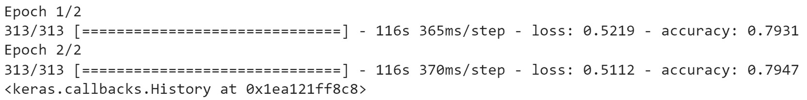


Summary
=======


In this lab, you explored different recurrent models for sequential
data. You learned that each sequential data point is dependent on the
prior sequence of data points, such as natural language text. You also
learned why you must use models that allow for the sequence of data to
be used by the model, and sequentially generate the next output.

This lab introduced RNN models that can make predictions for
sequential data. You observed the way RNNs can loop back on themselves,
which allows the output of the model to feed back into the input. You
reviewed the types of challenges that you face with these models, such
as vanishing and exploding gradients, and how to address them.
