Lab 8:  Recurrent Neural Networks
=================================


Overview

In this lab, you will learn how to handle real sequential data. You
will extend your knowledge of **artificial neural network** (**ANN**)
models and **recurrent neural network** (**RNN**) architecture for
training sequential data. You will also learn how to build an RNN model
with an LSTM layer for natural language processing.

By the end of this lab, you will have gained hands-on experience of
applying multiple LSTM layers to build RNNs for stock price predictions.


Introduction
============


Sequential data refers to datasets in which each data point is dependent
on the previous ones. Think of it like a sentence, which is composed of
a sequence of words that are related to each other. A verb will be
linked to a subject and an adverb will be related to a verb. Another
example is a stock price, where the price on a particular day is related
to the price of the previous days. Traditional neural networks are not
fit for processing this kind of data. There is a specific type of
architecture that can ingest sequences of data. This lab will
introduce you to such models---known as **recurrent neural networks**
(**RNNs**).

An RNN model is a specific type of deep learning architecture in which
the output of the model feeds back into the input. Models of this kind
have their own challenges (known as vanishing and exploding gradients)
that will be addressed later in the lab.

In many ways, an RNN is a representation of how a brain might work. RNNs
use memory to help them learn. But how can they do this if information
only flows in one direction? To understand this, you\'ll need to first
review sequential data. This is a type of data that requires a working
memory to process data effectively. Until now, you have only explored
non-sequential models, such as a perceptron or CNN. In this lab, you
will look at sequential models such as RNN, LSTM, or GRU.

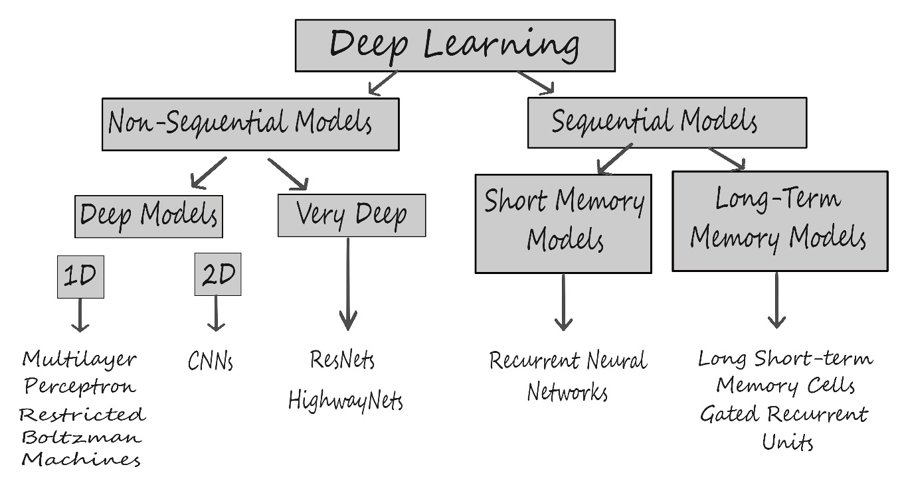


Sequential Data
===============


Sequential data is information that happens in a sequence and is related
to past and future data. An example of sequential data is time series
data; as you perceive it, time only travels in one direction.

Suppose you have a ball (as in *Figure 9.2*), and you want to predict
where this ball will travel next. If you have no prior information about
the direction from which the ball was thrown, you will simply have to
guess. However, if in addition to the ball\'s current location, you also
had information about its previous location, the problem would be much
simpler. To be able to predict the ball\'s next location, you need the
previous location information in a sequential (or ordered) form to make
a prediction about future events.

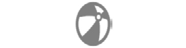


RNNs function in a way that allows the sequence of the information to
retain value with the help of internal memory.

You\'ll take a look at some examples of sequential data in the following
section.

Examples of Sequential Data
---------------------------

Sequential data is a specific type of data where the order of each piece
of information is important, and they all depend on each other.

One example of sequential data is financial data, such as stock prices.
If you want to predict future data values for a given stock, you need to
use previous values in time. In fact, you will work on stock prediction
in *Exercise 9.01*, *Training an ANN for Sequential Data -- Nvidia Stock
Prediction*.

Audio and text can also be considered sequential data. Audio can be
split up into a sequence of sound waves, and text can be split up into
sequences of either characters or words. The sound waves or sequences of
characters or words should be processed in order to convey the desired
result. Beyond these two examples that you encounter every day, there
are many more examples in which sequential processing may be useful,
from analyzing medical signals such as EEGs, projecting stock prices,
and inferring and understanding genomic sequences. There are three
categories of sequential data:

-   **Many-to-One** produces one output from many inputs.
-   **One-to-Many** produces many outputs from one input.
-   **Many-to-Many** produces many outputs from many inputs.

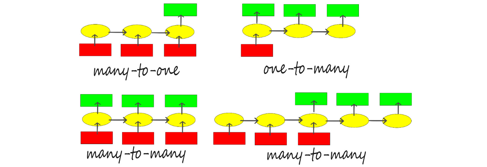


Consider another example. Suppose you have a language model with a
sentence or a phrase and you are trying to predict the word that comes
next, as in the following figure:

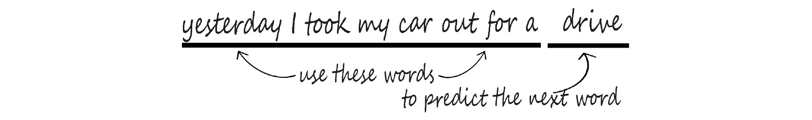


Say you\'re given the words
`yesterday I took my car out for a…`, and you want to try to
predict the next word, `drive`. One way you could do this is
by building a deep neural network such as a feed-forward neural network.
However, you would immediately run into a problem. A feed-forward
network can only take a fixed-length input vector as its input; you have
to specify the size of that input right from the start.

Because of this, your model needs a way to be able to handle
variable-length inputs. One way you can do this is by using a fixed
window. That means that you force your input vector to be just a certain
length. For example, you can split the sentence into groups of two
consecutive words (also called a **bi-gram**) and predict the next one.
This means that no matter where you\'re trying to make that next
prediction, your model will only be taking in the previous two words as
its input. You need to consider how you can numerically represent this
data. One way you can do this is by taking a fixed-length vector and
allocating some space in that vector for the first word and some space
in that vector for the second word. In those spaces, encode the identity
of each word. However, this is problematic.

Why? Because you\'re using only a portion of the information available
(that is, two consecutive words only). You have access to a limited
window of data that doesn\'t give enough context to accurately predict
what will be the next word. That means you cannot effectively model
long-term dependencies. This is important in sentences like the one in
*Figure 9.5* where you clearly need information from much earlier in the
sentence to be able to accurately predict the next word.

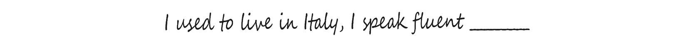


If you were only looking at the past two or three words, you wouldn\'t
be able to make this next prediction, which you know is
`Italian`. So, this means that you really need a way to
integrate the information in the sentence from start to finish.

To do this, you could use a set of counts as a fixed-length vector and
use the entire sentence. This method is known as **bag of words**.

You have a fixed-length vector regardless of the identity of the
sentence, but what differs is adding the counts over this vocabulary.
You can feed this into your model as an input to generate a prediction.

However, there\'s another big problem with this. Using just the counts
means that you lose all sequential information and all information about
the prior history.

Consider *Figure 9.6*. So, these two sentences, which have completely
opposite semantic meanings would have the exact same representations in
this bag of words format. This is because they have the exact same list
of words, just in a different order. So, obviously, this isn\'t going to
work. Another idea could be simply to extend the fixed window.

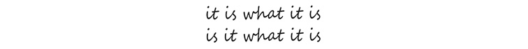


Now, consider *Figure 9.7*. You can represent your sentence in this way,
feed the sentence into your model, and generate your prediction. The
problem is that if you were to feed this vector into a feed-forward
neural network, each of these inputs,
`yesterday I took my car`, would have a separate weight
connecting it to the network. So, if you were to repeatedly see the word
`yesterday` at the beginning of the sentence, the network may
be able to learn that `yesterday` represents a time or a
setting. However, if `yesterday` were to suddenly appear later
in that fixed-length vector, at the end of a sentence, the network may
have difficulty understanding the meaning of `yesterday`. This
is because the parameters that are at the end of a vector may never have
seen the term `yesterday` before, and the parameters from the
beginning of the sentence weren\'t shared across the entire sequence.

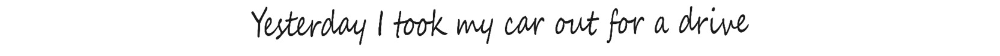


So, you need to be able to handle variable-length input and long-term
dependencies, track sequential order, and have parameters that can be
shared across the entirety of your sequence. Specifically, you need to
develop models that can do the following:

-   Handle variable-length input sequences.
-   Track long-term dependencies in the data.
-   Maintain information about the sequence\'s order.
-   Share parameters across the entirety of the sequence.

How can you do this with a model where information only flows in one
direction? You need a different kind of neural network. You need a
recursive model. You will practice processing sequential data in the
following exercise.

Exercise 9.01: Training an ANN for Sequential Data -- Nvidia Stock Prediction
-----------------------------------------------------------------------------

In this exercise, you will build a simple ANN model to predict the
Nvidia stock price. But unlike examples from previous chapters, this
time the input data is sequential. So, you need to manually do some
processing to create a dataset that will contain the price of the stock
for a given day as the target variable and the price for the previous 60
days as features. You are required to split the data into training and
testing sets before and after the date `2019-01-01`.

Note

You can find the `NVDA.csv` dataset here:
[https://github.com/fenago/deep-learning-essentials/blob/main/Lab09/Datasets/NVDA.csv].

1.  Open a new Jupyter or Colab notebook.

2.  Import the libraries needed. Use `numpy` for computation,
    `matplotlib` for plotting visualization,
    `pandas` to help work with your dataset, and
    `MinMaxScaler` to scale the dataset between zero and one:
    
    ```
    import numpy as np
    import matplotlib.pyplot as plt
    import pandas as pd
    from sklearn.preprocessing import StandardScaler, MinMaxScaler
    ```


3.  Use the `read_csv()` function to read in the CSV file and
    store your dataset in a pandas DataFrame, `data`, for
    manipulation:
    
    ```
    import io
    data = pd.read_csv('NVDA.csv')
    ```


4.  Call the `head()` function on your data to take a look at
    the first five rows of your DataFrame:

    
    ```
    data.head()
    ```


    You should get the following output:

    
    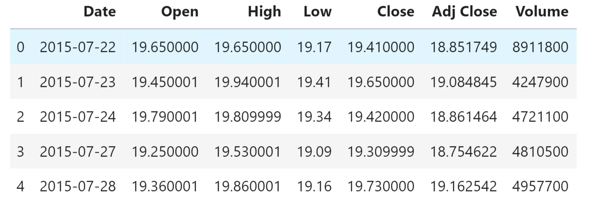


    The preceding table shows the raw data. You can see that each row
    represents a day where you have information about the stock price
    when the market opened and closed, the highest price, the lowest
    price, and the adjusted close price of the stock (taking into
    account dividend or stock split, for instance).

5.  Now, split the training data. Use all data that is older than
    `2019-01-01` using the `Date` column for your
    training data. Save it as `data_training`. Save this in a
    separate file by using the `copy()` method:
    
    ```
    data_training = data[data['Date']<'2019-01-01'].copy()
    ```


6.  Now, split the test data. Use all data that is more recent than or
    equal to `2019-01-01` using the `Date` column.
    Save it as `data_test`. Save this in a separate file by
    using the `copy()` method:
    
    ```
    data_test = data[data['Date']>='2019-01-01'].copy()
    ```


7.  Use `drop()` to remove your `Date` and
    `Adj Close` columns in your DataFrame. Remember that you
    used the `Date` column to split your training and test
    sets, so the date information is not needed. Use
    `axis = 1` to specify that you also want to drop labels
    from your columns. To make sure it worked, call the
    `head()` function to take a look at the first five rows of
    the DataFrame:

    
    ```
    training_data = data_training.drop\
                    (['Date', 'Adj Close'], axis = 1)
    training_data.head()
    ```


    You should get the following output:

    
    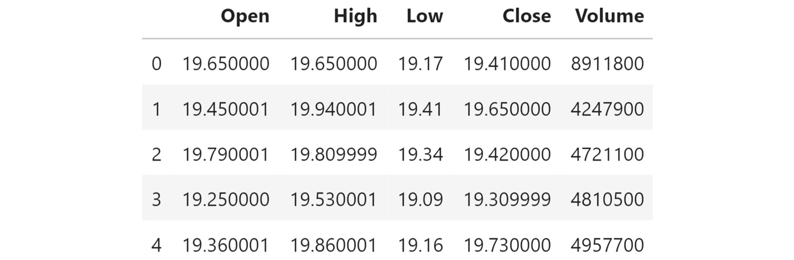


    This is the output you should get after removing those two columns.

8.  Create a scaler from `MinMaxScaler` to scale
    `training_data` to numbers between zero and one. Use the
    `fit_transform` function to fit the model to the data and
    then transform the data according to the fitted model:

    
    ```
    scaler = MinMaxScaler()
    training_data = scaler.fit_transform(training_data)
    training_data
    ```


    You should get the following output:

    
    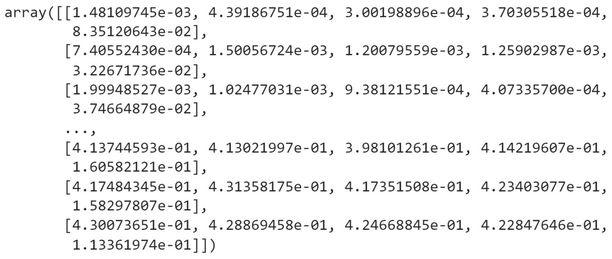


9.  Split your data into `X_train` and `y_train`
    datasets:
    
    ```
    X_train = []
    y_train = []
    ```


10. Check the shape of `training_data`:

    
    ```
    training_data.shape[0]
    ```


    You should get the following output:

    
    ```
    868
    ```


    You can see there are 868 observations in the training set.

11. Create a training dataset that has the previous 60 days\' stock
    prices so that you can predict the closing stock price for day 61.
    Here, `X_train` will have two columns. The first column
    will store the values from 0 to 59, and the second will store values
    from 1 to 60. In the first column of `y_train`, store the
    61st value at index 60, and in the second column, store the 62nd
    value at index 61. Use a `for` loop to create data in 60
    time steps:
    
    ```
    for i in range(60, training_data.shape[0]):
        X_train.append(training_data[i-60:i])
        y_train.append(training_data[i, 0])
    ```


12. Convert `X_train` and `y_train` into NumPy
    arrays:
    
    ```
    X_train, y_train = np.array(X_train), np.array(y_train)
    ```


13. Call the `shape()` function on `X_train` and
    `y_train`:

    
    ```
    X_train.shape, y_train.shape
    ```


    You should get the following output:

    
    ```
    ((808, 60, 5), (808,))
    ```


    The preceding snippet shows that the prepared training set contains
    `808` observations with `60` days of data for
    the five features you kept (`Open`, `Low`,
    `High`, `Close`, and `Volume`).

14. Transform the data into a 2D matrix with the shape of the sample
    (the number of samples and the number of features in each sample).
    Stack the features for all 60 days on top of each other to get an
    output size of `(808, 300)`. Use the following code for
    this purpose:

    
    ```
    X_old_shape = X_train.shape
    X_train = X_train.reshape(X_old_shape[0], \
                              X_old_shape[1]*X_old_shape[2]) 
    X_train.shape
    ```


    You should get the following output:

    
    ```
    (808, 300)
    ```


15. Now, build an ANN. You will need some additional libraries for this.
    Use `Sequential` to initialize the neural net,
    `Input` to add an input layer, `Dense` to add a
    dense layer, and `Dropout` to help prevent overfitting:
    
    ```
    from tensorflow.keras import Sequential
    from tensorflow.keras.layers import Input, Dense, Dropout
    ```


16. Initialize the neural network by calling
    `regressor_ann = Sequential()`.
    
    ```
    regressor_ann = Sequential()
    ```


17. Add an input layer with `shape` as `300`:
    
    ```
    regressor_ann.add(Input(shape = (300,)))
    ```


18. Then, add the first dense layer. Set it to `512` units,
    which will be your dimensionality for the output space. Use a ReLU
    activation function. Finally, add a dropout layer that will remove
    20% of the units during training to prevent overfitting:
    
    ```
    regressor_ann.add(Dense(units = 512, activation = 'relu'))
    regressor_ann.add(Dropout(0.2))
    ```


19. Add another dense layer with `128` units, ReLU as the
    activation function, and a dropout of `0.3`:
    
    ```
    regressor_ann.add(Dense(units = 128, activation = 'relu'))
    regressor_ann.add(Dropout(0.3))
    ```


20. Add another dense layer with `64` units, ReLU as the
    activation function, and a dropout of `0.4`:
    
    ```
    regressor_ann.add(Dense(units = 64, activation = 'relu'))
    regressor_ann.add(Dropout(0.4))
    ```


21. Again, add another dense layer with `128` units, ReLU as
    the activation function, and a dropout of `0.3`:
    
    ```
    regressor_ann.add(Dense(units = 16, activation = 'relu'))
    regressor_ann.add(Dropout(0.5))
    ```


22. Add a final dense layer with one unit:
    
    ```
    regressor_ann.add(Dense(units = 1))
    ```


23. Check the summary of the model:

    
    ```
    regressor_ann.summary()
    ```


    You will get valuable information about your model layers and
    parameters.

    
    


24. Use the `compile()` method to configure your model for
    training. Choose Adam as your optimizer and mean squared error to
    measure your loss function:
    
    ```
    regressor_ann.compile(optimizer='adam', \
                          loss = 'mean_squared_error')
    ```


25. Finally, fit your model and set it to run on `10` epochs.
    Set your batch size to `32`:

    
    ```
    regressor_ann.fit(X_train, y_train, epochs=10, batch_size=32)
    ```


    You should get the following output:

    
    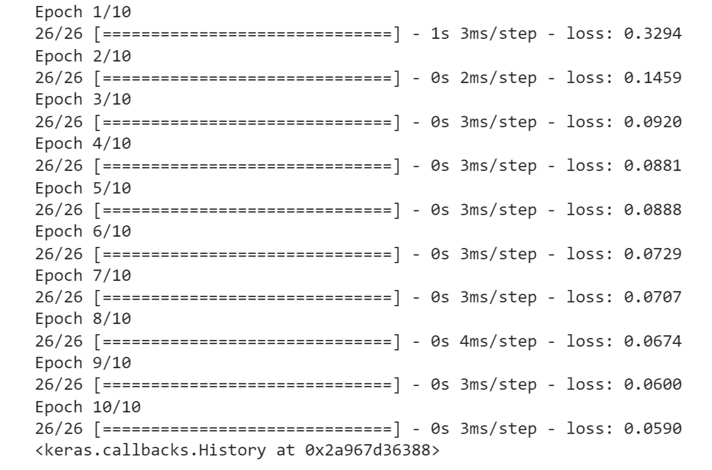


26. Test and predict the stock price and prepare the dataset. Check your
    data by calling the `head()` method:

    
    ```
    data_test.head()
    ```


    You should get the following output:

    
    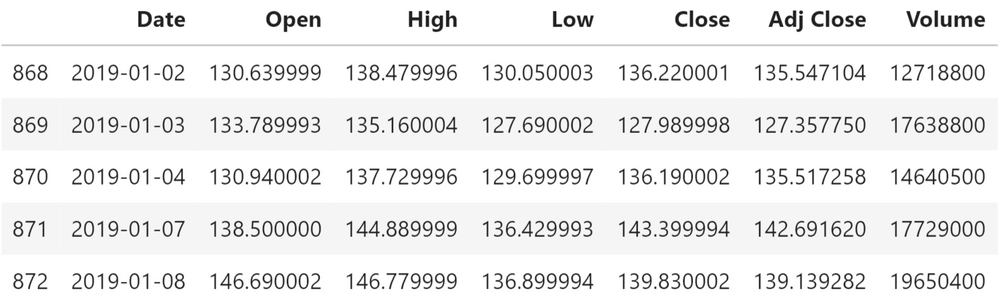


27. Use the `tail(60)` method to create a
    `past_60_days` variable, which consists of the last 60
    days of data in the training set. Add the `past_60_days`
    variable to the test data with the `append()` function.
    Assign `True` to `ignore_index`:
    
    ```
    past_60_days = data_training.tail(60)
    df = past_60_days.append(data_test, ignore_index = True)
    ```


28. Now, prepare your test data for predictions by repeating what you
    did for the training data in *steps 8* to *15*:

    
    ```
    df = df.drop(['Date', 'Adj Close'], axis = 1)
    inputs = scaler.transform(df) 
    X_test = []
    y_test = []
    for i in range(60, inputs.shape[0]):
        X_test.append(inputs[i-60:i])
        y_test.append(inputs[i, 0])
    X_test, y_test = np.array(X_test), np.array(y_test)
    X_old_shape = X_test.shape
    X_test = X_test.reshape(X_old_shape[0], \
                            X_old_shape[1] * X_old_shape[2])
    X_test.shape, y_test.shape
    ```


    You should get the following output:

    
    ```
    ((391, 300), (391,))
    ```


29. Test some predictions for your stock prices by calling the
    `predict()` method on `X_test`:
    
    ```
    y_pred = regressor_ann.predict(X_test)
    ```


30. Before looking at the results, reverse the scaling you did earlier
    so that the number you get as output will be at the correct scale
    using the `StandardScaler` utility class that you imported
    with `scaler.scale_`:

    
    ```
    scaler.scale_
    ```


    You should get the following output:

    
    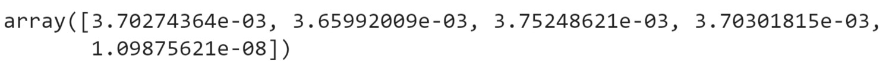


31. Use the first value in the preceding array to set your scale in
    preparation for the multiplication of `y_pred` and
    `y_test`. Recall that you are converting your data back
    from your earlier scale, in which you converted all values to
    between zero and one:

    
    ```
    scale = 1/3.70274364e-03
    scale 
    ```


    You should get the following output:

    
    ```
    270.0700067909643
    ```


32. Multiply `y_pred` and `y_test` by
    `scale` to convert your data back to the proper values:
    
    ```
    y_pred = y_pred*scale
    y_test = y_test*scale
    ```


33. Review the real Nvidia stock price and your predictions:

    
    ```
    plt.figure(figsize=(14,5))
    plt.plot(y_test, color = 'black', label = "Real NVDA Stock Price")
    plt.plot(y_pred, color = 'gray',\
             label = 'Predicted NVDA Stock Price')
    plt.title('NVDA Stock Price Prediction')
    plt.xlabel('time')
    plt.ylabel('NVDA Stock Price')
    plt.legend()
    plt.show()
    ```


    You should get the following output:

    
    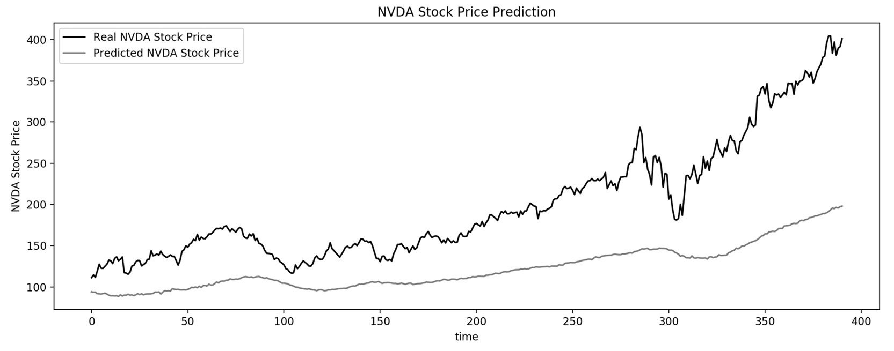


In the preceding graph, you can see that your trained model is able to
capture some of the trends of the Nvidia stock price. Observe that the
predictions are quite different from the real values. It is evident from
this result that ANNs are not suited for sequential data.

In this exercise, you saw the inability of simple ANNs to deal with
sequential data. In the next section, you will learn about recurrent
neural networks, which are designed to learn from the temporal
dimensionality of sequential data. Then, in *Exercise 9.02*, *Building
an RNN with LSTM Layer Nvidia Stock Prediction*, you will perform
predictions on the same Nvidia stock price dataset using RNNs and
compare your results.


Recurrent Neural Networks
=========================


The first formulation of a recurrent-like neural network was created by
John Hopfield in 1982. He had two motivations for doing so:

-   Sequential processing of data
-   Modeling of neuronal connectivity

Essentially, an RNN processes input data at each time step and stores
information in its memory that will be used for the next step.
Information is first transformed into vectors that can be processed by
machines. The RNN then processes the vector sequence one at a time. As
it processes each vector, it passes the previous hidden state. The
hidden state retains information from the previous step, acting as a
type of memory. It does this by combining the input and the previous
hidden state with a tanh function that compresses the values between
`-1` and `1`.

Essentially, this is how the RNN functions. RNNs don\'t need a lot of
computation and work well with short sequences.

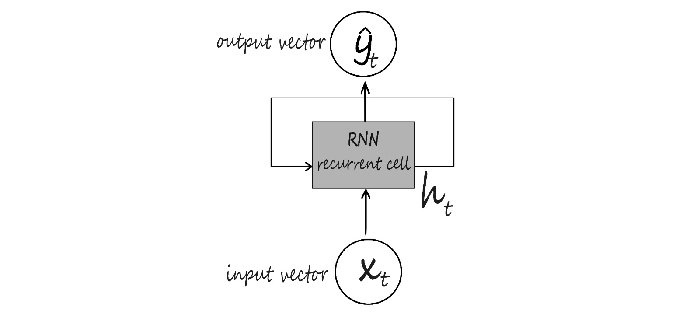


Now turn your attention to applying neural networks to problems that
involve sequential processing of data. You\'ve already learned a bit
about why these sorts of tasks require a fundamentally different type of
network architecture from what you\'ve seen so far.

RNN Architecture
----------------

This section will go through the key principles behind RNNs, how they
are fundamentally different from what you\'ve learned so far, and how
RNN computation actually works.

But before you do that, take one step back and consider the standard
feed-forward neural network that was discussed previously.

In feed-forward neural networks, data propagates in one direction only,
that is, from input to output.

Therefore, you need a different kind of network architecture to handle
sequential data. RNNs are particularly well-suited to handling cases in
which you have a sequence of inputs rather than a single input. These
are great for problems in which a sequence of data is being propagated
to give a single output.

For example, imagine that you are training a model that takes a sequence
of words as input and outputs an emotion associated with that sequence.
Similarly, consider cases in which, instead of returning a single
output, you could have a sequence of inputs and propagate them through
your network, where each time step in the sequence generates an output.

Simply put, RNNs are networks that offer a mechanism to persist
previously processed data over time and use it to make future
predictions.

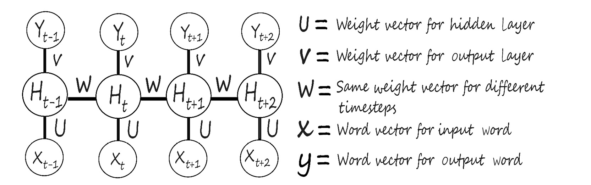


In the preceding diagram, at some time step denoted by t, the RNN takes
in `X`[t]{.subscript} as the input, and at that time step, it
computes a prediction value, `Y`[t]{.subscript}, which is the
output of the network.

In addition to that output, it saved an internal state, called update,
`H`[t]{.subscript}. This internal state from time step
`t` can then be used to complement the input of the next time
step `t+1`. So, basically, it provides information about the
previous step to the next one. This mechanism is called **recurrent**
because information is being passed from one time step to the next
within the network.

What\'s really happening here? This is done by using a simple recurrence
relation to process the sequential data. RNNs maintain internal state,
`H`[t]{.subscript}, and combine it with the next input data,
`X`[t+1]{.subscript}, to make a prediction,
`Y`[t+1]{.subscript}, and store the new internal state,
`H`[t+1]{.subscript}. The key idea is that the state update is
a combination of the previous state time step as well as the current
input that the network is receiving.

It\'s important to note that, in this computation, it\'s the same
function `f` of `W` and the same set of parameters
that are used at every time step, and it\'s those sets of parameters
that you learn during the course of training. To get a better sense of
how these networks work, step through the RNN algorithm:

1.  You begin by initializing your RNN and the hidden state of that
    network. You can denote a sentence for which you are interested in
    predicting the next word. The RNN computation simply consists of
    them looping through the words in this sentence.
2.  At each time step, you feed both the current word that you\'re
    considering, as well as the previous hidden state of your RNN into
    the network. This can then generate a prediction for the next word
    in the sequence and use this information to update its hidden state.
3.  Finally, after you\'ve looped through all the words in the sentence,
    your prediction for that missing word is simply the RNN\'s output at
    that final time step.

As you can see in the following diagram, this RNN computation includes
both the internal state update and the formal output vector.

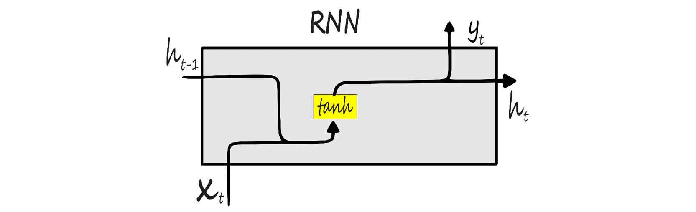


Given the input vector, `X`[t]{.subscript}, the RNN applies a
function to update its hidden state. This function is simply a standard
neural net operation. It consists of multiplication by a weight matrix
and the application of a non-linearity activation function. The key
difference is that, in this case, you\'re feeding in both the input
vector, `X`[t]{.subscript}, and the previous state as inputs
to this function, `H`[t-1]{.subscript}.

Next, you apply a non-linearity activation function such as tanh to the
previous step. You have these two weight matrices, and finally, your
output, `y`[t]{.subscript}, at a given time step is then a
modified, transformed version of this internal state.

After you\'ve looped through all the words in the sentence, your
prediction for that missing word is simply the RNN\'s output at that
final time step, after all the words have been fed through the model.
So, as mentioned, RNN computation includes both internal state updates
and formal output vectors.

Another way you can represent RNNs is by unrolling their modules over
time. You can think of RNNs as having multiple copies of the same
network, where each passes a message on to its descendant.

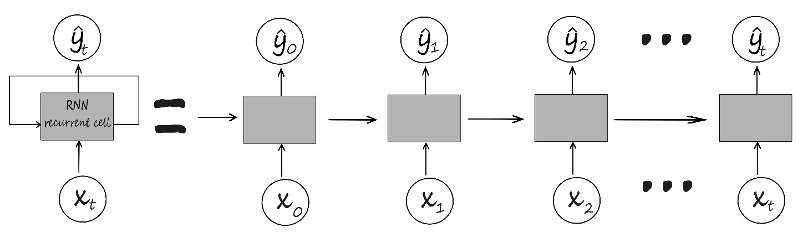


In this representation, you can make your weight matrices explicit,
beginning with the weights that transform the input to the `H`
weights that are used to transform the previous hidden state to the
current hidden state, and finally the hidden state to the output.

It\'s important to note that you use the same weight matrices at every
time step. From these outputs, you can compute a loss at each time step.
The computation of the loss will then complete your forward propagation
through the network. Finally, to define the total loss, you simply sum
the losses from all of the individual time steps. Since your loss is
dependent on each time step, this means that, in training the network,
you will have to also involve time as a component.

Now that you\'ve got a bit of a sense of how these RNNs are constructed
and how they function, you can walk through a simple example of how to
implement an RNN from scratch in TensorFlow.

The following snippet uses a simple RNN from
`keras.models.Sequential`. You specify the number of units as
`1` and set the first input dimension to `None` as
an RNN can process any number of time steps. A simple RNN uses tanh
activation by default:


```
model = keras.models.Sequential([
                                 keras.layers.SimpleRNN\
                                 (1, input_shape=[None, 1]) 
])
```


The preceding code creates a single layer with a single neuron.

That was easy enough. Now you need to stack some additional recurrent
layers. The code is similar, but there is a key difference here. You
will notice `return_sequences=True` on all but the last layer.
This is to ensure that the output is a 3D array. As you can see, the
first two layers each have `20` units:


```
model = keras.models.Sequential\
        ([Keras.layers.SimpleRNN\
          (20, return_sequences=True, input_shape=[None, 1]), \
          Keras.layers.SimpleRNN(20, return_sequences=True), \
          Keras.layers.SimpleRNN(1)])
```


The RNN is defined as a layer, and you can build it by inheriting it
from the layer class. You can also initialize your weight matrices and
the hidden state of your RNN cell to zero.

The key step here is defining the call function, which describes how you
make a forward pass through the network given an input `X`.
And, to break down this call function, you would first update the hidden
state according to the equation discussed previously.

Take the previous hidden state and the input `X`, multiply
them by the relevant weight matrices, add them together, and then pass
them through a non-linearity, like a hyperbolic tangent (tanh).

Then, the output is simply a transformed version of the hidden state,
and at each time step, you return both the current output and the
updated hidden state.

TensorFlow has made it easy by having a built-in dense layer. The same
applies to RNNs. TensorFlow has implemented these types of RNN cells
with the simple RNN layer. But this type of layer has some limitations,
such as vanishing gradients. You will look at this problem in the next
section before exploring different types of recurrent layers.

Vanishing Gradient Problem
--------------------------

If you take a closer look at how gradients flow in this chain of
repeating modules, you can see that between each time step you need to
perform matrix multiplication. That means that the computation of the
gradient---that is, the derivative of the loss with respect to the
parameters, tracing all the way back to your initial state---requires
many repeated multiplications of this weight matrix, as well as repeated
use of the derivative of your activation function.

You can have one of two scenarios that could be particularly
problematic: the exploding gradient problem or the vanishing gradient
problem.

The exploding gradients problem is when gradients become continuously
larger and larger due to the matrix multiplication operation, and you
can\'t optimize them anymore. One way you may be able to mitigate this
is by performing what\'s called gradient clipping. This amounts to
scaling back large gradients so that their values are smaller and closer
to `1`.

You can also have the opposite problem where your gradients are too
small. This is what is known as the vanishing gradient problem. This is
when gradients become increasingly smaller (close to `0`) as
you make these repeated multiplications, and you can no longer train the
network. This is a very real problem when it comes to training RNNs.

For example, consider a scenario in which you keep multiplying a number
by some number that\'s in between zero and one. As you keep doing this
repeatedly, that number is constantly shrinking until, eventually, it
vanishes and becomes 0. When this happens to gradients, it\'s hard to
propagate errors further back into the past because the gradients are
becoming smaller and smaller.

Consider the earlier example from the language model where you were
trying to predict the next word. If you\'re trying to predict the last
word in the following phrase, it\'s relatively clear what the next word
is going to be. There\'s not that much of a gap between the key relevant
information, such as the word \"fish,\" and the place where the
prediction is needed.

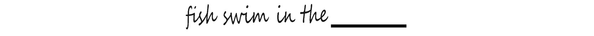


However, there are other cases where more context is necessary, like in
the following example. Information from early in the sentence,
`She lived in Spain`, suggests that the next word of the
sentence after `she speaks fluent` is most likely the name of
a language, `Spanish`.

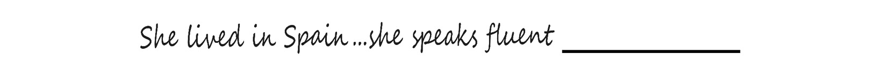


But you need the context of `Spain`, which is located at a
much earlier position in this sentence, to be able to fill in the
relevant gaps and identify which language is correct. As this gap
between words that are semantically important grows, RNNs become
increasingly unable to connect the dots and link these relevant pieces
of information together. That is due to the vanishing gradient problem.

How can you alleviate this? The first trick is simple. You can choose
either tanh or sigmoid as your activation function. Both of these
functions have derivatives that are less than `1`.

Another simple trick you can use is to initialize the weights for the
parameters of your network. It turns out that initializing the weights
to the identity matrix helps prevent them shrinking to zero too rapidly
during back-propagation.

But the final and most robust solution is to use a slightly more complex
recurrent unit that can track long-term dependencies in the data more
effectively. It can do this by controlling what information is passed
through and what information is used to update its internal state.
Specifically, this is the concept of a gated cell, like in the LSTM
layer, which is the focus of the next section.

Long Short-Term Memory Network
------------------------------

LSTMs are well-suited to learning long-term dependencies and overcoming
the vanishing gradient problem. They are very performant models for
sequential data, and they\'re widely used by the deep learning
community.

LSTMs have a chain-like structure. In an LSTM, the repeating unit
contains different interacting layers. The key point is that these
layers interact to selectively control the flow of information within
the cell.

The key building block of the LSTM is a structure called a gate, which
functions to enable the LSTM to selectively add or remove information
from its cell state. Gates consist of a neural net layer like a sigmoid.

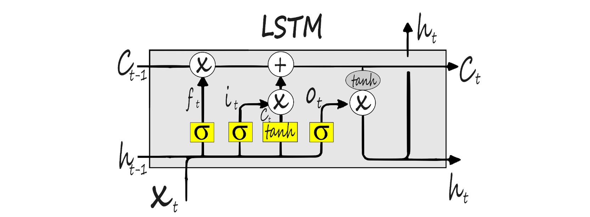


Take a moment to think about what a gate like this would do in an LSTM.
In this case, the sigmoid function would force its input to be between
`0` and `1`. You can think of this mechanism as
capturing how much of the information that\'s passed through the gate
should be retained. It\'s between zero and one. This effectively gates
the flow of information.

LSTMs process information through four simple steps:

1.  The first step in the LSTM is to decide what information is going to
    be thrown away from the cell state, to forget irrelevant history.
    This is a function of both the prior internal state,
    `H`[t-1]{.subscript}, and the input,
    `X`[t]{.subscript}, because some of that information may
    not be important.
2.  Next, the LSTM decides what part of the new information is relevant
    and uses this to store this information in its cell state.
3.  Then, it takes both the relevant parts of the prior information, as
    well as the current input, and uses this to selectively update its
    cell state.
4.  Finally, it returns an output, and this is known as the output gate,
    which controls what information encoded in the cell state is sent to
    the network.
    
    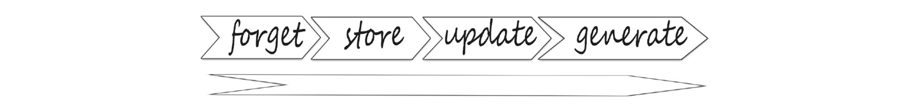


The key takeaway here for LSTMs is the sequence of how they regulate
information flow and storage. Once again, LSTMs operate as follows:

-   Forgetting irrelevant history
-   Storing what\'s new and what\'s important
-   Using its internal memory to update the internal state
-   Generating an output

An important property of LSTMs is that all these different gating and
update mechanisms work to create an internal cell state, `C`,
which allows the uninterrupted flow of gradients through time. You can
think of it as sort of a highway of cell states where gradients can flow
uninterrupted. This enables you to alleviate and mitigate the vanishing
gradient problem that\'s seen with standard RNNs.

LSTMs are able to maintain this separate cell state independently of
what is output, and they use gates to control the flow of information by
forgetting irrelevant history, storing relevant new information,
selectively updating their cell state, and then returning a filtered
version as the output.

The key point in terms of training and LSTMs is that maintaining the
separate independent cell state allows the efficient training of an LSTM
to backpropagate through time, which is discussed later.

Now that you\'ve gone through the fundamental workings of RNNs, the
backpropagation through time algorithm, and a bit about the LSTM
architecture, you can put some of these concepts to work in the
following example.

Consider the following LSTM model:


```
regressor = Sequential()
regressor.add(LSTM(units= 50, activation = 'relu', \
                   return_sequences = True, \
                   input_shape = (X_train.shape[1], 5)))
regressor.add(Dropout(0.2))
regressor.add(LSTM(units= 60, activation = 'relu', \
                   return_sequences = True))
regressor.add(Dropout(0.3))
regressor.add(LSTM(units= 80, activation = 'relu', \
                   return_sequences = True))
regressor.add(Dropout(0.4))
regressor.add(LSTM(units= 120, activation = 'relu'))
regressor.add(Dropout(0.5))
regressor.add(Dense(units = 1))
```


First, you have initialized a neural network by calling
`regressor = Sequential()`. Again, it\'s important to note
that in the last line you omit `return_sequences = True`
because it is the final output:


```
regressor = Sequential()
```


Then, the LSTM layer is added. In the first instance, set the LSTM layer
to `50` units. Use a relu activation function and specify the
shape of the training set. Finally, the dropout layer is added with
`regressor.add(Dropout(0.2)`. The `0.2` means that
20% of the layers will be removed. Set
`return_sequences = True`, which allows the return of the last
output.

Similarly, add three more LSTM layers and one dense layer to the LSTM
model.

Now that you are familiar with the basic concepts surrounding working
with sequential data, it\'s time to complete the following exercise
using some real data.

Exercise 9.02: Building an RNN with an LSTM Layer -- Nvidia Stock Prediction
----------------------------------------------------------------------------

In this exercise, you will be working on the same dataset as for
*Exercise 9.01*, *Training an ANN for Sequential Data -- Nvidia Stock
Prediction*. You will still try to predict the Nvidia stock price based
on the data of the previous 60 days. But this time, you will be training
an LSTM model. You will need to split the data into training and testing
sets before and after the date `2019-01-01`.

Note

You can find the `NVDA.csv` dataset here:
[https://github.com/fenago/deep-learning-essentials/blob/main/Lab09/Datasets/NVDA.csv].

You will need to prepare the dataset like in *Exercise 9.01*, *Training
an ANN for Sequential Data -- Nvidia Stock Prediction* (*steps 1* to
*15*) before applying the following code:

1.  Start building the LSTM. You will need some additional libraries for
    this. Use `Sequential` to initialize the neural net,
    `Dense` to add a dense layer, `LSTM` to add an
    LSTM layer, and `Dropout` to help prevent overfitting:
    
    ```
    from tensorflow.keras import Sequential
    from tensorflow.keras.layers import Dense, LSTM, Dropout
    ```


2.  Initialize the neural network by calling
    `regressor = Sequential()`. Add four LSTM layers with
    `50`, `60`, `80`, and `120`
    units each. Use a ReLU activation function and assign
    `True` to `return_sequences` for all but the
    last LSTM layer. Provide the shape of your training set to the first
    LSTM layer. Finally, add dropout layers with 20%, 30%, 40%, and 50%
    dropouts:
    
    ```
    regressor = Sequential()
    regressor.add(LSTM(units= 50, activation = 'relu',\
                       return_sequences = True,\
                       input_shape = (X_train.shape[1], 5)))
    regressor.add(Dropout(0.2))
    regressor.add(LSTM(units= 60, activation = 'relu', \
                  return_sequences = True))
    regressor.add(Dropout(0.3))
    regressor.add(LSTM(units= 80, activation = 'relu', \
                  return_sequences = True))
    regressor.add(Dropout(0.4))
    regressor.add(LSTM(units= 120, activation = 'relu'))
    regressor.add(Dropout(0.5))
    regressor.add(Dense(units = 1))
    ```


3.  Check the summary of the model using the `summary()`
    method:

    
    ```
    regressor.summary()
    ```


    You should get the following output:

    
    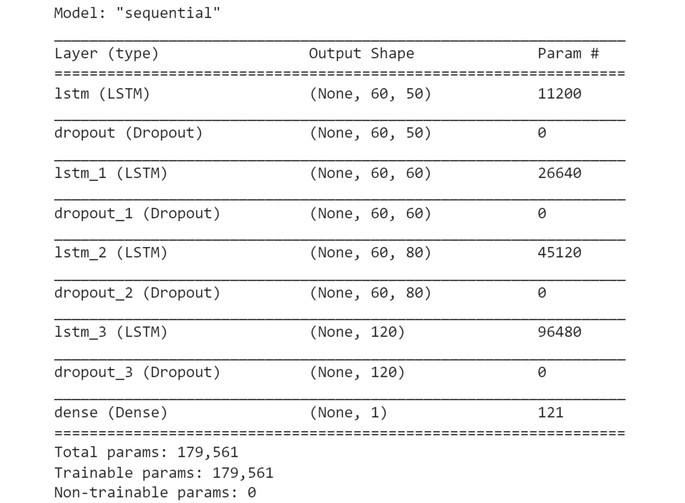


    As you can see from the preceding figure, the summary provides
    valuable information about all model layers and parameters. This is
    a good way to make sure that your layers are in the order you wish
    and that they have the proper output shapes and parameters.

4.  Use the `compile()` method to configure your model for
    training. Choose Adam as your optimizer and mean squared error to
    measure your loss function:
    
    ```
    regressor.compile(optimizer='adam', loss = 'mean_squared_error')
    ```


5.  Fit your model and set it to run on `10` epochs. Set your
    batch size equal to `32`:

    
    ```
    regressor.fit(X_train, y_train, epochs=10, batch_size=32)
    ```


    You should get the following output:

    
    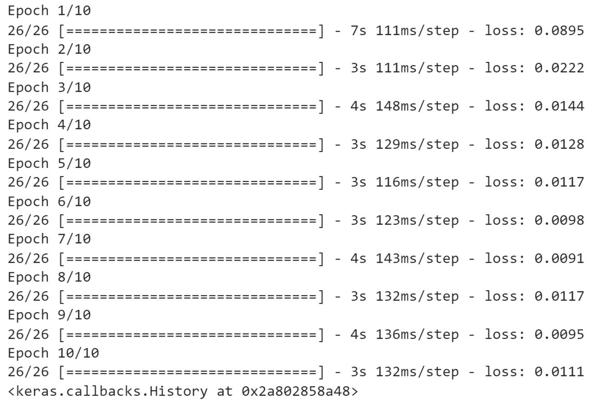


6.  Test and predict the stock price and prepare the dataset. Check your
    data by calling the `head()` function:

    
    ```
    data_test.head()
    ```


    You should get the following output:

    
    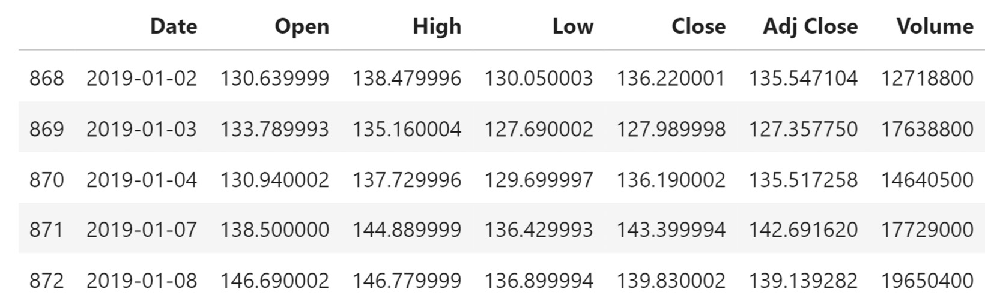


7.  Call the `tail(60)` method to look at the last 60 days of
    data. You will use this information in the next step:

    
    ```
    data_training.tail(60)
    ```


    You should get the following output:

    
    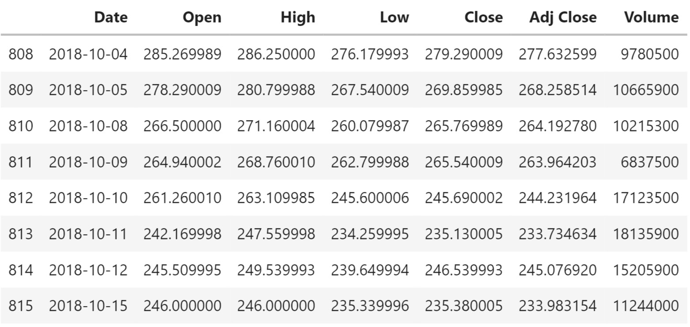


8.  Use the `tail(60)` method to create the
    `past_60_days` variable:
    
    ```
    past_60_days = data_training.tail(60)
    ```


9.  Add the `past_60_days` variable to your test data with the
    `append()` function. Set `True` to
    `ignore_index`. Drop the `Date` and
    `Adj Close` columns as you will not need that information:
    
    ```
    df = past_60_days.append(data_test, ignore_index = True)
    df = df.drop(['Date', 'Adj Close'], axis = 1)
    ```


10. Check the DataFrame to make sure that you successfully dropped
    `Date` and `Adj Close` by using the
    `head()` function:

    
    ```
    df.head()
    ```


    You should get the following output:

    
    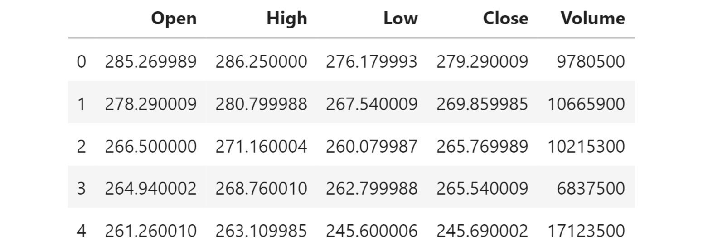


11. Use `scaler.transform` from `StandardScaler` to
    perform standardization on inputs:

    
    ```
    inputs = scaler.transform(df)
    inputs
    ```


    You should get the following output:

    
    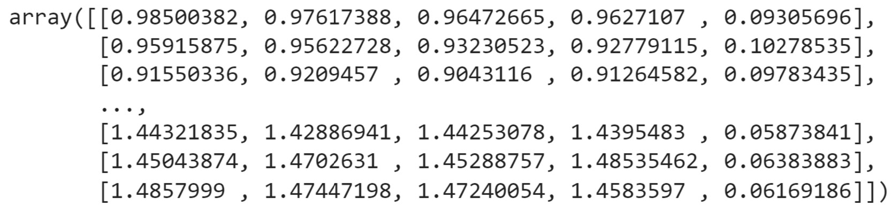


    From the preceding results, you can see that after standardization,
    all values are close to `0` now.

12. Split your data into `X_test` and `y_test`
    datasets. Create a test dataset that has the previous 60 days\'
    stock prices, so that you can test the closing stock price for the
    61st day. Here, `X_test` will have two columns. The first
    column will store the values from 0 to 59. The second column will
    store values from 1 to 60. In the first column of
    `y_test`, store the 61st value at index 60, and in the
    second column, store the 62nd value at index 61. Use a
    `for` loop to create data in 60 time steps:
    
    ```
    X_test = []
    y_test = []
    for i in range(60, inputs.shape[0]):
        X_test.append(inputs[i-60:i])
        y_test.append(inputs[i, 0])
    ```


13. Convert `X_test` and `y_test` into NumPy arrays:

    
    ```
    X_test, y_test = np.array(X_test), np.array(y_test)
    X_test.shape, y_test.shape
    ```


    You should get the following output:

    
    ```
    ((391, 60, 5), (391,))
    ```


    The preceding result shows that there are `391`
    observations and for each of them you have the last `60`
    days\' data for the following five features: `Open`,
    `High`, `Low`, `Close`, and
    `Volume`. The target variable, on the other hand, contains
    `391` values.

14. Test some predictions for stock prices by calling
    `regressor.predict(X_test)`:
    
    ```
    y_pred = regressor.predict(X_test)
    ```


15. Before looking at the results, reverse the scaling you did earlier
    so that the number you get as output will be at the correct scale
    using the `StandardScaler` utility class that you imported
    with `scaler.scale_`:

    
    ```
    scaler.scale_
    ```


    You should get the following output:

    
    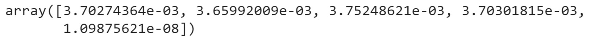


16. Use the first value in the preceding array to set your scale in
    preparation for the multiplication of `y_pred` and
    `y_test`. Recall that you are converting your data back
    from the scale you did earlier when converting all values to between
    zero and one:

    
    ```
    scale = 1/3.70274364e-03
    scale
    ```


    You should get the following output:

    
    ```
    270.0700067909643
    ```


17. Multiply `y_pred` and `y_test` by
    `scale` to convert your data back to the proper values:
    
    ```
    y_pred = y_pred*scale
    y_test = y_test*scale
    ```


18. Use `y_pred `to view predictions for NVIDIA stock:

    
    ```
    y_pred
    ```


    You should get the following output:

    
    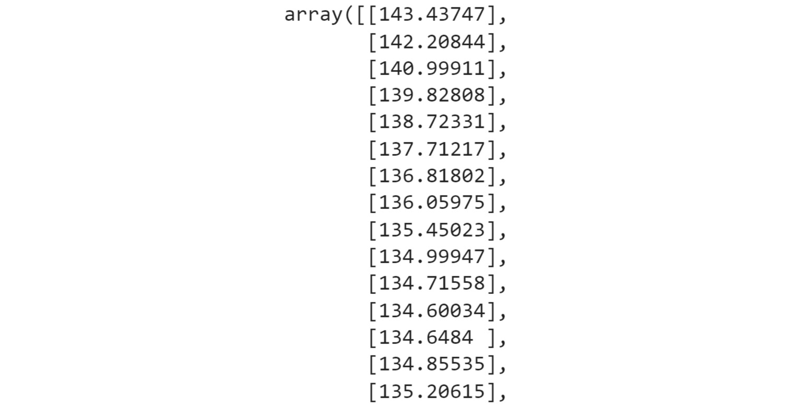


    The preceding results show the predicted Nvidia stock price for the
    future dates.

19. Plot the real Nvidia stock price and your predictions:

    
    ```
    plt.figure(figsize=(14,5))
    plt.plot(y_test, color = 'black', label = "Real NVDA Stock Price")
    plt.plot(y_pred, color = 'gray',\
             label = 'Predicted NVDA Stock Price')
    plt.title('NVDA Stock Price Prediction')
    plt.xlabel('time')
    plt.ylabel('NVDA Stock Price')
    plt.legend()
    plt.show()
    ```


    You should get the following output:

    
    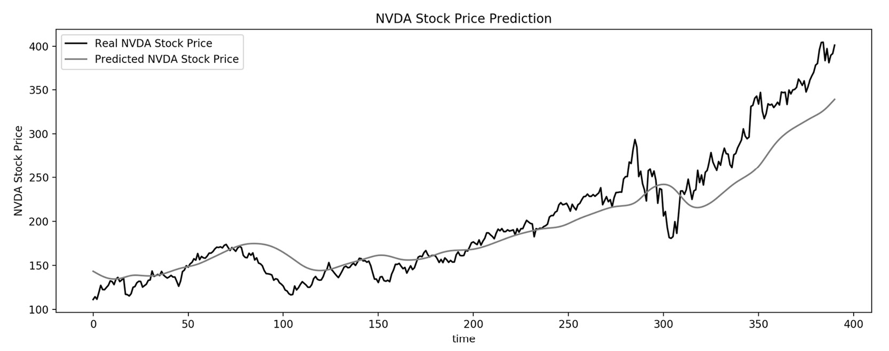


As you can see from the gray line in *Figure 9.32*, your prediction
model is pretty accurate, when compared to the actual stock price, which
is shown by the black line.

In this exercise, you built an RNN with an LSTM layer for Nvidia stock
prediction and completed the training, testing, and prediction steps.

Now, test the knowledge you\'ve gained so far in this lab in the
following activity.

Activity 9.01: Building an RNN with Multiple LSTM Layers to Predict Power Consumption
-------------------------------------------------------------------------------------

The `household_power_consumption.csv` dataset contains
information related to electric power consumption measurements for a
household over 4 years with a 1-minute sampling rate. You are required
to predict the power consumption of a given minute based on previous
measurements.

You are tasked with adapting an RNN model with additional LSTM layers to
predict household power consumption at the minute level. You will be
building an RNN model with three LSTM layers.

Note

You can find the dataset here: [https://github.com/fenago/deep-learning-essentials/blob/main/Lab09/Datasets/household_power_consumption.csv].

Perform the following steps to complete this activity:

1.  Load the data.

2.  Prepare the data by combining the `Date` and
    `Time` columns to form one single `Datetime`
    column that can be used then to sort the data and fill in
    missing values.

3.  Standardize the data and remove the `Date`,
    `Time`, `Global_reactive_power`, and
    `Datetime` columns as they won\'t be needed for the
    predictions.

4.  Reshape the data for a given minute to include the previous 60
    minutes\' values.

5.  Split the data into training and testing sets with, respectively,
    data before and after the index `217440`, which
    corresponds to the last month of data.

6.  Define and train an RNN model composed of three different layers of
    LSTM with `20`, `40`, and `80` units,
    followed by `50%` dropout and ReLU as the
    activation function.

7.  Make predictions on the testing set with the trained model.

8.  Compare the predictions against the actual values on the entire
    dataset.

    You should get the following output:

    
    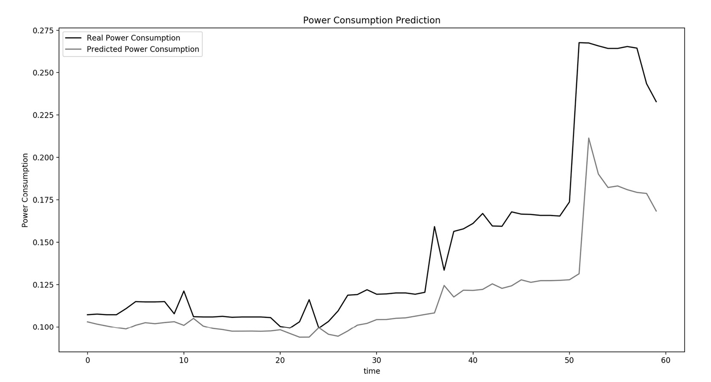


Note

The solution to this activity can be found via [this link].

In the next section, you will learn how to apply RNNs to text.


Natural Language Processing
===========================


**Natural Language Processing** (**NLP**) is a quickly growing field
that is both challenging and rewarding. NLP takes valuable data that has
traditionally been very difficult for machines to make sense of and
turns it into information that can be used. This data can take the form
of sentences, words, characters, text, and audio, to name a few. Why is
this such a difficult task for machines? To answer that question,
consider the following examples.

Recall the two sentences: *it is what it is* and *is it what it is*.
These two sentences, though they have completely opposite semantic
meanings, would have the exact same representations in this bag of words
format. This is because they have the exact same words, just in a
different order. So, you know that you need to use a sequential model to
process this, but what else? There are several tools and techniques that
have been developed to solve these problems. But before you get to that,
you need to learn how to preprocess sequential data.

Data Preprocessing
------------------

As a quick review, preprocessing generally entails all the steps needed
to train your model. Some common steps include data cleaning, data
transformation, and data reduction. For natural language processing,
more specifically, the steps could be all, some, or none of the
following:

-   Tokenization
-   Padding
-   Lowercase conversion
-   Removing stop words
-   Removing punctuation
-   Stemming

The following sections provide a more in-depth description of the steps
that you will be using. For now, here\'s an overview of each step:

-   **Dataset cleaning** encompasses the conversion of case to
    lowercase, the removal of punctuation marks, and so on.
-   **Tokenization** is breaking up a character sequence into specified
    units called tokens.
-   **Padding** is a way to make input sentences of different sizes the
    same by padding them. Padding the sequences means ensuring that the
    sequences have a uniform length.
-   **Stemming** is truncating words down to their stem. For example,
    the words \"rainy\" and \"raining\" both have the stem \"rain\".

### Dataset Cleaning

Here, you create the `clean_text` function, which returns a
list containing words once it has been cleaned. You will save all text
as lowercase with `lower()` and encode it with
`utf8` for character standardization:


```
def clean_text(txt):
    txt = "".join(v for v in txt if v not in string.punctuation)\
            .lower()
    txt = txt.encode("utf8").decode("ascii",'ignore')
    return txt 
corpus = [clean_text(x) for x in all_headlines]
```


### Generating a Sequence and Tokenization

TensorFlow provides a dedicated class for generating a sequence of
N-gram tokens -- `Tokenizer` from
`keras.preprocessing.text`:


```
from keras.preprocessing.text import Tokenizer
tokenizer = Tokenizer()
```


Once you have instantiated a `Tokenizer()`, you can use the
`fit_on_texts()` method to extract tokens from a corpus. This
step will attribute an integer index to each unique word from the
corpus:


```
tokenizer.fit_on_texts(corpus)
```


After the tokenizer has been trained on a corpus, you can access the
indexes allocated to each word from your corpus with the
`word_index` attribute:


```
tokenizer.word_index
```


You can convert a sentence into a tokenized version using the
`texts_to_sequences()` method:


```
tokenizer.texts_to_sequences([sentence])
```


You can create a function that will generate an N-gram sequence of
tokenized sentences from an input corpus with the following snippet:


```
def get_seq_of_tokens(corpus):
    tokenizer.fit_on_texts(corpus)
    all_words = len(tokenizer.word_index) + 1
    
    input_sequences = []
    for line in corpus:
        token_list = tokenizer.texts_to_sequences([line])[0]
        for i in range(1, len(token_list)):
            n_gram_sequence = token_list[:i+1]
            input_sequences.append(n_gram_sequence)
    return input_sequences, all_words
inp_sequences, all_words = get_seq_of_tokens(corpus)
inp_sequences[:10]
```


The `get_seq_of_tokens()` function trains a
`Tokenizer()` on the given corpus. Then you need to iterate
through each line of the corpus and convert them into their tokenized
equivalents. Finally, for each tokenized sentence, you create the
different sequences of N-gram from it.

Next, you will see how you can deal with variable sentence length with
padding.

### Padding Sequences

As discussed previously, deep learning models expect fixed-length input.
But with text, the length of a sentence can vary. One way to overcome
this is to transform all sentences to have the same length. You will
need to set the maximum length of sentences. Then, for sentences that
are shorter than this threshold, you can add padding, which will add a
specific token value to fill the gap. On the other hand, longer
sentences will be truncated to fit this constraint. You can use
`pad_sequences()` to achieve this:


```
from keras.preprocessing.sequence import pad_sequences
```


You can create the `generate_padded_sequences` function, which
will take `input_sequences` and generate the padded version of
it:


```
def generate_padded_sequences(input_sequences):
    max_sequence_len = max([len(x) for x in input_sequences])
    input_sequences = np.array(pad_sequences\
                               (input_sequences, \
                                maxlen=max_sequence_len, \
                                padding='pre'))
    predictors, label = input_sequences[:,:-1], \
                        input_sequences[:,-1]
    label = ku.to_categorical(label, num_classes=all_words)
    return predictors, label, max_sequence_len
predictors, label, max_sequence_len = generate_padded_sequences\
                                      (inp_sequences)
```


Now that you know how to process raw text, have a look at the modeling
step in the next section.


Back Propagation Through Time (BPTT)
====================================


There are many types of sequential models. You\'ve already used simple
RNNs, deep RNNs, and LSTMs. Let\'s take a look at a couple of additional
models used for NLP.

Remember that you trained feed-forward models by first making a forward
pass through the network that goes from input to output. This is the
standard feed-forward model where the layers are densely connected. To
train this kind of model, you can backpropagate the gradients through
the network, taking the derivative of the loss of each weight parameter
in the network. Then, you can adjust the parameters to minimize the
loss.

But in RNNs, as discussed earlier, your forward pass through the network
also consists of going forward in time, updating the cell state based on
the input and the previous state, and generating an output,
`Y`. At that time step, computing a loss and then finally
summing these losses from the individual time steps gets your total
loss.

This means that instead of backpropagating errors through a single
feed-forward network at a single time step, errors are backpropagated at
each individual time step, and then, finally, across all time
steps---all the way from where you are currently, to the beginning of
the sequence.

This is why it\'s called backpropagation through time. As you can see,
all errors are flowing back in time to the beginning of your data
sequence.

A great example of machine translation and one of the most powerful and
widely used applications of RNNs in industry is Google Translate. In
machine translation, you input a sequence in one language and the task
is to train the RNN to output that sequence in a new language. This is
done by employing a dual structure with an encoder that encodes the
sentence in its original language into a state vector and a decoder.
This then takes that encoded representation as input and decodes it into
a new language.

There\'s a key problem though in this approach: all content that is fed
into the encoder structure must be encoded into a single vector. This
can become a huge information bottleneck in practice because you may
have a large body of text that you want to translate. To get around this
problem the researchers at Google developed an extension of RNN called
**attention**.

Now, instead of the decoder only having access to the final encoded
state, it can access the states of all the time steps in the original
sentence. The weights of these vectors that connect the encoder states
to the decoder are learned by the network during training. This is
called attention because when the network learns, it places its
attention on different parts of the input sentence.

In this way, it effectively captures a sort of memory access to the
important information in that original sentence. So, with building
blocks such as attention and gated cells, like LSTMs, RNNs have really
taken off in recent years and are being used in the real world quite
successfully.

You should have by now gotten a sense of how RNNs work and why they are
so powerful for processing sequential data. You\'ve seen why and how you
can use RNNs to perform sequence modeling tasks by defining this
recurrence relation. You also learned how you can train RNNs and looked
at how gated cells such as LSTMs can help us model long-term
dependencies.

In the following exercise, you will see how to use an LSTM model for
predicting the next word of a text.

Exercise 9.03: Building an RNN with an LSTM Layer for Natural Language Processing
---------------------------------------------------------------------------------

In this exercise, you will use an RNN with an LSTM layer to predict the
final word of a news headline.

The `Articles.csv` dataset contains raw text that consists of
news titles. You will be training an LTSM model that will predict the
next word of a given sentence.

Note

You can find the dataset in the GitHub repo.

Perform the following steps to complete this exercise:

1.  Import the libraries needed:

    
    ```
    from keras.preprocessing.sequence import pad_sequences
    from keras.layers import Embedding, LSTM, Dense, Dropout
    from keras.preprocessing.text import Tokenizer
    from keras.callbacks import EarlyStopping
    from keras.models import Sequential
    import keras.utils as ku 
    import pandas as pd
    import numpy as np
    import string, os 
    import warnings
    warnings.filterwarnings("ignore")
    warnings.simplefilter(action='ignore', category=FutureWarning)
    ```


    You should get the following output:

    
    ```
    Using TensorFlow backend.
    ```


2.  Load the dataset locally by setting `curr_dir` to
    `content`. Create the `all_headlines` variable.
    Use a `for` loop to iterate over the files contained in
    the folder, and extract the headlines. Remove all headlines with the
    `Unknown` value. Print the length of
    `all_headlines`:

    
    ```
    curr_dir = '/content/'
    all_headlines = []
    for filename in os.listdir(curr_dir):
        if 'Articles' in filename:
            article_df = pd.read_csv(curr_dir + filename)
            all_headlines.extend(list(article_df.headline.values))
            break
    all_headlines = [h for h in all_headlines if h != "Unknown"]
    len(all_headlines)
    ```


    The output will be as follows:

    
    ```
    831
    ```


3.  Create the `clean_text` method to return a list containing
    words once it has been cleaned. Save all text as lowercase with the
    `lower()` method and encode it with `utf8` for
    character standardization. Finally, output 10 headlines from your
    corpus:

    
    ```
    def clean_text(txt):
        txt = "".join(v for v in txt \
                      if v not in string.punctuation).lower()
        txt = txt.encode("utf8").decode("ascii",'ignore')
        return txt 
    corpus = [clean_text(x) for x in all_headlines]
    corpus[:10]
    ```


    You should get the following output:

    
    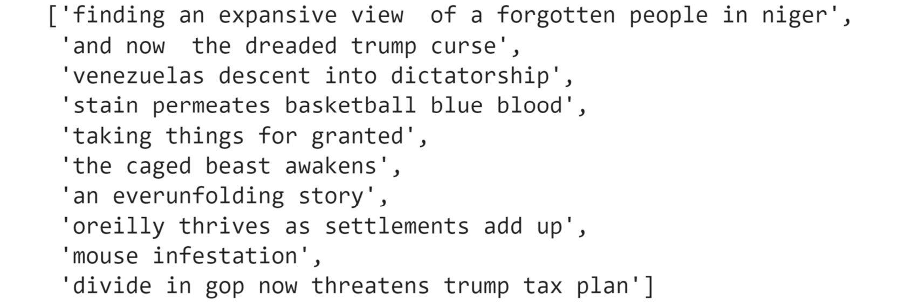


4.  Use `tokenizer.fit` to extract tokens from the corpus.
    Each integer output corresponds with a specific word. With
    `input_sequences`, train features that will be a
    `list []`. With
    `token_list = tokenizer.texts_to_sequences`, convert each
    sentence into its tokenized equivalent. With
    `n_gram_sequence = token_list`, generate the N-gram
    sequences. Using
    `input_sequences.append(n_gram_sequence)`, append each
    N-gram sequence to the list of your features:

    
    ```
    tokenizer = Tokenizer()
    def get_seq_of_tokens(corpus):
        tokenizer.fit_on_texts(corpus)
        all_words = len(tokenizer.word_index) + 1
        input_sequences = []
        for line in corpus:
            token_list = tokenizer.texts_to_sequences([line])[0]
            for i in range(1, len(token_list)):
                n_gram_sequence = token_list[:i+1]
                input_sequences.append(n_gram_sequence)
        return input_sequences, all_words
    inp_sequences, all_words = get_seq_of_tokens(corpus)
    inp_sequences[:10]
    ```


    You should get the following output:

    
    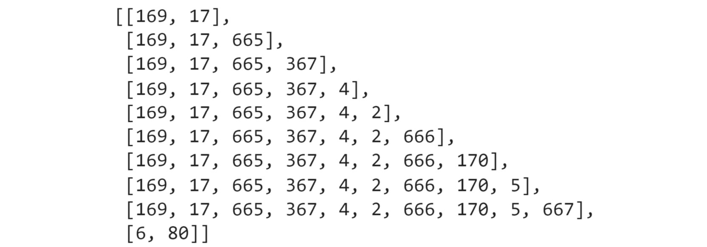


5.  Pad the sequences and obtain the `predictors` and
    `target` variables. Use `pad_sequence` to pad
    the sequences and make their lengths equal:
    
    ```
    def generate_padded_sequences(input_sequences):
        max_sequence_len = max([len(x) for x in input_sequences])
        input_sequences = np.array\
                          (pad_sequences(input_sequences, \
                                         maxlen=max_sequence_len, \
                                         padding='pre'))
        predictors, label = input_sequences[:,:-1], \
                            input_sequences[:,-1]
        label = ku.to_categorical(label, num_classes=all_words)
        return predictors, label, max_sequence_len
    predictors, label, max_sequence_len = generate_padded_sequences\
                                          (inp_sequences)
    ```


6.  Prepare your model for training. Add an input embedding layer with
    `model.add(Embedding)`. Add a hidden LSTM layer with
    `100` units and add a dropout of 10%. Then, add a dense
    layer with a softmax activation function. With the
    `compile` method, configure your model for training,
    setting your loss function to `categorical_crossentropy`,
    and use the Adam optimizer:

    
    ```
    def create_model(max_sequence_len, all_words):
        input_len = max_sequence_len - 1
        model = Sequential()
        
        model.add(Embedding(all_words, 10, input_length=input_len))
        
        model.add(LSTM(100))
        model.add(Dropout(0.1))
        
        model.add(Dense(all_words, activation='softmax'))
        model.compile(loss='categorical_crossentropy', \
                      optimizer='adam')
        return model
    model = create_model(max_sequence_len, all_words)
    model.summary()
    ```


    You should get the following output:

    
    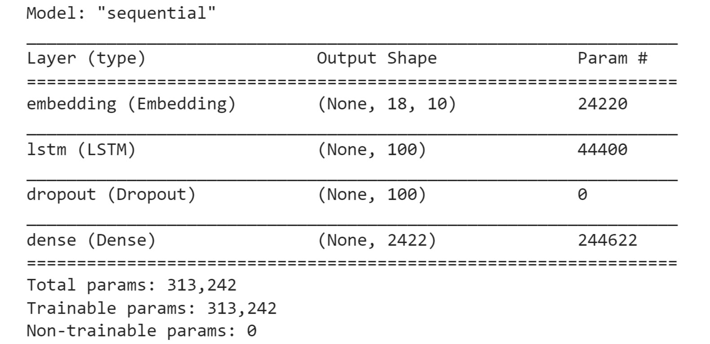


7.  Fit your model with `model.fit` and set it to run on
    `100` epochs. Set `verbose` equal to
    `5`:

    
    ```
    model.fit(predictors, label, epochs=100, verbose=5)
    ```


    You should get the following output:

    
    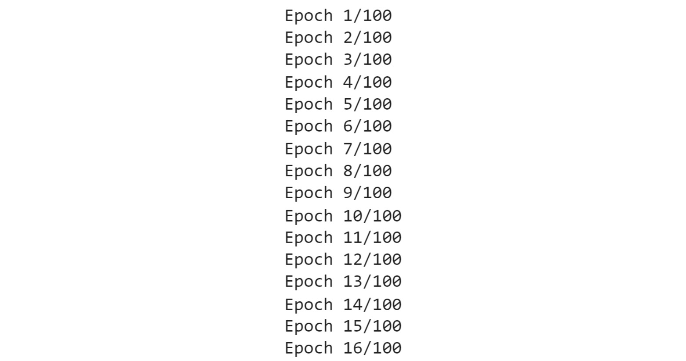


8.  Write a function that will receive an input text, a model, and the
    number of next words to be predicted. This function will prepare the
    input text to be fed into the model that will predict the next word:
    
    ```
    def generate_text(seed_text, next_words, \
                      model, max_sequence_len):
        for _ in range(next_words):
            token_list = tokenizer.texts_to_sequences\
                         ([seed_text])[0]
            token_list = pad_sequences([token_list], \
                                       maxlen=max_sequence_len-1,\
                                       padding='pre')
            predicted = model.predict_classes(token_list, verbose=0)
            output_word = ""
            for word,index in tokenizer.word_index.items():
                if index == predicted:
                    output_word = word
                    break
            seed_text += " "+output_word
        return seed_text.title()
    ```


9.  Output some of your generated text with the `print`
    function. Add your own words for the model to use and generate from.
    For example, in `the hottest new`, the integer
    `5` is the number of words output by the model:

    
    ```
    print (generate_text("the hottest new", 5, model,\
                         max_sequence_len))
    print (generate_text("the stock market", 4, model,\
                         max_sequence_len))
    print (generate_text("russia wants to", 3, model,\
                         max_sequence_len))
    print (generate_text("french citizen", 4, model,\
                         max_sequence_len))
    print (generate_text("the one thing", 15, model,\
                         max_sequence_len))
    print (generate_text("the coronavirus", 5, model,\
                         max_sequence_len))
    ```


    You should get the following output:

    
    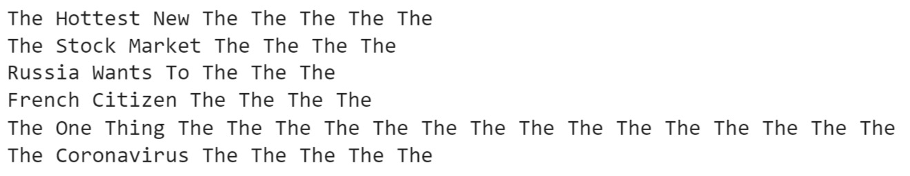


In this result, you can see the text generated by your model for each
sentence.

In this exercise, you have successfully predicted some news headlines.
Not surprisingly, some of them may not be very impressive, but some are
not too bad.

Now that you have all the essential knowledge about RNNs, try to test
yourself by performing the next activity.

Activity 9.02: Building an RNN for Predicting Tweets\' Sentiment
----------------------------------------------------------------

The `tweets.csv` dataset contains a list of tweets related to
an airline company. Each of the tweets has been classified as having
positive, negative, or neutral sentiment.

You have been tasked to analyze a sample of tweets for the company. Your
goal is to build an RNN model that will be able to predict the sentiment
of each tweet: either positive or negative.

Note

You can find `tweets.csv` here:
[https://github.com/fenago/deep-learning-essentials/blob/main/Lab09/Datasets/tweets.csv].

Perform the following steps to complete this activity.

1.  Import the necessary packages.

2.  Prepare the data (combine the `Date` and `Time`
    columns, name it `datetime`, sort the data, and fill in
    missing values).

3.  Prepare the text data (tokenize words and add padding).

4.  Split the dataset into training and testing sets with, respectively,
    the first 10,000 tweets and the remaining tweets.

5.  Define and train an RNN model composed of two different layers of
    LSTM with, respectively, `50` and `100` units
    followed by 20% dropout and ReLU as the activation function.

6.  Make predictions on the testing set with the trained model.

    You should get the following output:

    
    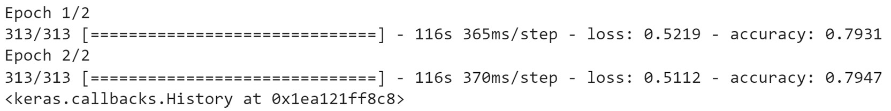


Note

The solution to this activity can be found via [this link].


Summary
=======


In this lab, you explored different recurrent models for sequential
data. You learned that each sequential data point is dependent on the
prior sequence of data points, such as natural language text. You also
learned why you must use models that allow for the sequence of data to
be used by the model, and sequentially generate the next output.

This lab introduced RNN models that can make predictions for
sequential data. You observed the way RNNs can loop back on themselves,
which allows the output of the model to feed back into the input. You
reviewed the types of challenges that you face with these models, such
as vanishing and exploding gradients, and how to address them.
